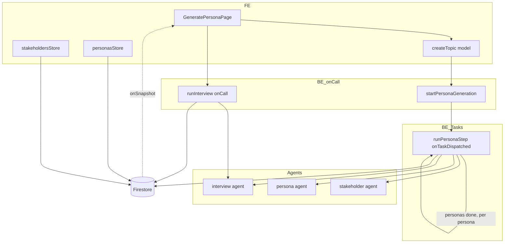
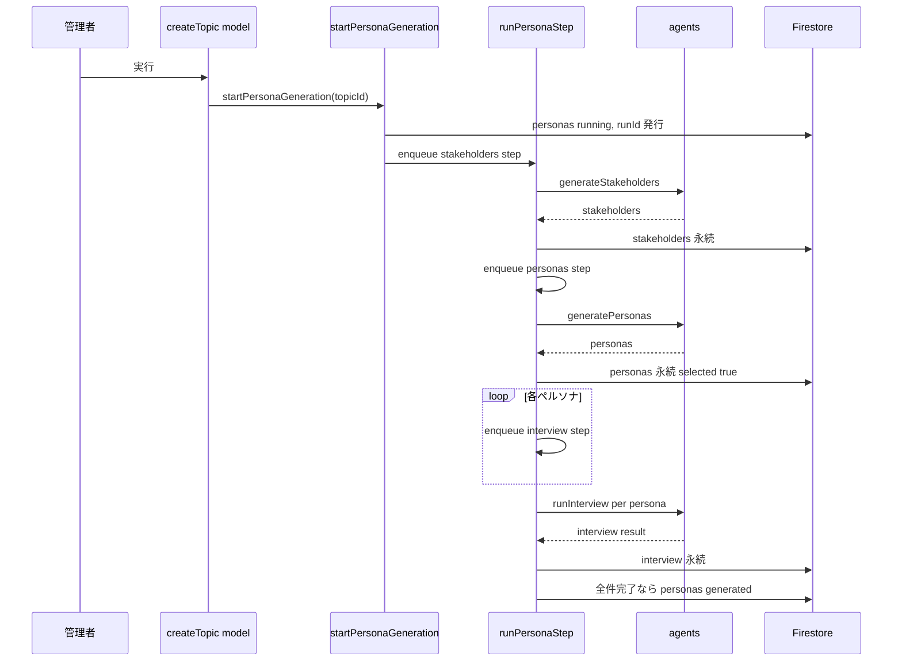
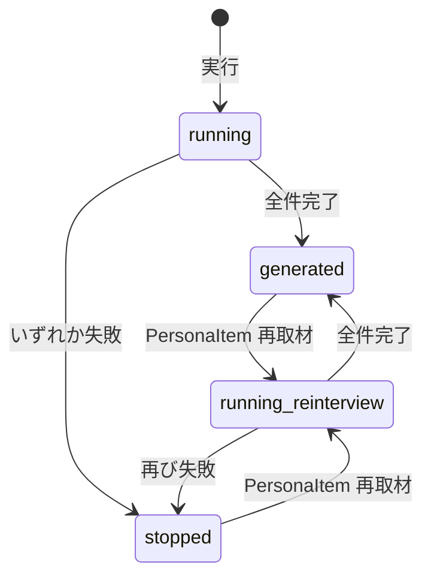

# Technical Design: persona-generation-consolidation

## Overview

**Purpose**: 管理者のペルソナ生成を、ステークホルダー生成〜ペルソナ生成〜取材の3操作から**1操作の一気通貫**へ集約する。実質判断されていない中間承認（ステークホルダー採用・ペルソナ承認）を廃し、採否の判断は「生成されたペルソナを見てから」行う採用選択へ置き換える。

**Users**: 管理者がテーマ詳細のペルソナ生成画面で利用する。1つの実行操作で全段が進み、取材完了後にペルソナ単位で討論参加の採否を選べる。

**Impact**: フェーズ定義を8値から6値へ縮約する（`stakeholders` / `interviews` を廃し `personas` 1フェーズへ）。生成の連鎖を FE オーケストレーションからサーバ側 Cloud Tasks チェーンへ移す。下流の参加者フィルタを `approved` から `selected` へ切り替える。

### Goals
- `stakeholders` / `personas` / `interviews` の3フェーズを `personas` 1フェーズへ統合し、FE/BE の `PhaseSlug` を一致させる。
- ステークホルダー生成→ペルソナ生成→全ペルソナ取材をサーバ側で完結する連鎖として実行する（クライアント在席非依存）。
- ペルソナ承認（`approved`）を廃し、ペルソナ単位の採用選択（`selected`）へ置換。下流は採用ペルソナに限定する。
- ペルソナ単位の再取材を `PersonaItem` から常時可能にする。

### Non-Goals
- ステークホルダー・ペルソナ・取材それぞれの生成ロジック（プロンプト・モデル・事実基盤の受け渡し）の変更。ただし `Persona` 型から `approved` を除き `selected` を加える型変更に伴い、ペルソナ生成エージェントが構築時に書く `approved: false` → `selected: true` へのフィールド名追随は行う（生成の意味は不変。`persona-generator-agent.ts` の該当行と `api/personas.ts` の永続箇所）。
- 既存トピックの移行（既存データは削除前提。互換コードを書かない）。
- フェーズ画面の操作ペイン統一方針そのもの（`phase-page-ui-unification` が所有）。本仕様はペルソナ画面を単一対象の画面へ単純化するに留める。

## Boundary Commitments

### This Spec Owns
- `PhaseSlug`（FE/BE）・`PHASE_DEFS`・`GeneratePhase`・正準リストテストからの `stakeholders` / `interviews` 除去。
- ペルソナ生成の連鎖起動 API と Cloud Tasks ステップチェーン（`startPersonaGeneration` / `runPersonaStep`）。
- ペルソナの `selected` フィールドの新設と、その永続・トグル・下流フィルタの定義。
- 採用ゲート（採用ペルソナ1件以上を前進の前提とする条件）の定義・所有。
- `personas` → `chapters` へのフェーズ前進メソッド（`advancePastPersonas`）。
- ステークホルダーの `selected` とペルソナの `approved` の撤去。
- ペルソナ生成画面（`GeneratePersonaPage`）とその配下（`StakeholderPersonaRow` / `StakeholderItem` / `PersonaItem`）の再構成。
- ルート `/stakeholders` `/personas` `/interviews` の `/personas` への一本化。

### Out of Boundary
- 章立て・討論・編集の生成ロジック（下流フィルタの条件語だけを `approved`→`selected` に置換し、参加者集合の意味は変えない）。
- 操作ペインの3領域レイアウト・「前に戻る/次に進む」ボタンの様式（`phase-page-ui-unification`）。ただし前進の可否条件（採用ゲート）は本仕様が所有し、UI 仕様はその判定結果を利用する。
- 取材エージェント・ステークホルダーエージェント・ペルソナ生成エージェントの内部。

### Allowed Dependencies
- 既存の Cloud Tasks 基盤（`hashTaskId` / `isTaskAlreadyExists`）を再利用してよい。ステップ本体は persona 専用に持つ。
- `confirmPhaseGenerated` / `getTopicContext` / 各生成エージェント関数を呼び出してよい。
- FE は `phasePath` / `phaseLogicalState` / `phaseOrder`（`nextPhase` は `advancePhase` 経由のみ）に依存してよい。

### Revalidation Triggers
- `PhaseSlug` の値集合・順序変更 → FE/BE 両側と `phase-slug.test`、`phase-page-ui-unification` の遷移先直書きを再確認。
- ペルソナの参加者判定キー（`selected`）の意味変更 → 章立て・討論・編集の全フィルタ箇所。
- `personas` フェーズの完了確定経路（`confirmPhaseGenerated` の対象フェーズ）変更 → 取材完了・再取材回復の両方。

## Architecture

### Existing Architecture Analysis
- **フェーズ定義の二重管理**: FE `PhaseSlug`/`PHASE_DEFS` と BE `PhaseSlug`/`GeneratePhase` は値集合・順序を一致させ、`functions/src/tests/types/phase-slug.test.ts` の「正準リスト」で機械検証している。この一致制約を保ったまま2値を除去する。
- **既存の Cloud Tasks チェーン**: 討論（`startDebate`→`runStep`）・編集（`startEditing`→`runEditingStep`）が「起動 onCall＋単一 `onTaskDispatched`＋決定的 task id＋終端失敗で stopped」の型を確立済み。ペルソナ連鎖はこれを踏襲する（共有せず同型で持つ。structure.md「過度な共通化をしない」）。
- **完了集約はサーバ権威**: `confirmInterviewsGeneratedIfAllComplete` が全ペルソナ completed で `confirmPhaseGenerated` を呼ぶ。確定先を `interviews`→`personas` に変えれば初期チェーンとオンデマンド再取材が同一経路に収束する。
- **生成エージェントは純関数**: `generateStakeholders` / `generatePersonas`(agent) / `runInterview`(agent) は `Result` を返す HTTP 非依存の関数。onCall はauth/検証/永続のみを担う。ステップからの呼び出しへ移設が容易。

### Architecture Pattern & Boundary Map



**Architecture Integration**:
- **Selected pattern**: サーバ側 Cloud Tasks 自己連鎖（討論・編集と同型）。初期チェーンはサーバ完結、ペルソナ単位再取材はクライアント起点 onCall。
- **Domain/feature boundaries**: 連鎖オーケストレーションは persona 専用の enqueue/step 層に置く。生成エージェントは不変。フェーズ型は既存の二重管理を保つ。
- **Existing patterns preserved**: 決定的 task id（`hashTaskId`）、`isTaskAlreadyExists` 収束、終端失敗で stopped、`confirmPhaseGenerated` の running/stopped→generated 冪等遷移、onSnapshot ストア。
- **New components rationale**: `startPersonaGeneration`（連鎖起動）と `runPersonaStep`（3 stepKind の連鎖本体）は既存 onCall では表現できない「サーバ完結の多段連鎖」を担うため新設。
- **Steering compliance**: 連鎖本体を共有化せず persona ドメインに閉じる（structure.md）。安定 id をキーにする（memory）。onSnapshot ストアで読む（firebase.md）。

### Technology Stack

| Layer | Choice / Version | Role in Feature | Notes |
|-------|------------------|-----------------|-------|
| Frontend | SvelteKit 2.x / Svelte 5 runes, `@14ch/svelte-ui` | ペルソナ画面再構成・採用チェックボックス・再取材ボタン | 既存スタック |
| Backend | Firebase Functions v2（onCall / onTaskDispatched・Node 24） | 連鎖起動と Cloud Tasks ステップ | 討論・編集と同型 |
| Data | Firestore（Client SDK 読み / Admin SDK 書き） | `selected` 永続・段階生成物の逐次永続 | 移行なし |
| Messaging | Google Cloud Tasks（`runPersonaStep` キュー） | 段階連鎖・per-persona 取材の並列＋リトライ | 新規キュー1本 |

## File Structure Plan

### Modified Files — Frontend
- `src/lib/models/phase/phase.types.ts` — `PhaseSlug` から `stakeholders` / `interviews` を削除（6値）。
- `src/lib/models/phase/phase.constants.ts` — `PHASE_DEFS` の該当2エントリ削除。`personas` の `statusLabels` を一気通貫全体の状態に合わせて更新。
- `src/lib/sharedComponents/StepNav.svelte` — `STEP_GROUPS` の `persona` グループを `phases: ['personas']` に。
- `src/lib/models/persona/persona.types.ts` — `PersonaForFirestore.approved` を削除し `selected: boolean` を追加。
- `src/lib/models/stakeholder/stakeholder.types.ts` — `selected` 関連を削除。
- `src/lib/stores/stakeholders.svelte.ts` — `setSelected` と `selected ?? true` を削除（表示のみのストアへ）。
- `src/lib/stores/personas.svelte.ts` — `approvePersonas` / `runInterviews`（バッチ）を削除。`setSelected(personaId, bool)` と `reinterview(personaId, title)` を追加。
- `src/lib/models/topic/createTopic.svelte.ts` — `approveStakeholders` / `approveInterviews` / 個別 `generateStakeholders` / `generatePersonas` を撤去。追加: `startPersonaGeneration()`（起動 callable ラッパ）と `advancePastPersonas()`（= `advancePhase('personas')`。`personas`→`chapters` 前進。撤去する store の `approvePersonas` と名が衝突しないよう別名）。`resetStakeholders` / `resetPersonas` は再生成で使用。
- `src/lib/features/admin/topic-detail/persona/GeneratePersonaPage.svelte` — 中央スロット1操作へ再構成、コメントアウト除去。
- `src/lib/features/admin/topic-detail/persona/StakeholderItem.svelte` — 採用チェックボックス削除（表示のみ）。
- `src/lib/features/admin/topic-detail/persona/PersonaItem.svelte` — 採用チェックボックスと再取材ボタンを追加。
- ルート: `src/routes/admin/topics/[topicId]/personas/+page.svelte` を残し、`stakeholders/` `interviews/` ディレクトリを削除。

### Modified / New Files — Backend
- `functions/src/types/phase.types.ts` — `PhaseSlug` 6値化。
- `functions/src/utils/topic-phase.ts` — `GeneratePhase` から `stakeholders` / `interviews` を除去（`personas` は残す）。
- `functions/src/tests/types/phase-slug.test.ts` — 正準リストとRecordを6値に更新。
- **新規** `functions/src/pipeline/personas/enqueue-persona-step.ts` — `PersonaStepPayload` 型・`personaTaskKey` ・`enqueuePersonaStep`（`hashTaskId` / `isTaskAlreadyExists` を discuss から再利用）。
- **新規** `functions/src/pipeline/personas/persona-chain.ts` — 各 stepKind の実行と次段 enqueue（オーケストレーション）。
- **新規/改** `functions/src/api/personas.ts` — `startPersonaGeneration`(onCall) と `runPersonaStep`(onTaskDispatched) を定義。旧 `generatePersonas` / `generateStakeholders` の onCall を撤去し、ロジックはステップから呼ぶ。
- `functions/src/api/interviews.ts` — `runInterview`(onCall) を再取材用に維持。取材本体を `runInterviewCore` として抽出しステップと共有。
- `functions/src/pipeline/interviews/interview-completion.ts` — `confirmInterviewsGeneratedIfAllComplete` の確定先を `personas` に変更し、完了判定を**採用（`selected`）ペルソナ基準**（採用0件ガード付き）へ変更。
- `functions/src/api/stakeholders.ts` — onCall 撤去、生成呼び出しはステップへ。
- `functions/src/index.ts` — エクスポート更新（`startPersonaGeneration` / `runPersonaStep` を追加、`generateStakeholders` / `generatePersonas` を削除）。
- 下流フィルタ: `chapter-generator.ts` / `debate-orchestrator.ts` / `debate-digest.ts`（変数名 `approvedPersonas` も `selectedPersonas` へリネーム推奨）/ `editing/regenerate-element.ts` / `editing-lifecycle.ts` / `editing-step.ts` の `filter(p => p.approved)` を `filter(p => p.selected)` へ。
- `EditingPage.svelte` — **`persona.approved`（183行）のみ** `selected` へ置換する。同ファイル133行・207行の `logicalState === 'approved'` は `PhaseLogicalState` の値であり `persona.approved` とは無関係。**`approved` の一括置換をしないこと**（討論完了ゲート・編集ボタン表示が壊れる）。

## System Flows

### 初期チェーン（サーバ完結）



**Key decisions**:
- 起動 onCall はステップ1件の enqueue のみで即返す（在席非依存・R2.2）。
- personas ステップが N 件の interview ステップを一括 enqueue し、per-persona 並列で取材（各ステップ独立リトライ）。
- 各ステップの終端失敗（最終リトライ）で `personas` を `stopped`（R5.1）。
- 完了確定は取材ステップ内の `confirmInterviewsGeneratedIfAllComplete`（確定先 `personas`）。最後の1人が終わった時のみ generated。

### ペルソナ単位再取材と停止回復



再取材は `runInterview`(onCall) を1ペルソナに対し実行。完了時 `confirmInterviewsGeneratedIfAllComplete` が全件 completed を確認して `personas` を generated に戻す（停止からの回復・R5.4）。他ペルソナの取材結果は不変（R5.3）。

## Requirements Traceability

| Requirement | Summary | Components | Interfaces | Flows |
|-------------|---------|------------|------------|-------|
| 1.1–1.3, 1.5 | 3→1 フェーズ統合・personas→chapters 前進 | phase.types/constants(FE/BE), GeneratePhase, StepNav, createTopic.advancePastPersonas | 正準リスト, advancePhase | — |
| 1.4 | phaseStatus に段階を持たせない | personas フェーズ状態 | — | 初期チェーン |
| 1.6 | ルート一本化 | routes/personas | — | — |
| 2.1–2.4 | 一気通貫・全件対象 | startPersonaGeneration, runPersonaStep, persona-chain | Batch | 初期チェーン |
| 2.5, 2.6 | running / 完了確定 | runPersonaStep, confirmPhaseGenerated | Batch | 初期チェーン |
| 2.7 | 段階生成物の逐次永続 | persona-chain | State | 初期チェーン |
| 3.1–3.6 | ステークホルダー中間生成物化・selected 撤去 | StakeholderItem, stakeholdersStore, stakeholder.types | State | — |
| 4.1–4.9 | approved 廃止・selected 新設・下流フィルタ | persona.types, personasStore.setSelected, PersonaItem, 下流6+箇所 | State | — |
| 4.10 | 採用ゲート（採用1件以上で前進可・本仕様所有） | GeneratePersonaPage, advancePastPersonas | State | — |
| 5.1–5.6 | ペルソナ単位再取材・バッチ廃止 | runInterview onCall, PersonaItem, personasStore.reinterview | Service | 再取材と回復 |
| 6.1–6.8 | 画面構成（中央1スロット） | GeneratePersonaPage | State | — |
| 7.1–7.5 | 非退行 | agents 不変, stakeholderId 対応 | — | — |
| 8.1–8.5 | Cloud Tasks・決定的 id・撤去 | enqueue-persona-step, persona-chain | Batch | 初期チェーン |

## Components and Interfaces

| Component | Domain/Layer | Intent | Req Coverage | Key Dependencies (P0/P1) | Contracts |
|-----------|--------------|--------|--------------|--------------------------|-----------|
| startPersonaGeneration | BE onCall | 連鎖起動・runId 発行 | 2.1, 2.5 | runPersonaStep (P0) | Service, Batch |
| runPersonaStep | BE Task | 3 stepKind の連鎖本体 | 2.1–2.7, 8.1–8.4 | agents (P0), confirmPhaseGenerated (P0) | Batch |
| enqueuePersonaStep | BE pipeline | 決定的 id で投入 | 8.3 | hashTaskId (P0) | Batch |
| runInterview (onCall) | BE onCall | ペルソナ単位再取材 | 5.2–5.4 | interview agent (P0), confirmInterviews (P0) | Service |
| personasStore | FE store | selected トグル・再取材・onSnapshot | 4.2–4.4, 5.2 | Firestore (P0) | State |
| GeneratePersonaPage | FE UI | 中央1スロット・中間生成物表示 | 6.1–6.8 | createTopic (P0), stores (P0) | State |
| PersonaItem | FE UI | 採用チェックボックス・再取材ボタン | 4.3, 5.2, 6.7 | personasStore (P1) | State |

### Backend

#### runPersonaStep

| Field | Detail |
|-------|--------|
| Intent | ステークホルダー生成・ペルソナ生成・取材の各ステップを実行し次段を enqueue する連鎖本体 |
| Requirements | 2.1, 2.2, 2.3, 2.4, 2.6, 2.7, 8.1, 8.2, 8.4 |

**Responsibilities & Constraints**
- `stepKind` を判別し当該段を実行。単一の関数呼び出しに全段を詰めない（R8.2・タイムアウト回避）。
- `stakeholders` 段: `runStakeholderGeneration` → `stakeholders/0` 永続 → `personas` 段を enqueue。
- `personas` 段: `runPersonaGeneration`（全ステークホルダー対象・R2.3）→ 各ペルソナを `selected: true` で永続 → ペルソナごとに `interview` 段を enqueue。
- `interview` 段（per persona）: `runInterviewCore` → 当該ペルソナへ永続 → `confirmInterviewsGeneratedIfAllComplete`（下記の**採用基準**で判定）。
- 終端失敗（`retryCount >= MAX_ATTEMPTS-1`）で `personas` を `stopped`（`setTopicPhaseStatus`）。
- **中間段は完了確定を書かない（重要）**: `stakeholders` 段・`personas` 段は `confirmPhaseGenerated` を**呼ばない**。generated 確定は `interview` 段の `confirmInterviewsGeneratedIfAllComplete`（全ペルソナ completed 時）でのみ行う。現行 `generateStakeholders`/`generatePersonas` onCall は各々 `confirmPhaseGenerated(topicId,'stakeholders'|'personas')` を末尾で呼んでいるため、ステップへ抽出する際にこの確定呼び出しを**持ち込まないこと**（持ち込むとステークホルダー生成完了時点で `personas` が generated へ早期遷移し R2.6 が壊れる）。
- 完了確定（generated）はサーバ側のみ・上記の単一箇所のみ（R8.4）。

**Dependencies**
- Inbound: `startPersonaGeneration` — 起動（P0）／自身 — 次段 enqueue（P0）
- Outbound: 各生成エージェント（P0）、`confirmPhaseGenerated`（P0）、`enqueuePersonaStep`（P0）
- External: Cloud Tasks — ステップ配送・リトライ（P0）

**Contracts**: Batch [x]

##### Batch / Job Contract
- **Trigger**: Cloud Tasks（`onTaskDispatched`・REGION `asia-northeast1`）。
- **Input**: `PersonaStepPayload = { topicId: string; runId: string; stepKind: 'stakeholders' | 'personas' | 'interview'; personaId?: string }`（`interview` 段のみ `personaId` 必須）。
- **Output**: Firestore への段階生成物永続と次段 enqueue。値は返さない。
- **Idempotency & recovery**: task id = `hashTaskId(personaTaskKey(payload))`、`personaTaskKey` = `${runId}:${stepKind}` または `${runId}:interview:${personaId}`。`isTaskAlreadyExists` で二重投入を1本へ収束。`retryConfig: { maxAttempts, minBackoffSeconds }`。

##### 完了判定の対象集合（採用基準）
`confirmInterviewsGeneratedIfAllComplete` は完了判定を**採用（`selected`）ペルソナ基準**で行う。
- 判定式: `const targets = personas.filter(p => p.selected); targets.length > 0 && targets.every(p => p.interview?.status === 'completed')` のとき `confirmPhaseGenerated(topicId, 'personas')`。
- **理由**: 取材は採否に関わらず全員に走る（R4.8）が、`selected` は随時切替可能（R4.7）。全ペルソナ基準にすると「取材失敗したペルソナを不採用にしても、その `error` が残り `generated` に到達しない」詰まりが生じる。採用基準にすれば「不採用ペルソナは判定から外れ、採用ペルソナが全員完了で generated」となり、参加者モデル（`selected`＝参加者）と一貫する。
- **採用0件ガード**: `targets.length === 0`（採用ペルソナ皆無）のときは generated にしない（空 `every` の true 化を防ぐ。既存の `docs.length === 0` ガードと同発想）。採用0件では前進自体も不可（R4.10・採用ゲート）。
- 現行実装は全 persona `every(completed)`。この判定を `selected` フィルタ付きへ変更する（`interview-completion.ts`）。

**Implementation Notes**
- Integration: 生成エージェント・`getTopicContext`・`confirm*` は現行を流用。`runInterviewCore` は `api/interviews.ts` から抽出しステップと onCall で共有。
- Validation: `personaId` は `interview` 段で必須。`stakeholders/0` 不在時はステップを失敗させ stopped（前段未完の防御）。
- Risks: 本番デプロイ検証（エミュレータ未使用）。段階ごとに `console.error` ログ。

#### startPersonaGeneration

| Field | Detail |
|-------|--------|
| Intent | `personas` を running にし runId を発行、最初のステップを enqueue して即返す |
| Requirements | 2.1, 2.5 |

**Contracts**: Service [x], Batch [x]

##### Service Interface
```typescript
interface StartPersonaGenerationRequest { topicId: string; }
// onCall(timeoutSeconds: 60): returns { topicId: string }
```
- Preconditions: 認証済み。トピックが存在し `fact-research` 承認済み（`personas` フェーズに到達している）。
- Postconditions: `personas` フェーズが `running`、新 runId 永続、`stakeholders` ステップ1件が enqueue 済み。
- Invariants: 在席非依存（クライアントが離脱しても連鎖は継続）。

**Implementation Notes**
- Integration: runId は討論の `updateDebatePhaseStatus` 相当で topic doc に永続し、全ステップ payload へ伝搬。
- Risks: 再生成時は `resetStakeholders`/`resetPersonas`/下流 reset の後に呼ぶ（FE 側で順序保証）。新 runId で旧 task id 衝突を回避。

#### runInterview (onCall・再取材用)

| Field | Detail |
|-------|--------|
| Intent | 単一ペルソナの取材をクライアント起点で実行（初期チェーンと同一の取材本体） |
| Requirements | 5.2, 5.3, 5.4 |

**Contracts**: Service [x]

##### Service Interface
```typescript
interface RunInterviewRequest {
  topicId: string; personaId: string; topicTitle: string; persona: PersonaForInterview;
}
// onCall(timeoutSeconds: 300): returns {}
```
- Preconditions: 対象ペルソナが存在。
- Postconditions: 当該ペルソナの `interview` を更新し、**採用ペルソナが全員 completed**なら `personas` を generated（採用基準・上記 runPersonaStep の完了判定と同一経路）。
- Invariants: 他ペルソナの取材結果に影響しない（R5.3）。失敗時は当該ペルソナを `error` 永続（R7.3）。

**Implementation Notes**
- Integration: 本体 `runInterviewCore` をステップと共有。Cloud Tasks を使わないため再取材の dedup 衝突は発生しない。

### Frontend

#### personasStore

| Field | Detail |
|-------|--------|
| Intent | ペルソナ onSnapshot 読み・採用トグル・再取材の起動 |
| Requirements | 4.2, 4.3, 4.4, 5.2 |

**Contracts**: State [x], Service [x]

##### State Management
- **State model**: `personas: Persona[]`（`selected` を含む）、`isLoaded`。
- **Persistence**: `setSelected(personaId, selected)` が当該ペルソナ文書を `updateDoc`（`stakeholdersStore.setSelected` と同型・安定 id キー）。
- **Concurrency**: 楽観更新は不要（onSnapshot 反映で足りる）。

##### Service Interface
```typescript
interface PersonasStore {
  setSelected(personaId: string, selected: boolean): Promise<void>;
  reinterview(personaId: string, topicTitle: string): Promise<void>; // runInterview onCall ラッパ
}
```
- 撤去: `approvePersonas` / `runInterviews`（バッチ）。

**Implementation Notes**
- Integration: `reinterview` は既存 `runInterview` callable を1ペルソナで呼ぶ。呼び出し中は当該ペルソナを取材中表示（`interview.status` を `in_progress` に即時更新するか、onSnapshot に委ねるかは実装時に既存踏襲）。

#### GeneratePersonaPage / StakeholderItem / PersonaItem（UI・summary）

- **GeneratePersonaPage**: 操作ペインの中央スロットは1操作（ペルソナ未生成=実行 / 実行中=実行中表示 / ペルソナ生成済み=最初から再生成、確認ダイアログ付き）。段階の進行（ステークホルダー生成中/ペルソナ生成中/取材中）は `stakeholders/0` 有無・`personas` 件数・各 `interview.status` から導出（R6.3・補助フィールドを増やさない）。列ヘッダーの旧生成ボタン群とコメントアウトを撤去（R6.2, 6.8）。
- **StakeholderItem**: 採用チェックボックスを削除し表示のみ（R3.2）。
- **PersonaItem**: 採用チェックボックス（`setSelected`・R4.3）と再取材ボタン（`reinterview`・成否問わず常時・R5.2）を追加。
- **採用ゲート（本仕様が所有・R4.10）**: 「採用（`selected`）ペルソナが1件以上あること」を前進の前提条件として **本仕様が定義・所有**する。`GeneratePersonaPage` は採用0件のとき次フェーズへ進めないことを示し、前進（`advancePastPersonas` → `chapters`）を採用1件以上のときのみ許可する。`selected` 集合を所有する spec がそのゲートも持つ（`phase-page-ui-unification` へ委ねない）。`phase-page-ui-unification` は操作ペインの様式（中央スロット・前後ボタン）のみを所有し、採用件数の判定条件は本仕様の提供物を利用する。

## Data Models

### Logical Data Model

**ペルソナ（`topics/{topicId}/personas/{personaId}`）**
- 追加: `selected: boolean`（生成時 `true`。討論参加の採否）。
- 削除: `approved: boolean`。
- 不変: `stakeholderId`（由来ステークホルダーの安定 id・R7.5）、`interview`、`beliefs`、`sortOrder`。

**ステークホルダー（`topics/{topicId}/stakeholders/0`）**
- 削除: 各要素の `selected`。`id`（安定 id）・その他属性は不変。

**トピック（`topics/{topicId}`）**
- `phase`: 取り得る値から `stakeholders` / `interviews` を除去。`personas` が一気通貫全体を表す。
- 追加: 連鎖の `runId`（討論の runId と同じ役割。ステップ payload と task id 鍵に伝搬）。

**整合性**
- `selected` 既定: 生成時に `true` を焼き込むため下流は `p.selected` を直接評価（`?? true` 補正に依存しない）。
- 完了確定: `personas` フェーズの generated は、**採用（`selected`）ペルソナが1件以上あり、その全員が `interview.status==='completed'`** のときのみ（サーバ権威・冪等）。不採用ペルソナの取材状態は判定に含めない。

### Data Contracts & Integration
- **下流フィルタ契約**: 章立て・討論・編集は「参加ペルソナ = `personas.filter(p => p.selected)`」を唯一の参加者判定とする（旧 `approved` を全面置換）。
- **段階生成物の可視化契約**: FE は補助フィールドに依存せず、各サブコレクション/文書の存在と `interview.status` から進行段階を導出する。
- **前進契約（seam）**: `personas`→`chapters` の前進は `advancePastPersonas`（= `advancePhase('personas')`）が担う。前進の前提条件「採用（`selected`）ペルソナ1件以上」は本仕様が所有し、`phase-page-ui-unification` の「次に進む」ハンドラはこの条件（`personas.some(p => p.selected)`）を活性判定に用いる。UI 仕様はボタンの見た目のみを所有する。

## Error Handling

### Error Strategy
- **段階失敗（System/5xx 相当）**: 各ステップの終端失敗（最終リトライ）で `personas` を `stopped`。UI は中央スロットを「最初から再生成」に、失敗ペルソナは `PersonaItem` の再取材で回復（討論・編集の stopped 規範と同型）。
- **取材の個別失敗（Business/422 相当）**: 当該ペルソナを `interview.status: 'error'` で永続。全件完了判定に反映され、error が残る間は generated に到達しない（R7.3）。回復はペルソナ単位再取材。
- **前段未完（Precondition）**: `personas`/`interview` ステップが前段の生成物（`stakeholders/0`・personas）を欠く場合はステップを失敗させ stopped にする。

### Monitoring
- 各ステップで `console.error('[runPersonaStep] error', { topicId, stepKind, personaId, retryCount }, err)`（討論・編集の既存規範に合わせる）。

## Testing Strategy

### Unit Tests
- `phase-slug.test`（BE）と FE `phase.test`: 正準リストが6値で一致し、`GeneratePhase` が `personas` を含み `stakeholders`/`interviews` を含まない。
- `personasStore`: `setSelected` が安定 id で当該ペルソナのみ更新。`reinterview` が `runInterview` callable を1ペルソナで呼ぶ。バッチ系メソッド不在。
- `confirmInterviewsGeneratedIfAllComplete`: 確定先が `personas`。**採用ペルソナ**が全員 completed で generated。採用ペルソナに error/未完が残れば no-op。不採用ペルソナの error は判定に影響しない（不採用の失敗ペルソナがあっても採用側が揃えば generated）。採用0件では generated にしない。
- 下流フィルタ: 章立て/討論/編集が `selected` ペルソナのみを参加者にする（`approved` 参照が残っていない）。

### Integration Tests
- 初期チェーン: `startPersonaGeneration` → stakeholders → personas → interviews → `personas` generated（各ステップの enqueue と確定）。
- 停止回復: 取材1件失敗 → stopped → 当該ペルソナ再取材 → 全件完了で generated。
- 採用選択: 一部ペルソナを不採用 → 章立て/討論が採用ペルソナのみ。再採用で取材再実行が不要（取材結果保持・R4.9）。

### E2E/UI Tests
- ペルソナ画面: 1操作で一気通貫が走り、段階表示が遷移。取材完了後に採用チェックボックスと再取材ボタンが機能。
- ルート: `/personas` が正となり、旧 `/stakeholders` `/interviews` が存在しない。

## Migration Strategy

移行は行わない。既存トピック（`stakeholders`/`interviews` フェーズや `approved`/`stakeholder.selected` を持つ文書）は削除前提。Firestore に残る旧フィールドは読まれないだけで、互換コード・移行スクリプトを設けない（要件確定事項）。
