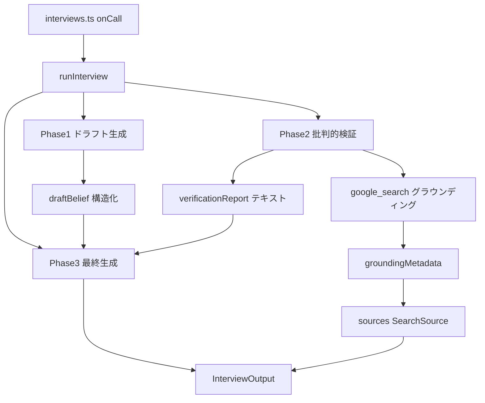
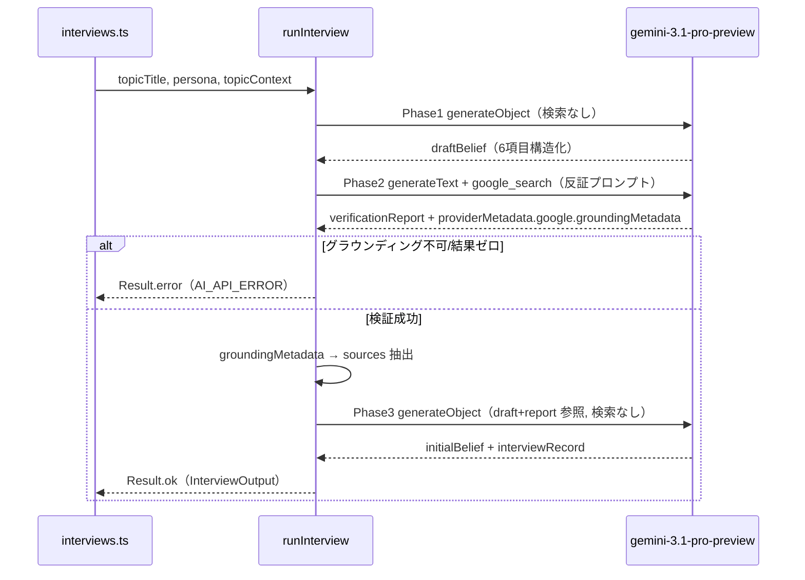

# Technical Design Document

## Overview

本機能は、ペルソナ取材パイプライン（`interview-agent.ts`）を**仮説検証型の3フェーズ・パイプライン**に再設計する。現行はTavilyツールをLLMに渡したシングルコールで、LLMがステレオタイプで穴を埋めた根拠の薄いペルソナを生成していた。新設計では「ステレオタイプ仮説を立てる→批判的に検証する→ゼロから再生成する」という流れで、Gemini の Google Search Grounding によって信念要素を実際の情報と照合する。

**Purpose**: 管理者が生成するペルソナに、実在の当事者の声に裏打ちされたリアリティを与える。

**Impact**: `runInterview` の内部実装を3フェーズに分割する。出力型 `InterviewOutput` には中間データ（`draftBelief`・`verificationReport`）を追加し、フロントは検証過程を段階表示する（要件5）。

### Goals
- ステレオタイプ仮説を実際の検索情報で批判的に検証し、根拠あるペルソナ信念を生成する
- グラウンディングメタデータから実際の参照URLを取得し `sources` として出力する
- 出力インターフェース（`InterviewOutput`）を変更せず、呼び出し元への影響をゼロにする

### Non-Goals
- ペルソナ生成（`persona-generator.ts`）・討論エージェント（`persona-agent.ts`）の変更
- `@tavily/core` パッケージの全廃（取材フローからの依存除去のみ。全廃は別判断）
- `interview` 以外の Firestore データ構造の変更

## Boundary Commitments

### This Spec Owns
- `interview-agent.ts` の3フェーズ・パイプライン実装（ドラフト生成・批判的検証・最終生成）
- Gemini Search Grounding の導入とグラウンディングメタデータからの `sources` 抽出
- 各フェーズのプロンプト設計（特に検証フェーズの反証起点プロンプト）
- `interviews.ts` の `SECRETS` から未使用の `TAVILY_API_KEY` を除去
- `InterviewOutput` への中間データ追加（`draftBelief`・`verificationReport`）
- フロント型・ストア・UI（`persona.types.ts`・`personas.svelte.ts`・`Phase3Interviews.svelte`）の検証過程可視化対応

### Out of Boundary
- `search-service.ts`・`persona-agent.ts`（討論側の検索。Tavilyを継続使用）
- `interview` 以外のペルソナ・トピックのデータ構造

### Allowed Dependencies
- `ai`（v6）・`@ai-sdk/google`（v3）・`@ai-sdk/anthropic`（v3）
- `getPipelineModel('personaInterview')`（`gemini-3.1-pro-preview`）
- `Result` / `PipelineError`（`common.types.ts`）

### Revalidation Triggers
- `InterviewOutput` / `SearchSource` / `SearchResult` の型変更
- グラウンディングメタデータのSDK API変更（`providerMetadata.google` 構造）
- AI SDK がグラウンディング+構造化出力の併用に対応した場合（フェーズ統合の検討余地）

## Architecture

### Existing Architecture Analysis
- `runInterview(topicTitle, persona, topicContext)` が単一の `generateText` で全工程を実行していた。
- 出力は `InterviewOutput = { interviewRecord, initialBelief, sources }`。`sources: SearchSource[]` は `{ query, summary, results: SearchResult[] }`。
- `interviews.ts`（onCall, 300秒）が `runInterview` を呼び、結果をそのままフロントへ返す。フロントが Firestore に保存する。
- 現行は例外を throw する方式。本設計では要件6に従い `Result` 型でのエラー返却に変更する。

### Architecture Pattern & Boundary Map



**Architecture Integration**:
- Selected pattern: 仮説検証型シーケンシャル・パイプライン（3フェーズ）。各フェーズは単一責務の純関数として `runInterview` 内で順次実行。
- Domain/feature boundaries: 構造化出力フェーズ（①③）とグラウンディングフェーズ（②）を分離。これによりAI SDKの「グラウンディング+構造化出力 非互換」制約を回避する（research.md 参照）。
- Existing patterns preserved: `getPipelineModel` によるモデル取得、`Result`/`PipelineError` のエラー型、`generateObject`/`generateText` の使い分け。
- New components rationale: 各フェーズを独立関数化し、ドラフトと検証レポートを独立した中間データとして保持（要件3.2）。
- Steering compliance: 中央ディスパッチャを作らず `interview-agent.ts` 内に処理を直接記述（過度な抽象化禁止）。アロー関数標準。

### Technology Stack

| Layer | Choice / Version | Role in Feature | Notes |
|-------|------------------|-----------------|-------|
| Backend / Services | `ai` v6 (`generateObject`/`generateText`) | フェーズ実行 | 構造化はObject、グラウンディングはText |
| AI Model | `gemini-3.1-pro-preview`（`@ai-sdk/google` v3） | 全3フェーズのLLM | ②のみ `google.tools.googleSearch` 付与 |
| Infrastructure / Runtime | Firebase Functions v2（onCall, Node.js 24） | 実行環境 | タイムアウトは実測で要調整（現状300秒） |

> グラウンディング有効化・メタデータ構造・非互換制約の詳細は research.md を参照。

## File Structure Plan

### Modified Files
- `functions/src/agents/interview-agent.ts` — シングルコールから3フェーズ・パイプラインへ全面再実装。Tavily・`evaluate_research` ツールを削除。`runInterview` の戻り値を `Result<InterviewOutput, PipelineError>` に変更。`InterviewOutput` に `draftBelief`・`verificationReport` を追加。
- `functions/src/api/interviews.ts` — `runInterview` が `Result` を返すようになるため、`ok===false` 時に `HttpsError` へ変換。`SECRETS` から `TAVILY_API_KEY` を除去。
- `functions/src/llm/models.ts` — グラウンディング用に `getGoogleProvider()`（APIキー読み取りを集約）を追加。
- `src/lib/models/persona/persona.types.ts` — `DraftBelief` 型と `InterviewForFirestore` への `draftBelief`・`verificationReport` を追加。
- `src/lib/stores/personas.svelte.ts` — 中間データを onCall 戻り値で受け取り Firestore に永続化。
- `src/lib/features/admin/research/Phase3Interviews.svelte` — ①ドラフト→②検証ギャップ＋参照元→③最終信念→取材記録の段階表示。marked + DOMPurify で Markdown 描画。

### New Dependencies
- `marked`（Markdown→HTML）・`isomorphic-dompurify`（サニタイズ）をフロントに追加。

## System Flows



**フロー上の決定**:
- Phase2でグラウンディングが利用不可、または `groundingChunks` が空のときはエラーを返し、未検証ドラフトを出力しない（要件5.5/6.1）。
- 各フェーズのLLMエラーは `Result.error` に集約し、呼び出し元がリトライ可能にする（要件6.2）。

## Requirements Traceability

| Requirement | Summary | Components | Flows |
|-------------|---------|------------|-------|
| 1.1–1.4 | ドラフト信念生成（検索なし・6項目・失敗時中断） | `generateDraftBelief` | Phase1 |
| 2.1–2.5 | グラウンディング批判的検証・ソース抽出・結果ゼロ時エラー | `verifyWithGrounding`, `extractSources` | Phase2 |
| 3.1–3.3 | ギャップを3区分テキストで独立保持・ドラフト非破壊 | `verifyWithGrounding`（verificationReport） | Phase2 |
| 4.1–4.4 | ドラフト+ギャップ参照で最終信念・取材記録をゼロ生成 | `generateFinalBelief` | Phase3 |
| 5.1–5.4 | `InterviewOutput`/`SearchSource` 形維持・researchSummary非出力 | `runInterview`, `extractSources` | 全体 |
| 6.1–6.3 | グラウンディング不可時エラー・Result返却・タイムアウト | `runInterview` | 全体 |

## Components and Interfaces

| Component | Layer | Intent | Req Coverage | Key Dependencies | Contracts |
|-----------|-------|--------|--------------|------------------|-----------|
| `runInterview` | Agent | 3フェーズを順次実行し結果を集約 | 5, 6 | generateDraftBelief/verifyWithGrounding/generateFinalBelief (P0) | Service |
| `generateDraftBelief` | Agent | ペルソナ情報のみでドラフト信念を生成 | 1 | gemini (P0) | Service |
| `verifyWithGrounding` | Agent | 反証起点でグラウンディング検証＋ソース抽出 | 2, 3 | gemini+google_search (P0), extractSources (P0) | Service |
| `generateFinalBelief` | Agent | ドラフト+検証レポートから最終信念・取材記録を生成 | 4 | gemini (P0) | Service |
| `extractSources` | Agent | groundingMetadata を SearchSource[] に変換 | 2, 5 | — | Service |

### Agent / Pipeline

#### runInterview

| Field | Detail |
|-------|--------|
| Intent | 3フェーズを順次実行し `InterviewOutput` を集約する |
| Requirements | 5.1, 5.4, 6.1, 6.2, 6.3 |

**Responsibilities & Constraints**
- 各フェーズを順番に呼び、いずれかがエラーなら即 `Result.error` を返す（fail-fast）。
- 出力は `InterviewOutput`（`interviewRecord`・`initialBelief`・`sources`）。`researchSummary` は出力しない。
- 例外を内部で捕捉し `Result` に正規化する（throwしない）。

**Dependencies**
- Outbound: `generateDraftBelief`・`verifyWithGrounding`・`generateFinalBelief`・`extractSources`（P0）
- External: `getPipelineModel('personaInterview')`（P0）

**Contracts**: Service [x]

##### Service Interface
```typescript
export const runInterview = (
  topicTitle: string,
  persona: Persona,
  topicContext?: TopicContext
): Promise<Result<InterviewOutput, PipelineError>>;
```
- Preconditions: `topicTitle` 非空、`persona.name` 非空（呼び出し元で検証済み）。
- Postconditions: `ok` のとき `sources` は非空（検証成功を保証）。`ok===false` のとき未検証ドラフトは含まない。
- Invariants: ドラフトは最終出力に直接含めず、参照入力としてのみ使用する。

#### generateDraftBelief

| Field | Detail |
|-------|--------|
| Intent | ペルソナ属性とテーマのみから6項目のドラフト信念を生成 |
| Requirements | 1.1, 1.2, 1.3, 1.4 |

**Responsibilities & Constraints**
- 外部検索を一切行わず、LLMの知識のみで生成する（要件1.2）。
- 6項目（立場と根拠・核心的主張・懸念事項・価値観・妥協点・変化の可能性）を構造化フィールドで返す（要件1.3）。
- 生成失敗時はエラーを返し、後続フェーズを実行しない（要件1.4）。

**Contracts**: Service [x]

##### Service Interface
```typescript
type DraftBelief = {
  stanceAndGrounds: string;
  coreClaims: string;
  concerns: string;
  values: string;
  compromisePoints: string;
  changePotential: string;
};

const generateDraftBelief = (
  topicTitle: string,
  persona: Persona,
  topicContext?: TopicContext
): Promise<Result<DraftBelief, PipelineError>>;
```
- 実装: `generateObject`（gemini, 検索なし）。スキーマは上記6フィールドの `z.object`。

**Implementation Notes**
- Integration: `getPipelineModel('personaInterview')` を検索ツールなしで使用。
- Risks: ドラフトはステレオタイプで構わない（検証で正す前提）。

#### verifyWithGrounding

| Field | Detail |
|-------|--------|
| Intent | ドラフト各項目を反証起点でグラウンディング検証し、レポートとソースを返す |
| Requirements | 2.1, 2.2, 2.3, 2.4, 2.5, 3.1, 3.2, 3.3 |

**Responsibilities & Constraints**
- `google.tools.googleSearch({})`（名前 `google_search`）を付与した `generateText` を使う（テキスト出力、構造化出力は使わない）。
- プロンプトで「各項目が誤り／実態と異なる証拠を優先的に探せ」と反証姿勢を明示する（要件2.2/2.3）。
- 出力テキストは**固定Markdownフォーマット**で構成し、Phase3のLLMが確実に区分解釈できるようにする（要件3.1）。これが `verificationReport`（ギャップ記録）。フォーマットは下記「検証レポート書式」を厳守させる。
- `providerMetadata.google.groundingMetadata` から `extractSources` でソースを得る。
- `groundingMetadata` が無い、または `groundingChunks` が空ならエラーを返す（要件2.5/6.1）。

**検証レポート書式（プロンプトで固定指定）**
```markdown
## 一致点
- ドラフトの主張: （ドラフト項目）
  実態: （検証で確認された内容）
  出典: （媒体名・調査機関名）

## 相違点
- ギャップ: （ドラフトの主張と実態のズレ）
  実態: （検証で判明した実態）
  出典: （媒体名・調査機関名）

## 新発見
- 観点: （ステレオタイプでは見えていなかった側面）
  内容: （具体的な内容）
  出典: （媒体名・調査機関名）
```
> **重要（確定）**: 本文にURLを書かせない。LLMにURLを書かせると実在しないリンク（ハルシネーション）を生成するため、出典は媒体名のみとする。UI出力用の正確な参照元リンクは `extractSources` が `groundingMetadata` から権威的に抽出し、`resolveSourceUrls` でリダイレクトURLを実URLに解決して得る（レポート本文とは独立）。spike で grounding チャンクは全件 redirect URL→実URL(200) に解決できることを確認済み。

**Dependencies**
- Outbound: `extractSources`（P0）
- External: gemini + `google_search` ツール（P0）

**Contracts**: Service [x]

##### Service Interface
```typescript
type VerificationResult = {
  verificationReport: string; // 固定Markdown書式（一致点/相違点/新発見, 各ギャップに根拠URL併記）
  sources: SearchSource[];
};

const verifyWithGrounding = (
  topicTitle: string,
  persona: Persona,
  draft: DraftBelief
): Promise<Result<VerificationResult, PipelineError>>;
```
- Preconditions: `draft` はPhase1の成功結果。
- Postconditions: `ok` のとき `sources` 非空。`draft` は読み取り専用（書き換えない）。

**Implementation Notes**
- Integration: `generateText({ model, tools: { google_search: google.tools.googleSearch({}) }, ... })`。`google` は `createGoogleGenerativeAI({ apiKey })`。
- Validation: `result.providerMetadata?.google?.groundingMetadata?.groundingChunks?.length` を確認。
- Risks: 反証の徹底はモデル依存。プロンプトで最大限強制する。

#### extractSources

| Field | Detail |
|-------|--------|
| Intent | groundingMetadata を `SearchSource[]` に変換 |
| Requirements | 2.3, 5.2, 5.3 |

**Responsibilities & Constraints**
- `groundingChunks[].web.{uri,title}` を `SearchResult{ title, url }` に変換し、URL重複を排除する。
- `webSearchQueries[]` を結合して `query` に、検証サマリー（レポート冒頭要約）を `summary` に格納し、1つの集約 `SearchSource` を返す（research.md のマッピング決定参照）。
- **設計判断（確定）**: グラウンディング精度を最優先し、ソースをサマリー単位に分解できなくても集約（1検証=1サマリー+全リンクプール）で許容する。クエリ単位グルーピングはグラウンディングメタデータから復元不可のため追求しない。

##### Service Interface
```typescript
const extractSources = (
  groundingMetadata: GoogleGenerativeAIGroundingMetadata,
  summary: string
): SearchSource[];
```
- Postconditions: `results` はURL重複なし。チャンクが空なら空配列（呼び出し元がエラー判定）。
- **URL解決＋タイトル取得（確定）**: `groundingChunks[].web.uri` は `vertexaisearch` のリダイレクトURL（短命）かつ `title` はドメイン名のため、抽出後に `resolveSourceUrls` で各URLを `fetch(GET, redirect:follow)` の `response.url`（フルの実URL）へ解決し、ページHTMLの `<title>` から記事タイトルを取得する。タイトルが取れない（PDF等）/解決失敗時は**フルURLをタイトルに使う（ドメイン名は使わない）**。並列＋5秒タイムアウト。詳細は research.md 参照。

#### generateFinalBelief

| Field | Detail |
|-------|--------|
| Intent | ドラフト+検証レポートを参照し最終信念・取材記録をゼロから生成 |
| Requirements | 4.1, 4.2, 4.3, 4.4 |

**Responsibilities & Constraints**
- ドラフトと検証レポートを**参照情報**として渡し、最終 `initialBelief` をドラフト構造に依存せずゼロ生成する（要件4.1/4.4）。
- ステレオタイプの一般論ではなく、このペルソナ固有の経験・葛藤・価値観を反映する（要件4.2）。
- 最終信念に基づき1000字以上の `interviewRecord` を生成する（要件4.3）。

**Contracts**: Service [x]

##### Service Interface
```typescript
const generateFinalBelief = (
  topicTitle: string,
  persona: Persona,
  draft: DraftBelief,
  verificationReport: string
): Promise<Result<{ initialBelief: string; interviewRecord: string }, PipelineError>>;
```
- 実装: `generateObject`（gemini, 検索なし）。スキーマは `{ initialBelief, interviewRecord }`。
- プロンプトでドラフトを「出発点ではなく比較参照」と明示（要件4.4）。

## Data Models

### Domain Model（中間データ）
- `DraftBelief`（Phase1出力・Phase2/3入力）: 6項目の構造化ドラフト。**最終出力には直接含めない**。
- `verificationReport`（Phase2出力・Phase3入力）: 3区分のギャップ記録テキスト。`DraftBelief` とは独立変数で保持（要件3.2）。
- `sources: SearchSource[]`（Phase2出力・最終出力）: グラウンディング由来の参照元。

### Data Contracts & Integration（出力型）
```typescript
export type SearchResult = { title: string; url: string };
export type SearchSource = { query: string; summary: string; results: SearchResult[] };
export type DraftBelief = {
  stanceAndGrounds: string;
  coreClaims: string;
  concerns: string;
  values: string;
  compromisePoints: string;
  changePotential: string;
};
export type InterviewOutput = {
  draftBelief: DraftBelief;      // Phase1: ステレオタイプ仮説（中間データ・可視化用）
  verificationReport: string;    // Phase2: 検証ギャップ（中間データ・可視化用）
  interviewRecord: string;
  initialBelief: string;
  sources: SearchSource[];
};
```
- `runInterview` の戻り値は `Result<InterviewOutput, PipelineError>`。`interviews.ts` が `ok===false` を `HttpsError` に変換する。
- 中間データ（`draftBelief`・`verificationReport`）はフロントが Firestore の `interview` に永続化し、`Phase3Interviews.svelte` が段階表示する（要件5）。Markdown は marked + DOMPurify で描画する。

## Error Handling

### Error Strategy
- 全フェーズのエラーを `Result<T, PipelineError>` に正規化。`runInterview` は throw せず、最初の失敗で即 `Result.error` を返す（fail-fast）。

### Error Categories and Responses
- **LLM/グラウンディングAPIエラー**: `{ code: 'AI_API_ERROR', message, retryable: true }`。`interviews.ts` が `HttpsError('internal')` に変換。
- **グラウンディング結果ゼロ／機能不可**: 同じく `AI_API_ERROR`（retryable）。未検証ドラフトは出力しない（要件6.1）。
- **入力検証**: `interviews.ts` の既存 `invalid-argument` チェックを維持。

### Monitoring
- 各フェーズ失敗時に `console.error('[runInterview] <phase> error', ...)` を出力（既存のハンドラ別エラーログ方針に準拠）。

## Testing Strategy

### Unit Tests（Vitest, `ai` をモック）
- Phase1: `generateDraftBelief` が検索ツールなしで6項目を返す。失敗時に `Result.error`。
- Phase2: `verifyWithGrounding` が `google_search` ツール付きで呼ばれ、`groundingChunks` 空のときエラーを返す。
- `extractSources`: `groundingChunks` を重複排除して `SearchResult[]` に変換、`webSearchQueries` を `query` に集約。
- Phase3: `generateFinalBelief` がドラフト+レポートをプロンプトに含めて `{initialBelief, interviewRecord}` を返す。
- `runInterview`: 全フェーズ成功で `InterviewOutput`（`sources` 非空）。Phase2失敗で全体エラー。`topicContext` の後方互換（descriptionを含む）。

### Integration Tests
- `interviews.ts`: `runInterview` が `ok===false` のとき `HttpsError` を投げる。`ok` のとき結果をそのまま返す。

## Performance & Scalability
- 目標: 3フェーズ（うち1回はグラウンディング+thinking）を Functions タイムアウト内に完了（要件6.3）。
- 現状の `timeoutSeconds: 300` で不足する場合は最大540秒まで引き上げ可能。実装後に実測して調整する（research.md のフォローアップ）。

## Risks & Mitigations

### 検索手段の段階的フォールバック
**本スペックの実装スコープは手段1（Geminiグラウンディング）のみ。** 手段2は実装せず、グラウンディングが機能しなかった場合の選択肢として記録に留める（別途検討）。Phase2の検索手段は 3フェーズ構造から独立しており、検索ツールのみ差し替え可能。

| 優先 | 手段 | 種別 | 備考 |
|------|------|------|------|
| 1（主軸） | Gemini `google.tools.googleSearch` グラウンディング | プロバイダ定義ツール | 本設計の前提。`groundingMetadata` からソース取得 |
| 2（フォールバック） | 既存 Tavily（`@tavily/core`） | 自前定義ツール | 実績あり・追加リスクなし。`google_search` を `web_search`（execute で Tavily 呼び出し）に差し替え。ソースは execute 内で記録 |

- **判断トリガー**: 実装最初のスパイクで gemini-3.1-pro-preview + `google_search` が `groundingChunks` を安定して返さない場合、手段2へ切り替える。
- **MCPは不採用**: Tavily MCP（サブプロセス起動）は Cloud Functions で起動・通信の追加リスクを抱えるため候補から除外。`search` 用途は自前定義ツールで十分。
- **構造非依存**: いずれの手段でも Phase1/Phase3（構造化出力・検索なし）は不変。検証フェーズの検索実装とソース抽出方法のみが変わる。

### その他リスク
- グラウンディングメタデータ未取得（gemini-3.1-pro-preview / AI SDK）。— スパイクで早期検証し、ダメなら手段2へ。
- 反証の徹底はモデル依存。— プロンプトで最大限強制。
- 3コール直列による latency 増。— タイムアウト引き上げで対応。
