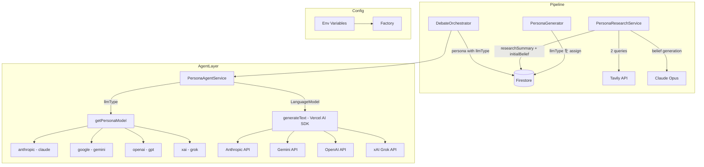
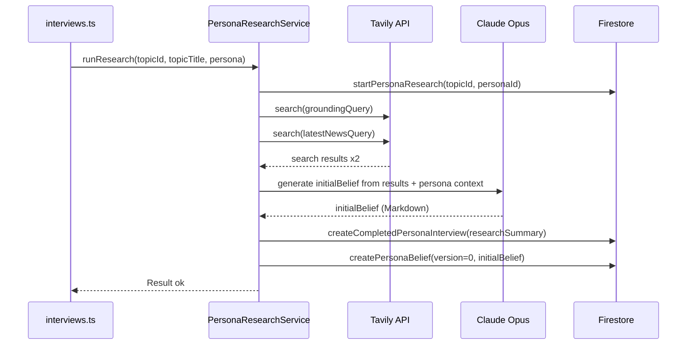
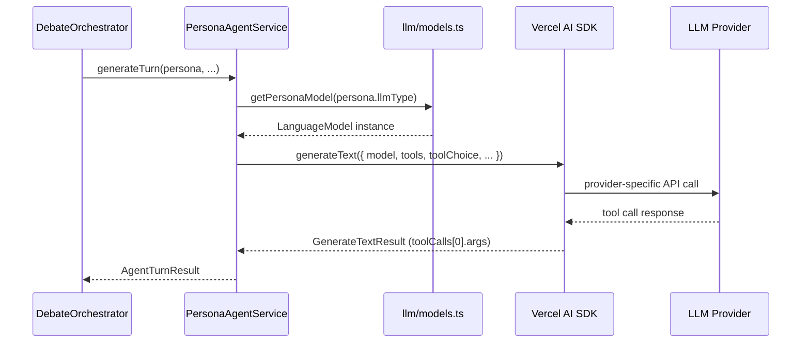

# Technical Design: persona-model-routing

## Overview

本フィーチャーは2つの独立した改善を行う。

**LLM モデルルーティング**: ペルソナの特性に応じて Gemini・Grok・Claude・GPT を使い分える `llm/models.ts` を新設し、`PersonaAgentService` がペルソナの `llmType` に基づいて Vercel AI SDK の `generateText` 経由で発言を生成する。既存の討論フロー・ファシリテーターは一切変更しない。

**信念形成パイプラインの刷新**: 現行の `InterviewerService`（LLM が架空のインタビューを生成）を廃止し、Tavily ウェブ検索 + Claude Opus による初期信念生成に置き換える。ペルソナの立場・役割に即した実際の情報を取得することで、LLM のステレオタイプを排除したリアリティある信念を形成する。

Firestore スキーマの変更は最小限（`llmType` フィールド追加のみ）とし、`interviewRecord` フィールド名は維持してデータマイグレーションを不要にする。

### Goals

- 4 プロバイダー（Gemini・Grok・Claude・GPT）での討論ターン生成
- Tavily 検索によるペルソナ信念のリアリティ向上
- フォールバック保証（API 障害時は Claude にフォールバック）
- 既存の討論フロー（章管理・エンゲージメント評価など）への影響ゼロ

### Non-Goals

- ファシリテーターエージェントの LLM 変更
- ペルソナ生成自体（`persona-generator.ts`）の LLM 変更（Claude Opus 継続）
- フロントエンド UI の変更
- 既存 Firestore ドキュメントのマイグレーション

---

## Boundary Commitments

### This Spec Owns

- `functions/src/llm/models.ts`（`getPersonaModel` 関数）
- `PersonaAttributes.llmType` フィールドの定義と Firestore への永続化
- `PersonaResearchService`（旧 `InterviewerService` の置き換え）
- `persona-generator.ts` での `llmType` 自動分類ロジック
- `persona-agent.ts` の Vercel AI SDK への移行

### Out of Boundary

- `facilitator-agent.ts` の変更
- フロントエンド（SvelteKit）の変更
- 既存 Firestore ドキュメントのマイグレーションスクリプト

### Allowed Dependencies

- `functions/src/db/repository.ts`（既存の read/write 関数をそのまま使用）
- `functions/src/config/ai.ts`（拡張して multi-provider モデル ID を追加）
- `functions/src/types/index.ts`（`LLMType` 型・`PersonaAttributes.llmType` を追加）

### Revalidation Triggers

- `getPersonaModel` のシグネチャ変更（`persona-agent.ts` に影響）
- `PersonaAttributes` 型の変更（`debate-orchestrator.ts` の `toPersonaAttributes` に影響）

---

## Architecture

### Existing Architecture Analysis

現在の AI 呼び出し構造:

```
PersonaAgentService
  └── new Anthropic()  ← ハードコード、全ペルソナ共通
        └── AI_MODELS.SONNET / OPUS

InterviewerService
  └── new Anthropic()  ← ハードコード
        └── AI_MODELS.OPUS
```

変更点:
- `PersonaAgentService` の Anthropic 直接依存を Vercel AI SDK（`generateText` + `getPersonaModel`）に変更
- `InterviewerService` を `PersonaResearchService` に完全置き換え

### Architecture Pattern & Boundary Map



**依存方向**: `Types → Config → llm/models → Services → Pipeline → API Endpoints`

### Technology Stack

| Layer | Choice / Version | Role | Notes |
|-------|-----------------|------|-------|
| AI SDK Core | `ai ^4.x`（Vercel AI SDK） | `generateText` + `jsonSchema` + `toolChoice` 統一 | 新規追加 |
| LLM - Claude | `@ai-sdk/anthropic` + 既存 `@anthropic-ai/sdk` | persona-agent の Claude ルーティング + facilitator/research | provider pkg 新規追加 |
| LLM - Gemini | `@ai-sdk/google` | Gemini ルーティング | 新規追加 |
| LLM - GPT | `@ai-sdk/openai` | GPT ルーティング | 新規追加 |
| LLM - Grok | `@ai-sdk/xai` | Grok ルーティング（公式プロバイダーパッケージ） | 新規追加 |
| 検索 | `@tavily/core ^1.x` | PersonaResearchService | 新規追加 |
| 既存インフラ | Firebase Functions v2, Firestore | 変更なし | |

---

## File Structure Plan

### Directory Structure

```
functions/src/
├── llm/                        # NEW: モデルプロバイダー層（Vercel AI SDK）
│   └── models.ts               # getPersonaModel(llmType) → LanguageModel
├── pipeline/
│   ├── persona-generator.ts    # MODIFIED: llmType 分類を submit_personas tool に追加
│   ├── persona-research.ts     # NEW: InterviewerService の置き換え
│   └── interviewer.ts          # DEPRECATED: 削除対象（persona-research.ts に移行後）
├── agents/
│   └── persona-agent.ts        # MODIFIED: generateText() + getPersonaModel() に変更
├── api/
│   └── interviews.ts           # MODIFIED: PersonaResearchService に差し替え
├── config/
│   └── ai.ts                   # MODIFIED: PERSONA_MODELS マップ追加
├── db/
│   └── repository.ts           # MODIFIED: llmType フィールド追加
└── types/
    └── index.ts                # MODIFIED: LLMType 型 + PersonaAttributes.llmType
```

### Modified Files

- `types/index.ts` — `LLMType` 型と `PersonaAttributes.llmType` フィールドを追加
- `config/ai.ts` — `PERSONA_MODELS` マップ（LLMType → モデル ID）を追加
- `db/repository.ts` — `PersonaProfile.llmType` と `CreatePersonaProfileParams.llmType` を追加
- `pipeline/persona-generator.ts` — `submit_personas` tool に `llmType` enum フィールドを追加し、`createPersonaProfile` 呼び出しに llmType を渡す
- `agents/persona-agent.ts` — `@anthropic-ai/sdk` 直接依存を `generateText` + `getPersonaModel` に変更。ツール定義を `jsonSchema()` でラップ
- `pipeline/debate-orchestrator.ts` — `toPersonaAttributes()` に `llmType: p.llmType ?? 'claude'` を追加（最小変更）
- `api/interviews.ts` — `InterviewerService` → `PersonaResearchService` に差し替え（関数名 `runInterview` は維持）
- `functions/package.json` — `ai`, `@ai-sdk/anthropic`, `@ai-sdk/google`, `@ai-sdk/openai`, `@ai-sdk/xai`, `@tavily/core` を追加

---

## System Flows

### 1. ペルソナ信念形成フロー（InterviewerService 置き換え）



フォールバック: Tavily 失敗時は検索なしで LLM のみによる信念生成を継続。

### 2. 討論ターン生成フロー（LLM ルーティング）



フォールバック: API キー未設定 / Provider が 5xx の場合、`getPersonaModel` は anthropic(claude) を返す。

---

## Requirements Traceability

| Req | Summary | Components | Interfaces | Flows |
|-----|---------|------------|------------|-------|
| 1.1 | LLMType の定義 | `llm/models.ts`, `types/index.ts` | `LLMType` 型 | — |
| 1.2 | PersonaAttributes.llmType | `types/index.ts` | `PersonaAttributes` | — |
| 1.3 | llmType を Firestore に保存 | `persona-generator.ts`, `repository.ts` | `CreatePersonaProfileParams` | — |
| 1.4 | デフォルト llmType = claude | `debate-orchestrator.ts`, `persona-agent.ts` | `toPersonaAttributes` | — |
| 2.1 | llmType 自動分類 | `persona-generator.ts` | `submit_personas` tool | — |
| 2.2–2.6 | 分類ルール | `persona-generator.ts` | tool enum | — |
| 3.1 | 4 プロバイダー対応 | `llm/models.ts` | `getPersonaModel` | — |
| 3.2 | APIキー管理 | `llm/models.ts` | env vars | — |
| 3.3 | クライアントキャッシュ | Vercel AI SDK 側で管理 | — | — |
| 3.4 | キー未設定フォールバック | `llm/models.ts` | `getPersonaModel` | — |
| 4.1–4.3 | 全操作でルーティング | `persona-agent.ts` | `generateText` + `getPersonaModel` | Flow 2 |
| 4.4 | エラー時フォールバック | `llm/models.ts` | `getPersonaModel` フォールバック | — |
| 4.5 | ツール定義の統一 | `persona-agent.ts` + `jsonSchema()` | Vercel AI SDK | — |
| 5.1–5.2 | Tavily 検索 | `persona-research.ts` | `PersonaResearchService` | Flow 1 |
| 5.3 | 検索 → 初期信念生成 | `persona-research.ts` | — | Flow 1 |
| 5.4 | Tavily 失敗フォールバック | `persona-research.ts` | — | — |
| 5.5 | リサーチ結果の保存 | `persona-research.ts`, `repository.ts` | — | — |

---

## Components and Interfaces

### Summary

| Component | Layer | Intent | Req | Key Dependencies | Contracts |
|-----------|-------|--------|-----|-----------------|-----------|
| `getPersonaModel` | llm/ | llmType → `LanguageModel` の解決（Vercel AI SDK） | 3.1–3.4 | `ai`, `@ai-sdk/*` (P0) | Service |
| `PersonaResearchService` | pipeline/ | Tavily 検索 + 信念生成 | 5.1–5.5 | `@tavily/core` (P0), Claude Opus (P0) | Service |
| `PersonaGeneratorService` (mod) | pipeline/ | llmType 分類追加 | 2.1–2.6 | Claude Opus (P0) | — |
| `PersonaAgentService` (mod) | agents/ | `generateText` + `getPersonaModel` で発言生成 | 4.1–4.4 | `ai`, `llm/models.ts` (P0) | — |

---

### LLM モデルプロバイダー層

#### `getPersonaModel` (`llm/models.ts`)

| Field | Detail |
|-------|--------|
| Intent | llmType を Vercel AI SDK の `LanguageModel` に解決。API キー未設定時は claude にフォールバック |
| Requirements | 3.1, 3.2, 3.3, 3.4 |

**Contracts**: Service [x]

##### Service Interface

```typescript
import type { LanguageModel } from 'ai';
import { anthropic } from '@ai-sdk/anthropic';
import { google } from '@ai-sdk/google';
import { openai } from '@ai-sdk/openai';
import { xai } from '@ai-sdk/xai';

export const PERSONA_MODELS = {
  claude: 'claude-sonnet-4-6',
  gemini: 'gemini-2.5-flash',
  gpt:    'gpt-4o',
  grok:   'grok-4',
} as const;

export const getPersonaModel = (llmType: LLMType): LanguageModel;
// llmType に対応する LanguageModel を返す。
// 各プロバイダーの API キー（GEMINI_API_KEY / OPENAI_API_KEY / XAI_API_KEY）が
// 未設定の場合は anthropic(PERSONA_MODELS.claude) にフォールバックする。
```

- `LLMType` は `types/index.ts` で定義: `'gemini' | 'grok' | 'claude' | 'gpt'`
- フォールバック: `process.env.GEMINI_API_KEY` 等を確認し、未設定なら claude を返す

**Vercel AI SDK による統一呼び出し**（`persona-agent.ts` での使用例）:

```typescript
import { generateText, jsonSchema } from 'ai';
import { getPersonaModel } from '../llm/models.js';

const result = await generateText({
  model: getPersonaModel(persona.llmType ?? 'claude'),
  maxTokens: MAX_TOKENS.PERSONA_TURN,
  system: buildPersonaSystemPrompt(persona, interviewRecord, currentBelief),
  tools: {
    submit_turn: {
      description: FULL_TURN_TOOL.description,
      parameters: jsonSchema(FULL_TURN_TOOL.input_schema),
    },
  },
  toolChoice: { type: 'tool', toolName: 'submit_turn' },
  messages: [{ role: 'user', content: userContent }],
});
const args = result.toolCalls[0].args;
// args.content, args.beliefChangeType, ... (型は input_schema から推論)
```

`jsonSchema()` により既存の `FULL_TURN_TOOL.input_schema`（JSON Schema オブジェクト）をそのまま再利用可能。プロバイダー固有のツール形式変換・レスポンス解析は Vercel AI SDK が吸収する。

---

### Pipeline Layer

#### `PersonaResearchService` (`pipeline/persona-research.ts`)

| Field | Detail |
|-------|--------|
| Intent | Tavily 検索 → Claude Opus による初期信念生成。InterviewerService の置き換え |
| Requirements | 5.1–5.5 |

**Dependencies**:
- Inbound: `api/interviews.ts` — runResearch 呼び出し (P0)
- Outbound: `db/repository.ts` — 検索結果・信念の保存 (P0)
- External: `@tavily/core` — ウェブ検索 (P0)
- External: Anthropic SDK (Claude Opus) — 初期信念生成 (P0)

**Contracts**: Service [x]

##### Service Interface

```typescript
export interface PersonaResearchResult {
  personaId: string;
  researchSummary: string;  // Firestore の interviewRecord フィールドに保存
  initialBelief: string;
  status: 'completed' | 'error';
  errorMessage?: string;
}

export class PersonaResearchService {
  async runResearch(
    topicId: string,
    topicTitle: string,
    persona: PersonaAttributes
  ): Promise<Result<PersonaResearchResult, PipelineError>>;
}
```

**内部処理**:
1. grounding query: `"{stakeholderRole} {occupation} 実際の問題 経験 証言"` 等
2. latest news query: `"{topicTitle} {stakeholderRole} 最新 2025 2026"` 等
3. Tavily 検索結果を連結してシステムプロンプトに含める
4. Claude Opus にペルソナプロフィール + 検索結果 → `initialBelief`（6項目 Markdown）+ `researchSummary` を生成させる
5. `repo.createCompletedPersonaInterview(topicId, personaId, researchSummary)` で保存（フィールド名維持）
6. `repo.createPersonaBelief(version=0, initialBelief)` で保存

**Implementation Notes**:
- Tavily 検索失敗時は空の検索結果で LLM 呼び出しを継続（フォールバック）
- `interviewRecord` フィールド名はそのまま維持（Firestore スキーマ変更なし、discussion-orchestrator.ts への影響なし）

---

#### `PersonaGeneratorService` 修正 (`pipeline/persona-generator.ts`)

`submit_personas` ツールの `items` スキーマに `llmType` フィールドを追加:

```typescript
llmType: {
  type: 'string',
  enum: ['gemini', 'grok', 'claude', 'gpt'],
  description: 'ペルソナの情報収集スタイルに合ったLLMタイプ。gemini=最新情報重視(記者・アナリスト等)、grok=SNS・世論に敏感(活動家・若年層等)、claude=学術・論理重視(研究者・教授等)、gpt=バランス型(一般市民・会社員等)',
}
```

`required` に `llmType` を追加。`createPersonaProfile` 呼び出し時に `llmType: p.llmType` を渡す。

---

#### `PersonaAgentService` 修正 (`agents/persona-agent.ts`)

コンストラクタを変更:

```typescript
// Before
constructor(client = new Anthropic()) { ... }

// After
constructor() { ... }  // 依存注入不要: getPersonaModel を直接呼び出す
```

`generateTurn` / `assessEngagement` / `generatePostDebateComment` の各メソッドで:
```typescript
import { generateText, jsonSchema } from 'ai';
import { getPersonaModel } from '../llm/models.js';

const result = await generateText({
  model: getPersonaModel(persona.llmType ?? 'claude'),
  maxTokens: MAX_TOKENS.PERSONA_TURN,
  system: buildSystemPrompt(...),
  tools: {
    submit_turn: {
      description: FULL_TURN_TOOL.description,
      parameters: jsonSchema(FULL_TURN_TOOL.input_schema),
    },
  },
  toolChoice: { type: 'tool', toolName: 'submit_turn' },
  messages: [...],
});
const args = result.toolCalls[0].args;
```

---

## Data Models

### Domain Model

`PersonaAttributes` に `llmType` を追加:

```typescript
// types/index.ts
export interface PersonaAttributes {
  id: string;
  stakeholderRole: string;
  name: string;
  nationality?: string;
  age: number;
  occupation: string;
  background: string;
  interests: string;
  stanceDirection: string;
  llmType?: LLMType;  // 追加（optional: 既存ドキュメントとの後方互換）
}
```

### Physical Data Model（Firestore）

**`topics/{topicId}/personas/{personaId}`** に `llmType` フィールドを追加:

```
llmType: 'gemini' | 'grok' | 'claude' | 'gpt'  // 新規フィールド
```

既存フィールドは変更なし。`interview.interviewRecord` はリサーチサマリーの内容に変わるが、フィールド名は維持。

### Data Contracts & Integration

`repo.CreatePersonaProfileParams` に `llmType` を追加:

```typescript
export interface CreatePersonaProfileParams {
  // ... existing fields
  llmType: LLMType;  // 追加
}
```

`repo.PersonaProfile` に `llmType` を追加:

```typescript
export interface PersonaProfile {
  // ... existing fields
  llmType?: LLMType;  // 追加（optional: 後方互換）
}
```

---

## Error Handling

### Error Strategy

| エラー種別 | 発生箇所 | 対応 |
|-----------|---------|------|
| LLM プロバイダー API エラー (5xx) | `generateText` 呼び出し | 上位に伝播 → PersonaAgent が catch → `getPersonaModel('claude')` でリトライ |
| API キー未設定 | `getPersonaModel` | anthropic(claude) にフォールバック（ログ記録） |
| Tavily 検索失敗 | PersonaResearchService | 空の検索結果で LLM 呼び出し継続（エラーログ記録） |
| ツール応答なし | `generateText` | `toolCalls` が空の場合は `PipelineError { code: 'AI_API_ERROR', retryable: true }` をスロー |

### Monitoring

- `getPersonaModel` でフォールバック発生時: `console.warn('[llm] fallback to claude: {llmType} - {reason}')`
- Tavily 検索失敗時: `console.warn('[research] tavily failed: {personaId} - {error}')`
- LLM プロバイダーエラー時: `console.error('[llm] provider error: {llmType} - {error}')`

---

## Testing Strategy

### Unit Tests

- `getPersonaModel`: API キー未設定時に claude モデルを返すこと、各 llmType に対応するモデルが返ること
- `PersonaAgentService.generateTurn`: `persona.llmType` に応じた `LanguageModel` が `generateText` に渡されること（`getPersonaModel` をモック）
- `PersonaAgentService.generateTurn`: `jsonSchema()` でラップされたツール定義が正しく渡されること
- `PersonaResearchService.runResearch`: Tavily モック + Anthropic モックでの信念生成テスト

### Integration Tests

- `PersonaGeneratorService.generate`: `llmType` フィールドが生成ペルソナに含まれること
- `PersonaAgentService.generateTurn`: 実際の `generateText` 呼び出しで全 llmType のツール呼び出しが成功すること（各 API キー設定時）
- `PersonaResearchService.runResearch`: Tavily 失敗時のフォールバック動作確認

### Migration Strategy

既存 Firestore ドキュメントへの `llmType` 未設定が許容されるため、マイグレーションスクリプト不要。`PersonaAttributes.llmType` は optional 型とし、`debate-orchestrator.ts` の `toPersonaAttributes()` でデフォルト値 `'claude'` を補完する。
