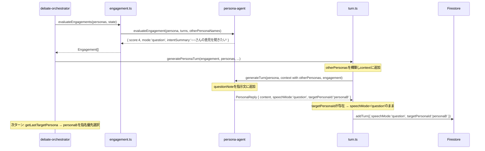

# Design Document: persona-question-mode

## Overview

討論システムにおいて、ペルソナが自分の意見を一方的に述べるだけでなく、他の参加者へ質問・問い返しをする動きを増やす拡張である。

`Engagement.mode` に `'question'` を追加することで、発言意欲評価フェーズで「特定の参加者に質問したい」という意図を表明できるようにする。ターン生成フェーズではこの意図を受けて質問形式の発言を生成し、生成されたターンの `targetPersonaId` を通じて既存の指名優先メカニズムが機能する。型・プロンプト・フォールバック処理を変更するリファクタリングであり、Firestoreスキーマ・API・話者選択アルゴリズムは変更しない。

### Goals
- `Engagement.mode: 'question'` によって「誰かに質問したい」という発言意図を正式にモデル化する
- ターン生成時に質問形式の指示文を追加し、`targetPersonaId` が設定されるターンを増やす
- 既存の指名優先メカニズム（`targeted_by_persona`）を最大限活用してペルソナ間対話を促進する

### Non-Goals
- 話者選択アルゴリズムの変更
- `MAX_PAIR_CONVERSATION_TURNS` などの定数変更
- Firestoreスキーマの変更
- `Engagement` への `targetPersonaId` フィールド追加（責務分離を維持するため）

---

## Boundary Commitments

### This Spec Owns
- `Engagement.mode` の型拡張（`'question'` 追加）
- `PersonaReply.speechMode` / `DebateTurn.speechMode` の型拡張（`'question'` 追加）
- `TurnGenerationContext.otherPersonas` フィールドの追加
- `ASSESS_ENGAGEMENT_TOOLS` のスキーマ・説明文更新
- `evaluateEngagement` への参加者名リスト引数追加
- `generateTurn` における questionモード専用指示文の追加
- `generatePersonaTurn` における question→opinion フォールバック処理

### Out of Boundary
- `speaker-selection.ts` のロジック変更
- `queued-intents.ts` のロジック変更（`intentSummary` の保存は既存のまま機能する）
- Firestoreスキーマ・コレクション構造の変更
- フロントエンドコンポーネントの変更

### Allowed Dependencies
- `types/debate.types.ts` — 型定義の単一ソース
- `agents/persona-agent.ts` — LLM呼び出しロジック
- `pipeline/debate/engagement.ts` — engagement評価オーケストレーション
- `pipeline/debate/turn.ts` — ターン生成・永続化

### Revalidation Triggers
- `Engagement.mode` の型を変更した場合、`speaker-selection.ts` / `queued-intents.ts` / `engagement.ts` の型整合確認が必要
- `TurnGenerationContext` の型を変更した場合、`generatePersonaTurn` の呼び出し箇所の確認が必要

---

## Architecture

### Existing Architecture Analysis

現在の討論実行フローは以下の通り：

1. `evaluateEngagements` → 全ペルソナの発言意欲を `{ score, mode: 'opinion'|'fact'|'none', intentSummary }` で評価
2. `selectSpeaker` → スコア・キュー・指名の優先順位で発言者を決定
3. `generatePersonaTurn` → `generateTurn` を呼び出し、発言内容を生成
4. `addTurn` → `DebateTurn`（`targetPersonaId` を含む）を Firestore に保存
5. 次ターンで `getLastTargetPersona` が `targetPersonaId` を読み取り、指名優先選択が働く

`targetPersonaId` はステップ3（ターン生成）でLLMが `submit_turn` を通じてセットし、ステップ4で保存される。現状のプロンプトでは "直接質問する場合のみ targetPersonaId を指定" という消極的な指示のみで、質問意図を評価フェーズで計画する仕組みがない。

### Architecture Pattern & Boundary Map

```mermaid
graph TB
    subgraph Before
        EA1[evaluateEngagement] -->|mode: opinion or fact or none| ES1[engagement]
        ES1 --> GT1[generateTurn]
        GT1 -->|targetPersonaId: 偶発的| T1[DebateTurn]
    end

    subgraph After
        EA2[evaluateEngagement\notherPersonaNames追加] -->|mode: question or opinion or fact or none| ES2[engagement]
        ES2 -->|intentSummary: 質問意図| GT2[generateTurn\nquestionNote追加]
        GT2 -->|targetPersonaId: 積極的にセット| T2[DebateTurn]
        T2 -->|既存メカニズム| SS[selectSpeaker\ntargeted_by_persona]
    end
```



**依存方向**: `types/` → `agents/` → `pipeline/debate/`

### Technology Stack

| Layer | Choice / Version | Role in Feature |
|-------|------------------|-----------------|
| Backend | ai SDK (既存) | `generateText` / ツール定義（変更なし） |
| Runtime | Firebase Functions v2 / Node.js 24 | 実行環境（変更なし） |

新規外部依存なし。

---

## File Structure Plan

### Modified Files

- `functions/src/types/debate.types.ts` — `Engagement.mode` / `PersonaReply.speechMode` / `DebateTurn.speechMode` に `'question'` 追加、`TurnGenerationContext` に `otherPersonas` 追加
- `functions/src/agents/persona-agent.ts` — `ASSESS_ENGAGEMENT_TOOLS` 更新、`evaluateEngagement` に `otherPersonaNames` 引数追加、`generateTurn` に questionモード処理追加
- `functions/src/pipeline/debate/engagement.ts` — `evaluateEngagement` 呼び出しに `otherPersonaNames` を渡す
- `functions/src/pipeline/debate/turn.ts` — `addTurn.speechMode` 型更新、`generatePersonaTurn` に otherPersonas構築・フォールバック処理追加

---

## System Flows



**フォールバックフロー**: `PersonaReply.targetPersonaId` が未設定の場合、`generatePersonaTurn` が `speechMode` を `'opinion'` に差し替えて保存する。

---

## Requirements Traceability

| 要件 | 概要 | コンポーネント | インターフェース |
|------|------|---------------|----------------|
| 1.1 | questionを Engagement.mode に追加 | `debate.types.ts` | `Engagement` 型 |
| 1.2 | intentSummaryに質問意図を記述 | `persona-agent` | `ASSESS_ENGAGEMENT_TOOLS` |
| 1.3 | 参加者名リストをevaluation promptに渡す | `persona-agent`, `engagement.ts` | `evaluateEngagement` 引数 |
| 1.4 | intentSummaryなしのquestionはopinionへフォールバック | `persona-agent` | `evaluateEngagement` 戻り値処理 |
| 2.1 | questionモード時の質問指示文 | `persona-agent` | `generateTurn` |
| 2.2 | speechMode:'question' をPersonaReplyに設定 | `persona-agent` | `PersonaReply` |
| 2.3 | speechMode:'question' を型に追加 | `debate.types.ts` | `PersonaReply`, `DebateTurn` |
| 2.4 | targetPersonaIdをターンに設定 | `turn.ts` | `generatePersonaTurn` |
| 2.5 | targetPersonaId未設定時のopinionフォールバック | `turn.ts` | `generatePersonaTurn` |
| 3.1 | questionモードの定義 | `persona-agent` | `ASSESS_ENGAGEMENT_TOOLS` 説明文 |
| 3.2 | 優先順位: question > fact > opinion > none | `persona-agent` | `ASSESS_ENGAGEMENT_TOOLS` 説明文 |
| 3.3 | 自分自身を対象にしない | `persona-agent` | `ASSESS_ENGAGEMENT_TOOLS` 説明文 |

---

## Components and Interfaces

### Summary

| Component | Layer | Intent | 要件カバレッジ | Key Dependencies |
|-----------|-------|--------|--------------|-----------------|
| `debate.types.ts` | types | 型定義の拡張 | 1.1, 2.3 | — |
| `ASSESS_ENGAGEMENT_TOOLS` | agents | questionモードのスキーマ定義 | 1.1, 1.2, 3.1, 3.2, 3.3 | ai SDK |
| `evaluateEngagement` | agents | engagement評価（参加者名追加） | 1.3, 1.4 | `ASSESS_ENGAGEMENT_TOOLS` |
| `generateTurn` | agents | questionモード指示文追加 | 2.1, 2.2, 2.4 | ai SDK |
| `generatePersonaTurn` | pipeline | otherPersonas構築・フォールバック | 2.4, 2.5 | `generateTurn`, Firestore |

---

### types/

#### `debate.types.ts`

| Field | Detail |
|-------|--------|
| Intent | questionモードに必要な型拡張 |
| Requirements | 1.1, 2.3 |

**Contracts**: State [x]

##### State Management

```typescript
// Engagement.mode に 'question' を追加
export type Engagement = {
  personaId: string;
  score: number;
  mode: 'opinion' | 'fact' | 'none' | 'question';
  intentSummary?: string;
  // targetPersonaId は追加しない（責務分離）
};

// PersonaReply.speechMode に 'question' を追加
export type PersonaReply = {
  content: string;
  speechMode?: 'opinion' | 'fact' | 'question';
  beliefChange: BeliefChangeEvent | null;
  targetPersonaId?: string;
  searchUsed?: boolean;
  searchQueries?: string[];
};

// DebateTurn.speechMode に 'question' を追加
export type DebateTurn = {
  // ... 既存フィールド
  speechMode?: 'opinion' | 'fact' | 'question';
  // ... 既存フィールド
};

// TurnGenerationContext に otherPersonas を追加
export type TurnGenerationContext = {
  chapterTurns: ReadonlyArray<DebateTurn>;
  chapter: Chapter;
  pendingTrigger?: { speakerName: string; content: string };
  targetedBy?: 'facilitator' | 'persona';
  otherPersonas: ReadonlyArray<{ id: string; name: string }>;  // 新規追加
};
```

---

### agents/

#### `ASSESS_ENGAGEMENT_TOOLS` の更新

| Field | Detail |
|-------|--------|
| Intent | questionモードをLLMが選択できるようスキーマ・説明文を更新 |
| Requirements | 1.1, 1.2, 3.1, 3.2, 3.3 |

**Contracts**: Service [x]

##### Service Interface

```typescript
// mode enum に 'question' を追加
// description を以下に更新:
/*
【mode の選び方】
1. 直前または以前の特定の参加者の発言を受けて、その人物に問い返し・確認・反論を向けたいなら → question
2. 紹介すべき事実・データ・調査結果を持っているなら → fact
3. それ以外で、自分の考え・意見・実感を述べたいなら → opinion
付け加える中身がなく発言する必要がなければ score 1（none）。

question（特定の参加者に直接問い返し・質問をする発言）:
  score 1: 質問しなくてよい（問い返したいことがない）
  score 2: 軽く質問したい（一言確認したいことがある）
  score 3: 質問したい（相手の発言をもっと深堀りしたい）
  score 4: ぜひ質問したい（相手の立場・経験を具体的に聞きたいことがある）
  score 5: すぐ質問したい（見逃せない点・矛盾を今すぐ確認したい）

intentSummary には「誰のどの発言について何を聞きたいか」を80文字以内で記述する。
自分自身を対象にしてはならない。
*/
```

**Implementation Notes**:
- `evaluateEngagement` の呼び出し時に `otherPersonaNames` を prompt に追加し、LLMが参加者名を参照できるようにする
- `intentSummary` は `question` モード時に必須（空の場合は `opinion` フォールバック）

---

#### `evaluateEngagement` の更新

| Field | Detail |
|-------|--------|
| Intent | 参加者名リストを evaluation prompt に渡し、questionモードの選択を可能にする |
| Requirements | 1.3, 1.4 |

**Contracts**: Service [x]

##### Service Interface

```typescript
// 引数に otherPersonaNames を追加
export const evaluateEngagement: (
  persona: Persona,
  turns: DebateTurn[],
  otherPersonaNames: string[]  // 新規追加: 自分以外の参加者名リスト
) => Promise<Engagement>
```

- Preconditions: `otherPersonaNames` は評価対象 persona 以外の参加者名の配列
- Postconditions: `mode === 'question'` かつ `intentSummary` が空または未設定の場合、**`evaluateEngagement` 自身が `mode: 'opinion'` に正規化して返す**。呼び出し元（`evaluateEngagements` / `evaluateEngagementWithFallback`）はフォールバック処理を行わない
- Invariants: 戻り値の `mode` が `'question'` のとき `intentSummary` は必ず非空

**Implementation Notes**:
- `evaluateEngagements` と `evaluateEngagementWithFallback` は `personas` から `otherPersonaNames` を構築して渡す
- question prompt への参加者名の埋め込み例: `「参加者: ${otherPersonaNames.join('、')}」`
- LLMが返した `mode === 'question'` かつ `intentSummary` が空の場合、この関数内で `{ ...result, mode: 'opinion' }` として返すことで一貫性を保証する

---

#### `generateTurn` の更新

| Field | Detail |
|-------|--------|
| Intent | questionモード専用の指示文を追加し、LLMが targetPersonaId を設定した質問ターンを生成するよう促す |
| Requirements | 2.1, 2.2, 2.4 |

**Contracts**: Service [x]

##### Service Interface

```typescript
// シグネチャ変更なし（TurnGenerationContext.otherPersonas を追加で利用）
export const generateTurn: (
  persona: Persona,
  context: TurnGenerationContext,  // otherPersonas を含む
  engagement: Engagement
) => Promise<Result<PersonaReply, PipelineError>>
```

**Implementation Notes**:
- `isQuestion = engagement.mode === 'question'` の場合、`questionInstruction` を使用する
- `questionInstruction` は `intentSummary` と `otherPersonas` の名前→IDマップを含み、`targetPersonaId` の設定を強く促す
- questionInstruction例:
  ```
  ${persona.name}として、特定の参加者に直接質問してください（${lengthGuide}）。
  【今回の質問意図】${engagement.intentSummary}
  【参加者一覧（targetPersonaId に使用するID）】
  ${otherPersonas.map(p => `- ${p.name}: ${p.id}`).join('\n')}
  必ず targetPersonaId に質問相手のIDを指定すること。信念変化があれば beliefChangeType を指定。
  ```
- `PersonaReply.speechMode` は `'question'` として返す

---

### pipeline/debate/

#### `generatePersonaTurn` の更新

| Field | Detail |
|-------|--------|
| Intent | `TurnGenerationContext.otherPersonas` の構築と、questionフォールバック処理を担う |
| Requirements | 2.4, 2.5 |

**Contracts**: Service [x]

##### Service Interface

```typescript
// シグネチャ変更なし（内部処理の追加）
export const generatePersonaTurn: (params: {
  topicId: string;
  personas: Persona[];
  chapter: Chapter;
  state: DebateState;
  speakerSelection: SpeakerSelection;
  engagement: Engagement;
}) => Promise<{ turnId: string; personaId: string; targetPersonaId: string | undefined; ... } | null>
```

**Implementation Notes**:
- `personas` から `context.otherPersonas` を構築: `personas.filter(p => p.id !== persona.id).map(p => ({ id: p.id, name: p.name }))`
- フォールバック: `turnResult.value.speechMode === 'question' && !targetPersonaId` のとき `effectiveSpeechMode = 'opinion'` として `addTurn` に渡す
- `addTurn.speechMode` の型を `'opinion' | 'fact' | 'question'` に更新

---

## Error Handling

### Error Strategy

本仕様のエラー処理は既存パターンを踏襲する。

- questionモードで `targetPersonaId` が設定されなかった場合: `generatePersonaTurn` が `speechMode` を `'opinion'` に差し替えてターンを保存（情報消失なし）
- `intentSummary` が空のまま `question` モードが返された場合: `evaluateEngagement` 自身が戻り値を `mode: 'opinion'` に正規化する（呼び出し元は関与しない）
- LLMエラー: 既存の `Result<T, PipelineError>` パターンで処理（変更なし）

---

## Testing Strategy

### Unit Tests

- `ASSESS_ENGAGEMENT_TOOLS` のスキーマに `question` が含まれること
- `evaluateEngagement` が `question` モードを返したとき `intentSummary` が設定されること
- `generateTurn` が `question` モードかつ `otherPersonas` ありで呼ばれたとき `questionInstruction` が指示文に含まれること
- `generatePersonaTurn` でフォールバック（`targetPersonaId` 未設定時に `speechMode` が `'opinion'` になること）

### Integration Tests

- `question` モードのengagementで `generatePersonaTurn` を実行したとき、`DebateTurn.targetPersonaId` が設定されること
- `targetPersonaId` が設定されたターン後、次ターンで対象ペルソナが `targeted_by_persona` として選ばれること（既存動作確認）
