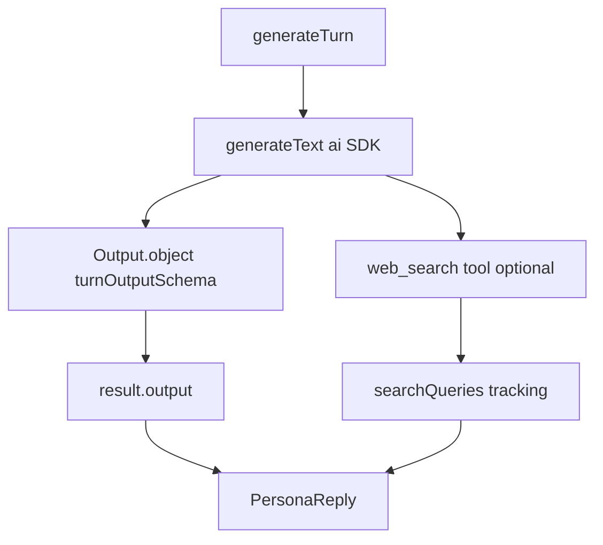
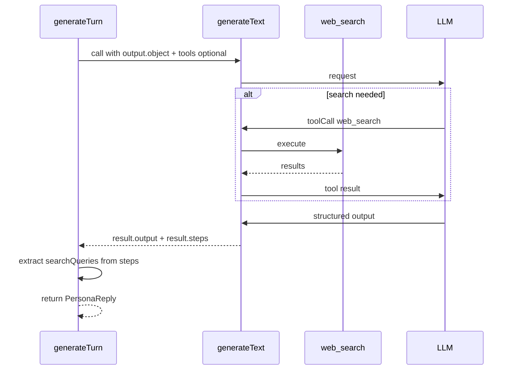

# Design Document: persona-turn-output-object

## Overview

`generateTurn` は討論1ターン分の発言を生成するエージェント関数である。現行実装は `submit_turn` というダミーツール（`execute` なし）を通じて構造化出力を取り出す迂回策を使っており、ツール呼び忘れによるエラーリスクを内包する。

本 spec では AI SDK v6 の `generateText` + `Output.object()` を使い、`submit_turn` を廃止して構造化出力を直接取得するよう移行する。`interview-agent.ts` で同一パターンが既に稼働しており、それをそのまま踏襲する。

### Goals

- `submit_turn` ダミーツールを廃止し、ツール呼び忘れエラーリスクをゼロにする
- `Output.object()` による型安全な構造化出力を実現する
- `web_search` による検索追跡（`searchUsed`, `searchQueries`）を現行どおり維持する
- 呼び出し元インターフェース（`Result<PersonaReply, PipelineError>`）を変更しない

### Non-Goals

- `evaluateEngagement` / `generatePostDebateComment` の出力方式変更
- `web_search` ツール自体の動作変更
- `pipeline/` など呼び出し元コードの変更

## Boundary Commitments

### This Spec Owns

- `persona-agent.ts` 内の `generateTurn` 関数の出力取得方式
- `buildFullTurnTools` から `submit_turn` エントリを削除すること
- `turnOutputSchema`（Zod スキーマ）の定義
- `generateText` 呼び出しオプションの変更（`output`, `toolChoice`, `tools` 条件分岐）
- `functions/src/tests/agents/persona-agent.test.ts` のモック更新

### Out of Boundary

- `generateTurn` の戻り値型 `Result<PersonaReply, PipelineError>` の変更
- `submit_turn` 以外のツール（`web_search`）の仕様変更
- Firestore 書き込み層・`pipeline/debate/turn.ts` など呼び出し元

### Allowed Dependencies

- `ai` パッケージ（`generateText`, `Output`, `stepCountIs`）— 既存依存
- `zod` — 既存依存

### Revalidation Triggers

- `PersonaReply` 型の変更
- AI SDK v6 の `Output.object` API 変更
- `generateTurn` の引数シグネチャ変更

## Architecture

### Existing Architecture Analysis

現行フロー：
1. `buildFullTurnTools` が `submit_turn`（ダミー）と `web_search`（条件付き）を返す
2. `generateText` に `toolChoice: 'required'` を指定し、モデルに必ずツールを呼ばせる
3. `stopWhen: stepCountIs(4)` でステップ上限を設ける
4. `result.steps.flatMap(s => s.toolCalls)` から `submit_turn` を探し、`.input` を構造化出力として取り出す
5. 非 Claude モデルで `submit_turn` がなければ Claude にフォールバック

移行後フロー：
1. `buildFullTurnTools` は `web_search` のみを返す（`submit_turn` 削除）
2. `generateText` に `output: Output.object({ schema: turnOutputSchema })` を追加
3. `toolChoice` を削除（`'auto'` デフォルト）
4. `web_search` 使用可否で `tools` と `stopWhen` を条件付き追加
5. `result.output` から直接構造化出力を取得
6. フォールバック判定を `result.output?.content` の有無に変更

### Architecture Pattern & Boundary Map



### Technology Stack

| Layer | Choice / Version | Role in Feature |
|-------|------------------|-----------------|
| Backend | `ai` v6 `Output.object` | 構造化出力取得 |
| Backend | `zod` | `turnOutputSchema` 定義・型推論 |

## File Structure Plan

### Modified Files

- `functions/src/agents/persona-agent.ts` — `submit_turn` 削除、`turnOutputSchema` 追加、`generateText` オプション変更、フォールバック判定変更
- `functions/src/tests/agents/persona-agent.test.ts` — `Output` モック追加、`output` フィールドを返すよう更新

## System Flows



## Requirements Traceability

| Requirement | Summary | Components | Flows |
|-------------|---------|------------|-------|
| 1.1 | submit_turn をツールに含めない | `buildFullTurnTools` | — |
| 1.2 | submit_turn エントリを削除 | `buildFullTurnTools` | — |
| 1.3 | search 不可時は tools 省略 | `generateTurn` 呼び出し部 | — |
| 2.1 | output: Output.object を渡す | `generateTurn` 呼び出し部 | System Flow |
| 2.2 | turnOutputSchema の定義 | `turnOutputSchema` | — |
| 2.3 | result.output から取得 | `generateTurn` 結果処理 | System Flow |
| 2.4 | submit_turn 検索コード削除 | `generateTurn` 結果処理 | — |
| 3.1 | steps から web_search を収集 | `generateTurn` 結果処理 | System Flow |
| 3.2 | searchQueries を PersonaReply に含める | `generateTurn` 結果処理 | — |
| 4.1 | output.content なしで Claude フォールバック | `generateTurn` フォールバック | — |
| 4.2 | 例外時 Claude フォールバック | `generateTurn` フォールバック | — |
| 4.3 | submit_turn 有無によるフォールバック削除 | `generateTurn` フォールバック | — |
| 5.1 | Output モックを ai モックに追加 | テスト | — |
| 5.2 | generateText モックが output フィールドを返す | テスト | — |
| 5.3 | submit_turn モックコードを削除 | テスト | — |

## Components and Interfaces

| Component | Layer | Intent | Req Coverage | Contracts |
|-----------|-------|--------|--------------|-----------|
| `turnOutputSchema` | Schema | ターン出力の Zod スキーマ定義 | 2.2 | State |
| `buildFullTurnTools` | Agent | web_search のみ返す（submit_turn 削除） | 1.1, 1.2 | Service |
| `generateTurn` 呼び出し部 | Agent | output.object + 条件付き tools で generateText を呼ぶ | 1.3, 2.1, 2.3, 2.4 | Service |
| `generateTurn` フォールバック | Agent | output.content 有無で Claude 再試行 | 4.1, 4.2, 4.3 | Service |
| `generateTurn` 結果処理 | Agent | result.output + steps から PersonaReply を組み立て | 3.1, 3.2 | Service |

### Agent Layer

#### turnOutputSchema

| Field | Detail |
|-------|--------|
| Intent | `generateText` の `output.object` に渡す Zod スキーマ。`PersonaReply` に必要な全フィールドを定義する |
| Requirements | 2.2 |

**Contracts**: State [x]

##### State Management

```typescript
const turnOutputSchema = z.object({
  content: z.string(),
  beliefChangeType: z.enum(['opinion_change', 'partial_acceptance']).optional(),
  beliefChangeSummary: z.string().optional(),
  beliefChangeUpdatedBelief: z.string().optional(),
  targetPersonaId: z.string().optional()
});

type TurnOutput = z.infer<typeof turnOutputSchema>;
```

#### buildFullTurnTools

| Field | Detail |
|-------|--------|
| Intent | `web_search` ツールのみを返す。`submit_turn` を含まない |
| Requirements | 1.1, 1.2 |

**Contracts**: Service [x]

##### Service Interface

```typescript
// 戻り値から submit_turn を除去。web_search のみ
function buildFullTurnTools(
  styleGuide: string,
  lengthGuide: string
): Record<string, AnyTool> | undefined
// isSearchAvailable() が false の場合は undefined を返す（1.3）
```

- Postconditions: 戻り値オブジェクトに `submit_turn` キーが存在しない

**Implementation Notes**
- `isSearchAvailable()` が false の場合、空オブジェクト `{}` を返さず `undefined` を返す（req 1.3）
- `AnyTool` 型の `inputSchema` / `execute` はそのまま維持

#### generateTurn 呼び出し部

| Field | Detail |
|-------|--------|
| Intent | `Output.object` + 条件付き `tools`/`stopWhen` で `generateText` を呼ぶ |
| Requirements | 1.3, 2.1, 2.3, 2.4 |

**Contracts**: Service [x]

##### Service Interface

```typescript
// generateText 呼び出しシグネチャ（概念）
const tools = buildFullTurnTools(styleGuide, lengthGuide);
const callFull = (model: ReturnType<typeof getPersonaModel>) =>
  generateText({
    model,
    system,
    output: Output.object({ schema: turnOutputSchema }),
    ...(tools && { tools, stopWhen: stepCountIs(4) }),
    messages: [{ role: 'user', content: userContent }]
  });
```

- `toolChoice: 'required'` を削除する（req 1.1 と連動）
- `result.output` が `TurnOutput` 型として取得できる

#### generateTurn フォールバック

| Field | Detail |
|-------|--------|
| Intent | 非 Claude モデルで出力が取れなかった場合に Claude で再試行 |
| Requirements | 4.1, 4.2, 4.3 |

**Contracts**: Service [x]

##### Service Interface

```typescript
// フォールバック判定（submit_turn 有無から output.content 有無へ）
const hasOutput = Boolean(fullResult.output?.content);
if (!hasOutput && llmType !== 'claude') {
  fullResult = await callFull(getPersonaModel('claude'));
}
```

- Postconditions: `fullResult.output.content` が存在する、または Claude フォールバック済み

#### generateTurn 結果処理

| Field | Detail |
|-------|--------|
| Intent | `result.output` と `result.steps` から `PersonaReply` を組み立てる |
| Requirements | 2.3, 2.4, 3.1, 3.2 |

**Contracts**: Service [x]

##### Service Interface

```typescript
// output から直接取得（submit_turn 検索コード削除）
const { content, beliefChangeType, beliefChangeSummary,
        beliefChangeUpdatedBelief, targetPersonaId } = fullResult.output;

// web_search は引き続き steps から収集（req 3.1）
const allToolCalls = fullResult.steps.flatMap((s) => s.toolCalls);
const searchCalls = allToolCalls.filter((c) => c.toolName === 'web_search');
const searchQueries = searchCalls.map((c) => (c.input as { query: string }).query);
```

## Data Models

### Domain Model

`TurnOutput`（Zod スキーマから推論）は既存の `PersonaReply` に直接マッピングされる。フィールド対応は以下の通り：

| TurnOutput フィールド | PersonaReply フィールド | 備考 |
|----------------------|------------------------|------|
| `content` | `content` | 必須 |
| `beliefChangeType` | `beliefChange.type` | 省略可 |
| `beliefChangeSummary` | `beliefChange.summary` | 省略可 |
| `beliefChangeUpdatedBelief` | `beliefChange.updatedBelief` | 省略可 |
| `targetPersonaId` | `targetPersonaId` | 省略可 |

データモデルの変更なし。`PersonaReply` 型はそのまま維持。

## Error Handling

### Error Strategy

| ケース | 判定 | 対応 |
|--------|------|------|
| 非 Claude で `output.content` なし | `!result.output?.content` | Claude で再試行（req 4.1） |
| `generateText` が例外 throw | `catch` | Claude で再試行（req 4.2） |
| Claude フォールバック後も `output.content` なし | `if (!toolCall)` → `ok: false` | `AI_API_ERROR` を返す |

## Testing Strategy

### Unit Tests（`persona-agent.test.ts`）

1. `Output` を `ai` モックに追加（`Output: { object: vi.fn(() => ({})) }`）
2. `generateText` モックが `{ output: { content, ... }, steps: [...] }` を返すよう更新
3. `submit_turn` ツール呼び出しオブジェクトを参照するコードをすべて削除
4. `question` モード・`opinion` モード・フォールバック判定の各テストが `result.output.content` ベースで動作すること
5. `searchQueries` が `steps` の `web_search` から正しく収集されることを確認
