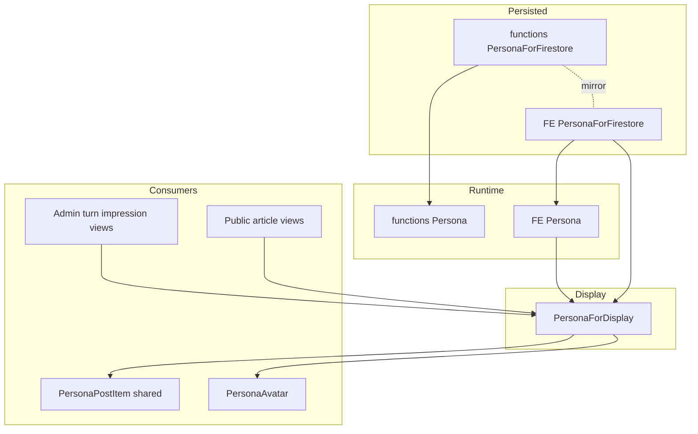
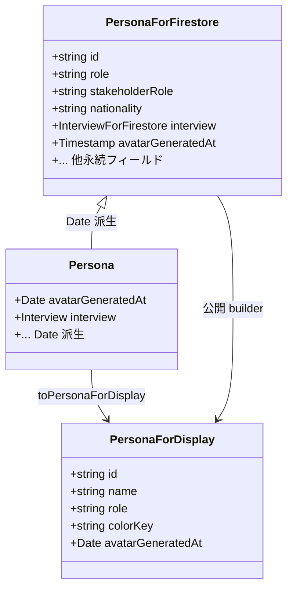
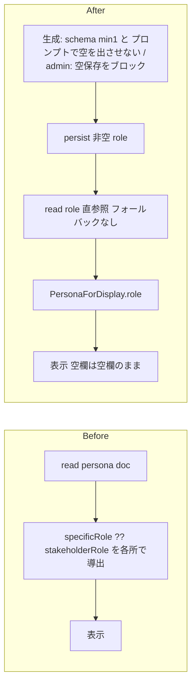
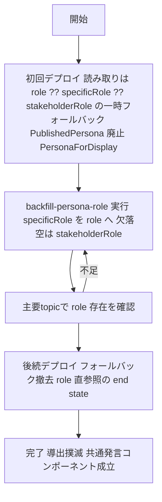

# Technical Design: persona-type-unification

## Overview

**Purpose**: ペルソナ関連の型ドメインを整理・統一し、Admin・公開・functions で一貫したペルソナ型を提供する。同名 `Persona` の意味ズレ、公開専用の並行型 `PublishedPersona`、散在する `role` 導出、`specificRole`/`nationality` のレイヤー間非対称を解消する。

**Users**: 本コードベースの開発者（保守性向上）と、共通「発言アイテム」コンポーネントを Admin・公開で共有できるようになる UI 実装者。

**Impact**: 型を3層（`PersonaForFirestore` 永続 → `Persona` ランタイム → `PersonaForDisplay` 表示）に整理する。永続フィールド `specificRole` を `role`（必須）に改名し、既存ペルソナを backfill で移行する。`PublishedPersona` を廃止し `PersonaForDisplay` に統合する。ユーザーに見える振る舞い（表示される名前・役割・アバター）は不変。

### Goals
- 永続形 `PersonaForFirestore` を FE↔functions で構造的に一致させ、ランタイム `Persona` をそこから派生させる（1.x, 2.x）。
- 公開 `PublishedPersona` を廃し、Admin・公開共通の軽量表示型 `PersonaForDisplay` に統合、共通発言コンポーネントを成立させる（3.x, 4.x）。
- `specificRole → role` 改名・必須化で読み取り導出（`?? stakeholderRole`）を撲滅し、既存データを移行する（5.x, 8.x）。

### Non-Goals
- turn / debate など persona 以外のドメインの型分解（type-domain-decomposition の残り）。
- functions runtime `Persona` の全面再設計（interview 平坦化の廃止＝Option B）。
- 生成・取材・アバターの品質やプロンプト内容の変更。
- `PersonaPostItem.svelte` 以外の新規 Ut コンポーネント設計。

## Boundary Commitments

### This Spec Owns
- ペルソナ型の3層構造（`PersonaForFirestore` / `Persona` / `PersonaForDisplay`）の定義と、FE↔functions の永続形一致。
- 永続フィールド `specificRole → role` の改名・必須化と、その導出ロジックの単一化（書き込み時保証）。
- 既存ペルソナデータの `role` 移行（backfill）。
- `PersonaForDisplay` への写像規則（Admin: `Persona` から / 公開: 永続読み取りから）。

### Out of Boundary
- functions runtime `Persona` の interview 平坦化の是非（現状維持）。
- persona 以外のドメイン型（turn/debate/editorial 等）。
- アバター生成ロジック・`AvatarSpec` の内部フィールド名（写像元のみ `role` に追随）。

### Allowed Dependencies
- 既存 backfill 群（`functions/src/scripts/backfill-*.ts`）のパターン。
- `editorial.types.ts` の「FE `*ForFirestore` は functions と一致」基準。
- `personaMap` / `personas`（id 保持・描画時解決）の既存方針。

### Revalidation Triggers
- `PersonaForFirestore` の形（フィールド追加・改名）が変わる。
- `PersonaForDisplay` の最小フィールド集合が変わる。
- ペルソナ文書のフィールド命名（`role` / `stakeholderRole` / `nationality`）が再度変わる。
- functions runtime `Persona` の派生規則（interview 平坦化）が変わる。

## Architecture

### Existing Architecture Analysis
- FE は `PersonaForFirestore → Persona`（Date 派生）を既に持つ（editorial と同じ正しい形）。ただし `nationality` 欠落・`specificRole?` optional。
- functions は永続形が無く、runtime `Persona` に永続＋ランタイムを混在（`interview→interviewRecord` 平坦化、`nationality`・`specificRole` 必須）。非テスト25ファイルが import。
- 公開は `PublishedPersona`（`{id, topicId, name, role, colorKey?, avatarGeneratedAt?}`）を builder で射影。admin は無名 `{name, role}` を各所で即席生成。
- `role` 導出 `specificRole ?? stakeholderRole` が6+箇所に散在。`PersonaAvatar` は `{colorKey?, avatarGeneratedAt?}` のみ要求。

### Architecture Pattern & Boundary Map



**Architecture Integration**:
- Selected pattern: 3層型モデル（永続→ランタイム→表示）への局所整理。gap-analysis Option A（加算的・低リスク）。
- Domain/feature boundaries: 永続形は FE↔functions ミラー、ランタイムは各サイドの派生、表示は FE 専用の共通最小形。
- Existing patterns preserved: `PersonaForFirestore→Persona` の Date 派生（editorial 準拠）、`personaMap`（id 保持・描画時解決）、backfill をコミットして残す。
- New components rationale: `PersonaForDisplay`（Admin/公開が写像する唯一の表示型）、`backfill-persona-role`（改名移行）。
- Steering compliance: FE `*ForFirestore` = functions 一致、単一 set・非トランザクション、使い捨てスクリプト禁止（backfill 常駐）、UI にスタイル値を書かない。

### Dependency Direction
`types（*ForFirestore → Persona → PersonaForDisplay）` → `repository / builder / store` → `components`。表示型は最も右（consumers 直前）。functions と FE は互いに import せず、永続形を手でミラーする（`editorial.types.ts` と同一運用）。

## File Structure Plan

### Modified Files — functions
- `functions/src/types/persona.types.ts` — `PersonaForFirestore`（永続形・`interview: InterviewForFirestore`・`nationality`・`role` 必須）を新設。永続 `InterviewForFirestore`（＋`DraftBelief`/`SearchSource`/`SearchResult` を型レイヤーへ集約）も新設し FE とミラーする。runtime `Persona` は `PersonaForFirestore` から派生（`interviewRecord` 平坦化・Date 変換を明示）。`specificRole` を `role` に改名。
- `functions/src/agents/interview-agent.ts` / `functions/src/search/grounding.ts` — 既存の `DraftBelief` / `SearchSource` を上記の型レイヤー定義へ移し、import 元を切り替える（重複定義の解消・依存方向の是正）。
- `functions/src/api/interviews.ts` — interview 書き込みを `InterviewForFirestore` 型で行う（オブジェクトリテラル直書きを解消）。`researchSummary` は書かない現状を維持（FE 側からフィールドを落とす）。
- `functions/src/pipeline/personas/personas.ts` — `toPersona` 写像を `role` 参照に。`role` の非空保証（空/欠落→`stakeholderRole`）は書き込み側で担保するため read では単純参照。
- `functions/src/pipeline/personas/persona-chain.ts`, `agents/persona-generator-agent.ts`, `agents/persona-agent.ts`, `agents/editor-agent.ts`, `utils/prompt-formatters.ts` — `specificRole` 参照を `role` に改名。**生成スキーマを `z.string().min(1)` にして空を弾き、プロンプトに「`role` を空で返さない」明示を追加**（生成側の非空保証・Issue 2）。総称による自動置換（`||=`）は行わない。
- `functions/src/api/avatars.ts` — 写像元 `persona.specificRole` を `persona.role` に（`AvatarSpec` の内部フィールド名は据え置き）。
- `functions/src/avatar/*` — Persona 由来の `specificRole` 参照があれば `role` に追随（`AvatarSpec.specificRole` 自体は別型・不変）。

### New Files — functions（型集約）
- interview 永続サブ型（`InterviewForFirestore` / `DraftBelief` / `SearchSource` / `SearchResult`）の集約先は persona 型モジュール（`types/persona.types.ts` もしくは `types/interview.types.ts`）。配置の最終判断はタスクで確定（依存方向: 型は agents/search に依存しない）。

### New Files — functions
- `functions/src/scripts/backfill-persona-role.ts` — 全ペルソナの `specificRole → role` 移行（欠落/空→`stakeholderRole`）。冪等・コミットして残す。

### Modified Files — FE
- `src/lib/models/persona/persona.types.ts` — `PersonaForFirestore` に `nationality` を追加、`specificRole?` を `role: string`（必須）に改名。`InterviewForFirestore` から `researchSummary?` を削除（functions が永続しない幽霊フィールド）。`Persona` は追随。`PersonaForDisplay` を新設し、`toPersonaForDisplay(persona: Persona): PersonaForDisplay` 写像を定義。
- `src/lib/features/admin/topic-detail/persona/InterviewDialog.svelte` / `src/lib/features/admin/topic-detail/persona/InterviewItem.svelte` — `researchSummary` 表示分岐を削除（型から落とすことに追随。両コンポーネントが当該フィールドを読むため双方を更新）。
- `src/lib/stores/personas.svelte.ts` / `src/lib/features/admin/topic-detail/persona/PersonaItem.svelte` — admin 保存で空文字・空白のみの `role` をブロックする（保存させない・総称へ自動置換しない）。`role` を空にできる誤解を招く placeholder（総称表示）を見直す。`toPersona` の `specificRole` を `role` に、`updatePersona` の Pick も `role` に。
- `src/lib/models/published/published-article/published-article.types.ts` — `PublishedPersona` を削除し `PersonaForDisplay` を参照。`PublishedArticle.personas: Map<string, PersonaForDisplay>`。
- `src/lib/models/published/published-article/published-article.ts` — builder を `PersonaForDisplay` 生成に（`role` 直参照、`topicId` は表示型に含めないため除外）。表示用に `toPersonaForDisplay` を利用（admin は `personaMap`、必要なら display map getter）。
- `src/lib/features/admin/topic-detail/**` — DebateChapter / EditingChapter / EditingImpression / InterviewItem / PersonaItem の `specificRole ?? stakeholderRole` 即席導出を廃し、`PersonaForDisplay`（`role`）を使う。
- `src/lib/features/public/article-detail/**` — 4 コンポーネントの `PublishedPersona` 参照を `PersonaForDisplay` に。
- `src/lib/sharedComponents/PersonaPostItem.svelte` — props を `PersonaForDisplay` にして Admin・公開共通の発言アイテムとして完成（保留解除）。

## Data Models

### 型階層（論理モデル）



### `PersonaForDisplay`（新規・FE 専用）
```typescript
export type PersonaForDisplay = {
	id: string;
	topicId: string; // アバター画像パス topics/{topicId}/avatars/{id} の構築に PersonaAvatar が使う
	name: string;
	role: string; // 必須。永続 role をそのまま（導出しない）
	colorKey?: string; // 外見。欠落は既定へ縮退（PersonaAvatar）
	avatarGeneratedAt?: Date; // 存在フラグ兼キャッシュバスター
};
```
- `topicId` は含める（当初 design は「表示に不要」として除外したが、共有 `PersonaAvatar` が画像パス `topics/{topicId}/avatars/{id}` を id と topicId から導出するため必須。task 3 で Revalidation を発火し、`PublishedPersona` と同じく topicId を保持する方針に確定）。
- `nationality` は含めない（描画に不要・Req2.2）。
- `colorKey` / `avatarGeneratedAt` は `PersonaAvatar` の要求と一致（optional・欠落許容・Req4.4）。

### 永続フィールドの変更（Firestore `topics/{id}/personas/{personaId}`）
- `specificRole`（optional・任意空）→ **`role`（必須・非空）**。導出は書き込み時に確定（空/欠落→`stakeholderRole`）。
- `nationality`：永続形として FE・functions 双方に定義（生成時必須で書き込み・移行不要）。
- `stakeholderRole`：総称として維持（`role` に畳まない）。
- 形の変更は上記＋下記 interview 型の整理に限定（他フィールドは不変）。

### interview 永続型のミラー化（functions 側の新設・runtime 非対称の明示）
- interview 結果は Firestore の persona ドキュメントの `interview` オブジェクト（`draftBelief` / `verificationReport` / `interviewRecord` / `sources` / `status` / `completedAt`）に**単一保存**される（[api/interviews.ts](functions/src/api/interviews.ts) の書き込み）。FE はこれを `InterviewForFirestore` としてフルに読み表示する。
- **functions には永続 `InterviewForFirestore` が無い**（書き込みはオブジェクトリテラル直書き、読み取りは `{ interviewRecord }` に絞って runtime へ平坦化）。Req1.2（FE↔functions の `PersonaForFirestore` 構造一致）を満たすため、**functions にも永続 `InterviewForFirestore` を新設**し、既存の `DraftBelief`（interview-agent）・`SearchSource`（grounding）を型レイヤーへ集約して再利用する。`api/interviews.ts` の書き込みはこの型を用いる（リテラル直書きを解消）。
- **runtime の非対称は意図的**：FE runtime `Persona` は `interview` オブジェクト（Date 変換）を保持、functions runtime `Persona` は `interviewRecord: string` へ平坦化（討論パイプラインの都合）。永続形（`PersonaForFirestore.interview: InterviewForFirestore`）は両サイド一致、runtime の派生規則のみ非対称、と Data Models で固定する。
- **`researchSummary` の不一致是正**：FE `InterviewForFirestore` は `researchSummary?` を持ち InterviewDialog も表示分岐を持つが、functions の書き込みは `researchSummary` を一度も永続しない（幽霊フィールド）。→ **FE 型と InterviewDialog から `researchSummary` を削除**して一致させる（functions が書かないため）。

## System Flows

### `role` 解決フロー（Before / After）

- 非空保証は「読み取り時の導出」から「書き込み入口の検証」へ移す（Req5）。総称による自動置換はしない。

## Requirements Traceability

| Requirement | Summary | Components | Interfaces | Flows |
|-------------|---------|------------|------------|-------|
| 1.1, 1.2, 1.3, 1.4 | 永続/ランタイム分離・FE↔functions ミラー | functions `persona.types.ts`, FE `persona.types.ts` | `PersonaForFirestore` / `Persona` | — |
| 2.1, 2.2, 2.3 | `nationality` 一貫化・表示型から除外 | 両 `persona.types.ts` | `PersonaForFirestore.nationality`, `PersonaForDisplay` | — |
| 3.1, 3.2, 3.3, 3.4 | `PublishedPersona` 統合・公開軽量化 | published-article.types/ts, 4 公開コンポーネント | `PersonaForDisplay`, `Map<string, PersonaForDisplay>` | — |
| 4.1, 4.2, 4.3, 4.4, 4.5 | 共通発言コンポーネントの型 | `PersonaPostItem.svelte`, `toPersonaForDisplay` | `PersonaForDisplay` props | role 解決フロー |
| 5.1, 5.2, 5.3, 5.4, 5.5, 5.6, 5.7 | `specificRole → role` 改名・必須化・入口検証で非空保証・導出とフォールバック廃止 | 生成スキーマ/admin バリデーション/読み取り/型（functions・FE） | `role: string`（必須・非空）, 生成 `min(1)`, admin 空保存ブロック | role 解決フロー |
| 6.1, 6.2 | 場当たり派生型の排除 | persona.types（両） | `Pick`/`Partial` 活用 | — |
| 7.1, 7.2, 7.3 | 見える振る舞い不変・影響明示 | 全対象 | — | — |
| 8.1, 8.2, 8.3 | 既存データ移行 | `backfill-persona-role.ts` | Batch | Migration Strategy |

## Components and Interfaces

| Component | Domain/Layer | Intent | Req Coverage | Key Dependencies | Contracts |
|-----------|--------------|--------|--------------|------------------|-----------|
| persona.types（functions・mod） | Types | 永続形 `PersonaForFirestore` 新設・`role` 改名 | 1.x, 2.x, 5.x | Firestore (P0) | State |
| persona.types（FE・mod） | Types | ミラー＋`PersonaForDisplay` 新設・`toPersonaForDisplay` | 1.x, 2.x, 3.x, 4.x, 5.x | functions 型と手動一致 (P0) | Service, State |
| PersonaPostItem（mod・共通化） | UI | Admin/公開共通の発言アイテム | 4.x | `PersonaForDisplay` (P0), PersonaAvatar (P1) | — |
| published-article builder（mod） | Model | 公開読み取り→`PersonaForDisplay` 写像 | 3.x | `PersonaForDisplay` (P0) | Service |
| backfill-persona-role（new） | Script | `specificRole→role` 移行 | 8.x | Firestore (P0) | Batch |

### Types

#### persona.types（FE・変更）

**Responsibilities & Constraints**
- `PersonaForFirestore`（永続形）を functions とフィールド・意味で一致させる（`role` 必須・`nationality` 追加・`interview?: InterviewForFirestore`）。
- `Persona = Omit<PersonaForFirestore, timestamps 系> & { Date 版 }`（既存派生を維持、`role`/`nationality` を反映）。
- `PersonaForDisplay` と `toPersonaForDisplay` を提供。`role` の導出はしない（永続 `role` をそのまま持つ）。

##### Service Interface
```typescript
export const toPersonaForDisplay: (persona: Persona) => PersonaForDisplay;
// { id, name, role, colorKey?, avatarGeneratedAt? } を抽出するだけ（導出なし）
```
- Preconditions: `persona.role` は非空（書き込み時保証・移行後）。
- Postconditions: 表示に必要な最小フィールドのみ返す。管理専用フィールドを含めない（3.4）。
- Invariants: `PersonaForDisplay` を返す唯一の FE 側写像入口（admin）。公開は builder が永続読み取りから同型を組む。

#### PersonaPostItem（変更・共通化）
| Field | Detail |
|-------|--------|
| Intent | Admin・公開共通の発言アイテム表示 |
| Requirements | 4.1, 4.2, 4.3, 4.4 |

**Responsibilities & Constraints**
- props を `{ persona?: PersonaForDisplay; content: string }` にする（`persona` 欠落＝ファシリテーターは既定名へ縮退）。
- `persona.role` を直参照（`role` は `PersonaForDisplay` の必須フィールド）。`PersonaAvatar` に `persona` をそのまま渡せる（`colorKey?`/`avatarGeneratedAt?` を含むため）。
- スタイル値は書かない（BEM セレクタのみ）。値はユーザー決定（steering）。

**Implementation Notes**
- Integration: Admin 側は `toPersonaForDisplay(personaMap.get(id))`、公開側は builder の `Map<string, PersonaForDisplay>` から解決。
- Validation: `role`/`name` は必須、`colorKey`/`avatarGeneratedAt` は欠落許容。
- Risks: 未追跡の現ファイルは `persona.role` を前提に作りかけ → `PersonaForDisplay` 化で型エラー解消・完成。

### Migration

#### backfill-persona-role（新規スクリプト）
| Field | Detail |
|-------|--------|
| Intent | 全ペルソナの `specificRole → role` 移行 |
| Requirements | 8.1, 8.2, 8.3 |

**Contracts**: Batch [x]

##### Batch / Job Contract
- Trigger: 手動実行（`npm run build && node lib/scripts/backfill-persona-role.js [--apply]`）。デプロイ前に1回（backfill 先行）。
- Input / validation: 全 `topics/*/personas/*` を走査。
- Output: 各ペルソナに `role` を書く。値は `specificRole`（非空）優先、欠落/空なら `stakeholderRole`。
- Idempotency & recovery: 既に `role` を持つペルソナはスキップ（冪等・再実行安全）。dry-run 既定（`--apply` で書き込み）。
- Persistence: `functions/src/scripts/` にコミットして残す（使い捨て禁止）。
- 補足: 旧 `specificRole` は削除しない（コードを戻せば復旧可能・ロールバック安全）。

## Error Handling

### Error Strategy
- **移行安全（確定方針・Issue 3）**: デプロイと backfill の順序に依存しないよう、**初回デプロイでは読み取り写像（`toPersona` / 公開 builder）に一時フォールバック `role ?? specificRole ?? stakeholderRole` を入れる**。backfill 完了を確認後、**後続タスクでフォールバックを撤去**して `role` 直参照の end state にする（導出の恒久排除は保つ）。これにより移行前デプロイでも役割の空表示を防ぐ。
- **非空保証は書き込み入口の検証で行う（Issue 2 確定方針）**: 総称による自動置換（読み取りフォールバック・書き込み `||=`）はしない。生成は `z.string().min(1)`＋プロンプト明示で空を出させない。admin は空文字・空白のみの保存をブロック（空欄は空欄のまま扱い、総称に置換しない）。`stakeholderRole` は `role` のフォールバックに使わない。旧データの空/欠落は移行 backfill が一度だけ `stakeholderRole` で埋める（移行専用）。
- **FE↔functions 型の乖離**: 手動ミラーのため、両 `persona.types.ts` の変更（`PersonaForFirestore` / `InterviewForFirestore` / `role` / `nationality`）は同一作業で行い、型チェックで担保。

### Monitoring
- backfill は既存スクリプト同様、対象件数・スキップ件数・書き込み件数を `console.log` する。

## Testing Strategy

### Unit Tests
- `toPersonaForDisplay`: `Persona` から `{id, name, role, colorKey?, avatarGeneratedAt?}` のみ抽出し、管理専用フィールドを含めない（3.4, 4.2）。
- 公開 builder: 永続読み取りから `PersonaForDisplay` を組み、`role` を直参照する（`?? stakeholderRole` 導出が無い）（3.1, 5.4）。
- `backfill-persona-role`: `specificRole` を `role` へコピー、欠落/空は `stakeholderRole`、既に `role` ありはスキップ（冪等）（8.1, 8.2）。
- functions `toPersona`: `role` を読み、runtime `Persona` を返す（1.3, 5.4）。

### Integration / Component Tests
- `PersonaPostItem.svelte`（共通）: Admin/公開いずれの `PersonaForDisplay` でも名前・役割・アバターを描画（4.1, 4.2）。既存の published コンポーネント spec を `PersonaForDisplay` 前提へ更新。
- 生成スキーマ: 空文字の `role` を弾く（`min(1)`）（5.3）。
- admin 保存: 空文字・空白のみの `role` はブロックし、`stakeholderRole` へ自動置換しない（5.4, 5.6）。

## Migration Strategy


- Phase: (1) 一時フォールバック込みでデプロイ（順序非依存で安全）→ (2) backfill 実行 → (3) 検証 → (4) フォールバック撤去デプロイ。デプロイはユーザーが実行（Claude は案内のみ）。
- Rollback: 旧 `specificRole` は削除せず残すため、コードを戻せば復旧可能。
- Validation checkpoint: 代表トピック（公開済み含む）の `role` 存在を確認してからフォールバックを撤去する。
- 補足: この一時フォールバックは移行専用の単一箇所（read 写像）に限り、end state では撤去して `role` 直参照に統一する（導出の恒久排除は維持）。
