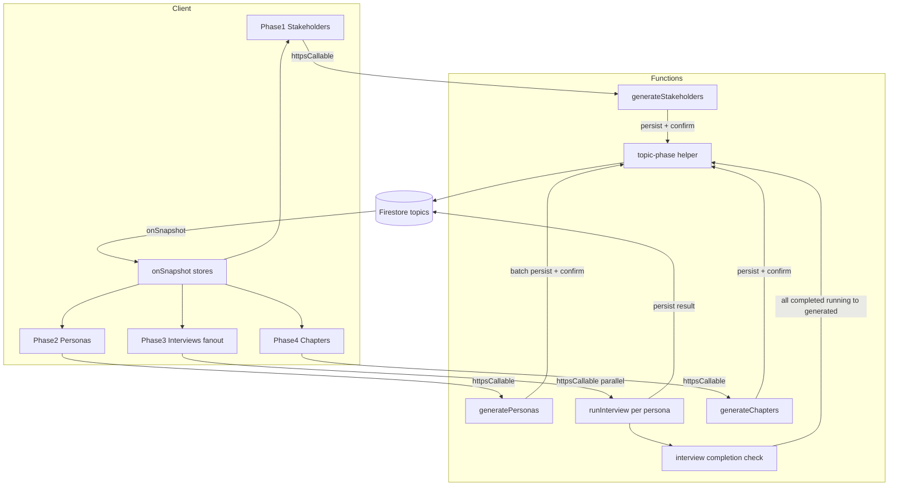
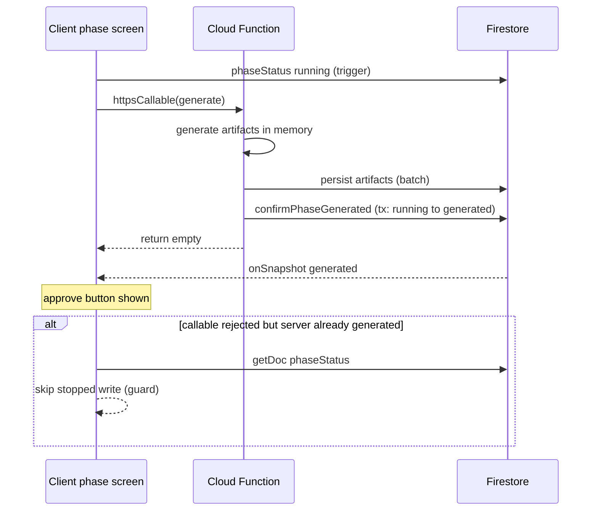
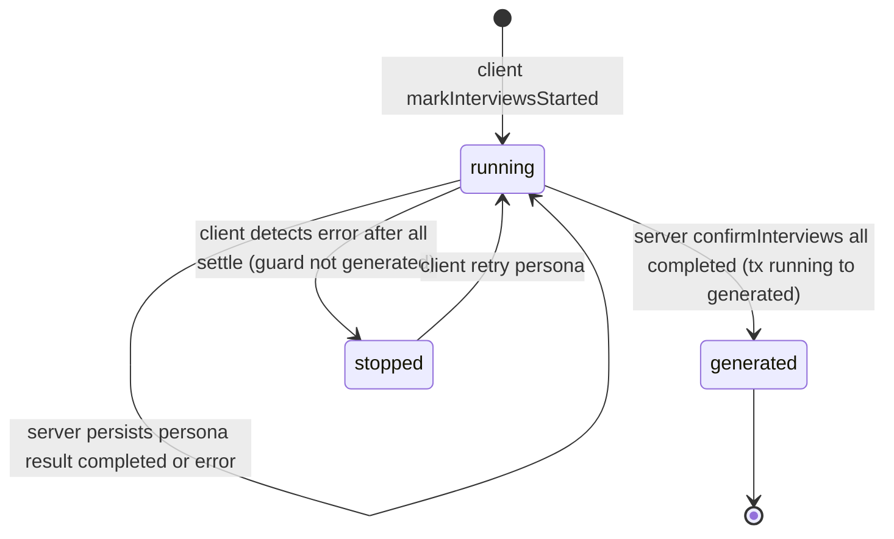

# Technical Design: phase-generation-server-authority

## Overview

**Purpose**: フェーズ1〜4の AI 生成（ステークホルダー・ペルソナ・取材・章立て）について、生成物の永続化と生成完了（`phaseStatus='generated'`）の確定をサーバ側（Cloud Functions）の責務に統一し、クライアントの生存やネットワーク状態に依存しない一貫した完了処理を実現する。

**Users**: 管理者がフェーズ生成を実行した際、生成中のリロード・離脱・タイムアウトがあっても、サーバが成果物と完了状態を確定するため「承認して次へ進む」が正しく表示される。

**Impact**: 現在フェーズごとに不揃いな「永続化／完了確定の所有者」を、フェーズ5（討論）と同じサーバ権威モデルへ揃える。P1 は先行修正済。本仕様で P2・P3・P4 を揃え、共通ヘルパーを導入し P1 も寄せる。

### Goals
- フェーズ1〜4の生成物の永続化をサーバ側で行う（P2・P3 の永続化をクライアントから移管）。
- 生成完了（`generated`）を「`running→generated` 限定の冪等トランザクション」でサーバが確定する。
- クライアントは完了（`generated`）を書かず、一時的失敗でサーバ確定済みの完了を上書きしない。
- フェーズ間で `not_started → running → generated/stopped` の状態遷移を統一する。

### Non-Goals
- フェーズ5（討論）の再設計（基準モデルとして参照のみ）。
- フェーズ3のペルソナ単位呼び出しを単一オーケストレーション関数へ集約すること（クライアント並列呼び出しは維持）。
- 承認・公開・リセットなど管理操作のステータス遷移の変更。
- 生成アルゴリズム・プロンプト・取材グラウンディングの内容変更。

## Boundary Commitments

### This Spec Owns
- フェーズ1〜4の生成物（`stakeholders/0`・`personas/*`・各ペルソナの `interview`/`beliefs`・`chapters/*`・`chapterAnalysis/0`）のサーバ側永続化責務。
- フェーズ1〜4の `topics/{id}.phaseStatus` の `generated` 確定（サーバ）と、`running`/`stopped` の統一的な取り扱い。
- 完了確定の共通ヘルパー（サーバ）と、それを用いる各生成 onCall の振る舞い。

### Out of Boundary
- 討論（フェーズ5）の状態遷移・`runId` 世代管理。
- 承認（`approve*`）・公開（`publishDebate`）・リセット（`reset*`）のステータス遷移と Firestore 書込（従来どおりクライアント）。
- ファクトチェック機能、生成エージェントの内部ロジック。

### Allowed Dependencies
- サーバ: `firebase-admin/firestore`（Admin SDK、ルールをバイパス）、各 `pipeline/*` 生成関数、新設の共通 phase ヘルパー。
- クライアント: `firebase/firestore`（`onSnapshot`/`updateDoc`/`getDoc`）、`httpsCallable`。
- 依存方向: 生成 onCall（`api/*`）→ pipeline 生成関数 + phase ヘルパー（`utils/`）。クライアント stores/models → `httpsCallable` のみ（Admin 直アクセス禁止）。

### Revalidation Triggers
- 各生成 onCall のレスポンス形状変更（特に `generatePersonas`/`runInterview` の戻り値縮小）。
- ペルソナ文書の永続化フィールド（`sortOrder`/`approved`/`beliefs`/`createdAt`/`interview`）の所有がサーバへ移ること。
- `phaseStatus` 遷移規則（`running→generated` 限定）の変更。

## Architecture

### Existing Architecture Analysis
- **基準モデル（フェーズ5）**: `updateDebatePhaseStatus`（無条件 update）と post-debate-comments の `running→generated` 限定冪等トランザクションが既に存在。本設計はこの冪等パターンを全フェーズの完了確定の規範とする。
- **現状の責務差異**: P1 はサーバ永続化＋サーバ generated（先行修正済）。P4 はサーバ永続化＋**クライアント** generated。P2/P3 は**クライアント**永続化＋クライアント generated。
- **保持すべきパターン**: クライアントの `onSnapshot` ストア駆動 UI、`PhasePanel` の `logicalState` 表示、`phaseLogicalState` の純粋関数（トピック状態のみ参照）。
- **steering 整合**: `firebase.md` の「CRUD はフロント」原則に対し、AI 生成物の永続化に限ってサーバへ寄せる意図的例外（要件で明記）。`structure.md` の中央化禁止に従い、共通化は薄い phase ヘルパー1点に留める。

### Architecture Pattern & Boundary Map



**Architecture Integration**:
- **Selected pattern**: サーバ権威（成果物永続化＋完了確定をサーバが所有）＋冪等状態遷移。
- **Domain/feature boundaries**: 各 `api/*` onCall が自フェーズの永続化と完了確定を所有。共通の状態書込のみ薄いヘルパーへ集約。
- **Existing patterns preserved**: `onSnapshot` ストア、`PhasePanel`/`phaseLogicalState`、討論の冪等遷移。
- **New components rationale**: `topic-phase` ヘルパー（4フェーズ＋討論で重複する `running→generated` 確定の唯一の実装）、`interview completion check`（P3 の全件完了判定）。
- **Steering compliance**: 中央ディスパッチャ化しない（各 onCall は自フェーズの処理を自身で持つ）。ヘルパーは「真に共通な処理」のみ。

### Technology Stack

| Layer | Choice / Version | Role in Feature | Notes |
|-------|------------------|-----------------|-------|
| Frontend | SvelteKit 2.x / Svelte 5 runes | 生成トリガ・`running` 書込・ガード付き `stopped`・`onSnapshot` 表示 | 新規依存なし |
| Backend | Firebase Functions v2 (Node 24) | 生成物永続化・`generated` 冪等確定 | 既存 onCall を改修。新規依存なし |
| Data | Firestore (firebase-admin ^13 / firebase client) | `topics/*` と配下サブコレクション | `runTransaction` で冪等遷移 |

## File Structure Plan

### New Files
```
functions/src/utils/
└── topic-phase.ts        # サーバ用 phase ヘルパー（confirmPhaseGenerated / setTopicPhaseStatus）

functions/src/pipeline/interviews/
└── interview-completion.ts  # P3 全件完了判定（confirmInterviewsGeneratedIfAllComplete）
```

### Modified Files
- `functions/src/api/stakeholders.ts` — P1 のインライン `update(generated)` を `confirmPhaseGenerated(topicId, 1)` に置換（一貫化）。
- `functions/src/api/personas.ts` — 生成後にペルソナ文書を batch 永続化し `confirmPhaseGenerated(topicId, 2)`。戻り値を `Record<string, never>` に縮小。
- `functions/src/api/chapters.ts` — `planChapters` 成功後に `confirmPhaseGenerated(topicId, 4)`。
- `functions/src/api/interviews.ts` — 成功時に当該ペルソナの結果を永続化し `confirmInterviewsGeneratedIfAllComplete(topicId)`、失敗時にペルソナの `error` 状態を永続化。
- `src/lib/models/topic/createTopic.svelte.ts` — `generatePersonas` の `setDoc` ループと generated 書込を撤去し呼び出し＋ガード catch に。`generateChapters` の generated 書込を撤去しガード catch に。`generateStakeholders` は実装済の形を維持。
- `src/lib/stores/personas.svelte.ts` — `runInterview` の結果書込を撤去（in_progress 即時クリアは維持）。`runInterviews` の `markInterviewsComplete` 呼び出しを撤去し、全件 settle 後の error 検知でガード付き `stopped` に。`markInterviewsComplete` は削除。
- テスト各種（Testing Strategy 参照）。

> 依存方向: `api/*` → `pipeline/*` ＋ `utils/topic-phase`。`utils/topic-phase` は `firebase-admin/firestore` のみに依存（上位を import しない）。

## System Flows

### P2/P4 の生成完了（サーバ権威）



### P3 取材の完了判定（クライアント並列＋サーバ確定）



- **Gating**: `generated` はサーバ側で「全ペルソナ `interview.status==='completed'` かつ topic が `running`」のときだけ確定。`error` が残る間は `running` を維持し、クライアントが `Promise.allSettled` の `rejected` を根拠に `stopped` を確定して再取材導線を出す。
- **Retry**: per-persona リトライはクライアントが先に `markInterviewsStarted`（`stopped→running`）を書いてから再実行する。再実行成功時にサーバが全件判定し、全件完了なら `generated` を確定（クライアントは完了を書かない）。**running 復帰を省くと confirm が no-op となり generated に到達しない**。

## Requirements Traceability

| Requirement | Summary | Components | Interfaces | Flows |
|-------------|---------|------------|------------|-------|
| 1.1, 1.2 | 生成物のサーバ永続化 | generatePersonas, runInterview, generateChapters(既), generateStakeholders(既) | persist batch / set | P2/P4, P3 |
| 1.3 | 失敗時に不完全成果物を残さない | generatePersonas(batch), runInterview | batch / per-persona | P2/P4 |
| 1.4, 1.5 | 複数アイテムの各成果物をサーバ永続化（fanout維持） | runInterview, interview-completion | per-persona persist | P3 |
| 2.1, 2.2, 2.4 | generated をサーバが同一処理内で冪等確定 | topic-phase.confirmPhaseGenerated | confirmPhaseGenerated | P2/P4, P3 |
| 2.3 | 完了時に承認ボタン表示 | PhasePanel(既), phaseLogicalState(既) | logicalState | — |
| 3.1, 3.2, 3.3 | クライアントは generated を書かず、確定済みを上書きしない | createTopic, personas store | guarded catch | P2/P4, P3 |
| 4.1, 4.2, 4.3, 4.4 | running/stopped を全フェーズ統一 | createTopic, personas store | setPhaseStatus / markInterviewsStarted | all |
| 5.1, 5.2, 5.3, 5.4 | 討論基準への統一・全件完了のサーバ導出 | topic-phase, interview-completion | confirm helpers | P3 |
| 6.1, 6.2, 6.3 | 中断・再生成・部分完了耐性 | topic-phase(冪等), reset*(既) | tx idempotent | all |
| 7.1, 7.2 | 管理操作は従来どおり | approve*/reset*/publish(既) | client write | — |

## Components and Interfaces

| Component | Domain/Layer | Intent | Req Coverage | Key Dependencies | Contracts |
|-----------|--------------|--------|--------------|------------------|-----------|
| topic-phase helper | Functions/utils | `running→generated` 冪等確定と状態書込の唯一実装 | 2.1, 2.2, 2.4, 5.1, 6.1 | firebase-admin (P0) | Service |
| interview-completion | Functions/pipeline | 全ペルソナ completed の判定と generated 確定 | 1.4, 5.2, 5.4 | topic-phase (P0), personas (P0) | Service |
| generatePersonas (onCall) | Functions/api | 生成＋ペルソナ batch 永続化＋generated | 1.1, 1.2, 1.3, 2.1 | persona agent (P0), topic-phase (P0) | Service |
| runInterview (onCall) | Functions/api | 自ペルソナ結果永続化＋全件確定起動 | 1.4, 1.5, 2.1 | interview agent (P0), interview-completion (P0) | Service |
| generateChapters (onCall) | Functions/api | 章永続化（既）＋generated 確定 | 1.1, 2.1 | chapter-generator (P0), topic-phase (P0) | Service |
| generateStakeholders (onCall) | Functions/api | 永続化＋generated（既、ヘルパーへ寄せる） | 1.1, 2.1 | topic-phase (P0) | Service |
| createTopic (client) | Frontend/models | generate トリガ・running・ガード catch | 3.1, 3.2, 4.1, 4.2 | httpsCallable (P0) | State |
| personas store (client) | Frontend/stores | 取材 fanout・running・即時クリア・stopped 判定・retry running 復帰 | 3.1, 3.2, 4.1, 4.2, 5.4, 6.3 | httpsCallable (P0) | State |

### Functions / Server

#### topic-phase helper

| Field | Detail |
|-------|--------|
| Intent | フェーズの `phaseStatus` 状態書込を一元化。完了確定は `running→generated` 限定の冪等トランザクション |
| Requirements | 2.1, 2.2, 2.4, 5.1, 6.1 |

**Responsibilities & Constraints**
- `confirmPhaseGenerated`: `topics/{id}` を transaction で読み、`phaseStatus==='running'` のときのみ `phase` と `phaseStatus='generated'` を書く（それ以外は no-op）。冪等・終端。
- `setTopicPhaseStatus`: `phase`/`phaseStatus`/`updatedAt` を書く。**完了確定（`generated`）はこの関数で書かせない**（必ず `confirmPhaseGenerated` 経由）。引数型を `'running' | 'stopped'` に限定してガード回避の余地を排除する。討論の `updateDebatePhaseStatus` とは別関数とし、`runId` 世代管理には踏み込まない。
- データ所有: `topics/{id}.phase`・`phaseStatus`・`updatedAt` のみ。生成物サブコレクションには触れない。

**Dependencies**
- Outbound: `firebase-admin/firestore` — Firestore 読み書き (P0)

**Contracts**: Service [x]

##### Service Interface
```typescript
type GeneratePhase = 1 | 2 | 3 | 4;

interface TopicPhaseService {
  // running のときだけ generated へ遷移（冪等・終端）。遷移したら true。
  confirmPhaseGenerated(topicId: string, phase: GeneratePhase): Promise<boolean>;
  // running / stopped のみ設定可能。generated はここでは書けない（confirmPhaseGenerated 経由）。
  setTopicPhaseStatus(
    topicId: string,
    phase: GeneratePhase,
    phaseStatus: 'running' | 'stopped'
  ): Promise<void>;
}
```
- Preconditions: `topics/{topicId}` が存在する。
- Postconditions: `confirmPhaseGenerated` 適用後、`phaseStatus` は `generated` または変更なし。
- Invariants: `confirmPhaseGenerated` は `running` 以外の状態（`approved` 相当の phase 前進・`stopped`）を上書きしない。

**Implementation Notes**
- Integration: P1/P2/P4 と interview-completion から呼ぶ。
- Validation: ドキュメント不存在時は no-op（`exists` チェック）。
- Risks: 並列呼び出し時の競合は transaction と `running` 限定で吸収。

#### interview-completion

| Field | Detail |
|-------|--------|
| Intent | 全ペルソナの取材完了をサーバ側で判定し、全件 `completed` のとき generated を確定 |
| Requirements | 1.4, 5.2, 5.4 |

**Responsibilities & Constraints**
- `topics/{id}/personas` を読み、件数>0 かつ全ペルソナの `interview.status==='completed'` を満たすとき `confirmPhaseGenerated(topicId, 3)` を呼ぶ。
- 1件でも `completed` 以外（`in_progress`/`error`/未設定）があれば no-op。
- 並列の各 `runInterview` 完了時に呼ばれても冪等（最後の completed 確定時のみ generated）。

**Dependencies**
- Outbound: topic-phase (P0), personas 読み取り (`getPersonasByTopicId` 既存) (P0)

**Contracts**: Service [x]

##### Service Interface
```typescript
interface InterviewCompletionService {
  // 全ペルソナ completed かつ topic running のとき generated を確定。確定したら true。
  confirmInterviewsGeneratedIfAllComplete(topicId: string): Promise<boolean>;
}
```
- Preconditions: 当該ペルソナの結果が既に永続化済み（呼び出し前に自ペルソナを completed にしている）。確定対象は `phaseStatus==='running'` のトピックのみ（`confirmPhaseGenerated` が running 限定）。**リトライ経路ではクライアントが事前に `running` へ戻していること**（後述）。
- Postconditions: 全件完了かつ `running` のときのみ `phaseStatus='generated'`。
- Invariants: `error` が残る間は generated にしない。`stopped` のままでは generated にしない（リトライ前に `running` 復帰が必要）。

**Implementation Notes**
- Integration: `runInterview` の completed 永続化直後に呼ぶ。
- Risks: 完了判定の読み取りと自ペルソナ書込の順序（自ペルソナを先に completed 化してから全件判定）。

#### generatePersonas (onCall) / runInterview (onCall) / generateChapters (onCall) / generateStakeholders (onCall)

| Field | Detail |
|-------|--------|
| Intent | 各フェーズの生成物をサーバ永続化し、generated を確定 |
| Requirements | 1.1, 1.2, 1.3, 1.4, 1.5, 2.1 |

**Responsibilities & Constraints**
- `generatePersonas`: stakeholders 読込 → 生成（in-memory）→ batch で `personas/{id}`（`sortOrder`=index, `approved:false`, `beliefs:[]`, `createdAt`, 生成フィールド）を書込 → `confirmPhaseGenerated(topicId, 2)`。戻り値 `{}`。
- `runInterview`: 取材エージェント実行 → 成功時、当該 `personas/{id}` に `interview`（completed, `completedAt`）と `beliefs[0]` を書込 → `confirmInterviewsGeneratedIfAllComplete(topicId)`。失敗時、`personas/{id}.interview = { status:'error', errorMessage }` を書込み `HttpsError` を投げる。
- `generateChapters`: `planChapters`（既存・章永続化）成功後に `confirmPhaseGenerated(topicId, 4)`。
- `generateStakeholders`: 既存実装の `update(generated)` を `confirmPhaseGenerated(topicId, 1)` に置換。

**Contracts**: Service [x]

##### API Contract
| Method | Function | Request | Response | Errors |
|--------|----------|---------|----------|--------|
| onCall | generatePersonas | `{ topicId, title }` | `{}` | invalid-argument, internal |
| onCall | runInterview | `{ topicTitle, persona, topicContext? }` | `{}` | invalid-argument, internal |
| onCall | generateChapters | `{ topicId }` | `{ topicId }` | invalid-argument, internal |
| onCall | generateStakeholders | `{ topicId, title }` | `{}` | invalid-argument, internal |

**Implementation Notes**
- Integration: 永続化は成功時のみ。`generatePersonas` は batch で部分書込を防ぐ。
- Validation: 既存の `requireAuth`・引数検証を維持。
- 戻り値方針（確定）: `runInterview` は結果を返さず `{}` を返す。取材結果はサーバが当該ペルソナ文書へ永続化し、FE は `onSnapshot` で購読して反映する（結果の Single Source of Truth は Firestore）。両側の callable ジェネリクス・レスポンス型を縮小する。

### Frontend / Client

#### createTopic (client) — summary

**Implementation Note**: `generatePersonas` から `setDoc` ループと `generated` 書込を撤去し「`running` 書込 → callable → （成功時は何もしない、サーバが generated 確定）」へ。`generateChapters` から `generated` 書込を撤去。両者の catch は `generateStakeholders` と同じガード（`getDoc` で `phaseStatus==='generated'` なら `stopped` を書かない）。Contracts: State。Req: 3.1, 3.2, 4.1, 4.2。

#### personas store (client) — summary

**Implementation Note**:
- `runInterview`（per-persona）: 開始時の `in_progress`/`beliefs:[]` 即時クリアを維持し、結果書込を撤去（サーバが書く）。サーバが per-persona 失敗時に `HttpsError` を投げるため、**この呼び出しは reject を握りつぶさず呼び出し元へ伝播させる**（後段の失敗集約のため）。
- `runInterviews`（fanout）: `markInterviewsStarted`（`running`）→ `Promise.allSettled(targets.map(runInterview))` で全件 settle を待つ。**失敗検知は `rejected` の有無で行う**（`onSnapshot` の status 読みに依存しない＝反映遅延の取りこぼしを防ぐ）。`rejected` が1件以上なら、ガード付き（`getDoc` で `generated` なら書かない）で `markInterviewsStopped`。`rejected` が0なら何もしない（サーバが `generated` を確定済み）。`markInterviewsComplete` は呼ばず削除。
- **リトライ（Issue 1 対応）**: per-persona リトライ（`handleRetry`）は再実行の前に `markInterviewsStarted` で `stopped→running` へ戻す。これがないとサーバの `confirmInterviewsGeneratedIfAllComplete`（running 限定）が no-op となり、全件完了しても `generated` に到達しない。
- `markInterviewsStarted`（running）は維持。

Contracts: State。Req: 3.1, 3.2, 4.1, 4.2, 5.4, 6.3。

## Data Models

### 永続化所有の変更（Logical）
- `topics/{id}.phaseStatus` — 完了（`generated`）はサーバが確定（全フェーズ）。`running` はクライアント（トリガ）。`stopped` はクライアント（ガード付き）。
- `topics/{id}/personas/{personaId}` — 文書作成（`sortOrder`/`approved`/`beliefs`/`createdAt`/生成フィールド）の所有が**クライアント→サーバ**（`generatePersonas`）。`interview`（completed/error）と `beliefs[0]` の書込所有が**クライアント→サーバ**（`runInterview`）。開始時の `in_progress`/`beliefs:[]` 即時クリアはクライアント。
- `topics/{id}/chapters/*`・`chapterAnalysis/0` — 変更なし（既にサーバ）。
- `topics/{id}/stakeholders/0` — 変更なし（既にサーバ）。

### Consistency & Integrity
- 完了確定は `runTransaction` による `running→generated` 限定（冪等・終端）。
- `generatePersonas` の永続化は batch（全件 or 未書込）。
- P3 は per-persona の結果書込（個別）＋トピックの完了確定（transaction）に分離。

## Error Handling

### Error Strategy
- サーバ生成失敗（agent/permission/timeout）: onCall は `HttpsError('internal', ...)` を投げ、成果物は永続化しない（P2 は batch 未コミット）。完了確定もされない。
- クライアント側の callable reject/timeout: ガード付きで `stopped`。サーバが既に `generated` 済みなら上書きしない（P1 実装済の規範）。
- P3 per-persona 失敗: サーバが当該ペルソナを `error` 状態に永続化し `HttpsError` を throw。クライアント `runInterview` は reject を伝播し、`runInterviews` は `Promise.allSettled` の `rejected` 有無で失敗を集約してガード付き `stopped`。リトライは `running` 復帰後に再実行する。

### Error Categories and Responses
- **User Errors (invalid-argument)**: 既存検証を維持（`topicId`/`title`/`persona` 必須）。
- **System Errors (internal)**: ログ出力（既存 `console.error`）を維持。状態は `running` 据置→クライアントが `stopped` を確定。
- **State conflicts**: `confirmPhaseGenerated` の `running` 限定により、承認・再生成と競合しても誤って `generated` を書かない。

### Monitoring
- 既存の各 onCall の `console.error` を維持。完了確定の transaction 結果（遷移有無）は必要に応じ debug ログ。

## Testing Strategy

### Unit Tests (Functions)
- `topic-phase.confirmPhaseGenerated`: `running` のとき generated に遷移／`generated`・`stopped`・phase 前進時は no-op／不存在 no-op。
- `interview-completion`: 全件 completed で generated 確定／1件でも error/in_progress なら no-op／件数0で no-op。
- `generatePersonas`: 生成→batch 永続化→confirm の順序、失敗時に未書込。
- `runInterview`: 成功時に interview/beliefs 永続化＋全件確定起動、失敗時に error 永続化＋throw。
- `generateChapters`/`generateStakeholders`: 成功後に confirm 呼び出し。

### Unit Tests (Client)
- `createTopic.generatePersonas`: `running` のみ書込、`generated`・persona の `setDoc` を書かない、catch ガードで `generated` 済みなら `stopped` を書かない（`topic.test.ts` 拡張）。
- `createTopic.generateChapters`: 同上（`generated` を書かない・ガード catch）。
- `personas.svelte` ストア: `runInterview` が結果を書かない（in_progress クリアは行う）・reject を伝播する、`runInterviews` が `markInterviewsComplete` を呼ばない・`allSettled` の `rejected` 検知時のみガード付き `stopped`（`generated` 済みなら書かない）。
- P3 リトライ経路: `handleRetry` が再実行前に `markInterviewsStarted`（`stopped→running`）を書く。`interview-completion` が `stopped` のときは generated にせず、`running` 復帰後の全件完了で generated に到達することを確認。

### Integration / Manual
- 生成中リロード→サーバ確定で `generated` 表示（P2/P3/P4）。
- callable タイムアウトでもサーバ成功時はボタン表示（ガード動作）。
- P3 一部 error→`stopped`＋再取材、retry 成功で `generated`。
