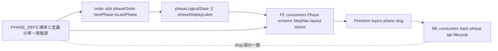
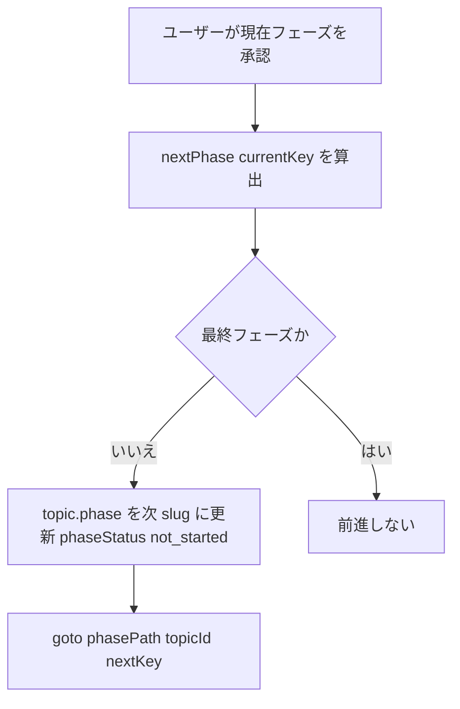
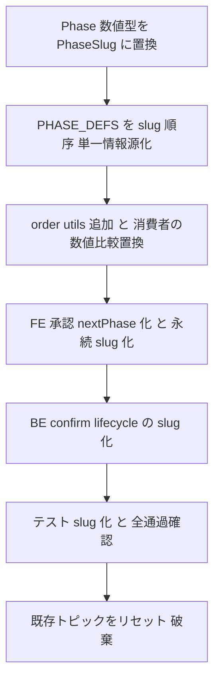

# Technical Design: phase-key-migration

## Overview

**Purpose**: フェーズの識別子を数値 `Phase = 1..6` から一意キー `PhaseSlug` へ移し、順序を `PHASE_DEFS` 配列位置に一元化する内部リファクタを提供する。これにより将来のフェーズ挿入コストを「配列に1行追加」へ縮小する。

**Users**: 直接のエンドユーザー向け機能変更はない。恩恵を受けるのは開発者（フェーズ追加が容易になる）と、後続 spec `topic-fact-base`（事実リサーチフェーズを低コストで挿入できる）。

**Impact**: フェーズ管理の「同一性・順序判定・バッジラベル・永続化」を数値方式から slug 方式へ置換する。ルーティングは既に slug ベースのため変更なし。実データが無いため既存トピックは移行せずリセットする（`Phase` 数値型は完全撤廃）。挙動（進行順序・ゲート条件・ラベル文言）は不変。

### Goals
- フェーズの同一性を `PhaseSlug` で表現し、数値 `Phase` を撤廃する（R1）。
- 順序を `PHASE_DEFS` 配列位置の単一情報源から導出する（R2, R3）。
- 状態別ラベルを `PHASE_DEFS` に内包し、番号キー Record を廃止する（R4）。
- 承認遷移を `nextPhase(currentKey)` 化し、ジャンプ先番号の直書きを排除する（R5）。
- `phase` を slug で永続化し、FE/BE でキーを一致させる（R6, R7）。
- 挙動不変を既存テスト（slug 化）通過で担保する（R8）。

### Non-Goals
- 新フェーズの追加（`topic-fact-base` で実施）。
- フェーズの生成ロジック・UI 見た目・ゲート条件・ラベル文言の意味的変更。
- 既存データの移行スクリプト・数値 phase の後方互換読み取り（リセット方針のため不要）。

## Boundary Commitments

### This Spec Owns
- フェーズ識別子の型（`PhaseSlug`）と、フェーズ順序の単一情報源（`PHASE_DEFS`）。
- 順序ユーティリティ（`phaseOrder` / `nextPhase` / `isLastPhase`）と `phaseLogicalState` / `phaseDisplayLabel` の slug 化。
- `phase` フィールドの永続表現（slug 文字列）と、その FE/BE 双方の型定義。
- 承認遷移（approve*）・状態書き込み（setPhaseStatus 系）・BE のフェーズ確定/判定の slug 化。

### Out of Boundary
- 事実リサーチフェーズなど新フェーズの追加。
- 各フェーズの生成処理（stakeholder/persona/interview/chapter/debate/editing のロジック本体）。
- フェーズ以外のトピックフィールド（sourceUrls, fetchedSourceContents 等）。

### Allowed Dependencies
- FE: `$lib/models/phase/*`、`$lib/models/topic/*`、各 `Phase*.svelte`、stores。
- BE: `functions/src/utils/topic-phase.ts`、`api/*`、`pipeline/*/lifecycle`。
- Firestore（`topics/{id}.phase` の値表現）。

### Revalidation Triggers
- `PhaseSlug` の値集合が変わる（フェーズ追加/削除/改名）。
- `PHASE_DEFS` の順序が変わる。
- `phase` 永続表現の型が変わる。
- `confirmPhaseGenerated` / `phaseLogicalState` のシグネチャが変わる。

## Architecture

### Existing Architecture Analysis
- **routing は slug 既定**: `phasePath` は slug URL を生成し、`+layout.svelte` は URL slug ↔ phase を相互変換。番号は順序・ゲート・ラベル・永続化にのみ残存。
- **順序判定が数値比較に散在**: `phaseLogicalState`（`target < current.phase`）、`StepNav`（`phase > currentPhase`）、`phase === 6` 直書き。
- **ラベルが番号キー Record**: `RUNNING/GENERATED/NOT_STARTED/STOPPED_LABEL: Record<Phase,string>`。
- **承認がジャンプ先番号直書き**: `createTopic.svelte.ts` approve*、`personas.svelte.ts`。
- **BE は Phase 型を持たず** raw `data.phase` と `GeneratePhase=1..4`。FE/BE の一致は Firestore 値の規約。
- **技術的負債の解消**: 「番号＝順序＋同一性」の混在を分離する。

### Architecture Pattern & Boundary Map



**Architecture Integration**:
- Selected pattern: **単一情報源（PHASE_DEFS）＋派生ユーティリティ**。順序・ラベル・遷移を配列から導出。
- Domain/feature boundaries: フェーズ定義は `models/phase` が唯一の権威。消費者（画面/ストア/BE）は派生関数と `PhaseSlug` のみに依存。
- Existing patterns preserved: slug ルーティング、`PhaseStatus`/`PhaseLogicalState` の意味、承認＝phase 前進の考え方。
- New components rationale: `phaseOrder`/`nextPhase`/`isLastPhase` は数値比較・ジャンプ・`===6` 直書きを置換する最小の派生関数。
- Steering compliance: 「フェーズ番号で分岐する中央ディスパッチャを作らない」に準拠（`PHASE_DEFS` は順序データの共有であり分岐器ではない。各画面は自分の slug 定数と派生関数のみ参照）。

### Technology Stack

| Layer | Choice / Version | Role in Feature | Notes |
|-------|------------------|-----------------|-------|
| Frontend | SvelteKit + TypeScript（現行） | フェーズ定義・順序・UI 消費 | 型のみ変更、依存追加なし |
| Backend | Firebase Functions + TypeScript（現行） | フェーズ確定・ライフサイクル判定 | slug リテラルで判定 |
| Data / Storage | Firestore（現行） | `topics/{id}.phase` を slug で保持 | 移行なし・リセット |

## File Structure Plan

### Modified Files（FE）
- `src/lib/models/phase/phase.types.ts` — `Phase`（数値）を削除。`PhaseSlug` を識別子に昇格。`PhaseDef` から `phase` を除き `statusLabels` を追加。
- `src/lib/models/phase/phase.constants.ts` — `PHASE_DEFS` を slug＋label＋statusLabels の配列に。`RUNNING/GENERATED/NOT_STARTED/STOPPED_LABEL` Record を削除。
- `src/lib/models/phase/phase.ts` — `phaseOrder`/`nextPhase`/`isLastPhase` を追加。`phaseLogicalState` を order 比較に、`phaseDisplayLabel` を slug ルックアップ＋`isLastPhase` に、`phasePath` 引数を `PhaseSlug` に変更。
- `src/lib/models/topic/topic.types.ts` — `TopicForFirestore.phase: PhaseSlug`。`topicFromFirestore` の型追随（後方互換読み取りは追加しない）。
- `src/lib/models/topic/createTopic.svelte.ts` — approve* を `nextPhase(currentKey)` 化。`setPhaseStatus` 引数を `PhaseSlug` 化。
- `src/lib/stores/topics.svelte.ts` — addTopic 初期値を先頭 slug（`stakeholders`）に。
- `src/lib/stores/personas.svelte.ts` — approvePersonas / リセットの `phase:N` を slug に。
- `src/lib/features/admin/topic-detail/**/Phase*.svelte`（6画面）— `const PHASE` を対応 slug に。approve の `goto` を `nextPhase` 経由に。
- `src/lib/sharedComponents/StepNav.svelte` / `src/routes/admin/topics/[topicId]/+layout.svelte` / `+page.svelte` / `src/lib/features/admin/topic-list/TopicListPage.svelte` — 型追随、`phase > currentPhase` を order 比較に。

### Modified Files（BE）
- `functions/src/utils/topic-phase.ts` — `GeneratePhase` を slug ユニオン（`'stakeholders'|'personas'|'interviews'|'chapters'`）に。`confirmPhaseGenerated`/`setTopicPhaseStatus` の slug 化。`data.phase !== phase` は slug 等価比較。
- `functions/src/api/{stakeholders,personas,chapters}.ts` — `confirmPhaseGenerated(topicId, '<slug>')`。
- `functions/src/pipeline/interviews/interview-completion.ts` — `'interviews'`。
- `functions/src/pipeline/debate/debate-lifecycle.ts` — `phase:'debate'` / `data.phase === 'debate'`。
- `functions/src/pipeline/editing/editing-lifecycle.ts` — `phase:'editing'` / `data.phase === 'editing'`。
- `functions/src/types/topic.types.ts` — 永続 `phase` の slug 型（BE 側 `PhaseKey` 定義）。

### Modified Files（テスト）
- FE/BE の `phase:N` 直書きを対応 slug に置換（意図不変）。`phase.test.ts` は順序判定を slug ベースに書き換え。

## System Flows

### 承認遷移（数値ジャンプ → nextPhase）



順序・遷移先はすべて `PHASE_DEFS` 位置から導出し、番号リテラルを用いない。`isLastPhase` が最終フェーズ（`editing`）での前進抑止を担う。

## Requirements Traceability

| Requirement | Summary | Components | Interfaces | Flows |
|-------------|---------|------------|------------|-------|
| 1.1, 1.2, 1.3 | slug で一意識別 | phase.types, PHASE_DEFS | `PhaseSlug` | — |
| 2.1, 2.2, 2.3 | 順序を配列位置から導出 | phase.ts order utils | `phaseOrder` | — |
| 3.1–3.4 | 論理状態を order 比較で | phaseLogicalState | `phaseLogicalState` | — |
| 4.1, 4.2, 4.3 | ラベル内包・最終判定導出 | PHASE_DEFS statusLabels, phaseDisplayLabel | `isLastPhase` | — |
| 5.1, 5.2, 5.3 | 承認は nextPhase | createTopic approve*, Phase*.svelte | `nextPhase` | 承認遷移 |
| 6.1–6.4 | slug 永続・リセット | topic.types, topics.svelte, createTopic | `TopicForFirestore.phase` | — |
| 7.1, 7.2, 7.3 | BE の slug 化 | topic-phase, lifecycle, api | `confirmPhaseGenerated` | — |
| 8.1–8.4 | 挙動不変・テスト通過 | 全消費者＋テスト | — | — |

## Components and Interfaces

| Component | Domain/Layer | Intent | Req Coverage | Key Dependencies (P0/P1) | Contracts |
|-----------|--------------|--------|--------------|--------------------------|-----------|
| phase.types | FE/Model | フェーズ型定義 | 1, 4 | — | State |
| PHASE_DEFS | FE/Model | 順序＋ラベルの単一情報源 | 2, 4 | phase.types (P0) | State |
| phase order utils | FE/Model | 順序・遷移・最終判定の導出 | 2, 3, 5 | PHASE_DEFS (P0) | Service |
| topic persistence | FE/Model | phase を slug で永続 | 6 | phase.types (P0) | State |
| approve transitions | FE/Store | 承認で次 slug へ前進 | 5, 6 | phase order utils (P0) | Service |
| BE phase ops | BE/Utils+Pipeline | 確定・ライフサイクル判定を slug で | 7 | phase slug 値 (P0) | Service, Batch |

### FE / Model

#### phase.types + PHASE_DEFS

| Field | Detail |
|-------|--------|
| Intent | フェーズの同一性・順序・状態別ラベルを一元管理 |
| Requirements | 1.1, 1.2, 2.1, 4.1, 4.2 |

**Responsibilities & Constraints**
- `PhaseSlug` を唯一のフェーズ識別子とする（`Phase` 数値は削除）。
- `PHASE_DEFS` の配列順序がフェーズ順序の唯一の真実。
- 各エントリが状態別ラベルを内包する（番号キー Record を持たない）。

**Contracts**: State [x]

##### State Management
```typescript
export type PhaseSlug =
  | 'stakeholders' | 'personas' | 'interviews'
  | 'chapters' | 'debate' | 'editing';

export type PhaseStatus = 'not_started' | 'running' | 'generated' | 'stopped';
export type PhaseLogicalState = PhaseStatus | 'approved';

export type PhaseDef = {
  key: PhaseSlug;
  label: string; // ステップ名（StepNav 用）
  statusLabels: Record<PhaseStatus, string>; // バッジ表示（現行 *_LABEL の文言を移設）
};

export const PHASE_DEFS: readonly PhaseDef[]; // 配列順 = フェーズ順
```
- Invariants: `PHASE_DEFS` の `key` は重複しない。配列順が進行順と一致する。ラベル文言は現行と同一。

#### phase order utils（phase.ts）

| Field | Detail |
|-------|--------|
| Intent | 順序・遷移・最終判定・論理状態の導出 |
| Requirements | 2.2, 2.3, 3.1, 3.2, 3.3, 3.4, 4.3, 5.1, 5.3 |

**Contracts**: Service [x]

##### Service Interface
```typescript
// 配列位置。未知キーは実装で不正入力として扱う
export const phaseOrder = (key: PhaseSlug): number;
export const nextPhase = (key: PhaseSlug): PhaseSlug | null; // 最終なら null
export const isLastPhase = (key: PhaseSlug): boolean;

export const phaseLogicalState = (
  current: { phase: PhaseSlug; phaseStatus: PhaseStatus },
  target: PhaseSlug
): PhaseLogicalState;

export const phaseDisplayLabel = (
  current: { phase: PhaseSlug; phaseStatus: PhaseStatus }
): { label: string; styleKey: string };

export const phasePath = (topicId: string, phase: PhaseSlug): string;
```
- Preconditions: 引数 `key`/`phase` は `PhaseSlug`。
- Postconditions: `phaseLogicalState` は `phaseOrder(target)` と `phaseOrder(current.phase)` の比較で approved/not_started を返し、同一なら `phaseStatus` を返す（現行の数値比較と同値）。`phaseDisplayLabel` は `generated` かつ `isLastPhase` のとき `styleKey: 'completed'`、それ以外 `'ready'`（現行 `phase===6` と同値）。
- Invariants: 番号リテラル比較を一切用いない。

### FE / Store

#### approve transitions（createTopic.svelte.ts / personas.svelte.ts）

| Field | Detail |
|-------|--------|
| Intent | 承認時に次 slug へ前進、状態書き込みを slug で |
| Requirements | 5.1, 5.2, 5.3, 6.1, 6.2 |

**Contracts**: Service [x] / State [x]

**Implementation Notes**
- Integration: `approve*` は現在 slug から `nextPhase` を求め、`{ phase: next, phaseStatus: 'not_started' }` を書き込む。`goto(phasePath(id, next))`。
- Validation: `nextPhase` が `null`（最終フェーズ）なら前進しない。
- Risks: 各 approve* が対応する現在 slug を正しく指すこと（`Phase*.svelte` の `const PHASE` と整合）。

### BE / Utils + Pipeline

#### BE phase ops（topic-phase.ts / lifecycle / api）

| Field | Detail |
|-------|--------|
| Intent | フェーズ確定・状態遷移・ライフサイクル判定を slug で行う |
| Requirements | 7.1, 7.2, 7.3 |

**Contracts**: Service [x] / Batch [x]

##### Service Interface
```typescript
// 生成確定を持つフェーズの部分集合
export type GeneratePhase =
  | 'stakeholders' | 'personas' | 'interviews' | 'chapters';

export const confirmPhaseGenerated = (
  topicId: string, phase: GeneratePhase
): Promise<boolean>;

export const setTopicPhaseStatus = (
  topicId: string, phase: GeneratePhase, phaseStatus: 'running' | 'stopped'
): Promise<void>;
```
- Preconditions: `data.phase` は slug 文字列。
- Postconditions: `confirmPhaseGenerated` は `data.phase === phase`（slug 等価）かつ status が running/stopped のときのみ generated へ遷移（現行と同一の冪等条件）。
- Invariants: 討論/編集ライフサイクルは `data.phase === 'debate'` / `'editing'` で判定。

**Implementation Notes**
- Integration: `api/{stakeholders,personas,chapters}.ts` と `interview-completion.ts` の confirm 呼び出しを対応 slug に。`debate-lifecycle.ts` / `editing-lifecycle.ts` の `phase` 書き込み・判定を slug に。
- Validation: FE/BE の slug 値・順序が一致すること（下記「FE/BE slug 一致の担保」）。
- Risks: BE 側に `Phase` 型が無いため、slug リテラルの typo を型で防げない箇所がある → BE 側にも `PhaseKey`（＝FE `PhaseSlug` と同一の値集合）を定義して slug を集約する。

##### FE/BE slug 一致の担保（正準リスト）
- **正準 slug リスト（順序込み）**を両側のコード近傍にコメントで明示し、これを唯一の基準とする:
  `['stakeholders', 'personas', 'interviews', 'chapters', 'debate', 'editing']`
- FE/BE は別パッケージ・別テストスイートのため cross-package 検証はしない。**各パッケージが自分の slug 型・`PHASE_DEFS` 順序をリテラル期待値に対して self-check する単体テスト**を持つ:
  - FE: `PHASE_DEFS.map(d => d.key)` が上記リテラル配列と完全一致（順序含む）。
  - BE: `PhaseKey` の全値・`GeneratePhase` の部分集合が上記リテラルと一致。
- 正準リストを変更する場合は FE/BE 両方の self-check テストが同時に落ちることで、片側だけのドリフトを検出する。

## Data Models

### Physical Data Model（Firestore）
- `topics/{topicId}.phase`: `string`（`PhaseSlug` の値）。旧: `number`。
- `topics/{topicId}.phaseStatus`: 変更なし（`PhaseStatus`）。
- 移行: なし。実データ無しのため既存 topic はリセット（破棄）。新規は `phase: 'stakeholders'` で作成。後方互換読み取りは実装しない。

#### リセット手順と切替時の過渡状態（破壊的・本番直結）
- **実行主体・手順**: デプロイ**前**に、対象 `topics` コレクションの旧ドキュメント（数値 `phase` を持つもの）を手動削除する。削除は破壊的な本番操作のため、実施はユーザー承認のうえで行う（自動スクリプト化はしない）。
- **順序の固定**: 「旧 topics 削除 → slug 版コードをデプロイ」の順を厳守。逆順だと、数値 `phase` の残存 topic を slug 前提コードが読み、`phaseLogicalState` が誤判定して管理画面が不整合表示になる。
- **過渡期の防御は入れない**: リセット方針のため、`topicFromFirestore` に number/slug 両対応のフォールバックは実装しない（残存 topic は削除で解消する前提）。仮に削除漏れがあった場合の表示不整合は許容範囲とする。

## Error Handling

### Error Strategy
- 純粋リファクタのため新規エラー経路は追加しない。既存の `confirmPhaseGenerated` の冪等・running 限定ガードはそのまま（slug 等価判定に置換するのみ）。
- 未知 slug（想定外値）は不正入力として扱い、順序ユーティリティは既存の防御（フォールバックまたは早期リターン）を踏襲する。

### Monitoring
- 既存のログ方針を踏襲。追加のメトリクスは設けない。

## Testing Strategy

### Unit Tests
- `phaseLogicalState`（slug 版）: approved/not_started/現状の3分岐を、リファクタ前の数値版と同値になるよう網羅（`phase.test.ts` 書き換え）。
- `phaseOrder`/`nextPhase`/`isLastPhase`: 先頭・中間・最終の各キーで順序・次要素・最終判定を検証。
- `phaseDisplayLabel`: `generated`＋最終フェーズで `completed`、その他 `ready`。全状態でラベル文言が現行と一致。
- FE/BE の `PhaseSlug` 値集合の一致検証テスト。

### Integration Tests
- `confirmPhaseGenerated`（slug 版）: running→generated の冪等確定、非対象フェーズでの no-op（`topic-phase.test.ts` 書き換え）。
- 承認遷移: 各フェーズ承認で `nextPhase` の slug に前進し、最終フェーズで前進しない（`topic.test.ts` / `personas.test.ts`）。
- debate/editing ライフサイクル: `data.phase === 'debate'`/`'editing'` 判定（`debate-lifecycle` / `editing-lifecycle` テスト）。

### Regression（挙動不変の担保）
- 既存テスト全体を slug 化して通過させることを完了条件とする（R8.4）。ラベル文言・進行順序・ゲート条件の差分ゼロを確認。
- **テスト自体を書き換えるため「通過」だけでは不変性を証明できない**。以下の独立した同値チェックを追加し、誤変換をグリーンにしない:
  - `phaseLogicalState`: リファクタ前の数値ケース（`phase.test.ts` の現行アサーション）を **slug へ1:1機械変換した表駆動テスト**として保持する。番号→slug の対応は正準リスト順に固定（1→stakeholders … 6→editing）。判定結果（approved/not_started/現状）は現行と完全一致であること。
  - `PHASE_DEFS` の順序（`key` 配列）と各 `statusLabels` 文言を、**現行値のスナップショットとしてリテラル固定**するテストを持つ。文言・順序の意図しない変化を検出する。

## Migration Strategy



- Rollback triggers: `tsc` に `Phase` 残存参照が出る／既存テストが挙動差分で落ちる場合は、該当ステップを見直す。
- Validation checkpoints: 各ステップ後に `tsc --noEmit` と関連テスト実行。最終で FE/BE 双方のフル `lint`＋テスト。
