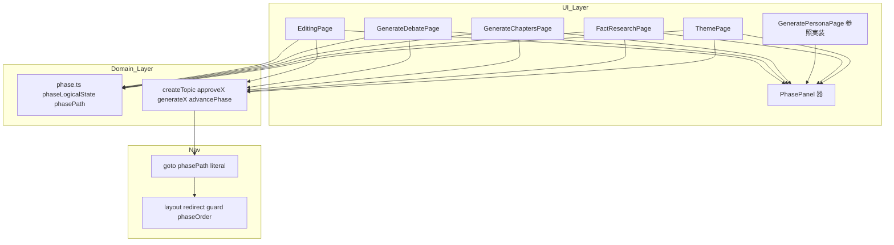
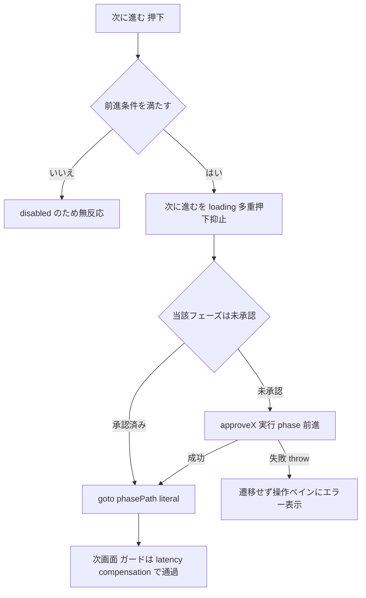
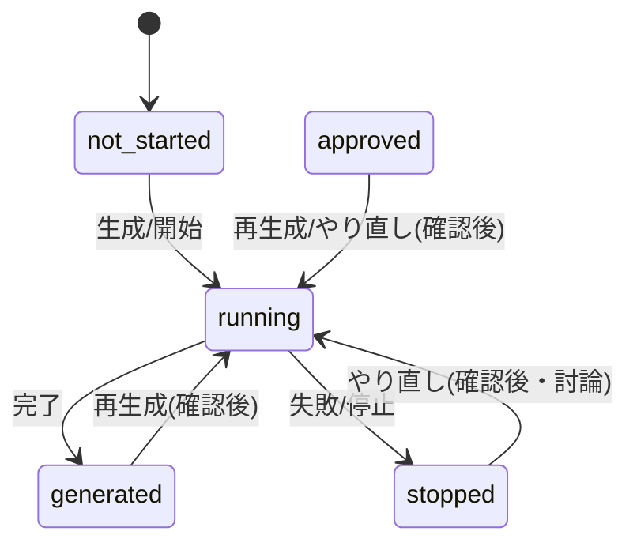

# Technical Design: phase-page-ui-unification

## Overview

**Purpose**: 管理画面のフェーズ画面6枚（テーマ設定・事実リサーチ・ペルソナ生成・アジェンダ生成・討論・編集）の操作ペインを、同一の3領域構成（左＝前に戻る / 中央＝実行操作1スロット / 右＝次に進む）へ統一する。管理者が画面ごとに操作を読み直さずに討論生成を進められる状態にする。

**Users**: 管理者（トピック作成者）が、テーマ設定から編集までのフェーズ進行に利用する。

**Impact**: 現状は画面ごとにボタンの顔ぶれ・位置・文言が異なり（「承認して次へ進む」「討論を確定して編集へ」等）、承認と前進が別操作になっている。本 spec は承認を「次に進む」へ畳み込み、実行操作を中央1スロットへ集約し、画面遷移の `nextPhase()` 導出を撤去して各画面が遷移先を直接持つ形へ移行する。前提 spec `persona-generation-consolidation`（実装済み・6フェーズ化）の成果として `GeneratePersonaPage` は既に本方針に適合しており、これを参照実装として残りの画面を揃える。

### Goals
- 6画面の操作ペインを「前に戻る / 実行1スロット / 次に進む」の同一骨格へ統一する。
- 承認を「次に進む」へ畳み込み、承認失敗時は遷移せずエラーを表示する。
- 画面遷移を各画面のリテラル（遷移先フェーズ）で宣言し、`nextPhase()` の画面遷移用途を撤去する。

### Non-Goals
- Firebase Functions 側の生成パイプラインの挙動・構造の変更（無変更・デプロイ不要）。
- `phase` / `phaseStatus` のデータモデル・遷移規則（`PHASE_DEFS` の値・順序）の変更。
- `StepNav` の `STEP_GROUPS`（ステップ束ね）の変更・外部切り出し。
- 各フェーズのコンテンツ本体（事実項目・ペルソナカード・討論ターン・編集記事）の表示仕様の変更。
- 公開閲覧側の画面。

## Boundary Commitments

### This Spec Owns
- 6画面の `actions` スニペットの操作配置・ボタン様式・状態別表示。
- 各画面の「前に戻る」「次に進む」の遷移先（リテラル宣言）と、承認の畳み込み・失敗時の扱い。
- 廃止操作（「実行せず承認する」`emptyApprove`、討論の「1章で討論を終了する」`singleChapterMode`、各画面の独立承認ボタン）の撤去。
- 編集画面のゲート表示位置の調整（討論未完了でも「前に戻る」を出す）。

### Out of Boundary
- Functions 側の生成・破棄ロジック、callable の契約（`startDebate` 等の optional フィールドはサーバ既定に委ねる）。
- `phase.ts` のドメイン関数（`nextPhase` / `phaseOrder` / `advancePhase` はドメイン前進・ガード用途で維持）。
- ペルソナ生成〜取材のサーバ側連鎖（`persona-generation-consolidation` で実施済み）。
- コンテンツ本体の既存操作（事実の手編集・保存、ペルソナ採用チェック、記事要素の個別再生成、章ステータス表示）。

### Allowed Dependencies
- `PhasePanel`（sharedComponents・器）、`@14ch/svelte-ui`（`Button` / `ConfirmDialog` / `Checkbox` / `Skeleton` 等）。
- `currentTopicStore` と各ドメインストア、`createTopic` モデルの既存メソッド（`approveTheme` / `approveFactResearch` / `advancePastPersonas` / `approveChapters` / `approveDebate` / `generateX` / `startDebate` / `restartDebate` / `startEditing`）。
- `phase.ts` の `phaseLogicalState` / `phasePath`。

### Revalidation Triggers
- `PHASE_DEFS` の値・順序変更（遷移先リテラルの再確認が必要）。
- `phaseLogicalState` の戻り値集合の変更（中央スロットの状態写像に影響）。
- `createTopic` の approve/generate 系メソッドのシグネチャ変更。
- レイアウトのリダイレクトガードの条件変更（承認直後の遷移整合に影響）。

## Architecture

### Existing Architecture Analysis
- **器**: `PhasePanel` が sticky な `actions` ペインとスクロールする `content` ペインを提供。操作の中身は各画面が `actions` スニペットに直接持つ（一元管理しない）。この分担は維持する。
- **ドメイン**: `phase.ts` は (phase, phaseStatus, target) から `phaseLogicalState`（`not_started` / `running` / `generated` / `stopped` / `approved`）を導出する純関数。各画面はこれで自フェーズの表示状態を決める。
- **前進**: `createTopic.advancePhase(current)` が `nextPhase(current)` を用いて Firestore の `phase` を次へ進める。承認系メソッド（`approveTheme` 等）はこれを呼ぶだけで、**承認＝前進は単一操作**。
- **ガード**: トピック詳細レイアウトが未到達フェーズへのアクセスを現在フェーズへリダイレクト。`await approveX()` は latency compensation で `onSnapshot` へ即時反映されるため、直後の `goto` はガードに弾かれない。
- **技術的負債の是正**: 画面側の `nextPhase()` 画面遷移導出、`ThemePage` / `FactResearchPage` の `catch {}` 握りつぶし＋失敗時遷移、`FactResearchPage` の初回生成が確認ダイアログを開く不整合を本 spec で解消する。

### Architecture Pattern & Boundary Map

**Architecture Integration**:
- **Selected pattern**: 画面ローカル・コンポジション（各画面が自分の操作・遷移を直接記述）。共通化は `PhasePanel` の器と3領域レイアウト CSS に限定。
- **Domain/feature boundaries**: UI 層（6画面）＝配置・遷移・様式を所有。ドメイン層（`phase.ts` / `createTopic`）＝状態導出・前進を所有（UI は呼ぶだけ）。
- **Existing patterns preserved**: `PhasePanel` スニペット分担、`phaseLogicalState` 駆動の状態表示、楽観フラグ（`isStarting` 等）による実行中表示、`ConfirmDialog` による再生成確認。
- **New components rationale**: 新規コンポーネントは作らない（structure.md「過度な共通化をしない」）。
- **Steering compliance**: 中央ディスパッチャ・条件分岐で複数画面を吸収する共通部品を作らない。CSS は BEM、UI は `@14ch/svelte-ui`。



キーとなる決定は、画面遷移を各画面の `goto(phasePath(topic.id, '<literal>'))` に直書きし（`nextPhase()` 非依存）、承認を forward ハンドラに畳むこと。図の Domain→Nav は「承認完了→遷移」の制御方向を示す。

### Technology Stack

| Layer | Choice / Version | Role in Feature | Notes |
|-------|------------------|-----------------|-------|
| Frontend | Svelte 5（runes）/ SvelteKit | 6画面の `actions` 再構成・遷移直書き | 既存。新規依存なし |
| UI 部品 | `@14ch/svelte-ui`（`Button` / `ConfirmDialog` / `Checkbox` / `Skeleton`） | 3領域ボタン様式・確認ダイアログ・スケルトン | 要件の全様式（variant/rounded/icon/loading/disabled）を既存 API で表現可能 |
| Domain | `phase.ts` / `createTopic.svelte.ts` | 状態導出・前進・生成 callable ラッパ | シグネチャ変更は `startDebate`/`restartDebate` の引数削除のみ |
| Backend | Firebase Functions | 生成・破棄 | **無変更・デプロイ不要** |

## File Structure Plan

### Modified Files
- `src/lib/features/admin/topic-detail/theme/ThemePage.svelte` — 前に戻る無し・中央無し・次に進む（保存＋参考URL本文取得＋`approveTheme`→`fact-research`）。`nextPhase` import 除去、遷移先を `'fact-research'` 直書き。`approve` の失敗を throw させ、forward ハンドラで「失敗時は遷移せずエラー表示」に是正（`catch {}` 撤去）。
- `src/lib/features/admin/topic-detail/fact-research/FactResearchPage.svelte` — 前に戻る（`'theme'`）/ 中央（生成・再調査の単一スロット）/ 次に進む（`approveFactResearch`→`'personas'`）。初回生成は `generate()` を直接呼ぶ（確認ダイアログを開かない）。`emptyApprove` と `nextPhase` import を撤去。forward の失敗時遷移是正。
- `src/lib/features/admin/topic-detail/chapters/GenerateChaptersPage.svelte` — 前に戻る（`'personas'`）追加、中央（生成・再生成の単一スロット、cached/rounded 様式）、次に進む（`approveChapters`→`'debate'`）。「承認して次へ進む」独立ボタンを撤去。`nextPhase` import 除去。
- `src/lib/features/admin/topic-detail/debate/GenerateDebatePage.svelte` — 前に戻る（`'chapters'`）、中央（開始／停止／やり直しの単一スロット）、次に進む（`approveDebate`→`'editing'`）。「討論を確定して編集へ」独立ボタン、「討論を再開する」（`restart` ハンドラ）、`singleChapterMode` state・`Checkbox` を撤去。`nextPhase` import 除去。
- `src/lib/features/admin/topic-detail/editing/EditingPage.svelte` — 前に戻る（`'debate'`）、中央（開始・やり直しの単一スロット）、次に進む無し（最終）。討論未完了時も `PhasePanel` を常時描画し、ゲート文言を content 側へ移す。`showDiff` の `Checkbox` を actions からコンテンツ領域へ移設。
- `src/lib/models/topic/createTopic.svelte.ts` — `startDebate` の `singleChapterMode` 引数と callable への受け渡しを撤去（引数なしで呼ぶ。callable の optional フィールドはサーバ既定に委ねる）。UI から不要になった `restartDebate` ラッパ（＋公開）を撤去（Functions ハンドラはサーバ側に残置＝範囲外）。`stopDebate` は存続。
- `src/lib/features/admin/topic-detail/persona/GeneratePersonaPage.svelte` — 骨格（前に戻る／中央1スロット／次に進む）は参照実装として維持しつつ、**共通 forward 契約に揃える軽微改修**を行う。現行 `handleForwardClick` は `advancePastPersonas()` を loading 無し・try/catch 無しで呼んでおり R3.3/R3.4 を満たさないため、`isApproving`（loading・多重押下抑止）と失敗時の `approveError` 表示（遷移しない）を追加する。中央スロット・採用ゲートは現行のまま。

### Test Files (rewrite / consolidate)
- **重複 spec の集約**: 現状、各画面の spec が新旧2箇所に重複して存在し、いずれも現行コンポーネントを import している（旧: `src/tests/features/admin/{theme,fact-research,chapters,debate,editing}/` の `ThemePage` / `PhaseFactResearch` / `Phase4Chapters` / `Phase5Debate` / `Phase6Editing`。新: `src/tests/features/admin/topic-detail/.../` の `ThemePage` / `FactResearchPage` / `GenerateChaptersPage` / `GenerateDebatePage` / `EditingPage`）。**旧配置の spec を削除し、`topic-detail` 配下の1系統へ一本化**する（二重メンテと旧文言アサートの残存を防ぐ）。
- 一本化した各 page spec はボタン文言・遷移・失敗時挙動をアサートしており、新様式へ書き換える。
- `src/tests/models/phase/fact-research-lifecycle.test.ts` — 「実行せず承認」経路の検証を、`advancePhase` のドメイン前進の検証へ読み替えて書き換える。

> 依存方向: 型 → `phase.ts`（ドメイン関数）→ `createTopic`（モデル）→ 画面（UI）。画面は下位のみ import し、`goto` は画面に置く（`models/` に置かない）。

## System Flows

### 「次に進む」の承認畳み込みと失敗時分岐（全画面共通の制御）



前進条件（R3.6）: テーマ設定＝入力妥当 / 事実リサーチ＝生成完了（空可）/ ペルソナ生成＝生成完了かつ採用1件以上 / アジェンダ生成＝章立て生成済み / 討論＝生成完了。失敗時は `goto` を実行しない（現行の `catch {}`＋失敗時遷移を是正）。

### 中央スロットの状態→ボタン写像



写像規則（単一スロット・R4.2）: `not_started`＝生成ボタン（filled・rounded・`cached`）/ `running`＝loading / `generated`・`approved`・`stopped`＝再生成/やり直しボタン（ghost・rounded・`cached`・確認ダイアログ）。討論のみ `running`＝停止（outlined）を持つ。討論 `stopped` は「最初からやり直す」（部分継続の「再開する」は提供しない）。

## Requirements Traceability

| Requirement | Summary | Components | Flows |
|-------------|---------|------------|-------|
| 1.1–1.7 | 操作ペイン3領域・様式・空中央はテーマのみ | 全6画面の `actions` | 中央スロット写像 |
| 2.1–2.4 | 遷移先を各画面リテラルで宣言・`nextPhase` 画面遷移撤去・戻るは非破壊 | 全6画面 | 承認畳み込み |
| 2.5–2.6 | `advancePhase` は `nextPhase` 維持・`STEP_GROUPS` 非切り出し | `createTopic` / `StepNav`（無変更） | — |
| 3.1–3.6 | 承認を次に進むへ畳み込み・loading・失敗時非遷移＋エラー・前進条件 | 全6画面（Editing 除く forward） | 承認畳み込み |
| 4.1–4.10 | 中央1スロット・生成/再生成様式・loading/disabled・確認ダイアログ・採用ゲート | Fact/Persona/Chapters/Debate/Editing | 中央スロット写像 |
| 5.1–5.5 | 実行中スケルトン・停止再開（討論）・討論停止・空結果・未生成表示 | Fact/Debate/各 content | 中央スロット写像 |
| 6.1–6.10 | 全画面適用・各画面の具体操作・ペルソナは取材専用UI無し・編集ゲート | 全6画面 | 両フロー |
| 7.1–7.5 | 破棄範囲・確認文言維持・廃止操作撤去・楽観表示・コンテンツ操作維持・ガード整合 | 全6画面 / `createTopic` | 承認畳み込み |
| 8.1–8.5 | 中央ディスパッチャ禁止・`goto` は画面・遷移機構新設禁止・撤去・BEM/UI部品 | 全6画面 | — |

## Components and Interfaces

| Component | Layer | Intent | Req Coverage | Key Dependencies | Contracts |
|-----------|-------|--------|--------------|------------------|-----------|
| ThemePage | UI | 入力＋承認して事実リサーチへ | 1, 2, 3, 6, 7 | createTopic (P0), phase.ts (P0) | State |
| FactResearchPage | UI | 事実リサーチ実行/再調査＋前進 | 1–7 | factBaseStore (P0), createTopic (P0) | State |
| GeneratePersonaPage | UI | 生成/再生成＋採用ゲート前進（骨格維持＋共通 forward 契約へ軽微改修） | 1–7 | personasStore (P0), createTopic (P0) | State |
| GenerateChaptersPage | UI | 章立て生成/再生成＋前進 | 1–8 | chaptersStore (P1), createTopic (P0) | State |
| GenerateDebatePage | UI | 討論 開始/停止/再開/やり直し＋前進 | 1–8 | chaptersStore (P1), createTopic (P0) | State |
| EditingPage | UI | 編集 開始/やり直し（最終・前進なし） | 1, 4, 5, 6, 7, 8 | editorialStore (P1), createTopic (P0) | State |
| createTopic (model) | Domain | approve/generate/前進 callable ラッパ（`startDebate` 引数削減） | 2.5, 3.2, 7.2 | Functions (External P0) | Service |

各画面は新たな境界を導入しない presentational + ローカルロジックのため、詳細ブロックは下記の共通契約に集約する。

### UI 層: フェーズ画面の共通操作契約

すべての画面が `PhasePanel` の `actions` スニペットに3領域を持つ。ローカル状態と遷移の共通形は次のとおり。

**Responsibilities & Constraints**
- 各画面は自フェーズの `phaseLogicalState` から中央スロットのボタン1つを決める（他フェーズ状態を参照しない・R4.8。例外は編集画面の開始ゲートが討論状態を見る R6.10）。
- 「前に戻る」は `goto(phasePath(topic.id, '<prevLiteral>'))` のみ（`phase`/`phaseStatus`/生成データを変更しない・R2.4）。
- 「次に進む」は前進条件を満たすときのみ活性。押下時に未承認なら approve を実行し、成功時のみ `goto('<nextLiteral>')`。失敗時は遷移せずエラー表示（R3.2–3.4）。
- 遷移先リテラル: theme→fact-research / fact-research→personas / personas→chapters / chapters→debate / debate→editing。前: fact-research→theme / personas→fact-research / chapters→personas / debate→chapters / editing→debate。

**Contracts**: State [x]

##### State Management
- **State model（画面ローカル・`$state`）**:
  - `isApproving: boolean` — 次に進む押下中の loading と多重押下抑止。
  - `approveError: string` — 承認失敗時のメッセージ（操作ペインに表示、成功で空）。
  - `isStarting: boolean` — 生成/開始押下直後の楽観的「実行中」表示（サーバ権威ステータス反映で解除）。
  - `isRegenerating` / `isResetting: boolean`（Fact/Persona/Chapters/Debate）— 再生成押下直後の旧データ即時非表示（実削除の同期に連動して解除。現行踏襲）。
- **Derived**: `logicalState = phaseLogicalState({phase, phaseStatus}, PHASE)`（`isStarting` 中は `running`）。前進可否 `canAdvance` は R3.6 の条件。
- **Persistence & consistency**: 画面はローカル状態のみ所有。永続は `createTopic` / 各ストア経由の Firestore。承認前進は latency compensation で即時反映（ガード整合）。
- **Concurrency**: `isApproving` / `isStarting` で多重実行を抑止。

**Forward ハンドラの共通形（型・擬似シグネチャ）**
```typescript
// 各画面がローカルに持つ（models/ に置かない）。approveFn は当該フェーズの前進メソッド。
const handleForwardClick = async (): Promise<void> => {
  const topic = currentTopicStore.topic;
  if (!topic || !canAdvance) return;
  isApproving = true;
  approveError = '';
  try {
    if (logicalState !== 'approved') await approveFn(); // approveFn は失敗時 throw
    goto(phasePath(topic.id, NEXT_PHASE));               // 成功時のみ遷移
  } catch {
    approveError = '<画面固有の失敗メッセージ>';           // 遷移しない
  } finally {
    isApproving = false;
  }
};
```
- Preconditions: `canAdvance === true`（未達なら disabled で押下不可）。
- Postconditions: 成功＝次画面へ遷移かつ `phase` 前進済み / 失敗＝同画面・`approveError` 表示・`phase` 不変。
- Invariants: 承認失敗時に `goto` を呼ばない（R3.4）。「前に戻る」は非破壊（R2.4）。

**Implementation Notes**
- Integration: 中央スロットのボタン様式は `Button`（`variant` / `rounded` / `icon="cached"|"arrow_back"|"arrow_forward"` / `iconPosition` / `loading` / `disabled`）。3領域は `display:flex; justify-content:space-between` の BEM ブロック（`<page>__actions`）。
- Validation: theme は `isValid`（タイトル必須・上限・URL形式）、persona は採用1件以上、fact-research は空でも generated 可（R6.4）。
- Risks: 討論 `stopped` の単一スロット化で直接「最初からやり直す」が落ちる（Open Question 参照）。

### 画面別の中央スロット写像（要点のみ）

- **テーマ設定**: 中央なし。次に進む＝保存＋参考URL本文取得＋`approveTheme`。
- **事実リサーチ**: not_started＝「事実リサーチを実行する」(filled/cached, 確認なしで `generateFactResearch`) / running＝loading / generated・approved・stopped＝「再調査する」(ghost/cached, 確認ダイアログ→`generateFactResearch`)。次に進む＝`approveFactResearch`。
- **ペルソナ生成（骨格維持＋forward契約改修）**: not_started＝「ペルソナを生成する」(filled) / running＝loading(ghost) / generated・stopped・approved＝「ペルソナを再生成する」(ghost, 確認)。次に進む＝採用1件以上で `advancePastPersonas`（共通契約どおり loading＋失敗時エラー表示）。
- **アジェンダ生成**: not_started＝「章立てを生成する」(filled/cached) / running＝loading / generated・approved＝「再生成する」(ghost/cached, 確認)。次に進む＝`approveChapters`。
- **討論**: not_started＝「討論を開始する」(filled/cached) / running＝「討論を停止する」(outlined, `stopDebate`) / stopped・generated・approved＝「最初からやり直す」(ghost/cached, 確認→`startDebate`)。次に進む＝`approveDebate`。「再開する」(`restartDebate`) と `singleChapterMode` を撤去。
- **編集（最終・前進なし）**: 討論未完了＝中央空＋content にゲート文言。not_started＝「編集を開始する」(filled/cached) / running＝loading / generated・stopped・approved＝「編集をやり直す」(ghost/cached, 確認→`startEditing`)。`showDiff` トグルは content 領域。

### Domain 層: createTopic（変更点のみ）

**Contracts**: Service [x]

##### Service Interface
```typescript
// singleChapterMode 引数を撤去（callable の optional フィールドは送らずサーバ既定に委ねる）。
startDebate(): Promise<void>;
// restartDebate は UI から不要になったため撤去（Functions ハンドラはサーバ側に残置＝範囲外）。
stopDebate(): Promise<void>; // 存続
```
- Preconditions: 画面側の状態遷移条件は UI が担保。
- Postconditions: Functions 側の討論開始挙動は既定（最後の章まで）で不変。討論のやり直しは常に `startDebate`（最初から）に一本化。
- Invariants: 他の approve/generate メソッドのシグネチャ・挙動は不変（本 spec で触れない）。

## Error Handling

### Error Strategy
- **承認/前進の失敗**: approve 系は失敗を throw。forward ハンドラが捕捉し、遷移せず `approveError` を操作ペインに表示（`role="alert"`）。握りつぶし（`catch {}`）と失敗時遷移を撤廃。
- **生成/再生成の失敗**: サーバが `phaseStatus: 'stopped'` を書き、中央スロットが停止/再生成表示へ遷移（討論は再開）。楽観フラグは実状態反映で解除。
- **未達の前提**: 前進条件未達は「次に進む」を disabled にし、理由の注記を表示（採用0件・討論未完了など）。

### Error Categories and Responses
- **User Errors**: テーマ入力不正＝フィールド別バリデーション表示・次に進む disabled。参考URL本文取得失敗＝操作ペインにエラー、遷移しない。
- **Business Logic Errors**: 採用ペルソナ0件＝前進不可＋注記。討論未完了で編集不可＝ゲート文言（前に戻るは可能）。

### Monitoring
- 追加のロギングは導入しない（既存の callable エラーは throw されストア/画面で表示）。

## Testing Strategy

### Unit / Component Tests
- 各 page spec を新様式へ書き換え、状態別に中央スロットのボタン（文言・variant・loading/disabled）が1つだけ出ることを検証（Fact/Chapters/Debate/Editing）。
- 「次に進む」: 前進条件未達で disabled、押下で approve→goto、approve throw 時に**遷移せずエラー表示**を検証（R3.3/R3.4）。
- 「前に戻る」: 押下で前フェーズへ `goto` し、`phase`/`phaseStatus` を変更しないことを検証（R2.4）。
- 討論: `singleChapterMode` 撤去後も開始/停止/再開/やり直しが動作すること。編集: 討論未完了時にゲート文言＋前に戻るが出ること（R6.10）、`showDiff` が content 側にあること。

### Integration Tests
- `fact-research-lifecycle.test.ts` を `advancePhase` のドメイン前進検証へ読み替え（「実行せず承認」廃止と `nextPhase` 画面遷移撤去に整合）。
- 承認→`goto` がリダイレクトガードに弾かれないこと（latency compensation 整合、R7.5）。

### E2E/UI（任意）
- テーマ→事実リサーチ→ペルソナ→アジェンダ→討論→編集の一連で、各画面が同一骨格（前/中央/次）で前進できることを実機確認。

## Decisions Resolved / Risks
- **討論 `stopped` の単一スロット（決定済み）**: `stopped`＝「最初からやり直す」1つに統一し、部分継続の「再開する」（`restartDebate`）は UI・モデルから撤去する。停止後の復旧は最初からの生成し直しに一本化する（R5.2/R6.8 反映済み）。
- 既存 page spec の広範な赤化は想定内（tasks に書き換えを明示）。
