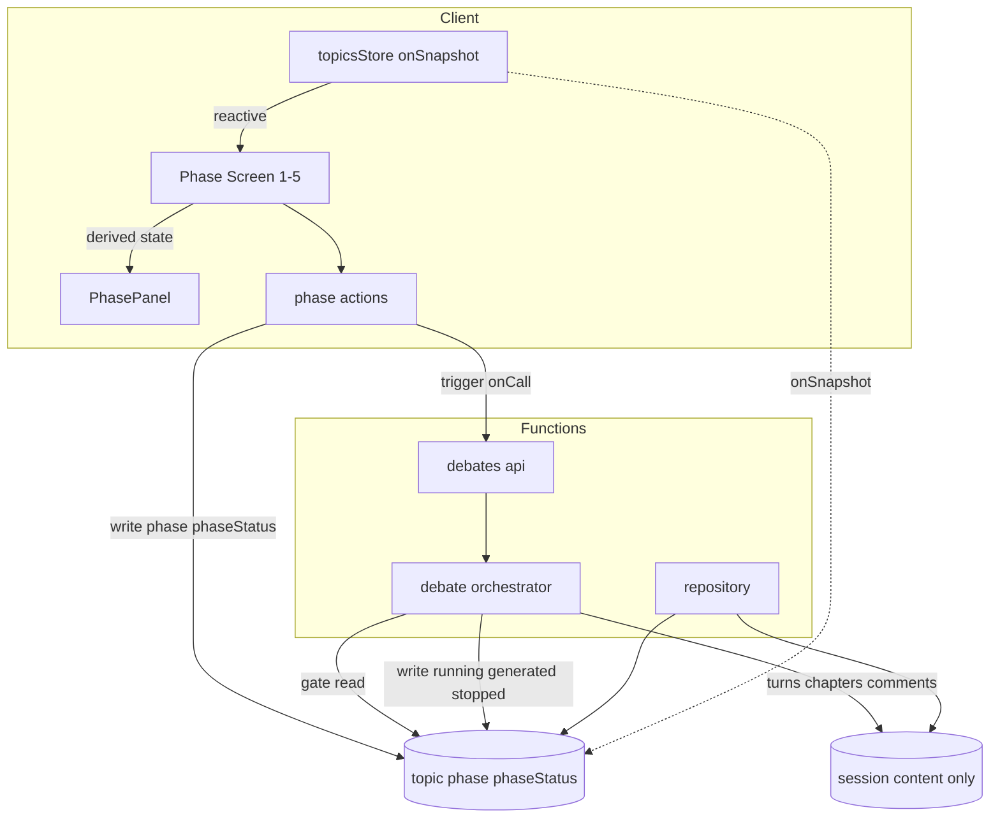
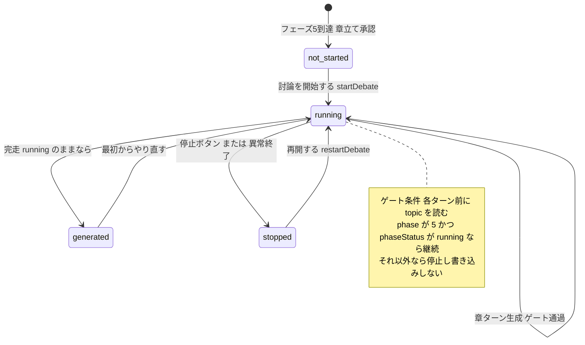
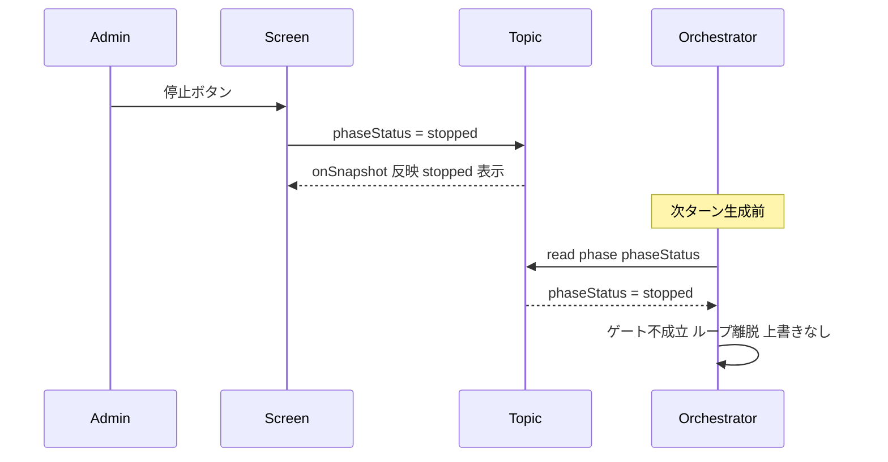

# 技術設計: phase-status-consolidation

## Overview

**Purpose**: 管理画面の討論生成ワークフロー（フェーズ1〜5）の進行状態を、現状 topic・session・クライアントローカルの3箇所に分散している状態を、topic の `(phase, phaseStatus)` 単一の真実の源（SSOT）へ一元化する。これにより状態の不整合・二重管理を根絶し、コンテンツ生成フローの保守性を高める。

**Users**: 管理者が討論生成フローを操作する際、リロード・別タブ・非同期完了のいずれでも常に同一の状態を見られるようになる。開発者は状態の置き場所が topic だけになり、フェーズ追加・変更が単純化する。

**Impact**: `SessionStatus`・`DebateStatus`・クライアントローカルの実行中フラグ（`clientPhaseInFlight`）と、それらに依存する導出・移行ヘルパー（`statusToPhase` / `resolveCurrentPhase` / `deriveLegacyPhaseState` 等）を完全除去する。討論オーケストレータの停止判定を session から topic へ付け替える。`phaseController(targetPhase)` を解体し、各フェーズ画面が `$derived` で自身の状態を導出する構造へ変える。

### Goals
- topic の `(phase, phaseStatus)` を進行状態の唯一の保持点とする（必須フィールド化）
- `phaseStatus` を `not_started | running | generated | stopped` の4値に統一（エラーは `stopped` に集約）
- 討論を「クライアント在席に非依存で完走、トピック状態のゲートで停止」に再構成
- 旧 status 実装（型・ヘルパー・移行コード）を互換コードパスごと完全除去

### Non-Goals
- 各フェーズのAI生成ロジック（プロンプト・生成品質）の変更
- 公開（publish）機能。当面オミットし、`status === 'published'` 依存箇所の最小退避のみ行う
- フェーズ共通操作のUI文言・配置の再設計（[phase-workflow-consistency](../phase-workflow-consistency/) が担当）
- 新フェーズの追加、討論コンテンツのデータ構造変更

## Boundary Commitments

### This Spec Owns
- topic の `(phase, phaseStatus)` の値集合・遷移・必須化（進行状態の権威）
- `PhaseStatus` 型定義（`src/lib/utils/phase.ts` と `functions/src/types/index.ts`）
- フェーズ論理状態の導出規則（`phaseLogicalState`：トピック入力のみの純粋関数）
- 討論オーケストレータの停止ゲート条件（topic 参照）と終端書き込み
- 旧 status 実装の除去と既存データの一度きり移行

### Out of Boundary
- 公開ページ（`/`・`/debate/[id]`）の表示仕様と publish フローの再設計
- 討論の話者選択・章進行・介入などのパイプラインロジック
- フェーズ操作の文言・確認ダイアログの統一（隣接 spec）

### Allowed Dependencies
- Firestore Client SDK（`src/lib/stores/` の onSnapshot 同期）
- Firebase Functions v2（Cloud Tasks による章タスク連鎖）と `functions/src/db/repository.ts`
- `@14ch/svelte-ui`（`Button` / `ConfirmDialog`）

### Revalidation Triggers
- `PhaseStatus` の値集合変更（`stopped` 追加・error 集約）→ 全 `phaseStatus` 消費者
- `SessionStatus` 削除 → session を読む全箇所
- topic 状態の必須化 → 既存データを読む全経路（移行前提）
- 討論停止ゲート条件の変更 → オーケストレータ・停止UI

## Architecture

### Existing Architecture Analysis

- **2軸モデルは導入済み**: topic は既に `phase?` / `phaseStatus?`（任意）を持ち、フェーズ1〜4の生成・取材・章立ては既にクライアントが topic に書いている（[topic.svelte.ts](../../../src/lib/models/topic/topic.svelte.ts), [personas.svelte.ts](../../../src/lib/stores/personas.svelte.ts)）。
- **停止ゲートは既存**: 討論オーケストレータは各章・各ターン冒頭で `session.status === 'cancelled'` をポーリングして停止する（[debate-orchestrator.ts:192-193](../../../functions/src/pipeline/debate-orchestrator.ts#L191)）。**参照先を topic に替えるだけ**でゲートは成立する。
- **討論完了の topic 書き込みも既存**: `finalizeDebate` が `updateTopicPhase(5, 'generated')` を既に呼んでいる（[:555](../../../functions/src/pipeline/debate-orchestrator.ts#L555)）。
- **技術負債**: SessionStatus が「終端の権威」と「停止フラグ」の二役を担い、`phaseLogicalState` が session/ローカルのヒントを混ぜている点が二重管理の根源。

### Architecture Pattern & Boundary Map



**Architecture Integration**:
- **Selected pattern**: Single Source of Truth + リアクティブ導出。topic が状態を単独保持し、UI は onSnapshot 同期値から `$derived` で導出、Functions は同じ topic をゲート・書き込みに使う。
- **Domain boundaries**: 状態の保持＝topic、討論コンテンツの保持＝session、状態の導出＝純粋関数 `phaseLogicalState`、操作＝action 関数。保持点は topic 唯一。
- **Existing patterns preserved**: onSnapshot ストア（firebase.md）、Functions が repository 経由で Firestore に書く、Cloud Tasks の章連鎖。
- **New components rationale**: 新規コンポーネントは無し。既存の責務移動（session→topic）と削除が中心。
- **Steering compliance**: Firestore 書き込みは stores / repository に集約、型は `functions/src/types` と `src/lib` に分離維持、アロー関数標準。

### Technology Stack

| Layer | Choice / Version | Role in Feature | Notes |
|-------|------------------|-----------------|-------|
| Frontend | SvelteKit 2.x / Svelte 5 runes | `$derived` による状態導出、onSnapshot 購読 | `phaseController` 解体 |
| Backend | Firebase Functions v2 (Node 24) | 討論実行・停止ゲート・終端書き込み | 既存 onCall/onTaskDispatched |
| Data | Firestore | topic を SSOT 化、session は content のみ | `status` フィールド削除 |
| Infra | Cloud Tasks (runChapter) | 章単位の連鎖実行 | 変更なし |

## File Structure Plan

### Modified Files

**共有型・導出（依存の最上流）**
- `src/lib/utils/phase.ts` — `PhaseStatus` に `stopped` 追加。`phaseLogicalState` を `(current, target)` のみの純粋関数へ簡素化（hints 削除、stopped 対応）。`statusToPhase` / `resolveCurrentPhase` / `deriveLegacyPhaseState` / `LEGACY_PHASE_STATE` / `STATUS_PHASE_MAP` / `DebateStatus` import を削除。ラベルマップに stopped 追加。
- `functions/src/types/index.ts` — `PhaseStatus` に `stopped` 追加、`SessionStatus` 型を削除。

**型定義**
- `src/lib/models/topic/topic.types.ts` — `DebateStatus` 削除。`TopicDoc` / `TopicSummary` の `status` 削除、`currentPhase`→`phase`・`phaseStatus` を必須化。
- `src/lib/models/session/session.types.ts` — `SessionStatus` 削除、`SessionDoc.status` 削除。

**状態書き込み（クライアント）**
- `src/lib/models/topic/topic.svelte.ts` — `cancelRunningDebate`（session 書き込み）を topic `stopped` 書き込みへ変更。各 generate のエラー時 `stopped` 書き込みを追加。`publishDebate` の `status:'published'` 削除（`publishedAt` のみ）。`get status()` 削除。
- `src/lib/stores/personas.svelte.ts` — フェーズ3取材のエラー時 `stopped` 書き込みを追加（running/generated は既存）。

**状態導出・画面（`phaseController` 解体）**
- `src/lib/models/topic/phaseController.svelte.ts` — **削除**。代替として action 関数群（後述）と各画面の `$derived` 導出に分解。
- `src/lib/sharedComponents/PhasePanel.svelte` — props を `controller` から `phase` / `logicalState` / action ハンドラ群へ変更。running 分岐に全フェーズ共通の回復アクション（やり直す/停止）を追加。
- `src/lib/features/admin/{stakeholders,personas,research,chapters,debate}/Phase*.svelte` — 各画面で自フェーズ定数 + topic 状態から `logicalState` を `$derived` し、PhasePanel に渡す。
- `src/routes/admin/topics/[topicId]/+layout.svelte` — `resolveCurrentPhase` を `topic.phase` 直接参照へ変更。
- `src/lib/features/admin/topic-list/TopicListPage.svelte` — `deriveLegacyPhaseState` フォールバック削除、`phase`/`phaseStatus` 直接利用。
- `src/routes/+page.svelte` — 公開判定を `status === 'published'` → `publishedAt != null` へ。

**Functions（停止ゲート・終端）**
- `functions/src/pipeline/debate-orchestrator.ts` — ゲート判定を topic 参照（`phase===5 && phaseStatus==='running'`）へ。`finalizeDebate` の `generated` 書き込みを条件付き（running のままなら）に。
- `functions/src/api/debates.ts` — `updateDebateSessionStatus` 呼び出し削除（topic 書き込みに一本化）。runChapter の最終リトライ失敗時を `stopped` 書き込みへ。
- `functions/src/db/repository.ts` — `updateDebateSessionStatus` / `markSessionError` 削除。`createDebateSession` / `discardChapterProgress` / `completeDebateSession` から `status` 書き込み削除。topic を `stopped` にする `markTopicStopped` を追加。終端の条件付き更新ヘルパーを追加。

**データ削除（移行なし）**
- 既存 `topics` コレクションはデプロイ前に削除する運用手順のみ（コード変更なし）。バックフィル・移行スクリプトは作らない。

> 依存方向: `phase.ts`（型・純粋関数）→ stores/repository（書き込み）→ action → 画面/PhasePanel。上位（画面）から下位（型）へのみ依存。

## System Flows

### 討論ライフサイクルと停止ゲート（状態遷移）



### 停止操作のシーケンス（在席非依存）



停止はクライアントが topic に `stopped` を書くだけで、実行中の Functions は次のターン境界でそれを読み自己停止する。クライアントの表示有無に依存しない。上流フェーズの再生成（phase を 1〜4 に戻す）も同じゲートで討論を止める（phase!==5 で不成立）。

## Requirements Traceability

| Requirement | Summary | Components | Flows |
|-------------|---------|------------|-------|
| 1.1, 1.2, 1.3 | topic を唯一の源・topic のみから導出 | phase.ts（phaseLogicalState）, topic.types | — |
| 1.4 | 状態変化操作を topic に反映 | phase actions, topic.svelte.ts | 状態遷移 |
| 1.5 | 旧 status を導出に使わない | phase.ts（旧ヘルパー削除） | — |
| 2.1, 2.2 | SessionStatus 廃止・session 参照除去 | session.types, repository, orchestrator | — |
| 2.3 | 討論状態変化を topic に書く | debates.ts, orchestrator | 状態遷移 |
| 3.1, 3.2, 3.3, 3.4 | onSnapshot 直接参照・ローカルフラグ廃止 | topicsStore, Phase*.svelte, PhasePanel | — |
| 3.5, 3.6 | running/中断判別と全フェーズやり直し | PhasePanel（running 分岐）, phase actions | 状態遷移 |
| 4.1, 4.2, 4.3, 4.4 | 在席非依存実行・ゲート・停止・条件付き完了 | orchestrator, debates.ts, repository | 停止シーケンス |
| 4.5 | currentChapterIndex 再開 | debates.ts restartDebate | 状態遷移 |
| 4.6 | session 非参照で判別 | orchestrator, phase.ts | — |
| 4.7 | Functions 死亡時も停止で回復 | PhasePanel 停止, repository markTopicStopped | 停止シーケンス |
| 5.1-5.5 | 単独保持・画面 $derived・targetPhase 注入廃止 | phase.ts, Phase*.svelte, PhasePanel | — |
| 5.6, 5.7 | 一覧と画面で同一導出・追加永続フラグ無し | phaseDisplayLabel, phaseLogicalState | — |
| 6.1-6.4 | 旧型・ヘルパー・ヒント引数の完全除去（移行せず全削除・再作成） | phase.ts, types | — |

## Components and Interfaces

| Component | Layer | Intent | Req Coverage | Key Dependencies | Contracts |
|-----------|-------|--------|--------------|------------------|-----------|
| phase.ts (types + 純粋関数) | Shared | PhaseStatus・論理状態導出 | 1, 5, 6 | なし (P0) | State |
| phase actions | Client logic | 生成/承認/再生成/停止/再開 | 1, 3, 4 | topic store, repo onCall (P0) | Service |
| PhasePanel + Phase*.svelte | UI | topic から $derived 表示 | 3, 5 | phase.ts, topicsStore (P0) | State |
| debate orchestrator gate | Functions | topic ゲートで停止・終端書き込み | 2, 4 | repository, topic (P0) | Batch |
| repository status fns | Functions data | topic 状態書き込み・session content | 2, 4 | Firestore Admin (P0) | Service |
| migration | One-shot | 既存データの 2軸化 | 6 | Firestore Admin (P0) | Batch |

### Shared: phase.ts

#### PhaseStatus / phaseLogicalState

| Field | Detail |
|-------|--------|
| Intent | フェーズ状態の値集合と、topic からの論理状態導出 |
| Requirements | 1.2, 1.3, 5.1, 5.2, 5.3, 6.3 |

**Responsibilities & Constraints**
- `PhaseStatus = 'not_started' | 'running' | 'generated' | 'stopped'`（永続値）。error は `stopped` に集約。
- `PhaseLogicalState = 'not_started' | 'running' | 'generated' | 'stopped' | 'approved'`（`approved` は導出のみ）。
- `phaseLogicalState` はヒント引数を持たない純粋関数。session・ローカルを参照しない。
- 追加の永続フラグを持たない（`approved` は phase 比較で導出、5.7）。

**Contracts**: State [x]

##### State Management
```typescript
export type PhaseStatus = 'not_started' | 'running' | 'generated' | 'stopped';
export type PhaseLogicalState = PhaseStatus | 'approved';

export interface PhaseState {
  phase: Phase;
  phaseStatus: PhaseStatus;
}

// 純粋関数: トピック状態と対象フェーズ番号のみから導出（hints 廃止）
export const phaseLogicalState = (
  current: PhaseState,
  target: Phase
): PhaseLogicalState => { /* target<phase→approved, target>phase→not_started, else phaseStatus */ };
```
- Preconditions: `current.phase` / `current.phaseStatus` は必須（topic で保証）。
- Postconditions: `target < current.phase` → `approved`、`target > current.phase` → `not_started`、一致 → `current.phaseStatus` をそのまま返す。
- Invariants: 同一入力で同一出力。外部状態に依存しない。

**Implementation Notes**
- Integration: 各画面が自フェーズ定数を `target` に渡し `$derived` で利用。`phaseDisplayLabel` も同じ `PhaseState` を入力に統一（5.6）。
- Risks: `DebateStatus` 削除に伴い `phaseLogicalState` の `SessionStatus` import が消える。型の重複（src/functions）は両方更新が必要。

### Client logic: phase actions

| Field | Detail |
|-------|--------|
| Intent | フェーズ操作を実行し topic に状態を書く（旧 phaseController の操作部） |
| Requirements | 1.4, 3.3, 3.6, 4.3 |

**Responsibilities & Constraints**
- `phaseController(targetPhase)` の**状態保持（inFlight/error/logicalState）を持たない**。操作のみを提供（5.4）。
- 各操作は開始時に topic `phaseStatus='running'` を書き、成功で `generated`、失敗で `stopped` を書く（クライアント権威フェーズ1〜4）。
- 討論（フェーズ5）の開始/再開は Functions をトリガーするだけ。停止は topic に `stopped` を書く。
- ローカルの実行中フラグを持たず、ボタン無効化・進行表示は topic の `phaseStatus` から導出（3.2, 3.3）。

**Contracts**: Service [x]

##### Service Interface
```typescript
// 既存 topic store / personas store のメソッドを利用する薄い操作群（状態は持たない）
interface PhaseActions {
  generate(phase: Phase): Promise<void>;   // running→generated、失敗時 stopped
  approve(phase: Phase): Promise<void>;     // phase+1, not_started へ
  regenerate(phase: Phase): Promise<void>;  // 下流破棄→running→generated
  stopDebate(): Promise<void>;              // topic phaseStatus = stopped
  restartDebate(): Promise<void>;           // onCall restartDebate
  retryRunning(phase: Phase): Promise<void>;// running 固着からの再実行（1〜4）
}
```
- Preconditions: 対象 topic が存在し購読済み。
- Postconditions: 操作結果が topic の `(phase, phaseStatus)` に反映される。
- Invariants: 状態の保持点は topic のみ。action は副作用の入口でしかない。

**Implementation Notes**
- Integration: 失敗時の transient なエラーメッセージ表示は許容するが、論理状態の真実の源にはしない（権威は topic の `stopped`）。
- Validation: ガード（`running` 中の二重起動抑止）は topic の `phaseStatus` を読んで判定。
- Risks: 上流再生成と討論実行の競合 → ゲート条件 `phase===5 && phaseStatus==='running'` で吸収。

### UI: PhasePanel / Phase*.svelte

| Field | Detail |
|-------|--------|
| Intent | topic 状態から導出した論理状態で表示分岐（targetPhase 注入を廃止） |
| Requirements | 3.1, 3.4, 5.2, 5.4 |

**Responsibilities & Constraints**（Summary-only：新境界なし）
- 各画面は自フェーズ番号（定数）と `topicsStore` の購読値から `logicalState` を `$derived`。
- PhasePanel は `controller` オブジェクト依存をやめ、`phase` / `logicalState` / action ハンドラを props で受ける。
- `running` 分岐に全フェーズの回復アクションを追加：フェーズ5は「停止する」、フェーズ1〜4は「やり直す」（3.6）。
- `stopped` 分岐は全フェーズで「やり直す」を提示（フェーズ1〜4は再実行、フェーズ5は `restartable` なら「再開する」＋「最初からやり直す」）。`stopped` はフェーズ専用ではなく全フェーズ共通。

**Implementation Note**: 既存の 5 分岐（not_started/running/stopped/generated/approved）を維持。`controller.inFlight` 参照を全廃し、無効化は `logicalState === 'running'` から導出。回復導線（running の「やり直す」と stopped の「やり直す」）は全フェーズで一貫させる。

### Functions: debate orchestrator gate

| Field | Detail |
|-------|--------|
| Intent | topic をゲートに討論を停止し、終端を topic に書く |
| Requirements | 2.3, 4.1, 4.2, 4.4, 4.6 |

**Responsibilities & Constraints**
- ゲート: 各章タスク冒頭・各ターンループ冒頭で topic を読み、`phase===5 && phaseStatus==='running'` でなければ停止し、以降の生成・書き込みを行わない（4.2, 4.6）。
- 終端: 完走時は **running のままである場合に限り** `phaseStatus='generated'` を書く（4.4）。
- session の `status` を一切参照しない（2.1）。

**Contracts**: Batch [x]

##### Batch / Job Contract
- Trigger: `runChapter`（onTaskDispatched, Cloud Tasks）。
- Input/validation: `{ topicId, chapterIndex }`。冪等性は既存の `currentChapterIndex` 比較を維持。
- Gate: `isDebateActive(topicId) = topic.phase===5 && topic.phaseStatus==='running'`。不成立で `return false`（次章を投入しない）。
- Idempotency & recovery: 最終リトライ失敗時は topic を `stopped` に（旧 `markSessionError` 置換）。停止後の再開は `restartDebate` が `currentChapterIndex` から再投入。

**Implementation Notes**
- Integration: 既存ポーリング箇所（[orchestrator:86,193](../../../functions/src/pipeline/debate-orchestrator.ts#L191)）の `session.status==='cancelled'` 判定を `!isDebateActive(topicId)` に置換。
- Risks: 完走書き込みと停止の競合 → トランザクションで「running のときのみ generated」を保証（下記 repository）。

### Functions data: repository status fns

| Field | Detail |
|-------|--------|
| Intent | topic 状態の書き込みと session content の維持 |
| Requirements | 2.2, 4.4, 4.7 |

**Contracts**: Service [x]

##### Service Interface
```typescript
// 追加
export const markTopicStopped = (topicId: string): Promise<void>; // phaseStatus = stopped
// 完了は running のときのみ generated（停止を上書きしない）
export const finalizeTopicIfRunning = (topicId: string): Promise<boolean>; // runTransaction

// 変更（status 書き込み削除）
createDebateSession(topicId): Promise<{id}>;          // status 引数/フィールド削除
discardChapterProgress(topicId, chapterIndex);        // status:'debating' 行削除
completeDebateSession(topicId, totalTurns);           // status:'completed' 削除、totalTurns/completedAt は維持
// 削除
updateDebateSessionStatus; markSessionError; updateTopicStatus;
```
- Preconditions: topic ドキュメント存在。
- Postconditions: `finalizeTopicIfRunning` は現在 `phaseStatus==='running'` のときのみ `generated` を書き `true`、それ以外は無変更で `false`。
- Invariants: session は content（turns/chapters/comments/index）のみを保持し、進行状態を持たない。

## Data Models

### Topic（`topics/{topicId}`）

**変更後（進行状態の権威）**
```typescript
type TopicDoc = {
  id: string;
  title: string;
  phase: Phase;                 // 必須化（1..5）
  phaseStatus: PhaseStatus;     // 必須化（not_started|running|generated|stopped）
  createdAt: Timestamp;
  updatedAt: Timestamp;
  publishedAt?: Timestamp;      // publish は当面オミット、公開判定にのみ残置
  personaCount?: number;
  stakeholders?: { items: StakeholderDoc[]; approved: boolean; createdAt: Timestamp };
};
```
- **削除**: `status: DebateStatus`、`currentPhase`（`phase` に一本化）。
- **不変条件**: `(phase, phaseStatus)` は常に存在。`stopped` は**全フェーズ（1〜5）で有効**な状態で、「実行中の処理が停止または失敗した」ことを表す。回復は全フェーズ共通の「やり直す」（フェーズ1〜4は再実行、フェーズ5は `currentChapterIndex` からの再開、または最初からやり直す）。

### Session（`topics/{topicId}/sessions/0`）

- **削除**: `status: SessionStatus`。
- **維持**: `turns`, `postDebateComments`, `chapters`, `currentChapterIndex`, `totalTurns`, `createdAt`, `completedAt`, `publishedAt`, `chapterIssues`。
- session は討論コンテンツのみを保持し、進行状態は一切持たない（2.1）。

### 状態遷移表（参照）

| 状況 | phase | phaseStatus |
|---|---|---|
| 前フェーズ承認直後 | N | not_started |
| 生成/取材/討論 開始 | N | running |
| 正常完了 | N | generated |
| 生成エラー / 討論異常終了 | N | stopped |
| 管理者が討論停止 | 5 | stopped |
| 承認 | N+1 | not_started |
| 再生成 / 最初からやり直す | N | running |
| stopped から再開 | N | running |

## Error Handling

### Error Strategy
- **`stopped` は全フェーズ共通の失敗・停止状態**。捕捉できたエラーは `stopped` を書き、回復は全フェーズで「やり直す」に一本化する（running 固着・stopped のいずれからも同じ導線）。
- **クライアント権威（1〜4）**: 生成 action は try/catch で失敗時に topic `phaseStatus='stopped'` を書く。離脱で書けず `running` 固着した場合は、`running` 表示の「やり直す」で再実行して回復（4.7 のフェーズ1〜4版）。`stopped` からの「やり直す」も同じ再実行。
- **Functions 権威（5）**: 最終リトライ失敗で `markTopicStopped`。Functions 自体が死んで終端を書けない場合も、停止ボタンが topic を `stopped` にして表示・操作を回復（4.7）。
- **競合**: 完走 vs 停止は `finalizeTopicIfRunning`（トランザクション）で「running のときのみ generated」を保証し、停止を上書きしない。

### Error Categories
- **Business（状態遷移）**: 不正な操作（`running` 中の二重起動・`not_started` での承認）は topic の `phaseStatus` ガードで抑止。
- **System（Functions タイムアウト/クラッシュ）**: `stopped` への回復経路を常に提供。
- transient なエラーメッセージは UI に表示してよいが、論理状態の権威にはしない。

### Monitoring
- 既存の Functions ログを維持。停止は `phaseStatus` 遷移で観測可能。

## Testing Strategy

### Unit Tests
- `phaseLogicalState(current, target)`：approved/not_started/running/generated/stopped の各導出（hints 無し）。
- `phaseDisplayLabel`：stopped を含む全 phaseStatus のラベル/スタイルキー。
- 状態遷移：generate 成功→generated、失敗→stopped、approve→次フェーズ not_started。
- `finalizeTopicIfRunning`：running のときのみ generated、stopped のとき無変更。

### Integration Tests
- 討論ゲート：`phaseStatus='stopped'` 書き込み後、`isDebateActive` が false を返しループ離脱・上書きなし。
- 上流再生成中の討論停止：`phase` を 1〜4 に戻すとゲート不成立で討論停止。
- restartDebate：`currentChapterIndex` から再投入され `running` に戻る。

### E2E/UI Tests
- リロード/別タブ：topic onSnapshot のみから同一表示（ローカル状態非依存）。
- running 固着回復：`running` 表示から「やり直す」で再実行。
- 停止：討論中に別画面へ切替→戻って停止ボタンで `stopped`。

## Migration Strategy

**移行は行わない。既存データを全削除し、新規作成で 2軸モデルから始める。**

- 旧 status を持つ既存 topic/session はバックフィルせず破棄する（本番 Firestore 直結・データ価値が低い段階のため）。移行スクリプトも互換ランタイムコードも作らない（6.4）。
- そのため `deriveLegacyPhaseState` / `statusToPhase` / `resolveCurrentPhase` / `LEGACY_PHASE_STATE` / `STATUS_PHASE_MAP` は移植せず**単純削除**する。
- 新規 topic は既に [`addTopic`](../../../src/lib/stores/topics.svelte.ts#L36) が `(phase=1, phaseStatus='not_started')` を必須で初期化済みのため、追加の初期化変更は不要。
- 前提条件：本仕様のデプロイ前に既存 `topics` コレクションを削除する運用手順を実施する（手動 or 一度きりの削除スクリプト）。`phase`/`phaseStatus` 必須化はこの前提下で安全。

## Supporting References
- ギャップ分析・既存コード調査の詳細は [research.md](./research.md)。
- 隣接仕様の状態モデル前提は [phase-workflow-consistency/requirements.md](../phase-workflow-consistency/requirements.md)。
