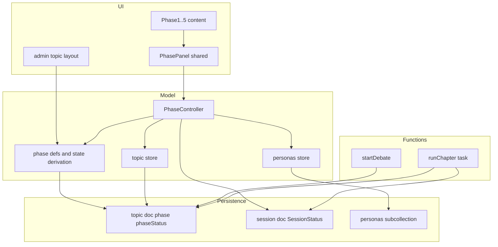
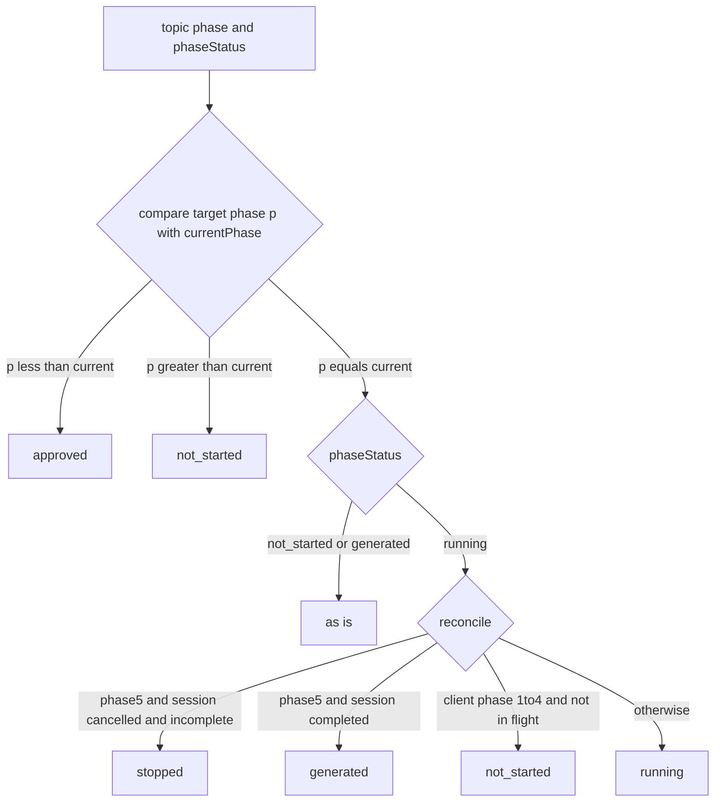
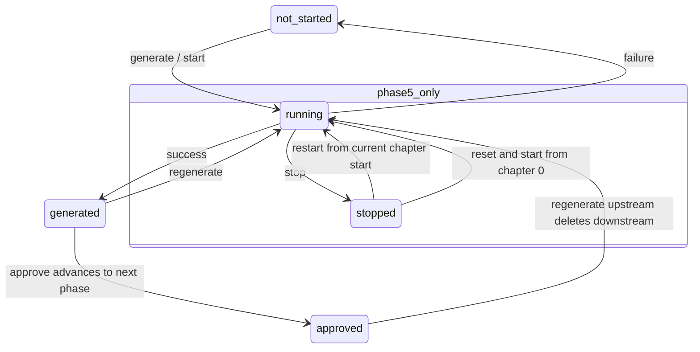
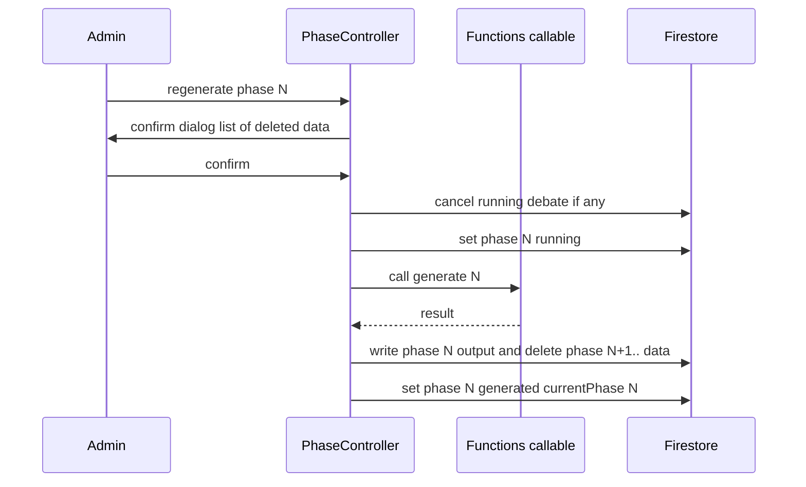
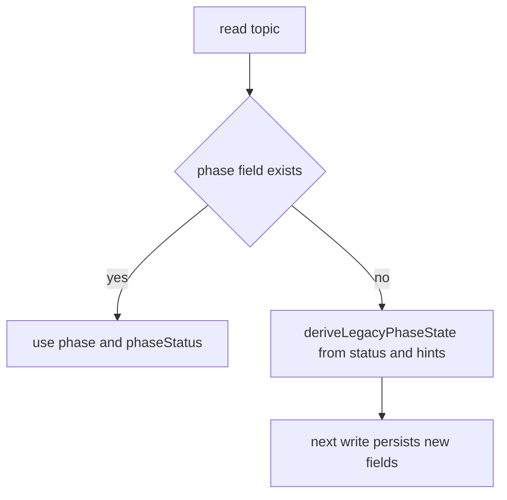

# Technical Design: phase-workflow-consistency

## Overview

本機能は、管理画面の討論生成フロー（フェーズ1: ステークホルダー調査 → 2: ペルソナ生成 → 3: 取材 → 4: 章立て → 5: 討論）における共通操作（生成・承認・再生成）の振る舞い・状態管理・UI表示・データ破棄ルールを統一する。現状はフェーズごとに状態の真実の源が異なり（ローカルフラグ／subcollection有無／`session.status`）、トピックステータスもフェーズと状態を混線して表現しているため、操作の予測可能性と保守性が低い。

本設計は、トピックの進行状況を **「現在のフェーズ（`phase`）」と「そのフェーズの状態（`phaseStatus`）」の直交2軸**で永続化し、全フェーズ共通の導出規則・操作ロジック・共有UIに集約する。これにより、永続データだけからフェーズ進行を一意に判定でき、フェーズ追加・変更時の一貫性を保証する。

**Users**: 管理者が討論コンテンツを生成する際、どのフェーズでも同一の操作感（生成→承認→次フェーズ、必要に応じ再生成）で作業できる。

**Impact**: トピックの永続ステータス表現を `status: DebateStatus`（単一混線enum）から `phase` + `phaseStatus`（直交2軸）へ置き換え、各フェーズコンポーネントの個別状態判定ロジックを共有レイヤーへ移行する。

### Goals
- フェーズ進行を `(phase, phaseStatus)` の2軸で永続化し、単一の導出規則で4論理状態（`not_started`/`running`/`generated`/`approved`）を提供する。
- 生成・承認・再生成の操作ロジックとUIを共有化し、全フェーズで一貫させる。
- 再生成時に「該当フェーズ以降の生成済みデータ削除」を統一規則で保証する。
- 到達不能・混線したステータス値を排除する。

### Non-Goals
- 各フェーズのAI生成ロジック（プロンプト・生成品質）の変更。
- 公開ページ（閲覧側）の表示・データ契約の変更。
- 新フェーズの追加。
- **討論の公開（publish）**: 今回スコープ外（一旦無視）。フェーズ5の `generated` に forward（公開）ボタンは置かない。将来 `ForwardAction.kind` 拡張で追加可能な余地のみ残す。

## Boundary Commitments

### This Spec Owns
- トピックの進行状況表現 `(phase, phaseStatus)` の定義と、全フェーズ共通の状態導出規則（`stopped` 含む）。
- 共通操作（生成・承認・再生成）＋フェーズ5固有の停止(stop)/再開(restart)のモデル層ロジックと共有UIコンポーネント。
- 再生成時の下流データ破棄ルールとタイミングの統一。
- フェーズ進行に伴う `(phase, phaseStatus)` 遷移（client / Functions 双方の書き込み点）と `restartDebate` の新設。

### Out of Boundary
- AI生成パイプラインの内部処理（`pipeline/`・`agents/`）。
- 討論の**公開（publish）**操作（今回スコープ外）と公開閲覧 UI・その DTO（`PublishedDebateDetail` 等）。
- 取材の per-persona 実行詳細・討論の章ごとタスク実行（既存挙動を維持し、状態確定点と再開起点のみ調整）。

### Allowed Dependencies
- `@14ch/svelte-ui` の `Button` / `ConfirmDialog`（標準UI）。
- Firebase Firestore Client SDK（`src/lib/stores/`）、Firebase Functions callable。
- 既存の `phase.ts`（`PHASE_DEFS`/`phasePath`）。

### Revalidation Triggers
- `(phase, phaseStatus)` のフィールド名・値集合の変更。
- 状態遷移の権威レイヤー（client / Functions）の変更。
- `SessionStatus`（session.status の値集合）の変更。
- 共有 `PhaseController` / `PhasePanel` の契約変更。

## Architecture

### Existing Architecture Analysis
- フェーズ判定は [src/lib/utils/phase.ts](../../../src/lib/utils/phase.ts) の `STATUS_PHASE_MAP` に集約済み（`statusToPhase`）。本設計はこれを `topic.phase` の直接参照＋状態導出に置き換える。
- トピックステータスは client と Functions の両方が書き込む。フェーズ1〜4はクライアントが callable を await して結果を書き込むため client が権威。フェーズ5（討論）は Cloud Tasks で非同期実行され、Functions が完了を確定するため Functions が権威。
- 各 `PhaseNxxx.svelte` が重複して持つ「生成中/エラー表示・アクションバー・確認ダイアログ」を共有コンポーネントへ集約する。

### Architecture Pattern & Boundary Map



**Architecture Integration**:
- Selected pattern: 直交2軸ステータス + 設定駆動の共有コントローラ/パネル（研究 Option B）。
- Domain/feature boundaries: 状態の永続表現と導出は Model 層（`phase.ts` + `PhaseController`）に一元化。UI は表示のみ。フェーズ固有のコンテンツは snippet 注入で分離。
- Existing patterns preserved: `PHASE_DEFS`/`phasePath`、Svelte 5 runes ストア、Functions callable、`@14ch/svelte-ui`。
- New components rationale: `PhaseController`（共通操作と状態導出の単一窓口）、`PhasePanel`（共通UIの単一実装）。
- Steering compliance: 型は `src/lib/models` に配置（フロント）、`any` 不使用、UIは標準ライブラリ優先。

### Dependency Direction
`types (phase.ts) → stores (topic/personas/session) → PhaseController → PhasePanel → Phase content components → route layout`。各層は左の層のみ import する。Functions 側は `functions/src/types` → `repository` → `api/pipeline` の既存方向を維持。

### Technology Stack

| Layer | Choice / Version | Role in Feature | Notes |
|-------|------------------|-----------------|-------|
| Frontend | SvelteKit 2.x / Svelte 5 runes | 共有 PhasePanel・PhaseController・状態導出 | 既存構成を踏襲 |
| Frontend UI | `@14ch/svelte-ui` | Button / ConfirmDialog | 標準UI、新規UIライブラリ追加なし |
| Backend | Firebase Functions v2 | 討論フェーズの状態確定（startDebate / runChapter） | `updateTopicStatus` を `updateTopicPhase` へ置換 |
| Data | Firestore | `topic.phase` / `topic.phaseStatus` / `session.status` | 新フィールド2つ追加、`status` 廃止 |

新規依存ライブラリなし。

## File Structure Plan

### Modified Files
- [src/lib/models/topic/topic.types.ts](../../../src/lib/models/topic/topic.types.ts) — `DebateStatus` を廃し、`Phase`参照と `PhaseStatus`、`TopicDoc` に `phase`/`phaseStatus` を追加。`TopicSummary` も更新。
- [src/lib/utils/phase.ts](../../../src/lib/utils/phase.ts) — `STATUS_PHASE_MAP`/`statusToPhase` を削除し、`PhaseStatus`・`PhaseLogicalState`（`stopped`含む）・`phaseLogicalState()`・`deriveLegacyPhaseState()`・`phaseDisplayLabel()` を追加。`PHASE_DEFS` を `PhaseDef`（`generateLabel`/`forwardAction`/`regenerateLabel`/`regenerateConfirm`/`stoppable`/`restartable`）へ拡張。
- [src/lib/models/topic/topic.svelte.ts](../../../src/lib/models/topic/topic.svelte.ts) — 各操作で `phase`/`phaseStatus` を書く。下流破棄の順序・規則を統一。`phase`/`phaseStatus` getter を追加。
- [src/lib/stores/topics.svelte.ts](../../../src/lib/stores/topics.svelte.ts) — トピック作成時の `status: 'pending'` を `phase: 1, phaseStatus: 'not_started'` の明示初期化に置換（新規データを互換導出に頼らせない）。
- [src/lib/stores/personas.svelte.ts](../../../src/lib/stores/personas.svelte.ts) — `approvePersonas`/`resetPersonas` を新フィールド書き込みへ更新。取材の集約完了で `(3, generated)` を書く（per-persona進捗は非永続）。
- Phase1〜5 コンポーネント（`src/lib/features/admin/**/Phase*.svelte`） — 個別状態判定・アクションバー・エラー表示を撤去し `PhasePanel` + `PhaseController` に委譲。固有コンテンツ（取材一覧/リトライ・討論ターン表示）のみ残す。
- [src/lib/features/admin/topic-list/TopicListPage.svelte](../../../src/lib/features/admin/topic-list/TopicListPage.svelte) — `statusLabel: Record<DebateStatus,…>` と `status-{status}` クラスを `phaseDisplayLabel((phase,phaseStatus))` 由来のラベル/`styleKey` に置換。
- [src/routes/admin/topics/[topicId]/+layout.svelte](../../../src/routes/admin/topics/%5BtopicId%5D/+layout.svelte), [+page.svelte](../../../src/routes/admin/topics/%5BtopicId%5D/+page.svelte) — `statusToPhase(status)` を `topic.phase`（互換導出経由）に置換。**互換導出に必要なストアの `isLoaded` 完了までリダイレクトを保留**（誤遷移防止, 1.6）。
- [src/lib/models/session/session.types.ts](../../../src/lib/models/session/session.types.ts) — `SessionDoc.status` を新 `SessionStatus` 型に変更。
- [functions/src/types/index.ts](../../../functions/src/types/index.ts) — `DebateStatus` を `SessionStatus`（session専用）に整理し、topic は `phase`/`phaseStatus` を持つ型へ。
- [functions/src/api/debates.ts](../../../functions/src/api/debates.ts) — `generateChapters` の topic status 書き込みを撤去（client権威）、`startDebate` を `(5, running)` 設定へ、**`restartDebate`（resume）を新設**。
- [functions/src/pipeline/debate-orchestrator.ts](../../../functions/src/pipeline/debate-orchestrator.ts) — 討論完了の `updateTopicStatus('completed')` を `(5, generated)` へ。
- [functions/src/db/repository.ts](../../../functions/src/db/repository.ts) — `updateTopicPhase(topicId, phase, phaseStatus)` を追加。

### New Files
- `src/lib/models/topic/phaseController.svelte.ts` — `PhaseController` 実装（状態導出 + 共通操作 generate/approve/regenerate + フェーズ5の stop/restart + 一時エラー）。
- `src/lib/sharedComponents/PhasePanel.svelte` — 共通UI（タイトル・状態表示・状態×ボタンマトリクス描画・再生成ダイアログ + content snippet）。

## System Flows

### フェーズ状態の導出（永続3状態 → 表示5状態）



- **discussion(フェーズ5)の再調整**: `phaseStatus='running'` でも session が `cancelled` かつ **未完了**（`session.status !== 'completed'`、すなわち最終章未到達）なら **`stopped`**、`completed` なら `generated` に再調整（req 7-6）。
- **クライアント権威フェーズ(1〜4)の中断再調整**: `running` でもセッション内の実行中フラグ（`clientPhaseInFlight`）が無ければ、ブラウザ離脱で残った `running` とみなし `not_started` に再調整して生成ボタンを再表示（req 2-3, 7-6）。

### 共通操作の遷移



承認は「現在フェーズを次フェーズへ進め `not_started` にする」操作（最終フェーズ＝フェーズ5は承認なし）。失敗時は永続状態を変えず一時エラーのみ提示する。**フェーズ5のみ** `stop`（→stopped）/`restart`（resume）/reset+start（章0から）を持つ（下記マトリクス参照）。

### 状態 × ボタン表示マトリクス

`PhasePanel` は `logicalState` と `PhaseDef` のみでボタンを決定する（フェーズ固有の分岐を持たない）。

| logicalState | フェーズ1〜4 | フェーズ5（討論） |
|---|---|---|
| `not_started` | [生成]（filled, `generateLabel`） | [討論を開始する]（filled） |
| `running` | 進行中インジケータ（アクション抑止） | 進行中インジケータ ＋ [討論を停止する]（outlined, `stoppable`） |
| `stopped` | （発生しない） | [討論を再開する]（filled, `restartable`）＋ [最初からやり直す]（outlined, regenerate） |
| `generated` | [承認する]（filled, `forwardAction`）＋ [再生成]（outlined） | [討論を再生成する]（outlined）※forward なし |
| `approved`（過去フェーズ閲覧） | [再生成]（outlined）のみ | [討論を再生成する]（outlined）のみ |
| `error`（一時オーバーレイ） | 停止表示 ＋ 当該 logicalState のボタン | 同左 |

- 描画規則: `forwardAction` 未定義（フェーズ5）なら `generated` で forward ボタンを出さない。`stoppable`/`restartable` が無いフェーズ（1〜4）は stop/restart を出さない。
- 再生成は `stopped`/`generated`/`approved` で表示（過去フェーズに戻って再作成→以降削除、req 4）。フェーズ5の `stopped`/`generated` では reset+start（章0からやり直し）として機能し、確認ダイアログを伴う。
- restart は**現在章の頭から再開**（章途中のターンは破棄）。章単位なので失う範囲が限定的で、確認ダイアログは省略可とする。

### 再生成（フェーズN以降の削除）



クライアント権威フェーズ（1〜4）は「生成成功を前提に下流を削除」する統一規則。ステータスのみ戻して生成済みデータが残る状態を作らない（req 4-3）。

## Requirements Traceability

| Requirement | Summary | Components | Interfaces | Flows |
|-------------|---------|------------|------------|-------|
| 1.1, 1.2 | (phase, phaseStatus) + 4論理状態 | phase.ts | `PhaseStatus`, `phaseLogicalState` | 状態導出 |
| 1.3 | 前=approved/後=not_started 導出 | phase.ts | `phaseLogicalState` | 状態導出 |
| 1.4 | error は非永続の一時表示 | PhaseController | `error`, `clearError` | 共通操作 |
| 1.5 | running 中はアクション抑止 | PhasePanel | アクションバー描画規則 | 共通操作 |
| 1.6 | リロード復元・error クリア | PhaseController, layout | `logicalState` | 状態導出 |
| 2.1–2.3 | 生成の running→generated と失敗時挙動 | PhaseController | `runGenerate` | 共通操作 |
| 2.4 | 生成開始で当該フェーズ running 永続化 | topic store, Functions | `updateTopicPhase` | 共通操作 |
| 2.5 | not_started は生成のみ提示 | PhasePanel | アクションバー描画規則 | — |
| 3.1–3.4 | 承認の文言/遷移/エラー | PhaseController, PhasePanel | `runApprove` | 共通操作 |
| 4.1–4.6 | 再生成確認・下流削除・再調整 | PhaseController, topic store | `runRegenerate` | 再生成 |
| 5.1–5.3 | 進行中/エラー表示統一 | PhasePanel | `PhasePanelProps` | — |
| 6.1–6.4 | 文言/配置/ダイアログ/共有化 | PhasePanel, phase.ts | `PhaseDef`拡張 | — |
| 7.1–7.6 | 永続2軸・一意判定・遷移網羅・再調整 | phase.ts, stores, Functions | `phaseLogicalState`, `updateTopicPhase` | 状態導出, 全遷移 |

## Components and Interfaces

| Component | Domain/Layer | Intent | Req Coverage | Key Dependencies (P0/P1) | Contracts |
|-----------|--------------|--------|--------------|--------------------------|-----------|
| phase.ts (拡張) | Types/Utils | フェーズ定義・状態導出・互換移行 | 1, 6, 7 | topic.types (P0) | State |
| PhaseController | Model | 共通操作と状態の単一窓口 | 1,2,3,4,5 | topic/personas/session stores (P0), phase.ts (P0) | Service, State |
| PhasePanel | UI | 共通UI（状態表示・アクション・ダイアログ） | 1,2,3,5,6 | PhaseController (P0), svelte-ui (P0) | State |
| topic store (改修) | Model | (phase,phaseStatus) 書き込みと破棄規則 | 2,3,4,7 | Firestore (P0) | Service |
| Functions phase書込 | Backend | 討論フェーズの状態確定 | 2,7 | repository (P0) | Service |

### Types / Utils

#### phase.ts（拡張）

| Field | Detail |
|-------|--------|
| Intent | フェーズ定義・永続状態の型・表示状態の導出・旧データ互換 |
| Requirements | 1.1, 1.2, 1.3, 1.6, 6.1, 7.1, 7.2 |

**Contracts**: State [x]

```typescript
export type Phase = 1 | 2 | 3 | 4 | 5;

// 永続する状態（approved/stopped は永続しない）
export type PhaseStatus = 'not_started' | 'running' | 'generated';

// 表示用の論理状態（approved は導出、stopped はフェーズ5のみ）
export type PhaseLogicalState =
  | 'not_started'
  | 'running'
  | 'stopped'      // フェーズ5のみ: 討論を停止し partial turns が残る状態
  | 'generated'
  | 'approved';

// generated 状態での主操作。現状は承認のみ（publish は今回スコープ外・将来拡張で kind 追加余地）
export type ForwardAction = { kind: 'approve'; label: string };

export interface PhaseDef {
  phase: Phase;
  slug: PhaseSlug;
  label: string;
  generateLabel: string;            // not_started ボタン文言（例「調査を開始する」「討論を開始する」）
  forwardAction?: ForwardAction;    // generated の主操作。フェーズ5は未定義（承認なし・公開はスコープ外）
  regenerateLabel: string;          // 再生成（フェーズ5では「最初からやり直す」= reset+start）
  regenerateConfirm: { title: string; description: string; submitLabel: string };
  stoppable?: boolean;              // running 中に停止可（フェーズ5のみ true）
  restartable?: boolean;            // stopped から再開(resume)可（フェーズ5のみ true）
}

// (phase, phaseStatus) と対象フェーズ p、(フェーズ5のみ) session 終端情報から表示状態を導出
export const phaseLogicalState = (
  current: { phase: Phase; phaseStatus: PhaseStatus },
  target: Phase,
  hints?: { sessionStatus?: SessionStatus; debateComplete?: boolean; clientPhaseInFlight?: boolean }
): PhaseLogicalState => {
  /*
   * p < current.phase                                    → approved
   * p > current.phase                                    → not_started
   * p == current.phase:
   *   - phaseStatus==='running' (フェーズ5) かつ session cancelled かつ 未完了 → stopped
   *   - phaseStatus==='running' (クライアント権威 1..4) かつ inFlight でない    → not_started（中断再調整, 7.6）
   *   - それ以外                                          → phaseStatus そのまま
   */
};

// 旧 status を持つ既存トピックの遅延移行
export const deriveLegacyPhaseState = (
  legacyStatus: string,
  hints?: { hasStakeholders: boolean; stakeholdersApproved: boolean; hasPersonas: boolean; allInterviewsDone: boolean; hasChapters: boolean; sessionStatus?: SessionStatus }
): { phase: Phase; phaseStatus: PhaseStatus };

// ダッシュボード一覧などのバッジ表示用ラベル/スタイルキーを (phase, phaseStatus) から導出
export const phaseDisplayLabel = (
  current: { phase: Phase; phaseStatus: PhaseStatus }
): { label: string; styleKey: string };
```
- Preconditions: `current.phase` は 1..5。
- Postconditions: 返る `PhaseLogicalState` は対象フェーズの一意な表示状態。`stopped` は target===5 のときのみ返る。
- Invariants: 同一入力から常に同一状態（純粋関数）。`hints` 省略時はフェーズ5の `stopped` 判定とクライアント権威の中断再調整を行わない（保守的に phaseStatus を返す）。

**Implementation Notes**
- Integration: `+layout.svelte`/`+page.svelte` は `statusToPhase` を `current.phase` 参照に置換。`current` は `topic.phase`/`phaseStatus`、未定義時は `deriveLegacyPhaseState` 経由。
- Validation: `phase` 範囲外・未知 `phaseStatus` は型で排除。
- Risks: 互換導出は subcollection ヒントを要する場合がある（読み取り時に最小限取得）。

### Model

#### PhaseController

| Field | Detail |
|-------|--------|
| Intent | 1フェーズ分の論理状態・共通操作・一時エラーを提供する単一窓口 |
| Requirements | 1.4, 1.5, 1.6, 2.1, 2.2, 2.3, 3.1, 3.2, 3.3, 3.4, 4.1, 4.2, 4.5, 4.6, 5.1, 5.2 |

**Responsibilities & Constraints**
- 対象フェーズの `logicalState` を `topic.(phase, phaseStatus)` ＋（フェーズ5のみ）session 終端から導出（再調整含む）。
- 共通操作 `runGenerate`/`runApprove`/`runRegenerate` と、フェーズ5固有の `runStop`/`runRestart` を提供。`forwardAction`/`stoppable`/`restartable` を持たないフェーズでは対応操作を提供しない（`PhaseDef` 駆動）。
- 成功・失敗で状態と一時エラーを更新。失敗時は永続状態を変更しない。
- **役割境界**: コントローラは「集約状態の導出と `(phase, phaseStatus)` 書き込み・下流削除」のみを所有。フェーズ固有のコンテンツ・補助操作（フェーズ3の per-persona 実行/進捗/リトライ、討論ターン表示）は各フェーズの content snippet が所有する。
- `error` は非永続（`$state`）。リロードで消える。

**Dependencies**
- Outbound: topic store — `(phase, phaseStatus)` 書き込み・破棄（P0）
- Outbound: personas store — ペルソナ生成・承認・取材（P0）
- Outbound: session store — 討論セッション状態参照（P1）
- Inbound: PhasePanel（P0）

**Contracts**: Service [x] / State [x]

##### Service Interface
```typescript
export interface PhaseController {
  readonly phase: Phase;
  readonly logicalState: PhaseLogicalState; // 派生
  readonly inFlight: boolean;               // 当該セッションでの実行中（スピナー用）
  readonly error: string | null;            // 非永続の一時エラー
  runGenerate(): Promise<void>;             // not_started → running → generated（フェーズ5は start）
  runApprove(): Promise<void>;              // forwardAction=approve のフェーズのみ。成功で次フェーズへ goto
  runRegenerate(): Promise<void>;           // 下流削除を伴う再生成（フェーズ5は章0からの reset+start）
  runStop?(): Promise<void>;                // stoppable のフェーズのみ: running → stopped
  runRestart?(): Promise<void>;             // restartable のフェーズのみ: stopped → running（現在章の頭から再開）
  clearError(): void;
}

export const createPhaseController = (phase: Phase): PhaseController;
```
- Preconditions: `currentTopicStore.topic` が存在。
- Postconditions: `runGenerate` 成功で当該フェーズ `generated`（フェーズ5は Functions が `generated` を確定）、失敗で元状態維持＋`error`。`runApprove` 成功で `phase` が次へ進み画面遷移。`runRegenerate` 成功で当該フェーズ `generated`＋下流データ削除。`runStop` で `stopped`、`runRestart` で `running`（resume）。
- Invariants: `logicalState==='running'` の間は stop 以外の操作を受け付けない（PhasePanel 抑止 + コントローラガード）。`runApprove`/`runStop`/`runRestart` は `PhaseDef` に対応設定が無ければ未定義（呼び出し不能）。

**Implementation Notes**
- Integration: フェーズ固有の生成・承認・再生成は既存の `topic.svelte.ts`/`personas.svelte.ts` メソッドへ委譲（薄いアダプタ）。
- フェーズ3（取材, 集約）: `runGenerate` は全ペルソナの取材を FE 並列実行し、**per-persona の進捗・エラーは永続化せず** FE で管理。全件完了を検知した時点で `phaseStatus='generated'` を1回書く。per-persona のリトライは content snippet 側の責務。リロード時は取材記録の有無から未完了分を再構築できる。
- フェーズ4（章立て）: `generateChapters` callable を **同期 await**（client 権威）し、解決後に `(4, generated)` を書く。
- フェーズ5（討論, 非同期）: `runGenerate`=startDebate はタスクをenqueueして即return。`running` は Functions が設定し `generated` も Functions が確定（client は待たない）。`runStop` は session を `cancelled` にして停止、`runRestart` は Functions `restartDebate`（現在章の途中ターンを破棄して章頭から再実行する専用処理）を呼ぶ。
- Validation: 再生成（reset+start 含む）は確認ダイアログ確定後のみ実行（PhasePanel 制御）。restart は確認不要。

#### topic store（改修）

| Field | Detail |
|-------|--------|
| Intent | `(phase, phaseStatus)` の書き込みと、再生成時の下流削除を統一規則で実行 |
| Requirements | 2.4, 3.2, 4.2, 4.3, 4.4, 4.5, 7.4 |

**Contracts**: Service [x]

```typescript
// 例（抜粋）: 各操作は (phase, phaseStatus) を明示更新する
approveStakeholders(): Promise<void>;   // → (2, not_started)
generatePersonas(): Promise<void>;      // (2, running) → 成功で (2, generated)、失敗で (2, not_started)
approveInterviews(): Promise<void>;     // → (4, not_started)
regeneratePhase(phase: Phase): Promise<void>; // phase以降の生成済みデータ削除 + (phase, generated)
get phase(): Phase;
get phaseStatus(): PhaseStatus;
```
- Postconditions: 生成系は成功時のみ下流削除を実行し、ステータスのみ戻して生成済みデータが残る状態を作らない。進行中討論があれば削除前に cancel。
- Invariants: 下流削除と `(phase, phaseStatus)` 更新は同一バッチ/連続処理で整合させる。

**Implementation Notes**
- Integration: 既存 `generateStakeholders`/`generatePersonas`/`generateChapters`/`clearDebateSession`/`regenerateDebate` を統一規則（生成成功→下流削除）へ揃える。`generatePersonas` の「生成後クリア」、`generateStakeholders` の「生成前クリア」を**生成成功後削除**に統一。
- Risks: フェーズ4の章立て生成は Functions callable を await（client権威）。`startDebate` のみ Functions 権威。

### Backend (Functions)

#### Functions phase 書き込み

| Field | Detail |
|-------|--------|
| Intent | 討論フェーズの running/generated を権威的に確定 |
| Requirements | 2.4, 7.4, 7.6 |

**Contracts**: Service [x]

```typescript
// repository.ts
export const updateTopicPhase = (
  topicId: string, phase: number, phaseStatus: 'not_started' | 'running' | 'generated'
): Promise<void>;

// debates.ts — 現在章の頭から再開（章単位 restart）。章途中の状態を破棄して当該章を再実行
export const restartDebate: CallableFunction; // (topicId) => { topicId }
```
- `startDebate`: `updateTopicPhase(topicId, 5, 'running')` ＋ session `'debating'` ＋ `runChapter(0)` enqueue。
- `restartDebate`（新規, **章単位再開の専用処理**）: 単純な `runChapter` 再投入ではなく、以下を行う:
  1. 再開対象章 = `session.currentChapterIndex`（停止時に進行中だった章）。
  2. **当該章の途中ターンを破棄**: `turns` のうち `chapterIndex === currentChapterIndex` を削除し、その削除ターンに起因する派生変化（`triggeredByTurnId` が一致する信念バージョン、当該ターンのエンゲージメント）も巻き戻す。完了済み章（`chapterIndex < currentChapterIndex`）は保持。
  3. session を `'debating'`、`updateTopicPhase(topicId, 5, 'running')`。
  4. クリーン化した `runChapter(currentChapterIndex)` を enqueue（章頭から再実行）。
- 最終 `runChapter` 完了: `updateTopicPhase(topicId, 5, 'generated')` ＋ session `'completed'`。
- 停止（client `runStop`）: session を `'cancelled'` に更新（orchestrator が次章を停止）。topic は `(5, running)` のままとし、表示は導出で `stopped` 化。
- `generateChapters`: topic の状態書き込みを撤去（client が章立て callable 解決後に `(4, generated)` を書く）。session 作成は維持。

**Implementation Notes**
- Integration: `updateTopicStatus` の topic向け呼び出しを `updateTopicPhase` に置換。session 向け `updateDebateSessionStatus` は維持。
- 再開粒度は**章単位**に固定（ターン単位の resume は今回スコープ外＝優先度低）。これにより `executeChapterTask` 再入時のターン追記による重複・不整合を回避する。
- Risks: デプロイ必須（本番直結）。新旧フィールド併存期間は client の互換導出が吸収。

### UI

#### PhasePanel（共有）

| Field | Detail |
|-------|--------|
| Intent | 全フェーズ共通のタイトル・状態表示・アクションバー・再生成ダイアログを描画 |
| Requirements | 1.5, 2.5, 3.1, 5.1, 5.2, 5.3, 6.1, 6.2, 6.3, 6.4 |

**Contracts**: State [x]

```typescript
import type { Snippet } from 'svelte';
interface PhasePanelProps {
  controller: PhaseController;
  title: string;
  generateHint?: string;
  content: Snippet;          // フェーズ固有の一覧表示（取材一覧・討論ターン等）
  progress?: Snippet;        // 進捗併記（件数・章番号など）
}
```
- ボタン描画は前掲「状態 × ボタン表示マトリクス」に従い、`logicalState` ＋ `PhaseDef`（`forwardAction`/`stoppable`/`restartable`）だけで決定する（フェーズ固有の if 分岐を持たない）。
  - `not_started` → [生成]（`generateLabel`, filled）。
  - `running` → 統一インジケータ。`stoppable` なら [停止]（outlined）のみ許可、その他抑止。
  - `stopped` → [再開]（`restartable`, filled）＋ [最初からやり直す]（regenerate, outlined, `ConfirmDialog`）。
  - `generated` → `forwardAction` があれば [承認する]（filled）、無ければ無し。＋ [再生成]（outlined, `ConfirmDialog`）。
  - `approved` → [再生成]（outlined）のみ。
  - `error`（`controller.error`）→ 統一スタイルの停止表示＋当該状態のボタン。
- バリアント: 主要前進操作（生成/承認/再開）は filled、再生成/停止は outlined。配置順は前進→再生成で統一。

**Implementation Notes**
- Integration: 各 `PhaseNxxx.svelte` は `content`（と必要に応じ `progress`）snippet を渡すだけ。エラー・実行中・全アクション・確認ダイアログの重複実装を撤去。停止/再開/承認ボタンは PhasePanel が `PhaseDef` から描画するため、フェーズ側に固有アクション snippet は不要。
- Validation: 再生成/reset+start は `ConfirmDialog` 確定後のみ `controller.runRegenerate()`。restart は確認なしで `controller.runRestart()`。
- Risks: フェーズ3の per-persona リトライ・フェーズ5の討論ターン表示は `content` 内に閉じる（コントローラの共通トリアドは崩さない）。

## Data Models

### Logical Data Model

**topic ドキュメント（変更）**
- 追加: `phase: number`（1-5）、`phaseStatus: 'not_started' | 'running' | 'generated'`。
- 削除（新規書き込み停止）: `status: DebateStatus`。読み取り時のみ旧データ互換で参照。
- 既存維持: `stakeholders`（生成データとして保持、ただしフェーズ判定には使わない）、`publishedAt?`（既存フィールドは維持。ただし公開操作は今回スコープ外でワークフロー判定には使わない）。

**フェーズ3（取材）の状態の持ち方**
- per-persona の進捗（`in_progress`/`error`）は **永続化しない**（FE のセッション内一時状態）。
- per-persona の成果（`interview` レコード・初期信念 `beliefs`）は生成データとして永続。
- フェーズ3の集約状態は `topic.phaseStatus`（FE が全件完了時に `generated` を1回書く）で表す。完了判定はリロード時に取材レコードの有無からも再構築可能。

**session ドキュメント（変更）**
- `status` の型を `DebateStatus` から `SessionStatus`（`'chapters_ready' | 'debating' | 'completed' | 'cancelled' | 'error'`）に変更。値の実体は現状踏襲。
- フェーズ5の `stopped` 表示は永続フィールドを増やさず、`topic.phaseStatus==='running'` ＋ `session.status==='cancelled'`（かつ未完了）から導出する。

**Consistency & Integrity**
- フェーズ1〜4: client が callable 成功後に `(phase, phaseStatus)` と下流削除を整合更新。中断で残った `running` は導出時に `not_started` へ再調整。
- フェーズ5: Functions が `(5, running)`→`(5, generated)` を確定。停止は session `cancelled`、再開は `restartDebate` で `running` へ。client は導出で session 終端と突き合わせ `stopped`/`generated` を判定。
- 公開: `phaseStatus` は `generated` のまま `publishedAt` を設定。

### Migration Strategy



- 遅延移行（lazy compat）: `topic.phase` 未定義の既存データは読み取り時に `deriveLegacyPhaseState` で導出。以降の任意の書き込みで新フィールドが永続化される。
- 移行スクリプト不要。新旧フィールド併存を許容し、全データが新フィールドを持てば互換関数を削除可能。
- **リダイレクト保留**: `+layout`/`+page` のフェーズ判定が互換導出（personas/session のヒントを要する場合あり）に依存するため、必要なストアの `isLoaded` が完了するまでリダイレクト判定を保留する。明示 `phase` を持つ新規データはヒント不要で即時判定。これにより、閲覧中ページからの誤リダイレクト（req 1.6）を防ぐ。

## Error Handling

### Error Strategy
- 操作失敗（生成・承認・再生成・停止・再開）は例外を捕捉し、`PhaseController.error`（非永続）に統一文言で格納。永続 `(phase, phaseStatus)` は変更しない（req 2.3, 3.4）。
- 生成中にクライアントが離脱し `running` が残った場合: フェーズ1〜4は出力が未書き込みのため、読み取り時 `running` でも生成ボタン（再実行）を許容する再調整（→`not_started`）を行う。フェーズ5は session 終端を見て、`cancelled`→`stopped`（再開可能）/`completed`→`generated` に再調整（req 7.6）。

### Error Categories and Responses
- **User Errors**: 不正遷移（running 中の操作）→ UIで抑止。
- **System Errors**: callable タイムアウト/失敗 → `error` 表示＋再試行可能。
- **Business Logic Errors**: 下流削除中の整合崩れ → 削除と状態更新を連続処理で整合。

### Monitoring
- 既存の Functions ログ（discussion/chapter 実行）を維持。クライアントエラーは UI 表示に留める（本ツールは管理用・小規模）。

## Testing Strategy

### Unit Tests
- `phaseLogicalState`: `(phase, phaseStatus)` × 対象フェーズ p の全分岐（approved/not_started/running/generated）＋フェーズ5の `stopped` 導出（running＋session cancelled）＋クライアント権威の中断再調整（running＋not inFlight→not_started）。
- `deriveLegacyPhaseState`: 旧 `DebateStatus` 各値＋ヒントから正しい `(phase, phaseStatus)` を導出。
- `phaseDisplayLabel`: `(phase, phaseStatus)` から一覧バッジの label/styleKey を導出（旧 `statusLabel` 相当を網羅）。
- `PhaseController.runGenerate/runApprove/runRegenerate/runStop/runRestart`: 成功・失敗時の状態遷移・エラー設定・下流削除、`PhaseDef` に設定の無い操作が未定義であること（stores をモック）。
- topic store `regeneratePhase`: フェーズN以降のデータ削除と `(N, generated)` 設定。
- Functions `updateTopicPhase` 呼び出し点（startDebate / restartDebate / runChapter 完了）。

### Integration Tests
- 承認連鎖（フェーズ1→5）で `(phase, phaseStatus)` が欠落なく遷移し、`+layout` の currentPhase が追従する（ストア未ロード中はリダイレクト保留）。
- 再生成（中間フェーズ）で下流データが削除され、下流が `not_started` 表示になる。
- 討論: 開始→停止→再開（現在章の頭から、章途中ターンが破棄される）→完了、および停止→最初からやり直し（reset+start）の双方が成立する。`restartDebate` が当該章のターンと派生変化を巻き戻すこと。
- 討論中断（session cancelled/completed）後のリロードで `stopped`/`generated` の再調整が働く。

### E2E/UI Tests
- 各フェーズで生成→承認→次フェーズの一連操作が統一UIで完了する。
- 再生成確認ダイアログ→削除→再生成完了。
- 討論の停止→再開ボタン表示→再開で続行。
- 生成失敗時に停止表示が出て永続状態が変わらない。

## Security Considerations
- 管理操作は既存の Firebase Auth ガード（`/admin` レイアウト、Functions `requireAuth`）を踏襲。本機能で新たな権限・データ露出は発生しない。
