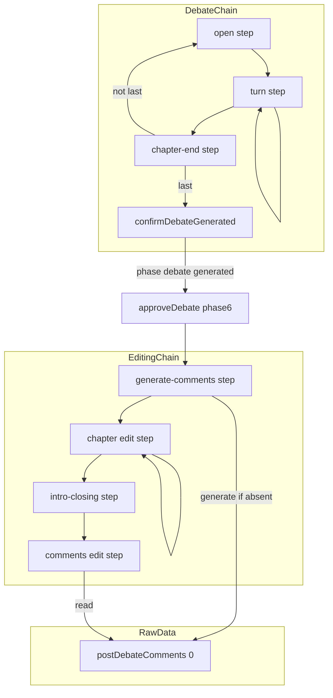
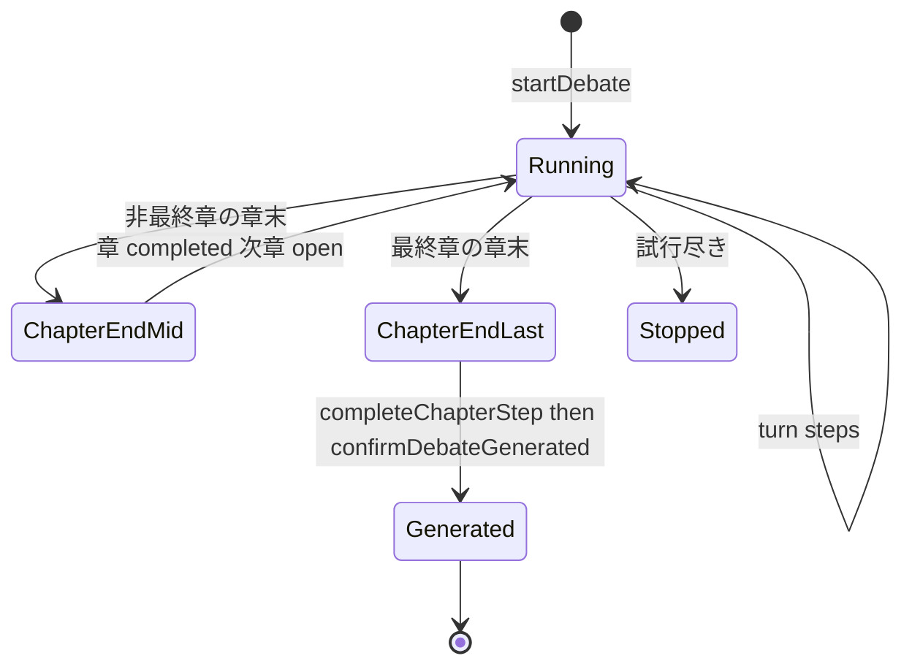
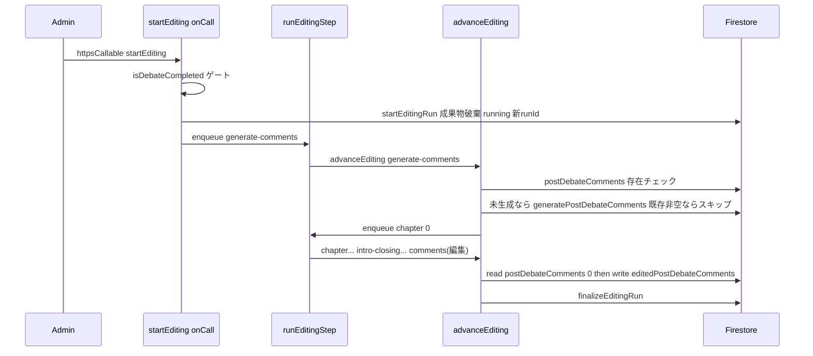

# Technical Design: post-debate-comment-generation-decouple

## Overview

**Purpose**: 討論後コメント（原本 `postDebateComments/0`）の生成を討論ライフサイクルから切り離し、編集工程（Phase 6）の先頭ステージへ移設する。討論の完了（`generated`）をターン生成＋章完了のみで成立させ、コンテンツ生成と討論進行の癒着を解消する。

**Users**: 管理者が討論を確定（Phase 5→6 承認）した後、編集を起動すると「原本コメント生成 → 編集パス」が順次実行される。閲覧向けの成果物生成フローが明確化される。

**Impact**: 討論チェーン末尾 `open → turn → summary|closing → comments` を `open → turn → chapter-end` へ短縮し、`running→generated` 遷移の担い手を最終章 `chapter-end` へ移す。編集チェーンを `generate-comments → chapter → intro-closing → comments(編集)` へ前段拡張する。原本 `postDebateComments/0` のスキーマ・保存パスは不変。

### Goals
- `summary`/`closing` を単一 `chapter-end` stepKind に統合し、名残の命名を排除（R1）。
- 討論の `generated` をターン生成＋章完了のみで確定（R2）。
- 討論後コメント生成を編集工程の先頭ステージへ移設し、生成→編集を順次実行（R3, R4）。
- 原本スキーマと reset/restart の後始末を保全（R5）。

### Non-Goals
- 原本 `postDebateComments/0` のスキーマ・内容・保存パス変更。
- コメント生成ロジック（`generatePostDebateComment` エージェント）およびリライト処理（`editComments` 等）の変更。
- 章立て生成（前フェーズ）・`debate-digest` の `summarizeChapter`（文脈圧縮用）の変更。
- 編集成果物（`editedChapters`/`editedPostDebateComments`）の内容・スキーマ変更。

## Boundary Commitments

### This Spec Owns
- 討論 stepKind チェーン末尾の構造・命名（`summary`/`closing`→`chapter-end` 統合、`comments` 撤去）。
- 討論の `running→generated` 遷移の所在（最終章 `chapter-end`）と、そのための `confirmDebateGenerated` 契約。
- 編集チェーンの先頭ステージ `generate-comments`（原本コメント生成の起動点）とステージ順序。
- `post-debate-comments.ts` の責務再編（生成＋クリアのみ、遷移責務を除去）。

### Out of Boundary
- 編集リライトロジック、原本コメント生成エージェントの中身。
- 討論のターン生成・話者選定・信念・ファクトチェック等（末尾以外）。
- FE 表示コンポーネントの再設計（既存の購読で成立）。

### Allowed Dependencies
- 編集層 → 討論データ読取（`readRawChapters` / `getPersonasByTopicId` / `post-debate-comments` の生成関数）。依存方向は editing → debate（データ）で一方向を維持。
- Cloud Tasks（`runStep` / `runEditingStep`）、Firestore、既存 deterministic task id 基盤。

### Revalidation Triggers
- `StepKind` union の変更（`comments`/`summary`/`closing` を参照する任意のコード・テスト）。
- 討論 `generated` 到達契機の変更（`isDebateCompleted` を前提とする編集開始ゲート）。
- `EditingStepPayload.stepKind` の変更（編集タスク投入の全経路）。
- 原本 `postDebateComments/0` の生成契機変更（FE `postDebateComments` store の表示前提）。

## Architecture

### Existing Architecture Analysis
- **討論**: 「1 ステップ＝1 Cloud Task」チェーン（`runStep` onTaskDispatched, `timeoutSeconds:540`, `maxAttempts:3`）。状態は毎回 Firestore＋`runId` から再構築し冪等。停止ゲート `isDebateActive`（phase debate かつ running）。終端 `comments` のみ frontier を `'comments'` 固定。
- **編集**: 同型チェーン（`runEditingStep`）。`startEditingRun`（成果物破棄＋running＋新 runId）→ `chapter → intro-closing → comments(編集)` → `finalizeEditingRun`。停止ゲート `isEditingActive`。
- **癒着点**: 討論 `running→generated` 遷移が `persistPostDebateComments` 内にのみ存在。

### Architecture Pattern & Boundary Map



**Architecture Integration**:
- Selected pattern: 既存 Cloud Tasks チェーンの再配線（前段追加 Option A）。新規アーキ要素なし。
- Domain/feature boundaries: 討論チェーンは「ターン生成＋章完了」までを所有。原本コメント生成は編集チェーンが所有。原本データ `postDebateComments/0` は生ディベートの一部として `debate/post-debate-comments.ts` が read/write/clear を集約。
- Existing patterns preserved: deterministic task id・runId 世代照合・冪等トランザクション・停止ゲート。
- New components rationale: `generate-comments` stepKind（編集前段）、`confirmDebateGenerated`（遷移の新たな担い手）。
- Dependency direction: `types → lifecycle/config → repository(step 実処理) → orchestrator → api(runtime)`。editing 層は debate データ層に対してのみ依存（下流→上流の逆流なし）。

### Technology Stack

| Layer | Choice / Version | Role in Feature | Notes |
|-------|------------------|-----------------|-------|
| Backend / Services | Firebase Functions v2（onTaskDispatched） | `runStep`（討論）/`runEditingStep`（編集）チェーン | 既存踏襲。新関数なし |
| Data / Storage | Firestore | `topics/{topicId}` phaseStatus、`postDebateComments/0` | スキーマ不変 |
| Messaging / Events | Cloud Tasks | ステップ連鎖・deterministic id | frontier `'comments'` 特別扱いを撤去 |

## File Structure Plan

### Modified Files

**討論側（末尾リストラ）**
- `functions/src/types/step.types.ts` — `StepKind` を `open | turn | chapter-end` に変更（`summary`/`closing`/`comments` 削除）。`NextStep`/`TurnFollowupStep` を `turn | chapter-end` に整理。
- `functions/src/pipeline/debate/debate-orchestrator.ts` — `chapterEndStepKind` 撤去。`decideNextStep` は章末で `chapter-end` を返す。dispatch を `open|turn|chapter-end` に再構成し、`chapter-end` で `completeChapterStep` 後に isLastChapter 分岐（非最終章→次章 open／最終章→`confirmDebateGenerated`）。`comments` ケース削除。
- `functions/src/pipeline/debate/step.ts` — `performCommentsStep` 削除。`completeChapterStep` は維持（doc から summary/closing 記述を除去）。
- `functions/src/pipeline/debate/enqueue-step.ts` — `taskKey` の `frontierIndex: number | 'comments'` を `number` に。`enqueueNextStep` の `'comments'` 分岐削除。
- `functions/src/pipeline/debate/post-debate-comments.ts` — `persistPostDebateComments`（生成＋書込＋遷移）を `generatePostDebateComments`（生成＋書込のみ、引数 `topicId`/`personas`/`turns`）に置換。`clearPostDebateComments` は維持。phase 遷移責務を除去。
- `functions/src/pipeline/debate/debate-lifecycle.ts` — `confirmDebateGenerated(topicId)` を新設。`discardChaptersWithSideData` の `clearPostDebateComments` 呼び出しは維持。

**編集側（前段挿入）**
- `functions/src/pipeline/editing/enqueue-editing-step.ts` — `EditingStepPayload.stepKind` に `generate-comments` を追加。
- `functions/src/pipeline/editing/editing-orchestrator.ts` — `advanceEditing` に `generate-comments` ケース追加（生成後に `chapter,0` を enqueue）。
- `functions/src/pipeline/editing/editing-step.ts`（または新 `generate-comments-step.ts`） — 原本コメント生成ステージ実処理 `runGenerateCommentsStep`（`clearPostDebateComments`→`generatePostDebateComments`）。入力は `readRawChapters` のターンと `getPersonasByTopicId`。
- `functions/src/api/editing.ts` — `startEditing` の初手投入を `stepKind:'chapter'` から `stepKind:'generate-comments'` へ変更。

**テスト**
- `functions/src/tests/pipeline/debate/*`（`decide-next-step` / `enqueue-step` / `debate-step-idempotency` / `debate-parity` 等）を新チェーンへ更新。
- 編集側に `generate-comments` ステージのテスト追加。

## System Flows

### 討論終端の状態遷移（generated の担い手移設）



最終章 `chapter-end` は章を completed 化した後 `confirmDebateGenerated` を呼ぶ。遷移は phase==='debate' かつ running|stopped 限定・前進済みは巻き戻さない冪等トランザクション。コメント生成には一切依存しない（R2.1, R2.2）。

### 編集チェーン（生成→編集の順次実行）



ゲーティング: `startEditing` は `isDebateCompleted`（討論 generated）でのみ起動（R3.6）。コメント編集ステージは前段生成の完了後にのみ到達するため、原本は常に存在する（R4.1, R4.2, R4.5）。

## Requirements Traceability

| Requirement | Summary | Components | Interfaces | Flows |
|-------------|---------|------------|------------|-------|
| 1.1, 1.2, 1.3, 1.4, 1.5 | 章末を単一 `chapter-end` へ統合・改名、発話なし | `step.types`, `debate-orchestrator`, `completeChapterStep` | `StepKind`, dispatch | 討論終端状態遷移 |
| 1.6 | 章完了の冪等 | `completeChapterStep` | — | — |
| 2.1, 2.2 | 最終章章完了で generated、コメント非依存 | `debate-orchestrator`(chapter-end), `confirmDebateGenerated` | `confirmDebateGenerated` | 討論終端状態遷移 |
| 2.3, 2.5 | running/stopped 限定・前進巻き戻さず、runId 世代識別 | `confirmDebateGenerated`, `enqueue-step` | `confirmDebateGenerated`, `taskKey` | — |
| 2.4 | isDebateCompleted はコメント有無に非依存 | `debate-lifecycle` | `isDebateCompleted`(既存) | — |
| 3.1 | コメント生成を討論チェーンから除去 | `debate-orchestrator`, `post-debate-comments` | `StepKind` | — |
| 3.2, 3.3, 3.4, 3.5 | 編集前段でコメント生成（未生成時のみ）、編集パスより前 | `editing-orchestrator`, `generate-comments-step`, `api/editing` | `EditingStepPayload`, `generatePostDebateComments` | 編集チェーン |
| 3.6 | 討論 generated 前は編集起動不可 | `api/editing` | `isDebateCompleted` | 編集チェーン |
| 3.7, 3.8 | 生成の冪等・失敗時 generated 非後退 | `generate-comments-step`, `runEditingStep` | `enqueueEditingStep`(id), `stopEditingRun` | — |
| 4.1, 4.2, 4.5 | コメント編集は原本生成後、完了時点の原本を入力 | `editing-orchestrator`, `runCommentsEditStep` | `advanceEditing` 順序 | 編集チェーン |
| 4.3 | 再実行時に原本があれば再生成せずスキップ | `generate-comments-step`（存在チェック） | `advanceEditing` generate-comments | 編集チェーン |
| 4.4 | restart/reset で原本消去後は再生成 | `debate-lifecycle`, `generate-comments-step` | `discardChaptersWithSideData` | 編集チェーン |
| 5.1 | 原本スキーマ・パス不変 | `post-debate-comments` | `generatePostDebateComments` | — |
| 5.2 | reset/restart で原本消去 | `debate-lifecycle` | `discardChaptersWithSideData` | — |
| 5.3 | 生ディベートと編集成果物の分離維持 | `post-debate-comments`, `edited-repository` | — | — |

## Components and Interfaces

| Component | Domain/Layer | Intent | Req Coverage | Key Dependencies | Contracts |
|-----------|--------------|--------|--------------|------------------|-----------|
| `chapter-end` handler | debate/orchestrator | 章完了＋（最終章）generated 確定 | 1, 2 | `completeChapterStep`(P0), `confirmDebateGenerated`(P0) | Service, Batch |
| `confirmDebateGenerated` | debate/lifecycle | 討論 generated 遷移の単一担い手 | 2 | Firestore(P0) | Service |
| `generatePostDebateComments` | debate/post-debate-comments | 原本コメント生成＋書込（遷移なし） | 3, 5 | `generatePostDebateComment` agent(P0) | Service |
| `generate-comments` step | editing/orchestrator | 編集前段で原本コメントを未生成時のみ生成 | 3, 4 | `generatePostDebateComments`(P0), `readRawChapters`(P1) | Batch |

### Debate

#### chapter-end handler（`debate-orchestrator.ts`）

| Field | Detail |
|-------|--------|
| Intent | 章末で章を completed 化し、最終章なら討論を generated 確定する |
| Requirements | 1.1, 1.2, 1.3, 1.4, 1.6, 2.1, 2.2 |

**Responsibilities & Constraints**
- `completeChapterStep`（章 completed＋論点クリーンアップ、発話生成なし）を実行。
- `ctx.isLastChapter` 分岐: 非最終章→次章 `open` を enqueue／最終章→`confirmDebateGenerated`（enqueue なしで終端）。
- 冪等: 章 completed 再適用・generated 再遷移いずれも安全。

**Dependencies**
- Outbound: `completeChapterStep` — 章完了（P0）／`confirmDebateGenerated` — 終端遷移（P0）／`enqueueNextStep` — 次章 open 投入（P1）。

**Contracts**: Service [x] / Batch [x]

##### Service Interface
```typescript
type StepKind = 'open' | 'turn' | 'chapter-end';

type NextStep =
  | { kind: 'turn'; expectedTurnIndex: number; finalResponse?: boolean }
  | { kind: 'chapter-end'; expectedTurnIndex: number }
  | { kind: 'open'; chapterIndex: number; expectedTurnIndex: 0 };
```
- Preconditions: 停止ゲート `isDebateActive` 通過（phase debate かつ running）。
- Postconditions: 章 `completed`。最終章なら phaseStatus `generated`。
- Invariants: 発話（ターン）を生成しない。

#### confirmDebateGenerated（`debate-lifecycle.ts`）

**Contracts**: Service [x]

##### Service Interface
```typescript
const confirmDebateGenerated: (topicId: string) => Promise<boolean>;
```
- Preconditions: なし（存在しない doc は no-op）。
- Postconditions: phase==='debate' かつ phaseStatus==='running' のとき `generated` に遷移し true。対象外は false。
- Invariants: phase が debate から前進済み（承認等）なら巻き戻さない。冪等トランザクション。

**Implementation Notes**
- Integration: `utils/topic-phase.ts` の `confirmPhaseGenerated` と近い規範だが、**討論は running 限定**にする（`confirmPhaseGenerated` は stopped も許容するが、討論は停止ゲート `isDebateActive` が running 限定で `chapter-end` は running 中しか実行されないため、stopped からの遷移経路は到達不能。許容すると停止済み討論を誤って generated に復活させる余地が残るため running 限定で塞ぐ）。debate は独自ライフサイクル管理のため `debate-lifecycle.ts` に配置し `GeneratePhase` は拡張しない。
- Risks: 遷移の唯一の担い手が移るため、承認導線（`isDebateCompleted`→`approveDebate`）の回帰確認が必須。

#### generatePostDebateComments（`post-debate-comments.ts`）

**Contracts**: Service [x]

##### Service Interface
```typescript
const generatePostDebateComments: (input: {
  topicId: string;
  personas: Persona[];
  turns: DebateTurn[];
}) => Promise<void>;

const clearPostDebateComments: (topicId: string) => Promise<void>;
```
- Postconditions: `postDebateComments/0` を単一 `set()` で原子的に書込（`{ comments: [...] }`）。phaseStatus には触れない。
- Invariants: スキーマ・保存パス不変（`{ id, personaId, content, sortOrder }[]`）。

**Implementation Notes**
- Integration: 討論チェーンからは呼ばれず、編集 `generate-comments` ステージが呼ぶ。`turns` は編集側で `readRawChapters` のターンを平坦化して渡す。
- Validation: 生成失敗ペルソナはスキップ（既存挙動維持）。

### Editing

#### generate-comments step（`editing-orchestrator.ts` ＋ 実処理 `runGenerateCommentsStep`）

| Field | Detail |
|-------|--------|
| Intent | 編集の先頭で原本コメントをクリア＆再生成し、章編集へ連鎖する |
| Requirements | 3.2, 3.3, 3.4, 4.3 |

**Responsibilities & Constraints**
- `isEditingActive`（runId 一致）ゲート後、**原本 `postDebateComments/0` の存在チェック**: 既に非空なら生成をスキップ、未生成（不在または空）なら `generatePostDebateComments` を実行（R4.3, R4.4, R3.4, R3.5）。
- いずれの分岐でも完了後に `enqueueEditingStep({ stepKind:'chapter', chapterIndex:0 })`。
- 冪等: deterministic task id（`runId:generate-comments:-1`）で多重投入を1本へ収束。生成時は原本を単一 `set()` で上書き。スキップ時は原本を変更しない。

**Dependencies**
- Outbound: `generatePostDebateComments`(P0), `readRawChapters`(P1), `getPersonasByTopicId`(P1)。原本存在チェックは Firestore 直読（P1）。

**Contracts**: Batch [x]

##### Batch / Job Contract
- Trigger: `startEditing` が最初に投入する `generate-comments` タスク。
- Input: `{ topicId, runId, stepKind:'generate-comments', chapterIndex:-1 }`。生成時は承認済みペルソナ＋全ターン（章から平坦化）。
- Output: `postDebateComments/0`（未生成時のみ書込）。
- Precondition for generation: 原本が不在または `comments.length === 0`。既存非空ならスキップ。
- Idempotency & recovery: runId 世代照合＋deterministic id。失敗は Cloud Tasks リトライ、終端失敗で `stopEditingRun`（generated を後退させない）。restart/reset で原本が消去された後の実行は「未生成」として再生成する（`discardChaptersWithSideData`）。

##### 編集 payload 拡張
```typescript
type EditingStepPayload = {
  topicId: string;
  runId: string;
  stepKind: 'generate-comments' | 'chapter' | 'intro-closing' | 'comments';
  chapterIndex: number;
};
```

**Implementation Notes**
- Integration: `advanceEditing` の先頭に `generate-comments` ケースを追加。既存 `chapter/intro-closing/comments` は不変。
- Validation: `runCommentsEditStep` の空入力耐性は保持（多層防御）。前段生成により通常は非空。
- Risks: リトライで LLM 再生成のたびテキストが変わり得るが、単一 `set()` 上書きで整合。

## Data Models

原本 `topics/{topicId}/postDebateComments/0` は不変（`{ comments: { id, personaId, content, sortOrder }[] }`）。本フィーチャーは**生成契機とライフサイクル帰属のみ**を変更し、ドキュメント構造・保存パス・型に変更を加えない（R5.1, R5.3）。

## Error Handling

### Error Strategy
- **討論 `chapter-end`**: `confirmDebateGenerated` はトランザクションで冪等。generated 済み・前進済みは no-op。リトライ安全。
- **編集 `generate-comments`**: LLM 失敗は例外送出→Cloud Tasks リトライ（`maxAttempts:3`）。終端失敗で `stopEditingRun`（phase6 running→stopped、再実行可）。討論 `generated` は後退しない（R3.7）。既存原本があればそもそも生成をスキップするため、編集失敗の再試行では要約を繰り返さない（R4.3）。
- **原本の部分状態**: 生成は単一 `set()` で原子的に書くため、失敗時は「未生成のまま」で部分状態を作らない。既存原本は変更しないので、リトライで既存が破壊されることもない。

### Monitoring
- 既存の `[runStep]`/`[runEditingStep]` ログ規約に準拠（topicId・stepKind・chapterIndex・retryCount）。

## Testing Strategy

### Unit Tests
- `confirmDebateGenerated`: running→generated、stopped→generated、前進済み(phase!=debate)で no-op、doc 不在で no-op。
- `chapter-end` dispatch: 非最終章→次章 open 投入、最終章→`confirmDebateGenerated` 呼び出しかつ enqueue なし。
- `generatePostDebateComments`: 原本スキーマ通りの単一 set、phaseStatus 非変更。
- `taskKey`: `frontierIndex` から `'comments'` を除去後も一意キー生成。

### Integration Tests
- 討論終端: 最終章の final-response→`chapter-end`→generated までの連鎖（コメント生成が走らないこと）。
- 編集チェーン: `startEditing`→`generate-comments`→`chapter`→…→`comments(編集)` の順序と、コメント編集が前段生成の原本を入力にすること。
- 冪等: `chapter-end`(最終章) と `generate-comments` の再適用/多重投入が状態を壊さないこと。
- 回帰: `isDebateCompleted`→`approveDebate`(Phase5→6) 導線がコメント非依存で成立。

## Migration Strategy

コードレベルの再配線のみでデータ移行なし。既存トピックの `postDebateComments/0` はそのまま。ただし [[project-no-emulator]] により本番 Cloud Functions 直結のため、**討論側の `comments` 撤去と編集側の `generate-comments` 追加は同一デプロイに含める**（片方のみのデプロイは討論 generated 未遷移や原本未生成を招くため不可）。
