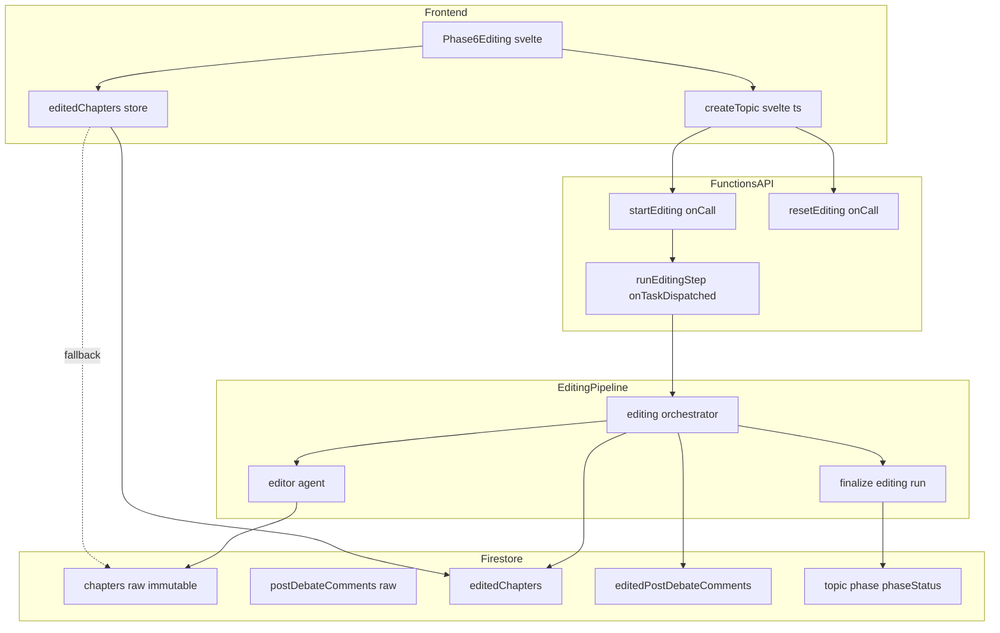
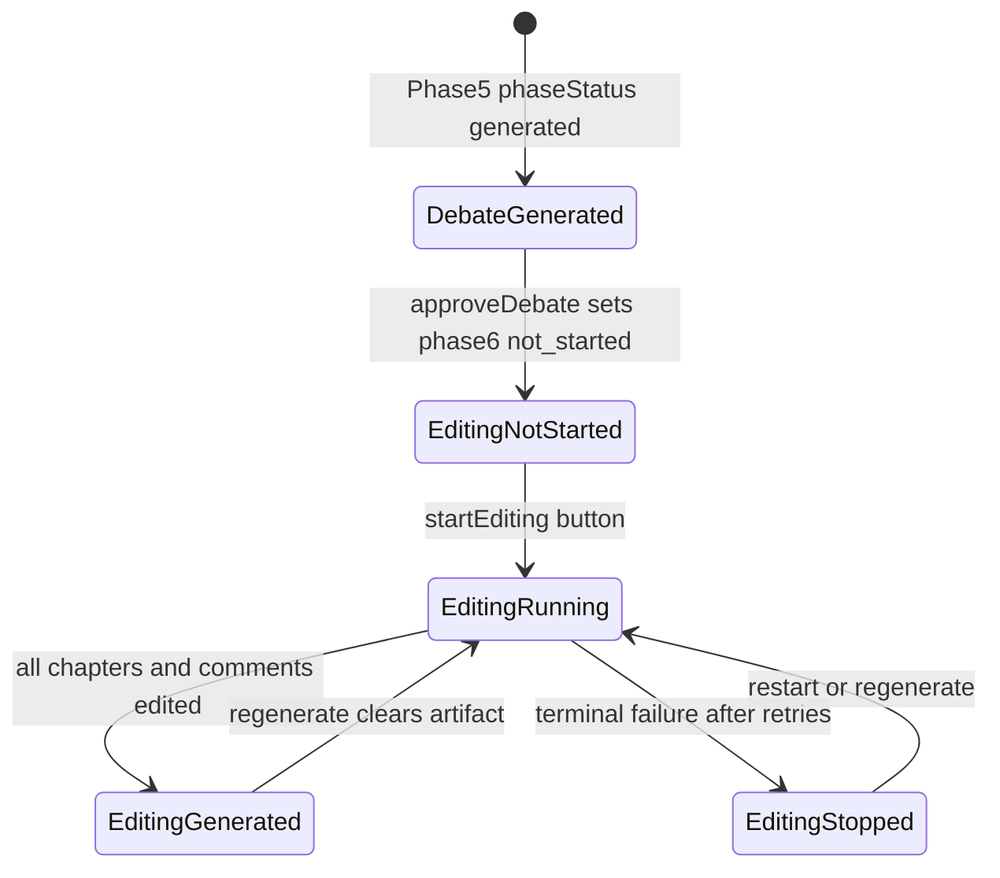
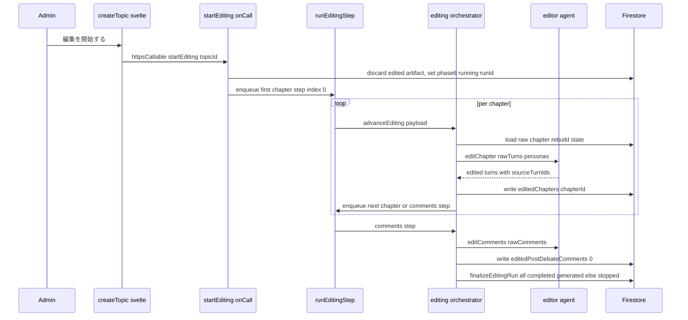

# Technical Design

## Overview

本フィーチャーは、討論フェーズ（Phase 5）の後に独立した **編集フェーズ（Phase 6）** を追加し、管理者がボタン操作で **編集者観点のリライト処理（編集パス）** を起動できるようにする。編集パスは AI（`generateObject` ＋ Zod schema）を用いて、生成済みの討論コンテンツから冗長な発言を取り除き、読みやすい散文へ整え、冗長な発言の除外で生じた同一話者の連続発言を自然に連結する。生ディベート（章・ターン・事後コメント）は不変の原本として保持し、編集成果物は別コレクションへ完全分離して保存する。

**Purpose**: 討論の多様性という価値を損なわずに、公開閲覧者にとっての「読み物としての質」を高める。
**Users**: 管理者が編集フェーズで編集を起動・再実行・確認する。編集成果物は将来の公開閲覧ページの表示ソースとなる。
**Impact**: 既存のフェーズモデル（`Phase = 1..5`）を Phase 6 まで拡張し、討論パイプラインと同型の Cloud Tasks チェーンで動く編集パイプラインを新設する。生ディベートのスキーマ・生成ロジックは変更しない。

### Goals
- 討論フェーズ後に Phase 6（編集）を設け、管理者のボタン操作で編集パスを起動・再実行できる。
- 生ディベートを不変の原本とし、編集成果物を別アーティファクトとして保存・表示する。
- 冗長性除去・可読性向上を、意味・立場・事実・帰属・無矛盾を保ったまま行う。冗長ターンの除外と同一話者連結を許容する。
- 編集失敗時も討論を閲覧不能にせず、原本へフォールバックする。

### Non-Goals
- 公開閲覧ページ（`/debate/[id]`）の新規実装（未実装のため別スペックへ委譲。編集成果物の形は将来の消費に耐えるよう設計する）。
- 討論アルゴリズム・エージェント・話者選択・発話生成・章生成の変更。
- 新しい意見・主張・結論の追加、立場・信念変化・ファクトチェック結果の改変。
- 編集成果物への新規発言の追加・時系列順序の入れ替え。

## Boundary Commitments

### This Spec Owns
- **Phase 6（編集フェーズ）** のフェーズモデル拡張（型・定数・表示ロジック・ルート・UI パネル）。
- **編集パイプライン**: `startEditing` / `resetEditing` onCall、`runEditingStep` onTaskDispatched、編集オーケストレーションと完了確定。
- **編集者エージェント**（`editor-agent`）: LLM による章単位リライトと構造化出力。
- **編集成果物のスキーマと永続化**: `topics/{topicId}/editedChapters/{chapterId}` と `topics/{topicId}/editedPostDebateComments/0`。
- **編集成果物の表示**（管理画面の Phase 6 画面）と、原本へのフォールバック。
- 討論 reset/restart 時に編集成果物を破棄する整合処理の追加。

### Out of Boundary
- 生ディベート（`chapters` / `turns` / `postDebateComments`）の改変・スキーマ変更。
- 信念変化・ファクトチェック・engagements の生成・改変（原本側が真実）。
- 公開閲覧ページの実装。

### Allowed Dependencies
- 既存の Cloud Tasks 基盤（`enqueueStep` 相当 / onTaskDispatched / `requireAuth`）。
- 既存の LLM 基盤（`@ai-sdk/anthropic`, `generateObject`, `AI_MODELS.SONNET`, `formatTurns`/`formatPersonas`）。
- 既存の章・事後コメント読み取りヘルパー（`getChaptersByTopicId` など）と `discardChaptersWithSideData`。
- 依存方向: Types → Constants → Repository/db → Agent → Pipeline → API（onCall/onTaskDispatched）。FE: models/types → stores → features(UI)。上位から下位へのみ依存し、逆流させない。

### Revalidation Triggers
- 編集成果物のスキーマ（`EditedChapterForFirestore` / `EditedTurnForFirestore`）変更 → 表示側・将来の公開ページ消費者を再確認。
- `Phase` 型の拡張 → `Phase` を参照する全箇所（label Record・終端判定・テスト・ナビゲーション）。
- 生ディベートのスキーマ変更（`session-document-restructure` 等）→ 編集パスの入力読み取り・`sourceTurnIds` join。

## Architecture

### Existing Architecture Analysis
- **フェーズモデル**: `Phase = 1|2|3|4|5`（固定 union）、`PhaseStatus = 'not_started'|'running'|'generated'|'stopped'`。フェーズ前進は approve で `topics/{topicId}.phase` を直接更新（例 `approveChapters` → `phase:5`）。Phase 5 は終端で approve を持たない。
- **討論パイプライン**: 「1 ステップ＝1 Cloud Task」のチェーン（`runStep` onTaskDispatched, `timeoutSeconds:540`, `retryConfig.maxAttempts:3`）。状態は毎回 Firestore から再構築し冪等。完了確定（`phaseStatus:'generated'`）は running/stopped 限定の冪等トランザクション。
- **データ**: `topics/{topicId}/chapters/{chapterId}` に `turns: DebateTurn[]` 埋め込み、`postDebateComments/0`。表示は `Phase5Debate.svelte` が `turn.content` を平文描画し、信念変化・ファクトチェックをターン id で join。
- **保持すべき統合点**: 編集パスはこれらの規範（Cloud Tasks チェーン・冪等完了確定・`*ForFirestore` 命名・型と永続形の一致）に従う。

### Architecture Pattern & Boundary Map



**Architecture Integration**:
- **Selected pattern**: 章単位の Cloud Tasks チェーン（討論オーケストレーションと同型）＋ 別コレクションへの成果物完全分離。
- **Domain/feature boundaries**: 生成（生ディベート）と編集（編集成果物）をライフサイクルで分離。編集パイプラインは原本を読み取り専用で参照し、書き込みは編集成果物コレクションのみ。
- **Existing patterns preserved**: 冪等完了確定、状態の Firestore 再構築、`requireAuth`、`generateObject`＋Zod、`*ForFirestore` 命名、フェーズ approve→前進。
- **New components rationale**: 編集は討論とライフサイクル・責務が異なるため、専用の onCall/タスク/エージェント/コレクションを新設（既存討論ロジックへ分岐を吸わせない＝過剰共通化回避）。
- **Steering compliance**: `firebase.md`（1MB・課金・埋め込み判断）、型と永続形の一致、アロー関数、省略しない命名。

### Technology Stack

| Layer | Choice / Version | Role in Feature | Notes |
|-------|------------------|-----------------|-------|
| Frontend | SvelteKit 2.x / Svelte 5 runes | Phase 6 画面・編集成果物ストア・onCall 呼び出し | 既存 `PhasePanel` を再利用 |
| Backend / Services | Firebase Functions v2（onCall / onTaskDispatched） | 編集起動・章単位編集タスク・完了確定 | `runEditingStep` は `timeoutSeconds:540`, `maxAttempts:3` |
| AI | `@ai-sdk/anthropic` + `ai`（`generateObject`） / `AI_MODELS.SONNET` | 章単位の編集者リライト（構造化出力） | 既存エージェント規範に一致。品質要求が高ければ Opus 切替を将来検討 |
| Data / Storage | Firestore | `editedChapters/{chapterId}`, `editedPostDebateComments/0` | 原本と完全分離。`chapterId` を原本と共有し 1:1・冪等上書き |
| Messaging / Events | Cloud Tasks（既存タスクキュー基盤） | 章 → 章 → コメント の編集ステップ連鎖 | 状態は Firestore から再構築・冪等 |

## File Structure Plan

### Directory Structure
```
functions/src/
├── types/
│   └── editorial.types.ts            # 編集成果物の型（*ForFirestore）
├── agents/
│   └── editor-agent.ts               # LLM 章単位リライト（generateObject + Zod）
├── pipeline/editing/
│   ├── editing-orchestrator.ts       # 編集ステップの dispatch と次ステップ決定（冪等）
│   ├── editing-step.ts               # 章編集ステップ / コメント編集ステップの実行
│   ├── editing-lifecycle.ts          # 編集成果物の破棄・完了確定（startEditingRun / finalizeEditingRun）
│   └── edited-repository.ts          # editedChapters / editedPostDebateComments の read/write
└── api/
    └── editing.ts                    # startEditing / resetEditing onCall, runEditingStep onTaskDispatched

src/lib/
├── models/
│   ├── phase/                        # Phase 6 拡張（types/constants/ts）— 後述 Modified
│   ├── editedChapter/editedChapter.types.ts   # FE 型（ForFirestore + runtime）
│   └── editedTurn/editedTurn.types.ts
├── stores/
│   └── editedChapters.svelte.ts      # editedChapters 購読（公開ページ再利用可能なよう stores 配下）
└── features/admin/topic-detail/editing/
    └── Phase6Editing.svelte          # 編集フェーズ画面（起動・再実行・編集成果物表示）

src/routes/admin/topics/[topicId]/
└── editing/+page.svelte              # Phase 6 ルート（debate と同階層）
```

### Modified Files
- `src/lib/models/phase/phase.types.ts` — `Phase` を `1|2|3|4|5|6` に拡張、`PhaseSlug` に `'editing'` 追加。
- `src/lib/models/phase/phase.constants.ts` — `PHASE_DEFS` に `{ phase:6, slug:'editing', label:'編集' }`、4 つの label Record（RUNNING/GENERATED/NOT_STARTED/STOPPED）に Phase 6 を追加。
- `src/lib/models/phase/phase.ts` — 終端判定 `phase === 5` を `phase === 6` に更新（最終フェーズの表示スタイル）。
- `src/lib/models/topic/createTopic.svelte.ts` — `approveDebate`（Phase 5→6 前進: `phase:6, phaseStatus:'not_started'`）、`startEditing` / `resetEditing`（httpsCallable）を追加。
- `src/lib/features/admin/topic-detail/debate/Phase5Debate.svelte` — `generated` 時に `approveLabel`（「討論を確定して編集へ」）＋ `onApprove` を `PhasePanel` へ渡す。
- `functions/src/pipeline/debate/debate-lifecycle.ts` — `discardChaptersWithSideData` に編集成果物（`editedChapters` / `editedPostDebateComments`）の削除を追加（reset/restart 時に編集成果物も破棄）。
- `functions/src/index.ts` — `editing.ts` の関数群をエクスポート。

## System Flows

### 編集フェーズのライフサイクル（状態遷移）


### 編集パスのチェーン実行


ゲーティング: `approveDebate` は討論が `generated` のときのみ Phase 6 へ前進させる（Req 1.2）。`startEditing` は冒頭で既存編集成果物を破棄してから running にする（Req 1.7, 5.5）。完了確定は running/stopped 限定の冪等トランザクション。`runId` で世代を識別し、旧世代タスクは no-op。

## Requirements Traceability

| Requirement | Summary | Components | Interfaces | Flows |
|-------------|---------|------------|------------|-------|
| 1.1, 1.2 | Phase 6 を討論後に設置・未完了時は開始不可 | Phase model, Phase6Editing, createTopic(approveDebate) | `approveDebate` | ライフサイクル |
| 1.3, 1.4 | ボタンで起動・自動実行しない | Phase6Editing, startEditing | `startEditing` | チェーン実行 |
| 1.5 | 完了で phaseStatus generated（全章成功時） | editing-lifecycle(finalizeEditingRun) | `finalizeEditingRun` | チェーン実行 |
| 1.6, 1.7 | 冪等・再実行・既存成果物破棄 | startEditing, edited-repository | `startEditing`, `clearEditedArtifact` | ライフサイクル |
| 2.1, 2.2 | 編集対象=ターン/コメント本文 | editor-agent | `editChapter`, `editComments` | チェーン実行 |
| 2.3 | メタデータを内容整合で引き継ぐ | editor-agent, editing-step | `EditedTurnForFirestore` | — |
| 2.4, 2.5 | 新規発言なし・順序維持・章跨ぎなし | editing-orchestrator(validation) | 検証ルール | — |
| 3.1–3.3 | 冗長除去・読みやすさ・個性維持 | editor-agent(system prompt) | `editChapter` | — |
| 3.4 | 重複だが固有情報は簡潔化し保持 | editor-agent | `editChapter` | — |
| 3.5, 3.6 | 冗長ターン除外・同一話者連結 | editor-agent | edited turn schema | — |
| 3.7 | 保護対象は除外しない/連結時引き継ぐ | editing-orchestrator(validation) | 検証ルール | — |
| 3.8 | 対象言語で編集 | editor-agent(system prompt) | — | — |
| 4.1–4.7 | 意味・立場・事実・帰属・無矛盾の保持 | editor-agent(system prompt), 検証 | `editChapter`, 検証ルール | — |
| 5.1 | 原本を不変保持 | editing pipeline(読み取りのみ) | — | — |
| 5.2 | 別コレクションへ保存 | edited-repository | `writeEditedChapter` | チェーン実行 |
| 5.3 | 永続形と型一致 | editorial.types | `*ForFirestore` | — |
| 5.4 | （5.5 と統合）— | — | — | — |
| 5.5 | 再実行時に旧成果物即時破棄 | startEditing, edited-repository | `clearEditedArtifact` | ライフサイクル |
| 5.6 | discard 時に編集成果物破棄 | debate-lifecycle(discardChaptersWithSideData) | — | — |
| 6.1, 6.2 | 状態管理・進行表示 | Phase6Editing, PhasePanel | `phaseLogicalState` | ライフサイクル |
| 6.3 | 失敗章も原本で閲覧可（章別フォールバック） | editedChapters store(章別fallback) | — | — |
| 6.4 | 章別ステータス表示・再実行可 | Phase6Editing, finalizeEditingRun | `finalizeEditingRun` | ライフサイクル |
| 6.5 | 一部章失敗なら generated とせず stopped | editing-orchestrator, finalizeEditingRun | `finalizeEditingRun` | チェーン実行 |
| 6.6, 6.7 | 章別に成果物あれば表示/なければ原本 | Phase6Editing, editedChapters store | store getters | — |

> 注: 5.4 は要件改訂で 5.5 に統合済み（番号は requirements.md の現行 5.1–5.6 に対応）。

## Components and Interfaces

| Component | Domain/Layer | Intent | Req Coverage | Key Dependencies (P0/P1) | Contracts |
|-----------|--------------|--------|--------------|--------------------------|-----------|
| editorial.types | Types | 編集成果物の永続/実行時型 | 5.3 | — | State |
| editor-agent | Agent | 章/コメントを LLM でリライト | 2.1–2.2, 3.x, 4.x | ai SDK (P0), prompt-formatters (P1) | Service |
| editing-orchestrator | Pipeline | ステップ dispatch・検証・次ステップ決定 | 2.4, 3.7, 4.x | editor-agent (P0), edited-repository (P0) | Service |
| editing-step | Pipeline | 章編集/コメント編集の実行 | 2.x | editor-agent (P0), edited-repository (P0) | Batch |
| editing-lifecycle | Pipeline | 成果物破棄・完了確定 | 1.5, 5.5 | edited-repository (P0) | Service |
| edited-repository | db | editedChapters/Comments の read/write/clear | 5.2, 5.5 | firebase-admin (P0) | Service |
| editing API | API | startEditing/resetEditing onCall, runEditingStep | 1.3, 1.6, 6.4 | editing pipeline (P0), auth (P0) | API, Batch |
| Phase6Editing | UI | 起動/再実行ボタン・章別ステータス・編集成果物表示 | 1.1, 6.1–6.7 | PhasePanel (P0), editedChapters store (P0) | State |
| editedChapters store | State | editedChapters 購読・章別原本フォールバック | 6.3, 6.6, 6.7 | firebase client (P0) | State |
| Phase model 拡張 | Types/UI | Phase 6 の型・定数・遷移 | 1.1, 1.2 | — | State |

### Functions / Backend

#### editorial.types（編集成果物の型）

**Responsibilities & Constraints**
- 編集成果物の永続形と実行時型を定義。型ガードのみ可、変換関数は持たない。
- 永続形（Firestore）と一致させる（[[feedback-mirror-firestore-shape]]）。

**Contracts**: State [x]

##### State Management
```typescript
// 編集後ターン: 散文・発話者・由来。注釈（信念変化/ファクトチェック）は持たず原本を参照
export type EditedTurnForFirestore = {
  id: string;                       // nanoid（編集ターンの新規 id）
  sourceTurnIds: string[];          // 由来する原本ターン id（>=1、連結時は複数）
  speakerType: 'persona' | 'facilitator';
  personaId?: string | null;
  content: string;                  // 編集後の散文
  speechMode?: 'opinion' | 'fact' | 'question';
};

export type EditingChapterStatus = 'pending' | 'completed' | 'failed';

export type EditedChapterForFirestore = {
  chapterIndex: number;
  title: string;                    // 原本からコピー（編集対象外）
  discussionPoints: string[];       // 原本からコピー
  turns: EditedTurnForFirestore[];
  status: EditingChapterStatus;
};

export type EditedPostDebateCommentForFirestore = {
  id: string;
  sourceCommentId: string;
  personaId: string;
  content: string;
  sortOrder: number;
};
export type EditedPostDebateCommentsForFirestore = {
  comments: EditedPostDebateCommentForFirestore[];
};
```
- Persistence: `topics/{topicId}/editedChapters/{chapterId}`（`chapterId` は原本と同一）、`topics/{topicId}/editedPostDebateComments/0`。
- Invariants: `sourceTurnIds.length >= 1`。連結ターンの全 `sourceTurnIds` は同一話者・同一 `personaId`。

#### editor-agent

| Field | Detail |
|-------|--------|
| Intent | 章の原本ターン列を編集者観点でリライトし、編集後ターン列（由来付き）を構造化出力する |
| Requirements | 2.1, 2.2, 3.1, 3.2, 3.3, 3.4, 3.5, 3.6, 3.8, 4.1, 4.2, 4.3, 4.4, 4.5, 4.6, 4.7 |

**Responsibilities & Constraints**
- 冗長性除去・可読性向上・個性維持・冗長ターン除外・同一話者連結を行う。
- 意味・立場・事実・帰属・無矛盾を保持制約として満たす範囲で積極的に編集（過剰に原文維持へ倒さない）。両立しない箇所のみ原文維持。
- プロンプトに「保護対象ターン id」（信念変化・固有事実・ファクトチェック指摘を持つターン）を渡し、これらは除外させない。

**Dependencies**
- Outbound: `ai` `generateObject` + `@ai-sdk/anthropic` — LLM 構造化出力（P0）
- Outbound: `prompt-formatters.formatTurns` / `formatPersonas` — プロンプト整形（P1）

**Contracts**: Service [x]

##### Service Interface
```typescript
export type EditedTurnDraft = {
  sourceTurnIds: string[];
  speakerType: 'persona' | 'facilitator';
  personaId?: string | null;
  content: string;
  speechMode?: 'opinion' | 'fact' | 'question';
};

export const editChapter = (
  chapter: { title: string; discussionPoints: string[]; turns: DebateTurn[] },
  personas: ReadonlyArray<Persona>,
  protectedTurnIds: ReadonlySet<string>
): Promise<Result<EditedTurnDraft[], PipelineError>>;

export const editComments = (
  comments: ReadonlyArray<{ id: string; personaId: string; content: string; sortOrder: number }>,
  personas: ReadonlyArray<Persona>
): Promise<Result<Array<{ sourceCommentId: string; personaId: string; content: string }>, PipelineError>>;
```
- Preconditions: `chapter.turns` は時系列順。`personas` は当該討論の参加者。
- Postconditions: 返却ドラフトは入力の時系列を保ち、新規話者を作らない。各ドラフトの `sourceTurnIds` は入力ターン id の部分集合。
- Invariants: LLM 出力は Zod schema（`{ turns: [{ sourceTurnIds: string[], speakerType, personaId?, content }] }`）で検証。

**Implementation Notes**
- Integration: モデルは `AI_MODELS.SONNET`。システムプロンプトに編集方針と不変条件を明示し、ユーザーコンテンツは `formatTurns` ＋ 保護対象 id 一覧 ＋ ペルソナ一覧。
- Validation: schema 検証後、orchestrator 側で意味的検証（後述）を行う。
- Risks: LLM が保護対象を落とす/話者を取り違える/矛盾を生む → 検証で検出し失敗扱い（原本フォールバック）。

#### editing-orchestrator / editing-step

| Field | Detail |
|-------|--------|
| Intent | 章単位の編集ステップを dispatch、編集結果を検証して保存、次ステップを enqueue。最後にコメント編集と完了確定 |
| Requirements | 2.3, 2.4, 2.5, 3.7, 4.x, 5.2 |

**Responsibilities & Constraints**
- 状態は毎回 Firestore（原本＋ `topic.runId`）から再構築し冪等・再入可能。
- 編集結果の**構造的検証**（不合格は当該章を `status:'failed'` で記録し、後続章は継続。意味的検証は行わない＝v1 は prompt-only、下記 Error Handling 参照）:
  - すべての `sourceTurnIds` が当該章の原本ターン id を指す。
  - 保護対象ターン id がいずれかの編集ターンの `sourceTurnIds` に含まれる（除外されていない）。
  - 連結ターンの `sourceTurnIds` が同一話者・同一 `personaId`。
  - 時系列順序が原本と矛盾しない（`sourceTurnIds` の最小インデックス昇順）。
- **部分失敗ポリシー（章別フォールバック）**: 各章は独立に編集・検証する。失敗章は `editedChapters/{chapterId}` を `status:'failed'`（`turns: []`）で記録し、表示側はその章のみ原本にフォールバックする。**全章が `completed` のときのみ** run を `generated` に確定し、1 章でも `failed` が残れば `stopped`（再実行可）にする。これにより「generated 表示なのに一部未編集」という silent partial を防ぐ（Req 6.4）。

**Contracts**: Service [x] / Batch [x]

##### Batch / Job Contract
- Trigger: `runEditingStep` onTaskDispatched（payload: `{ topicId, runId, stepKind: 'chapter' | 'comments', chapterIndex }`）。
- Input / validation: `topic.runId` と payload.runId 一致を確認（不一致＝旧世代 → no-op）。
- Output / destination: `editedChapters/{chapterId}`（chapter ステップ、成功は `completed`／構造検証不合格は `failed`）/ `editedPostDebateComments/0`（comments ステップ）。
- 完了判定: comments ステップの最後に全章の `editedChapters/{chapterId}.status` を集計し、**全て `completed` なら** `finalizeEditingRun`（`generated`）、`failed` が残れば `stopped`。
- Idempotency & recovery: 章成果物は冪等上書き。タスクの実行時例外は Cloud Tasks リトライ（`maxAttempts:3`）、終端で `phase:6, phaseStatus:'stopped'`。構造検証不合格は例外ではなく `failed` 記録として扱い後続章を止めない。

#### editing-lifecycle / edited-repository

**Service Interface**
```typescript
// edited-repository
export const writeEditedChapter = (topicId: string, chapterId: string, doc: EditedChapterForFirestore): Promise<void>;
export const writeEditedComments = (topicId: string, doc: EditedPostDebateCommentsForFirestore): Promise<void>;
export const clearEditedArtifact = (topicId: string): Promise<void>; // editedChapters 全削除 + editedPostDebateComments クリア

// editing-lifecycle
export const startEditingRun = (topicId: string): Promise<string>;   // clearEditedArtifact + phase6 running + runId 返却
export const finalizeEditingRun = (topicId: string, runId: string): Promise<'generated' | 'stopped'>; // 全章 completed→generated / failed 残存→stopped（冪等）
```
- `finalizeEditingRun`: `topic.phase === 6 && runId 一致 && phaseStatus in {running, stopped}` のときのみ遷移（巻き戻し防止）。全 `editedChapters` の `status` を読み、全 `completed` なら `generated`、`failed` が 1 つでもあれば `stopped` を書く。

#### editing API

**Contracts**: API [x] / Batch [x]

##### API Contract
| Method | Endpoint(onCall) | Request | Response | Errors |
|--------|------------------|---------|----------|--------|
| call | startEditing | `{ topicId: string }` | `{ topicId: string }` | unauthenticated, not-found, internal |
| call | resetEditing | `{ topicId: string }` | `{ topicId: string }` | unauthenticated, not-found, internal |
| task | runEditingStep | `StepPayload(editing)` | — | retry→stopped |

- `startEditing`: `requireAuth` → `startEditingRun`（破棄＋running）→ 最初の chapter ステップ enqueue。`onCall({ timeoutSeconds: 60 })`。
- `resetEditing`: `requireAuth` → `clearEditedArtifact` ＋ `phase:6, phaseStatus:'not_started'`（編集を未実行状態に戻す）。
- `runEditingStep`: `onTaskDispatched({ timeoutSeconds:540, retryConfig:{maxAttempts:3}, secrets:[ANTHROPIC_API_KEY,...] })`。

### Frontend

#### Phase model 拡張（Summary-only）
- `Phase` を `1|2|3|4|5|6` に拡張、`PhaseSlug` に `'editing'`、`PHASE_DEFS` と 4 label Record に Phase 6 を追加、`phase.ts` の終端判定を 6 に更新。型が `Record<Phase, ...>` を強制するため、未対応箇所はコンパイルエラーで検出される。

#### createTopic.svelte.ts（Summary-only）
- `approveDebate()`: 討論 `generated` のとき `topics/{topicId}` を `phase:6, phaseStatus:'not_started'` に更新（Phase 5→6 ゲート）。
- `startEditing()` / `resetEditing()`: `httpsCallable` で対応 onCall を呼ぶ（`startDebate` と同じ実装規範）。

#### Phase6Editing.svelte

| Field | Detail |
|-------|--------|
| Intent | 編集フェーズ画面。起動/再実行ボタンと編集成果物（読み物）の表示、未完了時は原本フォールバック |
| Requirements | 1.1, 1.3, 1.4, 6.1, 6.2, 6.3, 6.4, 6.6, 6.7 |

**Responsibilities & Constraints**
- `PhasePanel` に `logicalState`（`phaseLogicalState({phase, phaseStatus}, 6)`）と `generateLabel`「編集を開始する」/ `regenerateLabel`「編集をやり直す」/ `onGenerate=startEditing` / `onRegenerate=resetEditing→startEditing` を渡す。
- `content` snippet で `editedChapters` ストアを**章順**に描画。各章は `status` により切替: `completed` は編集後ターン（発話者名・役割・`content`）を表示し、信念変化・ファクトチェックを `sourceTurnIds` で原本ストアから join 表示（既存 `Phase5Debate` の表示部品を再利用可能な範囲で流用）。`failed` または成果物未生成の章はその章のみ原本（討論ターン）にフォールバック（Req 6.3, 6.6）。
- **章別ステータス表示**: 各章に編集状態（編集済み／原本表示(失敗)／未編集）を示し、部分失敗を管理者が把握できるようにする（Req 6.4）。
- 画面の操作・遷移はこの画面に直接書く（中央ディスパッチャを作らない）。

**Implementation Notes**
- Integration: `src/routes/admin/topics/[topicId]/editing/+page.svelte` がこの feature をマウント。ナビゲーションは `PHASE_DEFS` から自動生成。
- Validation: ボタン活性は `logicalState` 由来（討論未完了＝Phase 6 未到達なら画面到達不可＝起動不可、Req 1.2）。
- Risks: 公開ページ未実装のため、表示は管理画面のみ（Non-Goal）。

#### editedChapters store（Summary-only）
- `topics/{topicId}/editedChapters` を `chapterIndex` 順で `onSnapshot` 購読し、章別に公開。各章の `status`（`completed`/`failed`/未生成）を getter で提供し、UI が**章単位で**編集済み表示か原本フォールバックかを判定できるようにする。将来の公開ページが再利用できるよう `src/lib/stores/` に置く。

## Data Models

### Domain Model
- **集約**: 「編集成果物」は討論（topic）配下の派生集約。原本（章・ターン・コメント）を入力に持つが、書き込みは編集成果物コレクションに限定。
- **不変条件**:
  - 生ディベートは編集パスから不変（Req 5.1）。
  - 編集ターンは原本ターンの部分集合に由来（`sourceTurnIds ⊆ 原本ターン id`）。新規発話なし（Req 2.4）。
  - 保護対象ターン（信念変化／固有事実／ファクトチェック指摘）は必ずいずれかの編集ターンに由来として残る（Req 3.7, 4.3）。
  - 時系列順序保持・章跨ぎ連結なし（Req 2.4, 2.5）。

#### 連結ターンのメタデータ・注釈解決ルール（Req 2.3, 3.7）
編集ターンは散文・発話者・由来のみを持ち、注釈（信念変化・ファクトチェック指摘・engagements）は原本を真実として `sourceTurnIds` で join 表示する。連結（複数 `sourceTurnIds`）時の解決は以下:
- **信念変化 / ファクトチェック指摘 / engagements**: 全 `sourceTurnIds` に紐づく注釈の**和集合**を、その編集ターンの下に原本の元順序で表示する。二重管理を避けるため編集ターンには複製しない。
- **speechMode**: 全 `sourceTurnIds` が同一値のときのみその値を持つ。混在時は省略（`undefined`）。
- **engagementScore / targetPersonaId / targetedBy / fromQueue**: 編集ターンは保持しない（読み物では非表示、必要時は原本を参照）。これが Req 2.3「メタデータを内容整合で引き継ぐ」を join により満たす解釈。
- **帰属**: 連結対象は同一話者・同一 `personaId` に限る（構造検証で担保、Req 4.4）。

### Physical Data Model（Document Store）
```
topics/{topicId}/editedChapters/{chapterId}        # EditedChapterForFirestore（chapterId は原本と共有）
topics/{topicId}/editedPostDebateComments/0        # EditedPostDebateCommentsForFirestore
```
- 埋め込み判断: 編集後ターンは章と常に一緒に読むため章ドキュメントに埋め込む（原本 `chapters` と同方針）。編集後は短くなる想定で 1MB 内。
- 削除: `clearEditedArtifact` は `editedChapters` 配下を全削除し `editedPostDebateComments/0` を空に。reset/restart 時は `discardChaptersWithSideData` から呼ぶ。

## Error Handling

### Error Strategy
- **入力検証**（onCall）: `topicId` 必須・topic 存在確認。未認証は `unauthenticated`。
- **編集構造検証**（orchestrator）: Zod schema 検証＋構造的検証（`sourceTurnIds` 妥当性・保護対象残存・話者整合・時系列）。不合格章は `status:'failed'` で記録し原本フォールバック、後続章は継続。
- **意味保持の担保（v1 = prompt-only、残余リスク受容）**: 意味同値・無矛盾・新主張なし（Req 4.1, 4.2, 4.5）は**システムプロンプトの不変条件指示に委ね、自動検証は行わない**。誤編集の残余リスクは、(1) 章別フォールバックで局所化、(2) 生ディベートを常に不変保持し原本参照を可能に保つ、(3) 管理者が Phase 6 で編集成果物を目視確認できる、ことで受容する。将来的な意味検証パス追加は Open Questions を参照。
- **実行失敗**（タスク）: Cloud Tasks リトライ（`maxAttempts:3`）。終端失敗で `phase:6, phaseStatus:'stopped'`（Req 6.4）。再実行ボタンで復帰。
- **グレースフルデグラデーション**: 成果物が無い/失敗の間は原本を表示（Req 6.3, 6.6）。生ディベートは常に不変・閲覧可能。

### Open Questions / 将来検討
- **意味検証パス**: 編集後 vs 原本を LLM で照合（意味同値・矛盾・新主張）し逸脱章を `failed` にする検証ステップ。v1 では未実装（prompt-only）。品質問題が観測されたら追加を検討。
- **URL 引用表示**: 発言の裏付け URL を読み物に表示する機能は本スペック境界外（生ディベートに grounding URL を保持する改修が必要）。別スペック（`speech-search-grounding` への統合等）で検討。

### Error Categories and Responses
- **User Errors**: 討論未完了での起動 → 画面到達不可で予防（Req 1.2）。
- **System Errors**: LLM/タイムアウト → リトライ→stopped、状態 Firestore 再構築で再入安全。
- **Business Logic Errors**: 編集品質検証失敗 → 当該章のみ原本フォールバック、ログ記録。

### Monitoring
- 既存同様 `console.error('[startEditing]'/'[runEditingStep]', { topicId }, err)`。章ごとの検証失敗を warning ログに残す。

## Testing Strategy

### Unit Tests
- `editor-agent`: LLM をモックし、Zod schema 検証・保護対象 id の保持・話者整合を検証。
- `editing-orchestrator`: 構造検証ルール（sourceTurnIds 妥当性／保護対象残存／話者整合／時系列）の合否分岐と、不合格章の `status:'failed'` 記録＋後続章継続。
- `finalizeEditingRun`: 全章 `completed`→`generated` / `failed` 残存→`stopped` の冪等遷移と巻き戻し防止。
- `clearEditedArtifact`: editedChapters 全削除と comments クリア。
- `phaseLogicalState`: Phase 6 を含む論理状態導出。

### Integration Tests
- `startEditing` → 章チェーン → コメント → `generated` 確定の通し（タスクをモック駆動）。
- 討論 `resetDebate`/`restartDebate` が編集成果物も破棄すること（`discardChaptersWithSideData` 経由）。
- 再実行（`resetEditing`→`startEditing`）で旧成果物が即時破棄され再生成されること。

- 部分失敗: 一部章が構造検証で `failed` のとき、run が `stopped` になり、成功章は編集済み・失敗章は原本表示になること。

### E2E/UI Tests
- 討論完了 → 「討論を確定して編集へ」→ Phase 6 で「編集を開始する」→ 進行表示 → 編集成果物表示。
- 一部章が失敗した場合、章別ステータスが表示され、失敗章は原本表示・再実行できること。

## Security Considerations
- onCall は既存同様 `requireAuth`（管理者のみ）。編集成果物は公開前の管理データ。
- LLM 呼び出しの API キーは Functions secrets（`ANTHROPIC_API_KEY` 等）。新規シークレットは不要。
