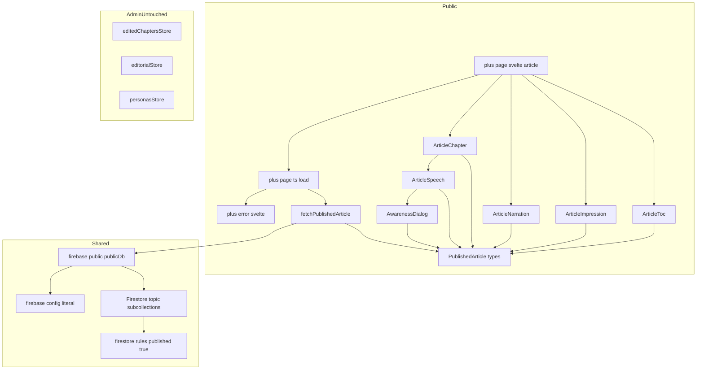
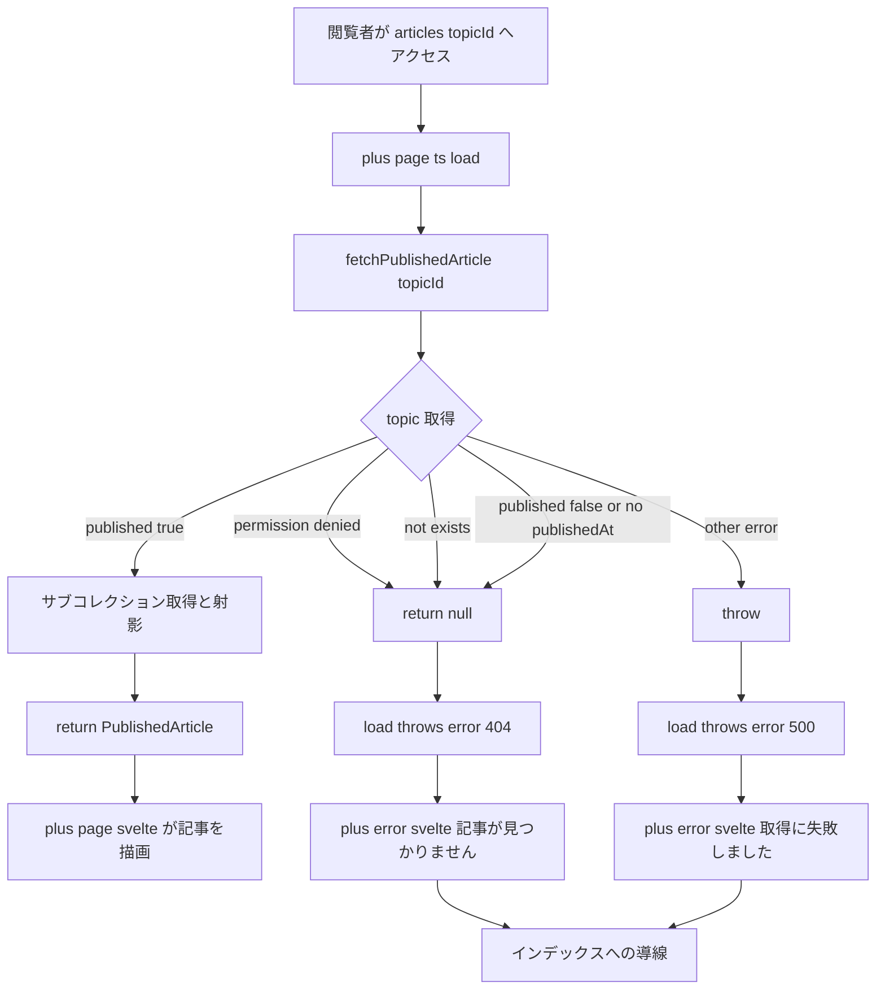
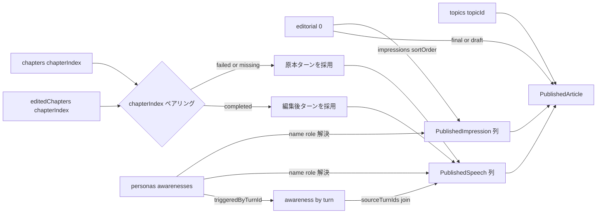
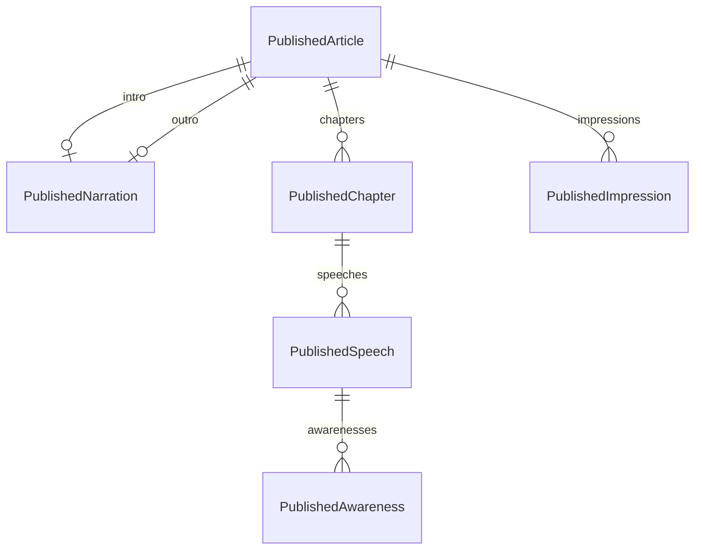

# Technical Design — public-article-page

## Overview

**Purpose**: 公開済みの討論を1本の読み物として通読できる公開記事ページ（`/articles/[topicId]`）を提供する。`public-index-page`（一覧）の各項目からの遷移先であり、AIペルソナ同士の討論を「導入 → 各章の議論 → 締め → 各ペルソナの所感」という記事構成で、未認証の閲覧者に SSR で配信する。

**Users**: 未認証を含む一般閲覧者が、URL（被リンク・検索流入含む）で単一記事に到達し、目次で見通しを保ちながら通読する。気づき（awareness）は本文を妨げないよう、発話ごとのアフォーダンスからダイアログで参照する。

**Impact**: `public-index-page` が確立した公開読み取り基盤（`publicDb`・universal `load`・`Published*` 型分離）を単一記事へ拡張する。記事本文は既存の編集成果物（`editedChapters` / `editorial/0`）と原本（`chapters` / `personas`）から読み込み境界で射影し、Admin 型・ストア（`editedChaptersStore` / `editorialStore` / `*ForFirestore`）から型・データ経路ごと分離する。

### Goals
- 未認証の閲覧者が公開記事を通読できる（rules 適合の限定読み取り、SSR 配信）。
- 記事を「導入・章立ての議論・締め・所感」で構成し、未編集章は原本にフォールバックする。
- awareness を本文に展開せず、発話単位のアフォーダンス＋ダイアログで提示する。
- 左ペイン固定の目次と、スクロール追従の現在地強調（CSS セレクタ表現・`<strong>` 不使用）。
- 公開型（`PublishedArticle` 系）を Admin 型から完全分離する。

### Non-Goals
- 公開インデックス（`/`）・About ページの新設/変更。
- 編集成果物（`editedChapters` / `editorial`）の生成・編集ロジック（別途実装済み）。
- コメント/リアクション/共有ボタン等の双方向機能、章内検索。
- firestore.rules の変更（既存の公開読み取り条件を利用するのみ）。
- realtime 更新（公開記事は一回取得。`onSnapshot` は使わない）。

## Boundary Commitments

### This Spec Owns
- 公開記事ページ（`/articles/[topicId]`）の表示・レイアウト（左ペイン目次＋記事ペイン）・状態（読み込み中／不在・未公開／取得失敗）・レスポンシブ・記事別メタ情報。
- 公開読み取りモデル `PublishedArticle`（＋ `PublishedChapter` / `PublishedSpeech` / `PublishedAwareness` / `PublishedImpression` / `PublishedNarration`）と、その取得・射影・join（`topics`・`editedChapters`・`chapters`・`editorial/0`・`personas` → `PublishedArticle`）。
- 発話単位の awareness アフォーダンス＋ダイアログ、目次のスクロール追従による現在地強調。
- 一覧からの遷移契約 `/articles/[topicId]` の受け口（`public-index-page` が定義したリンク先）。

### Out of Boundary
- 記事本文となる編集成果物・原本の生成/編集（admin/pipeline 側）。
- firestore.rules（既存の `published == true` 公開読み取りを前提に利用のみ）。
- Admin 画面・`topicsStore`/`editedChaptersStore`/`editorialStore`/`personasStore` の構造（一切変更しない）。
- 公開インデックス（`public-index-page`）の実装。

### Allowed Dependencies
- Firestore Client SDK（`$lib/firebase-public` の `publicDb`・読み取り専用）。公開経路は `$lib/firebase`（Auth/Functions 込み）に依存しない。
- SvelteKit universal `load`（`+page.ts`）／`@sveltejs/kit` の `error`。
- `@14ch/svelte-ui`（`Dialog` / `IconButton` / `Icon` / `Button` 等）、`dayjs`（日付整形・既存踏襲）。
- 依存方向: `models`（`Published*` 型・取得/射影）→ `routes/articles/[topicId]/+page.ts`（load）→ `+page.svelte`（構成）→ `features/public/article`（表示部品）。表示部品は `Published*` 型のみに依存し、Admin 型・ストアへは依存しない（逆流・横断依存禁止）。

### Revalidation Triggers
- `PublishedArticle` 系型の形状変更。
- 記事 URL 契約（`/articles/[topicId]`）の変更（`public-index-page` のリンクに波及）。
- firestore.rules の公開読み取り条件（`published == true`／サブコレクションの公開読み）の変更。
- editorial（`final`/`draft`）・章フォールバック（`completed`/`failed`/`missing`）・awareness 帰属（`triggeredByTurnId`/`sourceTurnIds`）の意味変更。
- SSR 方針（`+page.ts` の `ssr`）や not-found 写像（`permission-denied → 404`）の変更。

## Architecture

### Existing Architecture Analysis
- **公開読み取り基盤は確立済み**: `publicDb`（Firestore 専用初期化・SSR 安全）、`firebase-config`（副作用なしリテラル）、universal `load`＋`navigating` ローディング、`fetchPublishedTopics`（`where('published','==',true)` 限定クエリ＋射影インライン）。本仕様は同経路を単一記事へ拡張する。
- **記事の情報源**: `editedChapters`（`chapterIndex` 順・`status` 別に編集後ターン）／`chapters`（原本ターン・フォールバック源）／`editorial/0`（intro/outro/impressions、各要素 `final`＋`draft`）／`personas`（`name`/`specificRole`/`stakeholderRole`＋埋め込み `awarenesses`）。Admin は `EditingChapter`/`EditingNarration`/`EditingImpression` でこれらを描画しており、公開部品は見た目を踏襲しつつ型・経路は共有しない。
- **rules 前提**: `topics/{id}` は `published == true` で公開読み取り可、配下 `personas`/`chapters`/`editedChapters`/`editorial` も `get(topic).published == true` で公開読み取り可。未公開・不在は `permission-denied` を返し、真の不在と区別できない（→ 404 に写像）。
- **未実績**: スクロールスパイ（`IntersectionObserver`）と `error()` ベースの 404/500 はコードベース初導入。

### Architecture Pattern & Boundary Map



**Architecture Integration**:
- Selected pattern: **公開専用に単一記事経路を新設（研究 Option A）**。取得/射影/join（`fetchPublishedArticle`）・構成（`+page.svelte`）・表示部品（`features/public/article`）を公開ドメインに閉じる。
- Domain boundaries: 公開経路は `Published*` 型のみに依存。Admin ストア・`*ForFirestore`・`$lib/firebase` を経由しない。
- Existing patterns preserved: 画面の処理は画面に書く／`models` は型・データロジック／`*.types.ts` は型と型ガードのみ（射影は取得関数にインライン）／`publicDb` 読み取り専用／SSR で SEO。
- New components rationale: `PublishedArticle` 系型と `fetchPublishedArticle` は複数コレクションを読み物へ射影するために必要。`ArticleToc`（スクロールスパイ）・`ArticleSpeech`（awareness アフォーダンス＋開閉）は本仕様固有の閲覧体験を担い、ダイアログ本体は `AwarenessDialog` として独立させ ArticleSpeech から分離する。
- Steering compliance: 「公開型と管理型の分離（`Published` 接頭辞）」「公開ページは SSR」「過度な共通化をしない（画面ごとに素直に書く）」「安定 id を外部キーにする（`chapterIndex`）」。

### Technology Stack

| Layer | Choice / Version | Role in Feature | Notes |
|-------|------------------|-----------------|-------|
| Frontend | SvelteKit 2.x / Svelte 5 runes | 記事ページ・universal `load`・`+error.svelte` | `error()` と `IntersectionObserver` は本コードベース初導入 |
| Data | Firestore Client SDK（`$lib/firebase-public` `publicDb`） | topic/editorial/editedChapters/chapters/personas の一回取得（`getDoc`/`getDocs`）＋射影 | 公開 SSR 経路は Auth/Functions を初期化しない |
| UI | `@14ch/svelte-ui`（`Dialog` / `IconButton` / `Icon` / `Button`） | awareness ダイアログ・アフォーダンス | 独自モーダルは作らない |
| Utility | `dayjs` | `publishedAt` 整形 | `PublishedTopicItem` 踏襲 |
| Infra | Firebase App Hosting（`adapter-auto`） | SSR 配信 | `public-index-page` で SSR 実績確立済み |

## File Structure Plan

### Directory Structure
```
src/lib/models/published/
├── published-article.types.ts          # PublishedArticle 系型（型と型ガードのみ）
└── published-article.ts                 # fetchPublishedArticle(topicId): publicDb 読み取り＋射影/join（変換はここにインライン）
src/lib/features/public/article/
├── ArticleToc.svelte                    # 左ペイン固定目次＋スクロール追従の現在地強調（IntersectionObserver・ブラウザ限定）
├── ArticleNarration.svelte              # 導入/締め（PublishedNarration 表示・label で使い分け・共通）
├── ArticleChapter.svelte                # 章タイトル＋発話列（ArticleSpeech を並べる）
├── ArticleSpeech.svelte                 # 1発話（話者・本文・awareness アフォーダンス＋開閉状態。ダイアログ本体は AwarenessDialog に委譲）
├── AwarenessDialog.svelte               # 独立コンポーネント。awareness 一覧をダイアログ表示（開閉は props 受け）
└── ArticleImpression.svelte             # ペルソナ1人分の所感
src/routes/articles/[topicId]/
├── +page.ts                             # load: fetchPublishedArticle → null は error(404)、throw は error(500)
├── +page.svelte                         # 記事構成（目次ペイン＋記事ペイン）・メタ情報・レスポンシブ
└── +error.svelte                        # 不在/未公開(404)・取得失敗(500) の出し分け＋インデックス導線
```

### Modified Files
- なし（既存ファイルは変更しない）。`public-index-page` が用意した `/articles/[topicId]` リンク先を新設で満たす。

> 各表示部品は `EditingChapter`/`EditingNarration`/`EditingImpression` の見た目を踏襲してよいが、型・データ経路は共有せず `Published*` 型のみに依存する。

## System Flows

### 記事取得と not-found / error 写像（Req 5, 6, 7）



- **null（不在・未公開・`permission-denied`）→ 404**、**その他の失敗 → 500** に写像する。rules 上、未公開・不在は `permission-denied` で返るため、`code === 'permission-denied'` を null 扱いし、他コードは throw する。
- ローディング（Req 7.1）はクライアント遷移時 `navigating.to` で表示（sibling 踏襲）。初期 SSR はサーバで完成 HTML を返すため待機表示は不要。

### 射影・join（読み込み境界）



## Requirements Traceability

| Requirement | Summary | Components | Interfaces | Flows |
|-------------|---------|------------|------------|-------|
| 1.1–1.6 | 記事構成（見出し・導入/章/締め/所感の順・章順・欠落要素省略） | +page.svelte, ArticleNarration, ArticleChapter, ArticleImpression | PublishedArticle | 射影・join |
| 2.1–2.6 | 発話の読み物表示（順序・話者帰属・編集後優先/原本フォールバック・診断注釈非表示） | ArticleChapter, ArticleSpeech, fetchPublishedArticle | PublishedChapter, PublishedSpeech | 射影・join |
| 3.1–3.5 | awareness 非展開・件数アフォーダンス・ダイアログ・0件非表示・閉じる | ArticleSpeech（非展開/アフォーダンス/ref で open）, AwarenessDialog（表示/閉じる） | PublishedSpeech, PublishedAwareness | 射影・join |
| 4.1–4.4 | 左ペイン固定目次・章移動・スクロール追従強調・CSS 表現 | ArticleToc, +page.svelte | PublishedChapter | — |
| 5.1–5.4 | 公開判定（published のみ・不在/未公開は非表示・配下データも公開分のみ） | +page.ts, fetchPublishedArticle | PublishedArticle | 取得と写像 |
| 6.1–6.4 | 未認証アクセス・SSR・管理データ非要求・admin 導線なし | +page.ts, fetchPublishedArticle, +page.svelte | publicDb 経路 | 取得と写像 |
| 7.1–7.3 | 読み込み中／不在／取得失敗の表示 | +page.svelte, +error.svelte | error(404/500) | 取得と写像 |
| 8.1–8.2 | 記事別メタ・不在時は記事前提メタを出さない | +page.svelte, +error.svelte | PublishedArticle | 取得と写像 |
| 9.1 | インデックスへの導線 | +page.svelte, +error.svelte | — | — |
| 10.1–10.2 | レスポンシブ・狭幅時の目次適応 | +page.svelte, ArticleToc | — | — |

## Components and Interfaces

| Component | Domain/Layer | Intent | Req Coverage | Key Dependencies (P0/P1) | Contracts |
|-----------|--------------|--------|--------------|--------------------------|-----------|
| fetchPublishedArticle | Model | 単一記事の公開読み取り＋射影/join | 1,2,3,5,6 | publicDb (P0), PublishedArticle types (P0) | Service, State |
| +page.ts (load) | Route | 取得結果を 404/500/データへ写像 | 5,6,7,8 | fetchPublishedArticle (P0), error (P0) | Service |
| +page.svelte | Route/UI | 記事構成・レイアウト・メタ | 1,4,8,9,10 | Published* types (P0), Article* 部品 (P1) | State |
| +error.svelte | Route/UI | 不在/失敗の提示＋導線 | 7,8,9 | page state (P1) | — |
| ArticleToc | UI | 目次固定＋スクロール追従強調 | 4 | PublishedChapter (P0), IntersectionObserver (P0) | State |
| ArticleChapter | UI | 章タイトル＋発話列 | 1,2 | PublishedChapter/Speech (P0) | — |
| ArticleSpeech | UI | 発話＋awareness アフォーダンス（ref で dialog を開く） | 2,3 | PublishedSpeech (P0), AwarenessDialog (P1) | State |
| AwarenessDialog | UI | awareness 一覧のダイアログ表示（独立・命令的 open()） | 3 | PublishedAwareness (P0), Dialog (P1) | — |
| ArticleNarration | UI | 導入/締めの表示（共通・label 使い分け） | 1 | PublishedNarration (P0) | — |
| ArticleImpression | UI | ペルソナ所感の表示 | 1 | PublishedImpression (P0) | — |

### Model

#### fetchPublishedArticle

| Field | Detail |
|-------|--------|
| Intent | 公開済み単一討論を `publicDb` で読み、読み物 `PublishedArticle` へ射影/join する |
| Requirements | 1.1, 1.2, 1.3, 1.4, 1.5, 1.6, 2.1, 2.4, 2.5, 3.2, 5.1, 5.2, 5.3, 5.4, 6.1, 6.2 |

**Responsibilities & Constraints**
- `topics/{topicId}` を `getDoc`。`published !== true` または `publishedAt` 欠落、`not exists`、`permission-denied` は `null`（＝記事なし）を返す。他エラーは throw。
- `editorial/0`・`editedChapters`（`chapterIndex` 順）・`chapters`（`chapterIndex` 順）・`personas`（`sortOrder` 順）を取得。
- 章は `chapterIndex` でペアリングし、編集後章が `status === 'completed'` のとき編集後ターン、それ以外は原本ターンを採用（Req 2.4, 2.5）。章タイトルは採用側から取る。
- 各発話に話者（`personaId → name/role`、無ければファシリテーター）と awareness を焼き込む。awareness は編集後発話では `sourceTurnIds` 全て、原本発話では自ターン id を `triggeredByTurnId` で逆引きし `PublishedAwareness[]` にする（Req 3.2）。
- editorial 各要素は `final ?? draft`。両方 null の要素は省略（Req 1.6）。impressions は `sortOrder` 昇順（Req 1.2）。
- 診断注釈（`factCheck`/`engagementScore`/`speechMode` 等）は射影に含めない（Req 2.6）。
- **不変条件**: 戻り値は Admin 型・`*ForFirestore` を含まない。`publicDb` 以外の Firestore/Auth/Functions を参照しない。

**Dependencies**
- Outbound: `publicDb`（`$lib/firebase-public`）— 公開読み取り（P0）
- Outbound: `PublishedArticle` types — 射影先（P0）
- External: `firebase/firestore`（`getDoc`/`getDocs`/`doc`/`collection`/`query`/`orderBy`）（P0）

**Contracts**: Service [x] / State [x]

##### Service Interface
```typescript
// 記事なし（不在・未公開・permission-denied）は null。真の取得失敗のみ throw。
export const fetchPublishedArticle: (topicId: string) => Promise<PublishedArticle | null>;
```
- Preconditions: `topicId` は非空文字列。
- Postconditions: `null` または完全射影済み `PublishedArticle`（Admin 型非依存）。
- Invariants: `publicDb` の一回取得のみ（`onSnapshot` 不使用）。要素順は章 `chapterIndex`・所感 `sortOrder`・発話は取得順。

**Implementation Notes**
- Integration: `permission-denied` 判定は Firestore エラー `code`。未公開/不在の区別不能を許容し双方 null。
- Validation: `publishedAt` 欠落は安全側で null（`fetchPublishedTopics` と同方針）。
- Risks: join 取りこぼし → ユニットテストで固定（下記 Testing）。

### Route

#### +page.ts (load) / +error.svelte

| Field | Detail |
|-------|--------|
| Intent | 取得結果を SSR データ／404／500 に写像し、不在・失敗を `+error.svelte` に委ねる |
| Requirements | 5.1, 5.2, 5.3, 6.3, 7.1, 7.2, 7.3, 8.2, 9.1 |

**Responsibilities & Constraints**
- `load({ params })` は `fetchPublishedArticle(params.topicId)` を呼ぶ。`null → error(404, 'not-found')`、throw → `error(500, 'fetch-failed')`、成功 → `{ article }`。
- SSR で配信（`ssr` 無効化しない）。Req 6.3。
- `+error.svelte` は `page.status` で 404（記事が見つかりません）／それ以外（取得に失敗しました）を出し分け、`/` への導線を出す（Req 7.2, 7.3, 8.2, 9.1）。記事前提のメタは出さない。

**Contracts**: Service [x]

##### Service Interface
```typescript
export const load: PageLoad<{ article: PublishedArticle }>;
// throws: error(404, 'not-found') | error(500, 'fetch-failed')
```

**Implementation Notes**
- Integration: 404/500 は HTTP ステータスに反映（クローラ適合）。
- Risks: 真の障害を 404 にしない → `fetchPublishedArticle` 側で `permission-denied` のみ null。

### UI

> 以下は主に表示部品。boundary は `Published*` 型に限定され、Admin 型・ストアへは依存しない。詳細ブロックは新しい境界（スクロールスパイ／ダイアログ状態）を持つ 2 つのみ。

#### ArticleToc（詳細）

| Field | Detail |
|-------|--------|
| Intent | 章一覧を左ペインに固定表示し、スクロール追従で現在章を強調する |
| Requirements | 4.1, 4.2, 4.3, 4.4, 10.2 |

**Responsibilities & Constraints**
- props: `chapters: Pick<PublishedChapter, 'index' | 'title'>[]`、`activeIndex: number | null`（または内部で保持）。
- 各章項目は `href="#chapter-{index}"`（アンカー移動、Req 4.2）。
- ブラウザ限定で `IntersectionObserver` を生成し、可視章の `index` を `activeIndex` に反映（Req 4.3）。SSR/`onMount` 前は強調なし（または先頭）。監視対象は記事ペインの `[data-chapter-index]` セクション。
- 現在地強調は状態クラス（`.article-toc__item--active`）＋スタイルで表現。`<strong>` 等の要素差し替えはしない（Req 4.4）。
- 狭幅時は固定左ペインを解除し折りたたみ等へ適応（Req 10.2）。

**Contracts**: State [x]

##### State Management
- State model: `activeIndex`（`$state`）。オブザーバのコールバックで更新。
- Persistence & consistency: 永続なし（表示状態のみ）。
- Concurrency strategy: `onMount` で observe、`onDestroy`/cleanup で `disconnect`。SSR では生成しない。

**Implementation Notes**
- Integration: セクション id は安定な `chapterIndex`（`chapter-{index}`）。可変配列 index を外部キーにしない方針に合致。
- Risks: SSR 実行回避（`browser` ガード）。閾値/rootMargin は先頭付近優先で調整。

#### ArticleSpeech（詳細）

| Field | Detail |
|-------|--------|
| Intent | 1発話の話者・本文を表示し、awareness アフォーダンス＋開閉を持つ（ダイアログ本体は AwarenessDialog に委譲） |
| Requirements | 2.1, 2.2, 2.3, 2.6, 3.1, 3.2, 3.3, 3.4 |

**Responsibilities & Constraints**
- props: `speech: PublishedSpeech`。
- 話者はペルソナ（`speakerName`＋`speakerRole`）またはファシリテーター表記（Req 2.2, 2.3）。本文のみ表示、診断注釈は持たない（Req 2.6・型で保証）。
- awareness は本文に展開しない（Req 3.1）。`speech.awarenesses.length > 0` のときのみ `IconButton`（アイコン＋件数バッジ）を表示（Req 3.2, 3.4）。
- クリックで `AwarenessDialog` の `open()` を呼ぶ（Req 3.3）。ダイアログの表示・閉じる責務は `AwarenessDialog`（内部の `Dialog`）が持つ。

**Contracts**: State [x]

##### State Management
- State model: `dialogRef`（`$state`、`AwarenessDialog` への `bind:this`）。開閉状態は自前で持たず、`dialogRef.open()` で開く。
- 決定: `@14ch/svelte-ui` の `Dialog` は自身で開閉状態を管理し「親で状態管理しない」ことを明示要求する。かつ `onClose` prop を持たないため、当初案の `open`/`onClose` 制御コンポーネントは成立しない。よってコードベース既存の `InterviewDialog` と同じ命令的パターン（親が ref を持ち `open()` を呼ぶ）を採用する。
- Persistence & consistency: なし。

**Implementation Notes**
- Integration: アフォーダンスは `@14ch/svelte-ui` の `IconButton`（`hasBadge`/`badgeCount` で件数表示）。ダイアログ本体は持たず `AwarenessDialog` を子として描画し、`bind:this` の ref で開く。

#### AwarenessDialog（詳細）

| Field | Detail |
|-------|--------|
| Intent | awareness 一覧をダイアログで表示する独立コンポーネント（発話から分離） |
| Requirements | 3.3, 3.5 |

**Responsibilities & Constraints**
- props: `awarenesses: PublishedAwareness[]`。開閉状態は内部の `Dialog` が持ち、`export const open()` を公開して親（ArticleSpeech）が呼ぶ（命令的・独立コンポーネント）。
- `open()` で `Dialog` を表示し、各 awareness を「`personaName`: `content`」で一覧表示する（Req 3.3）。
- 閉じる操作（`Dialog` の閉じ・オーバーレイ）で本文閲覧へ戻れる（Req 3.5）。閉じは `Dialog` 標準操作に委ねる。

**Contracts**: —（開閉状態は内部 `Dialog` が保持）

**Implementation Notes**
- Integration: `@14ch/svelte-ui` の `Dialog` を使用（独自モーダル不可）。`bind:this` の ref を持ち `open()` を委譲する（`InterviewDialog` と同じ）。表示専用で `Published*` 型のみに依存。

#### ArticleChapter / ArticleNarration / ArticleImpression / +page.svelte（サマリ）
- **ArticleChapter**: `chapter: PublishedChapter` を受け、`<section data-chapter-index={index} id="chapter-{index}">` に章タイトルと `ArticleSpeech` 列を発話順に描画（Req 1.4, 2.1）。
- **ArticleNarration**: `content: string`・`label`（導入/締め）を受けて散文表示（Req 1.2）。呼び出し側は content が無い要素を描画しない（Req 1.6）。
- **ArticleImpression**: `impression: PublishedImpression` を受け、話者（name/role）と所感本文を表示（Req 1.2, 1.5）。
- **+page.svelte**: 目次ペイン（`ArticleToc`）＋記事ペインの2カラム構成。見出し（タイトル＋公開日）→ 導入 → 章列 → 締め → 所感列 の順に構成（Req 1.1, 1.2, 1.3）。`<svelte:head>` に記事別 title/description/OGP（Req 8.1）。`/` への導線（Req 9.1）。CSS で 2 カラム↔単カラムのレスポンシブ（Req 10.1, 10.2）。

## Data Models

### Domain Model
公開記事は topic を集約ルートとする読み取り専用の派生ビュー。構成要素（導入・章・発話・気づき・所感・締め）は表示に必要な最小フィールドのみを持ち、原本（Firestore 永続ドキュメント）を情報源として読み込み境界で materialize する。永続はしない（書き込みなし）。



### Logical Data Model（射影後の公開型）
```typescript
// src/lib/models/published/published-article.types.ts — 型と型ガードのみ（射影は取得関数にインライン）
export type PublishedAwareness = {
  personaName: string; // 気づきを得たペルソナ名（境界で解決）
  content: string;
};

export type PublishedSpeech = {
  id: string;
  speakerType: 'facilitator' | 'persona';
  speakerName: string;   // ペルソナ名／ファシリテーター
  speakerRole: string;   // specificRole ?? stakeholderRole。ファシリテーターは空
  content: string;       // 読み物本文のみ（診断注釈は持たない）
  awarenesses: PublishedAwareness[]; // 0 件ならアフォーダンス非表示
};

export type PublishedChapter = {
  index: number;         // chapterIndex（安定キー・アンカー/目次に使用）
  title: string;
  speeches: PublishedSpeech[];
};

export type PublishedNarration = string; // 導入/締めの本文（final ?? draft）。無い場合は article 側で null

export type PublishedImpression = {
  personaId: string;
  speakerName: string;
  speakerRole: string;
  content: string;       // final ?? draft
};

export type PublishedArticle = {
  id: string;
  title: string;
  publishedAt: Date;
  intro: PublishedNarration | null;  // 内容が無ければ null（非表示）
  outro: PublishedNarration | null;
  chapters: PublishedChapter[];
  impressions: PublishedImpression[];
};
```

**Consistency & Integrity**
- 章は `chapterIndex` 昇順、所感は `sortOrder` 昇順、発話は取得順。
- 参照整合: awareness の `triggeredByTurnId` は原本ターン id を指す。編集後発話は `sourceTurnIds` 経由で join。
- 一時性: `publishedAt` は `Timestamp → Date` 変換（`fetchPublishedTopics` 同様）。

### Physical Data Model（読み取り元・Firestore）
| Path | 用途 | 取得 |
|------|------|------|
| `topics/{topicId}` | title / publishedAt / published 判定 | `getDoc` |
| `topics/{topicId}/editorial/0` | intro / outro / impressions | `getDoc` |
| `topics/{topicId}/editedChapters` | 編集後章（`chapterIndex` 順） | `getDocs(orderBy chapterIndex)` |
| `topics/{topicId}/chapters` | 原本章（フォールバック源・`chapterIndex` 順） | `getDocs(orderBy chapterIndex)` |
| `topics/{topicId}/personas` | 話者 name/role・埋め込み awarenesses | `getDocs(orderBy sortOrder)` |

- すべて `publicDb` の一回取得。realtime 購読なし（Req 6.2 の公開分のみ・課金最小）。

## Error Handling

### Error Strategy
取得段階で「記事なし」と「取得失敗」を分離し、前者は 404、後者は 500 として `+error.svelte` に委譲する。fail-fast（`published` 判定を最初に行い、以降のサブコレクション取得を無駄打ちしない）。

### Error Categories and Responses
- **User/Not-found（404）**: 不在・未公開・`permission-denied` → `fetchPublishedArticle` が `null` → `error(404,'not-found')`。`+error.svelte` が「記事が見つかりません」＋インデックス導線（Req 5.2, 7.2, 9.1）。
- **System（500）**: `permission-denied` 以外の Firestore 失敗 → throw → `error(500,'fetch-failed')`。`+error.svelte` が「取得に失敗しました」（Req 7.3）。
- **Loading**: クライアント遷移中は `navigating.to` で読み込み表示（Req 7.1）。

### Monitoring
- SvelteKit の既定エラーハンドリング（`handleError`）に委譲。追加のログ基盤は本仕様では新設しない（steering の baseline に従う）。

## Testing Strategy

### Unit Tests（Vitest・`firebase/firestore` と `publicDb` をモック）
- `fetchPublishedArticle`: published → 完全射影／未公開・`publishedAt` 欠落 → null／`permission-denied` → null／他エラー → throw。
- 章フォールバック: 編集後 `completed` は編集後ターン、`failed`/未生成は原本ターンを採用。`chapterIndex` ペアリング。
- awareness join: 編集後発話が複数 `sourceTurnIds` を連結したとき全 awareness を集約／原本発話は自 id で逆引き／0 件は空配列。
- editorial 射影: `final ?? draft`、両 null 要素の省略、impressions の `sortOrder` 昇順。
- 話者解決: `personaId` 有→name/role、無→ファシリテーター。

### Component Specs（Vitest browser・`*.svelte.spec.ts`）
- `ArticleSpeech`: awareness 0 件でアフォーダンス非表示／>0 で `IconButton` 表示・クリックで `AwarenessDialog` の `open()` を呼ぶ（Req 3.2–3.4）。
- `AwarenessDialog`: `open()` で awareness 一覧を表示・`Dialog` 標準操作で閉じる（Req 3.3, 3.5）。
- `ArticleToc`: `activeIndex` 変化で該当項目に `--active` クラスが付き `<strong>` を使わない（Req 4.3, 4.4）。章クリックでアンカー href（Req 4.2）。
- `ArticleChapter`: 発話が順序通り・`section` に `data-chapter-index`/`id`。

### E2E（Playwright）
- 公開記事 `/articles/[id]`: 見出し→導入→章→締め→所感の順で描画。
- 不在/未公開 id: 404 メッセージ＋インデックス導線（HTTP 404）。
- 目次クリックで該当章へスクロール、スクロールで現在章がハイライト。
- awareness アフォーダンス→ダイアログ開閉。

## Security Considerations
- 公開経路は `publicDb`（読み取り専用・Auth/Functions 非初期化）。未認証で `published == true` の記事とその配下（personas/chapters/editedChapters/editorial）のみ取得し、管理専用（`chapterAnalysis`/`stakeholders`/`factBase`）は要求しない（Req 6.2）。rules は既存前提を利用し変更しない。
- 未公開・不在は 404 に統一し、存在推測（列挙）に情報を与えない。
