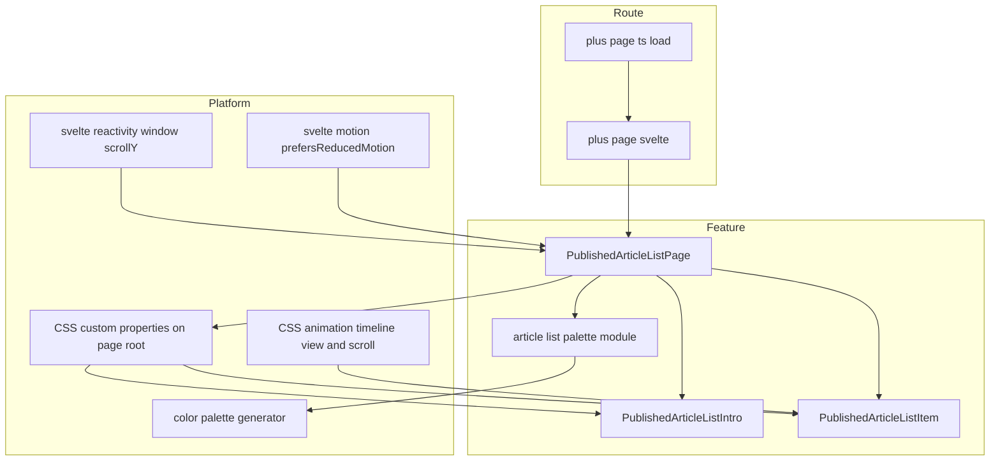
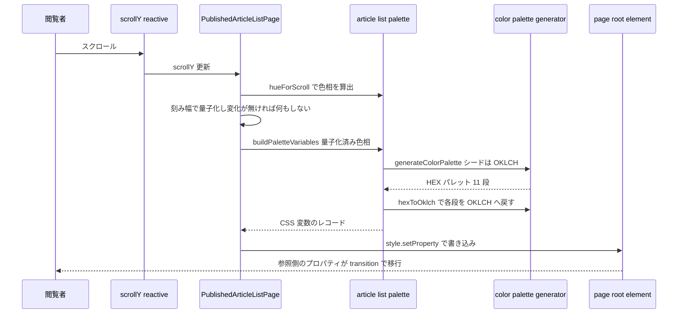
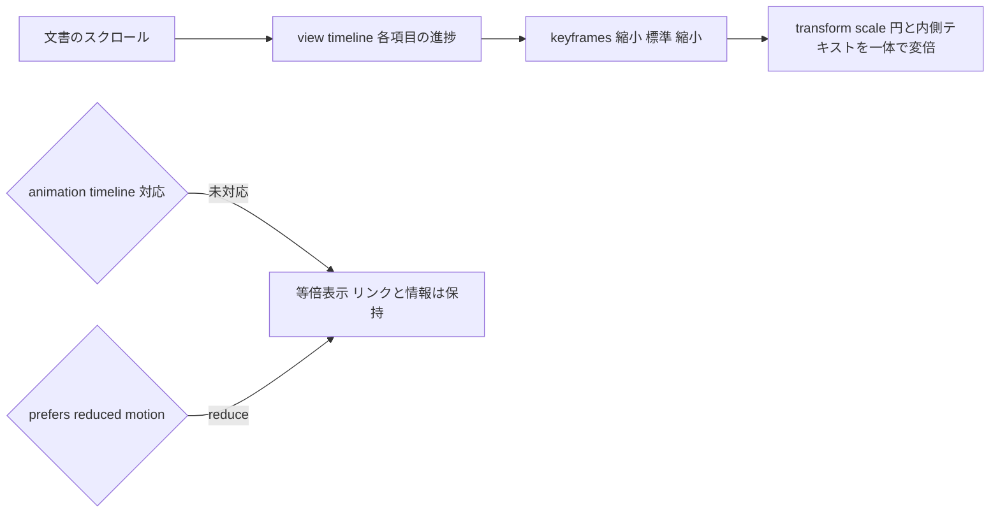

# Technical Design — public-index-page-redesign

## Overview

**Purpose**: 公開トップページ（ルート `/`）を、公開済み記事 1 件を 1 つの円として提示する 2 領域構成へ全面的にリデザインする。円は biotope（箱庭生態系）の生息域になぞらえた形であり、「複数の立場がそれぞれの居場所を持って成り立っている場」を入口の体験そのもので伝える。

**Users**: 未認証を含む一般閲覧者。左の紹介領域でサービスの位置づけを把握しつつ、右で円としてスクロールしてくる記事から読みたいものを選び `/articles/[topicId]` へ進む。

**Impact**: データ取得経路（`+page.ts` の `load` → `fetchPublishedTopics`）は変更しない。変わるのは表示層のみで、(1) 縦積みリスト → 2 領域 + 円、(2) スクロール連動の変倍を **CSS scroll-driven animation** で導入、(3) 配色を固定値から **スクロール連動で色相が巡るパレット**へ置き換える。既存コンポーネントに直書きされたスタイル値（`max-width: 720px` 等）はこの改修で解消する。

### Goals

- 記事 1 件＝1 つの円として提示し、円の内側で種別・タイトル・公開日を読み取れる状態にする。
- スクロールに連動して円が下から上へ移動し、下で小さく・中央で標準・上で小さくなる変倍を、円と内側テキストが一体で変倍される方式で実現する。
- 配色を単一の基調色に固定せず、スクロールに応じて色相が巡る状態にする。色の移行は OKLCH の色相補間で滑らかに行う。
- 演出が記事への到達性を損なわない（キーボード到達・文書構造・動きの抑制設定）。

### Non-Goals

- 背景に討論本文の断片を流す演出、およびそのための編集工程でのフレーズ抽出・保存（後続の別仕様）。
- 記事ページ `/articles/[topicId]` の情報設計変更、`PublicTemplate` の変更。
- 検索・絞り込み・カテゴリ・ページネーション。
- Firestore スキーマ・`firestore.rules` の変更、公開読み取りモデルの拡張（本設計では不要と確定。後述 Data Models）。

## Boundary Commitments

### This Spec Owns

- 公開トップページの DOM 構造・レイアウト・BEM セレクタ・状態表示（読み込み中／0 件／取得失敗）。
- 一覧項目 1 件分の表現（`PublishedArticleListItem`。名前は維持）。
- スクロール量 → 色相 → CSS カスタムプロパティという配色の供給経路と、その CSS 変数契約。
- 画面に現れる円をすべて記事に対応させること（模様としての円は置かない）。
- スクロール連動の変倍・移動の CSS 定義とフォールバック条件。

### Out of Boundary

- `src/routes/+page.ts` の `load` と `fetchPublishedTopics`（本設計では無変更）。
- `PublishedTopic` 型（無変更）。
- `PublicTemplate.svelte`（本ページでは使用しない。記事ページ専用として無変更）。
- `firestore.rules`、`topics` のスキーマ、AI 生成パイプライン。
- グローバルスタイル（`src/lib/assets/styles/**`）の既存定義。

### Allowed Dependencies

- `@14ch/color-palette-generator`（新規依存）— パレット生成と OKLCH 変換。
- `svelte/reactivity/window`（`scrollY` / `innerHeight`）、`svelte/motion`（`prefersReducedMotion`）— Svelte 5 標準 API。
- `$app/state`（`navigating`）— クライアント遷移時の読み込み中表示。
- `dayjs` — 公開日の整形（既存利用の踏襲）。
- 依存方向: `article-list-palette.ts`（純関数・定数）→ `PublishedArticleListPage.svelte`（画面のオーケストレーション）→ 子コンポーネント。子から親・横断への依存を作らない。

### Revalidation Triggers

- CSS カスタムプロパティの契約（段ごとの `--published-article-list-{level}`）の形状変更。
- 円のリンク先 URL（`/articles/[topicId]`）の変更。
- `PublishedTopic` の形状変更。
- `PublicTemplate` を本ページで使う方針へ変えた場合（記事ページとの共有関係が復活する）。

## Architecture

### Existing Architecture Analysis

- `src/routes/+page.ts` の universal `load` が `fetchPublishedTopics()` を呼び `{ topics: PublishedTopic[]; loadError: boolean }` を返す。SSR でデータ込みの HTML を返す構成は既に成立している。
- `src/routes/+page.svelte` は `PublishedArticleListPage` を差し込むだけの最小ラッパー（規約適合済み。無変更）。
- `PublishedArticleListPage` は `PublicTemplate` の中で縦積みリストを描画し、`navigating.to` / `loadError` / 0 件で分岐する。状態分岐の構造は踏襲する。
- `PublicTemplate` は `height: 100vh` のグリッドと `overflow-y: auto` の内側スクローラを持ち、ヘッダーにロゴを置く。記事ページと共有。**グローバルスタイルが文書スクロールを止めているため、公開ページはこの「内側スクローラ」方式が前提になっている。** 本ページは `PublicTemplate` を使わないが、スクローラを内側に持つ点は踏襲する。
- 既存の公開コンポーネントにはスタイル値の直書きが残る（`.kiro/steering/conventions.md` 違反）。

### Architecture Pattern & Boundary Map



**Architecture Integration**:

- **Selected pattern**: 演出を 2 系統に分離する。**位置と大きさは CSS のスクロール駆動アニメーションが持ち、色は JS が間引いて供給する CSS カスタムプロパティが持つ**。両者は同じスクロールを参照するが実行経路が独立しており、色の計算が変倍の追従を妨げない（Req 5.16）。
- **Domain boundaries**: 画面のオーケストレーション（スクロール購読・パレット適用）は `PublishedArticleListPage` に直接置く（`.kiro/steering/structure.md`「画面の操作はその画面のコンポーネントに直接書く」）。色相とパレットの算出だけを純関数モジュールへ切り出す（テスト可能性のため）。`models/` には何も置かない（ドメインデータではないため）。
- **Existing patterns preserved**: `+page.svelte` は最小ラッパー、公開型は `Published*`、Admin 型・`topicsStore` に依存しない、テストは `src/tests/` にミラー配置。
- **New components rationale**: `PublishedArticleListIntro`（紹介領域は独立した意味単位で、モバイルで別レイアウトになる）、`article-list-palette.ts`（スクロール量 → 色相 → CSS 変数の変換を純関数化しユニットテスト可能にする）。
- **Steering compliance**: BEM（Block はコンポーネント名の kebab-case）、コンポーネントにスタイル値を書かない（値は 1 か所の「デザイン値」ブロックと CSS カスタムプロパティに集約）、過度な共通化をしない（本ページ専用の部品は本ページのディレクトリに置く）、Svelte の仕様は svelte MCP で裏取り済み。

### Technology Stack

| Layer | Choice / Version | Role in Feature | Notes |
|-------|------------------|-----------------|-------|
| Frontend | SvelteKit 2.x / Svelte 5.54（runes） | ページ・状態分岐・スクロール購読 | `svelte/reactivity/window` は 5.11+、`prefersReducedMotion` は 5.7+ で利用可 |
| Styling | CSS scroll-driven animations（`animation-timeline: view()`） | 円の変倍 | 対応率約 85%。`@supports` フォールバック必須 |
| Styling | CSS カスタムプロパティ + `transition` | 色の移行 | カスタムプロパティを書き換えると、それを参照するプロパティの計算値が変わり transition が成立する。`@property` の登録は不要 |
| Color | `@14ch/color-palette-generator` ^1.0.2（新規依存） | 色相ごとのパレット生成・OKLCH 変換・ガマットマッピング | `culori` を内部依存に持つ |
| Data | 既存 `fetchPublishedTopics` / `publicDb` | 公開記事一覧の SSR 取得 | 本設計では無変更 |

## File Structure Plan

### Directory Structure

```
src/lib/features/public/article-list/
├── PublishedArticleListPage.svelte       # 2領域レイアウト・状態分岐・メタ・パレット適用（既存を刷新）
├── PublishedArticleListIntro.svelte       # 紹介領域: ロゴ(h1) + サービス概要（新規）
├── PublishedArticleListItem.svelte        # 記事1件＝円（既存を刷新・名前は維持）
└── article-list-palette.ts                # スクロール量→色相→CSS変数の純関数と値の定数（新規）

src/tests/features/public/article-list/
├── article-list-palette.test.ts           # 純関数のユニットテスト（新規）
└── PublishedArticleListItem.svelte.spec.ts # 円の内容とリンク先（既存を更新）
```

### Modified Files

- `src/lib/features/public/article-list/PublishedArticleListPage.svelte` — `PublicTemplate` の使用をやめ 2 領域レイアウトへ。スクロール購読とパレット適用を追加。直書きスタイル値を「デザイン値」ブロックへ集約。
- `src/lib/features/public/article-list/PublishedArticleListItem.svelte` — 円のマークアップ（種別ラベル・タイトル・公開日）と変倍アニメーションへ。直書きスタイル値を除去。
- `package.json` — `@14ch/color-palette-generator` を `dependencies` に追加。

### Unchanged (明示)

`src/routes/+page.svelte` / `src/routes/+page.ts` / `published-topics.ts` / `published-topic.types.ts` / `PublicTemplate.svelte` / `firestore.rules` / `src/lib/assets/styles/**`。

## System Flows

### 配色の供給フロー（スクロール → 色相 → CSS）



- **間引き**: 色相を刻み幅で量子化した値を `$derived` に置き、その値が変わったときだけ `$effect` が発火する。スクロールイベントごとの再生成は起きない（Req 5.15）。
- **補間**: JS が書くのは離散的な色。連続的な見えは CSS の `transition` が担う（Req 5.17, 5.18）。移行するのは色そのものなので、色相ごとに調整された明度・彩度も一体で移行する（Req 5.19）。移行中に次の色が来ても、CSS の transition は現在値から継続する（Req 5.21）。

### 円の変倍フロー（CSS のみ）



## Requirements Traceability

| Requirement | Criteria IDs | Components | Interfaces / Mechanisms |
|-------------|--------------|------------|-------------------------|
| 1 2 領域のページ構成 | 1.1, 1.2, 1.3, 1.4 | `PublishedArticleListPage`, `PublishedArticleListIntro` | グリッドレイアウト、紹介領域の `position: sticky`、admin リンクを描画しない |
| 2 記事を円として表現 | 2.1, 2.2, 2.3, 2.4, 2.5 | `PublishedArticleListItem` | `PublishedTopic` props、`href="/articles/{id}"`、固定文言の種別ラベル、タイトルの行数制限 |
| 3 スクロール連動の移動と変倍 | 3.1, 3.2, 3.3, 3.4, 3.5, 3.6, 3.7, 3.8, 3.9, 3.10, 3.11, 3.12 | `PublishedArticleListItem`, `PublishedArticleListPage` | `animation-timeline: view()` + `animation-range`、`transform: scale()`、`--published-article-list-item-index` による水平位置、一覧前後の `--published-article-list-edge-padding` |
| 4 記事件数で完結する流れ | 4.1, 4.2, 4.3, 4.4 | `PublishedArticleListPage` | `data.topics` を 1 回だけ `{#each}`、`fetchPublishedTopics` の降順を維持、文書フローの高さがスクロール長になる |
| 5 色相の変化 | 5.1, 5.2, 5.3, 5.4, 5.5, 5.6, 5.7, 5.8, 5.9, 5.10, 5.11, 5.12, 5.13, 5.14, 5.15, 5.16, 5.17, 5.18, 5.19, 5.20, 5.21, 5.22, 5.23, 5.24 | `article-list-palette.ts`, `PublishedArticleListPage` | `buildPaletteVariables`、段ごとの `oklch()` カスタムプロパティ、参照側プロパティの `transition`、`@supports` / `prefers-reduced-motion` 分岐 |
| 6 取得状態の表示 | 6.1, 6.2, 6.3, 6.4 | `PublishedArticleListPage` | `navigating.to` / `data.loadError` / `data.topics.length === 0` の分岐を記事領域の中に描画 |
| 7 モバイル表示 | 7.1, 7.2, 7.3, 7.4 | `PublishedArticleListPage`, `PublishedArticleListIntro`, `PublishedArticleListItem` | 単一カラムへの切り替え、紹介領域の圧縮、変倍は維持 |
| 8 アクセシビリティとモーション配慮 | 8.1, 8.2, 8.3, 8.4, 8.5 | 全コンポーネント | 文書順の `ul`/`li`/`a`、ネイティブフォーカス、`@media (prefers-reduced-motion: reduce)` |
| 9 スタイル記述の規約適合 | 9.1, 9.2, 9.3, 9.4, 9.5 | 全コンポーネント | BEM、デザイン値ブロック 1 か所、`+page.svelte` 無変更 |
| 10 既存の公開挙動の非回帰 | 10.1, 10.2, 10.3, 10.4, 10.5, 10.6 | `+page.ts`（無変更）, `PublishedArticleListPage` | 既存 `load` の維持、`<svelte:head>` のメタ、決定的な水平位置による SSR 一致 |

## Components and Interfaces

| Component | Domain/Layer | Intent | Req Coverage | Key Dependencies | Contracts |
|-----------|--------------|--------|--------------|------------------|-----------|
| `article-list-palette.ts` | Feature(logic) | スクロール量から色相を決め、CSS 変数のレコードを組み立てる | 5.3–5.12, 5.19, 5.20, 5.24 | `@14ch/color-palette-generator` (P0) | Service, State |
| `PublishedArticleListPage.svelte` | UI(public) | 2 領域レイアウト・状態分岐・メタ・パレット適用 | 1.x, 4.x, 5.14–5.16, 5.23, 5.24, 6.x, 7.x, 9.x, 10.3, 10.4 | `article-list-palette` (P0), `scrollY` / `innerHeight` (P0), `prefersReducedMotion` (P1), `navigating` (P1) | State |
| `PublishedArticleListIntro.svelte` | UI(public) | ロゴとサービス概要の提示 | 1.2, 7.2, 8.5 | — | State |
| `PublishedArticleListItem.svelte` | UI(public) | 記事 1 件を円として提示しリンクする | 2.x, 3.2–3.4, 3.8, 3.9, 3.11, 3.12, 7.3, 8.2 | `PublishedTopic` (P0), `dayjs` (P2) | State |

### Feature Logic

#### article-list-palette.ts

| Field | Detail |
|-------|--------|
| Intent | スクロール量 → 色相 → CSS カスタムプロパティのレコード、という純粋な変換を担う |
| Requirements | 5.3, 5.4, 5.5, 5.6, 5.7, 5.8, 5.9, 5.10, 5.11, 5.12, 5.19, 5.20, 5.24 |

**Responsibilities & Constraints**

- スクロール量と画面高から色相角を決める（1 画面あたり一定量。記事件数に依存しない）。
- 色相角から `generateColorPalette` でパレットを生成し、各段を `hexToOklch` を経て `oklch(L C H)` 記法の文字列へ変換し、CSS 変数のレコードとして返す。
- DOM に触れない。副作用を持たない。`window` を参照しない（SSR 安全）。
- 色相の起点・1 画面スクロールあたりの変化量・間引き幅・パレット生成の設定を、この 1 モジュールの名前付き定数として公開する（Req 5.24 の「値の指定点」）。

**Dependencies**

- External: `@14ch/color-palette-generator` — `generateColorPalette` / `hexToOklch` / `SCALE_LEVELS`（P0）

**Contracts**: Service [x] / State [x]

##### Service Interface

```typescript
// src/lib/features/public/article-list/article-list-palette.ts

/** CSS カスタムプロパティ名 → oklch() 記法の色。page ルート要素へそのまま setProperty する。 */
export type PaletteVariables = Readonly<Record<string, string>>;

/** スクロール量と画面高から色相角（度）を返す。1 画面スクロールするごとに一定量だけ回る。 */
export const hueForScroll: (scrollY: number, viewportHeight: number) => number;

/** 色相角を間引き幅で量子化する。 */
export const quantizeHue: (hue: number) => number;

/** 色相角からページ全体の配色を組み立てる。 */
export const buildPaletteVariables: (hue: number) => PaletteVariables;
```

- **Preconditions**: なし。`viewportHeight` が 0 以下なら起点の色相を返す（SSR・測定前）。
- **Postconditions**:
  - `hueForScroll` は `scrollY` に対して単調。同じスクロール位置には常に同じ値（Req 5.14）。
  - **色相の変化速度は「1 画面スクロールあたり N 度」で一定**。記事件数やページの高さに依存しない（Req 5.3）。
  - `buildPaletteVariables(hue)` は `SCALE_LEVELS`（50, 100, 200, 300, 400, 500, 600, 700, 800, 900, 950）の各段について 1 つずつ、計 11 個の色を返す。
  - 返る値はすべて `oklch(<L> <C> <H>)` 記法の文字列（Req 5.12）。
- **Invariants**:
  - 色空間の変換を自前で実装しない。OKLCH ↔ HEX はライブラリの関数のみを使う（Req 5.6）。
  - **色を明度・彩度・色相へ分解して別々に扱わない**。ライブラリは色相ごとに明度・彩度も作り替えているため、分解すると移行の間そのトーン均衡が崩れる（Req 5.19）。
  - 生成に用いるシードは `seedOklch`（色相のみ可変、明度・彩度は定数）で与える。

##### State Management

CSS 変数の契約（page ルート要素に書かれ、子孫が継承する）:

| 変数 | 値 | 意味 |
|------|-----|------|
| `--published-article-list-{level}` | `oklch(L C H)` | その段の色。`{level}` は 50 / 100 / 200 / … / 950 |

移行は、これらを参照するプロパティ側に `transition` を掛けることで成立する。カスタムプロパティ自体は補間されないが、参照するプロパティの計算値が変わるため transition が発火する。`@property` の登録は不要。

```
.published-article-list-page {
  background-color: var(--published-article-list-background);
  transition: background-color var(--published-article-list-color-transition-duration);
}
```

**Implementation Notes**

- Integration: `generateColorPalette` は HEX を返す。`applyColorPaletteToDom` は HEX のまま書くため使用しない（HEX は sRGB 系記法として扱われ補間が sRGB で行われうる。Req 5.12）。返る 5 個のエイリアス（`--{prefix}-color` 等）は `var()` 参照なので、役割の割り当ては本仕様の CSS 側で行う。
- Validation: `hexToOklch` は `undefined` を返しうる。段の変換に失敗した場合はその段を省き、CSS 側のフォールバック値が使われるに任せる（画面全体を落とさない）。
- Risks: transition の補間空間は Oklab（直交系）で、transition には色空間を指定する構文が無い。中間色の彩度は 1 ステップの色相差 `Δh` に対して `cos(Δh/2)` 倍になる。間引き幅を小さく保つことで知覚されない範囲に収める（Req 5.20）。間引き幅を大きく調整する際はここが顕在化する。

### UI (public)

#### PublishedArticleListPage.svelte

| Field | Detail |
|-------|--------|
| Intent | 2 領域レイアウトを組み、状態を分岐し、スクロールに応じたパレットをルート要素へ適用する |
| Requirements | 1.1, 1.3, 1.4, 4.1, 4.2, 4.3, 4.4, 5.14, 5.15, 5.16, 5.23, 6.1, 6.2, 6.3, 6.4, 7.1, 7.2, 9.1, 9.3, 9.4, 10.3, 10.4, 10.6 |

**Responsibilities & Constraints**

- props は既存どおり `{ data: { topics: PublishedTopic[]; loadError: boolean } }`。
- DOM 構造（`ul` / `li` / `a` の文書順）は演出に関係なく常に同じ。SSR とクライアントで一致する（Req 10.4, 8.1）。
- 紹介領域は `position: sticky` で画面内に留める（Req 1.3）。モバイルでは単一カラムに切り替え、紹介領域を圧縮する（Req 7.2）。
- **一覧の前後に余白を置く（`--published-article-list-edge-padding`）。** 円は通常の文書フローに置かれるため、余白が無いと**先頭と末尾の記事だけが画面中央に到達できず、標準サイズで表示されない**。余白は演出上の必須要素である。必要量は「ビューポート高の半分から円の半径を引いた分」に相当し、値としてユーザーが決める（Req 3.10）。スクロールできる長さはこの余白を含めた合計で決まり、それを超える空領域は作らない（Req 4.4）。
- 管理機能への導線を描画しない（Req 1.4）。

**Contracts**: State [x]

##### State Management

```typescript
let rootElement = $state<HTMLElement | undefined>();

const steppedHue = $derived(quantizeHue(hueForScroll(scrollY.current ?? 0, innerHeight.current ?? 0)));

$effect(() => {
  // 動きの抑制が有効なら何も書かない。CSS のフォールバック色（起点の色相）が使われる（Req 5.23）
  // steppedHue が変わったときだけ発火する = 間引き（Req 5.15）
  // buildPaletteVariables(steppedHue) を rootElement へ setProperty
});
```

- **スクロールするのは文書ではなく記事の領域。** グローバルスタイル（`src/lib/assets/styles/common.scss` の「バウンス抑制」）が `html` / `body` を `position: fixed` + `overflow: hidden` で固定しているため、文書スクロールは発生しない。記事の領域に `overflow-y: auto` を与え、そこを唯一のスクローラとする。色相の入力もこのスクローラの `scrollTop` と `clientHeight` から取る（`window.scrollY` は動かない）。
- 紹介領域はスクローラと別のグリッドトラックに置くため、`position: sticky` を使わずに画面内へ留まる。
- `prefersReducedMotion` は Svelte 5 標準（`svelte/motion`）。サーバではスクロール量・スクローラ高とも 0 のままなので起点の色相になる。
- **レイアウトの測定を行わない。** 色相はスクロール量とスクローラの高さだけで決まるため、`scrollHeight` の読み取りも `ResizeObserver` も不要（高さは `bind:clientHeight` で受け取る）。
- 変化速度が件数に依存しないぶん、記事が少ないと巡る色相の幅は狭くなる。Req 5.5（複数の色相を巡る）は「1 画面あたりの変化量」を十分に大きく取ることで満たす — この値はユーザーが決める。

**Implementation Notes**

- Integration: `PublicTemplate` は使わない（`research.md` の決定を参照）。`<svelte:head>` の title / description / OGP は既存の内容を引き継ぐ（Req 10.3）。
- Integration: 状態分岐は既存構造を踏襲し、`navigating.to` → 読み込み中、`data.loadError` → 失敗、`topics.length === 0` → 0 件を **記事領域の中**に描画する。紹介領域は常に描画されるため、失敗時もページの枠が保たれる（Req 6.4）。
- Validation: 失敗表示には「時間をおいて再度お試しください」という次の行動を含める（Req 6.3）。
- Risks: 色を運ぶカスタムプロパティは page ルート要素に書かれ子孫へ継承されるため、`transition` は**色を実際に適用する各要素**に置く必要がある。役割変数を定義した要素側だけに置いても移行しない。

##### デザイン値ブロック（Req 9.3, 5.24）

コンポーネントは意味づけされた役割変数だけを参照し、値は `<style>` 先頭の 1 ブロックに集約する。ユーザーが編集する前提であることをコメントで明示する。

| 役割変数 | 用途 |
|----------|------|
| `--published-article-list-background` | ページ背景 |
| `--published-article-list-surface` | 円の面 |
| `--published-article-list-on-surface` | 円の中のテキスト |
| `--published-article-list-accent` | 種別ラベル・公開日 |
| `--published-article-list-intro-text` | ロゴ・概要文 |
| `--published-article-list-item-size` | 円の標準直径（変倍前の唯一の寸法定義） |
| `--published-article-list-item-scale-min` | 上下端での縮小率 |
| `--published-article-list-item-gap` | レイアウト上のスロット高。**直径より小さくしたぶんだけ円が重なる** |
| `--published-article-list-edge-padding` | 一覧の前後の余白。先頭・末尾の円が画面中央（標準サイズ）へ到達するために必須 |
| `--published-article-list-hue-transition-duration` | 色相の移行にかける時間 |

各役割変数は「段の指定」＋「JS 未実行時のフォールバック色」の形で定義する:

```
--published-article-list-surface: var(--published-article-list-50, <fallback>);
```

フォールバック色は色相の起点におけるパレットの値に合わせる。これにより SSR の初回描画とハイドレーション後で色が飛ばず、`oklch()` 非対応環境でも配色が成立する（Req 5.22, 10.4）。

#### PublishedArticleListItem.svelte

| Field | Detail |
|-------|--------|
| Intent | 記事 1 件を円として提示し、記事ページへリンクする |
| Requirements | 2.1, 2.2, 2.3, 2.4, 2.5, 3.2, 3.3, 3.4, 3.8, 3.9, 3.11, 3.12, 7.3, 8.2, 9.2 |

**Contracts**: State [x]

**Implementation Notes**

- Props: `{ topic: PublishedTopic }`（現行を維持）。
- マークアップ: `<a href="/articles/{topic.id}">` の内側に種別ラベル（固定文言「AI討論」）・`<h2>` タイトル・公開日。円形は CSS（`aspect-ratio` と `border-radius`）で与える。
- **変倍**: `animation-timeline: view()` と `animation-range` を `<a>` に与え、`@keyframes` で `scale()` を 0%（`--…-item-scale-min`）→ 50%（1）→ 100%（`--…-item-scale-min`）と定義する。`<a>` を丸ごと変倍するため、円の直径と内側テキストの比は拡大率によらず一定（Req 3.8）。フォントサイズや直径を拡大率から個別に計算しない（Req 3.9）。
- **水平位置**: `<li>` に `--published-article-list-item-index` を渡し、CSS が `translateX` を決める。インデックスは配列の並び順から決まる決定的な値であり、再描画・再訪で変わらない（Req 3.6）。乱数を使わないため SSR とクライアントで一致する（Req 10.4）。`translateX` は `<li>`、`scale()` は `<a>` と分けて持たせ、変倍のキーフレームが水平位置を上書きしないようにする。
- **フォーカス時の到達位置**: 項目に `scroll-margin-block` を与え、キーボードフォーカスによるスクロールの着地点を画面の端から離す。着地点が縮退の効いていない領域に入れば、その項目は標準サイズで表示される（Req 8.2, 8.3）。`:focus-visible` で変倍を打ち消すような特殊分岐は設けない — 位置が正しければ大きさは `view()` の進捗から自動的に決まるため。
- タイトルは行数制限で円の内側に収める（Req 2.4）。項目の高さは変倍前の 1 通りの寸法で決まるため、記事ごとの情報量が他の円に影響しない（Req 2.5）。
- **重なりの生まれ方**: `transform: scale()` はレイアウトに影響しないため、円が占めるレイアウト上のスロット高は変倍前の寸法（`--published-article-list-item-gap`）で決まり、**視覚上の直径とは独立**する。したがって**スロット高を直径より小さく取ったぶんだけ円が重なる**。重なり量はこの 1 つの値で決まり、位置の補正は行わない（Req 3.11）。
- **重なり順**: `transform` は重ね合わせコンテキストを作る。`z-index: auto` の重ね合わせコンテキスト同士は文書順に描画されるため、**後ろの項目＝公開日が古い記事が手前に来る**。円の面は不透明なので手前の内容は読み取れる（Req 3.12）。新しい記事を手前にしたい場合は `--published-article-list-item-index` から `z-index` を導いて反転できる（どちらにするかは値の決定と同じくユーザーが選ぶ）。
- フォールバック: `@supports not (animation-timeline: view())` と `@media (prefers-reduced-motion: reduce)` の両方で変倍を無効化し等倍にする（Req 8.4）。分岐先は同一。

#### PublishedArticleListIntro.svelte

Summary-only（新しい境界なし）。

**Implementation Notes**

- ロゴは `<h1>` として置く（ページ唯一の h1。項目タイトルの `<h2>` と階層が通る。Req 8.5）。
- サービス概要は短い説明文の段落。文言はモックアップの「多様な視点を持ったAIペルソナが討論する実験コンテンツです。」を起点とし、ユーザーが確定する。
- 管理機能へのリンクを含めない（Req 1.4）。

#### 記事に対応しない円を置かないこと

当初は背景に記事と無関係な装飾の円を漂わせる計画で `PublishedArticleListDecoration.svelte` を設けたが、
**「円はすべてトピックに対応する」というユーザーの判断により廃止した。**

- 画面に現れる円は `PublishedArticleListItem` が描く記事の円だけとする。
- 記事に対応しない要素を置かないため、`aria-hidden` を必要とする描画は存在しない。
- 役割変数 `--published-article-list-decoration` とその寸法・個数の値も削除した。

## Data Models

本設計はデータモデルを変更しない。

- `PublishedTopic = { id: string; title: string; publishedAt: Date }` をそのまま用いる。円の内側に必要な情報（種別ラベルは固定文言、タイトル、公開日）はこの 3 フィールドで足りる。
- `fetchPublishedTopics` の公開限定クエリ・降順ソートをそのまま利用する（Req 4.2, 10.1）。
- Firestore のスキーマ・インデックス・`firestore.rules` は変更しない。
- 要件の Boundary にあった「公開読み取りモデルの拡張」は、背景テキストが別仕様へ切り出された結果 **不要** と確定した。

## Error Handling

### Error Strategy

取得系のエラー処理は既存の設計（`load` で捕捉し `loadError` として渡す）を踏襲する。本設計で新たに増えるのは**演出の縮退**であり、いずれもページ全体を落とさない。

| 事象 | 挙動 | 要件 |
|------|------|------|
| 一覧取得の失敗 | `+page.ts` が `{ topics: [], loadError: true }` を返し、記事領域に失敗表示と次の行動を描画。紹介領域は保持 | 6.3, 6.4 |
| 公開記事 0 件 | 例外ではなく空配列。記事領域に「まだ無い」旨を描画 | 6.2 |
| `animation-timeline` 未対応 | `@supports` で変倍を無効化し等倍表示。リンクと情報は完全に保つ | 8.1, 8.4 |
| `oklch()` 記法・色の transition 未対応 | 役割変数のフォールバック色が使われる、または移行なしで色が切り替わる。配色と可読性は成立 | 5.22 |
| `hexToOklch` が段の変換に失敗 | その段の変数を書かず、CSS のフォールバック値に委ねる | 5.22 |
| `prefers-reduced-motion: reduce` | 変倍を止める。パレットを一切書き換えず、CSS のフォールバック色（起点の色相）で固定する | 5.23, 8.4 |

### Monitoring

本ページ固有の監視は設けない。演出の縮退は例外ではなく正常系の分岐として扱う。

## Testing Strategy

### Unit Tests（Vitest node）

- `hueForScroll`: スクロール量に対して単調に増加し、同じ入力に同じ値を返す。1 画面ぶんスクロールすると設定した度数だけ回る。画面高が 0 のときは起点の色相を返す。
- `quantizeHue`: 刻み幅の内側では同じ値を返し、跨いだときだけ値が変わる。
- `buildPaletteVariables`: 全 11 段のキーを含み、値がすべて `oklch(L C H)` 記法の文字列である。HEX を含まない（Req 5.12）。
- `buildPaletteVariables`: 異なる色相で呼ぶと、色相だけでなく明度・彩度も段ごとに変わりうる（ライブラリの調整が素通しされていることの回帰検知。分解・固定していないことを保証する）。

### Component Tests（Vitest browser）

- `PublishedArticleListItem`: 種別ラベル「AI討論」・タイトル・整形済み公開日を表示し、リンク先が `/articles/{id}` になる。
- `PublishedArticleListItem`: `--published-article-list-item-index` が `<li>` に渡り、同じ入力で同じ値になる。
- `PublishedArticleListPage`: `loadError` / 0 件 / 通常の 3 状態が記事領域の中に描画され、いずれの状態でも紹介領域が描画される。

### Manual / Integration

- **[実装の先頭] `animation-timeline: view()` の実機確認**: 対象ブラウザで円が下→中央→上の順に想定どおり変倍するか。ここが通ってから残りの CSS に進む。
- **[実装の先頭] 色の移行の実機確認**: ルート要素のカスタムプロパティを書き換えたときに、それを参照する各要素の `background-color` / `color` が `transition` で移行するか。移行しない要素があれば `transition` の宣言位置を見直す。
- 色相を 12 分割程度でサンプリングし、円の中のテキスト／概要文のコントラスト比を実測する（Req 5.9, 5.13）。
- キーボードの Tab で全記事へ到達でき、画面外の円へ移動したときにスクロールが追従する。**着地した円が標準サイズで表示される**（縮退した状態でフォーカスが止まらない）。先頭・末尾の項目でも同様であることを確認する（Req 8.2, 8.3）。
- `prefers-reduced-motion: reduce` を有効にして、変倍が止まり、スクロールしても配色が起点の色相のまま変わらない（Req 5.23）。
- モバイル実機で単一カラム・紹介領域の圧縮・変倍の維持・タッチスクロールを確認する（Req 7.x）。
- 記事 1 件・0 件のときに空のスクロール領域が生じないことを確認する（Req 4.4）。

## Performance & Scalability

- パレット再生成は色相の刻みを跨いだときのみ発生する。スクロールイベントごとの計算は行わない（Req 5.15）。
- 円の変倍は CSS のスクロール駆動アニメーションであり、コンポジタ側で処理される。パレット再生成（メインスレッド）と実行経路が独立しているため互いを妨げない（Req 5.16）。
- 色相はスクロール量と画面高だけで決まり、レイアウトの測定を伴わない。スクロール中に `scrollHeight` を読まないためレイアウトの強制同期が発生しない。
- 1 回の適用で書き込む CSS カスタムプロパティは 11 個（段の数）。単一要素への `setProperty` であり、刻みを跨いだときだけ実行される。

## Security Considerations

- 公開読み取りの境界は既存のまま（`firestore.rules` の `published == true`）。本設計は読み取りを増やさない。
- 認証・管理操作の導線を公開ページに含めない（Req 1.4）。
- 新規依存 `@14ch/color-palette-generator` はクライアントでの色計算のみに用い、ネットワークアクセスや外部送信を行わない。
