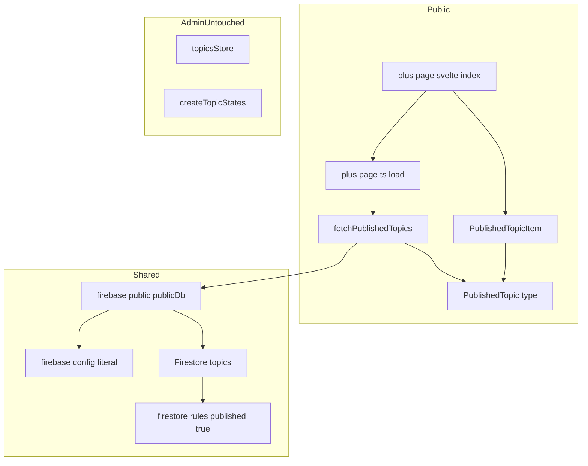
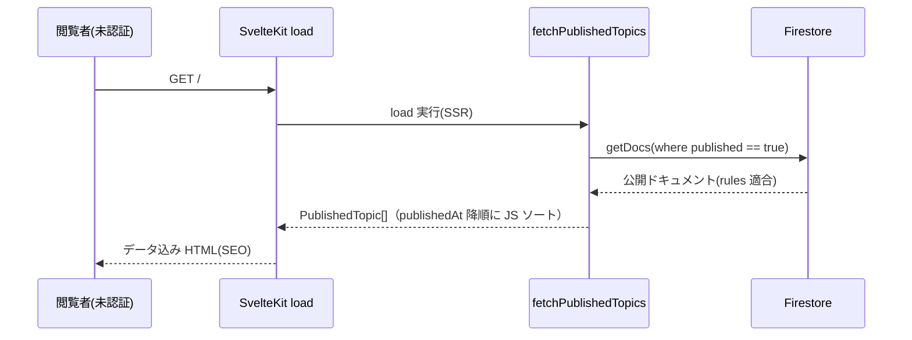

# Technical Design — public-index-page

## Overview

**Purpose**: 閲覧者が公開済みの討論記事を見つける入口となる公開インデックスページを、記事インデックスを主役として成立させる。

**Users**: 未認証を含む一般閲覧者が、ルート `/` で公開記事の一覧を見て、読みたい記事（`/articles/[topicId]`）へ進む。

**Impact**: 現在の公開トップ（`src/routes/+page.svelte`）は管理用 `topicsStore` の全件購読に依存しており、`published == true` のみ許可する firestore.rules 下で**未認証クエリが拒否される**（実質、匿名で機能しない）。本設計は、公開専用の読み取りモデル `PublishedTopic` と `published` 限定の SSR 取得へ置き換え、管理系（`topicsStore` / `createTopicStates` / `TopicStates` / `*ForFirestore`）から型・データ経路ごと分離する。

### Goals
- 未認証の閲覧者が公開記事一覧を閲覧できる（rules 適合の限定クエリ）。
- 公開型を Admin 型から完全分離する（`Published` 接頭辞。本仕様は `PublishedTopic`）。
- steering の「公開ページは SSR で SEO 確保」に沿い、universal `load` で SSR 配信する。

### Non-Goals
- 記事ページ（`/articles/[topicId]`）本体の新設・変更（別仕様。本ページは入口リンクのみ）。
- サービス説明（About）ページ（別仕様）。本インデックスには説明を主要コンテンツとして置かない。
- 検索・絞り込み・カテゴリ・ページネーション。
- realtime 更新（`onSnapshot`）。公開一覧は一回取得とする。

## Boundary Commitments

### This Spec Owns
- 公開インデックスページ（ルート `/`）の表示・状態（読み込み中／空／取得失敗）・レスポンシブ・メタ情報。
- 公開読み取りモデル `PublishedTopic` と、その取得・射影（`topics` ドキュメント → `PublishedTopic`）。
- 公開専用の一覧項目コンポーネント（`TopicStates` 非依存）。
- 一覧項目のリンク先を `/articles/[topicId]` とする契約（入口リンクのみ）。

### Out of Boundary
- 記事ページ `/articles/[topicId]` の実装（別仕様）。
- サービス説明ページ（別仕様）。
- firestore.rules の変更（既存の `published == true` を前提に利用するのみ）。
- 管理側（admin）画面・`topicsStore` の構造（一切変更しない）。

### Allowed Dependencies
- Firestore Client SDK（`$lib/firebase-public` の `publicDb`・Firestore 専用）— 読み取りのみ。公開経路は `$lib/firebase`（Auth/Functions 込み）に依存しない。
- SvelteKit universal `load`（`+page.ts`）。
- `@14ch/svelte-ui`（必要な範囲）。
- 依存方向: `models`（`Published*` 型・取得）→ `routes/+page.ts`（load）→ `+page.svelte`（UI）→ `features` の公開項目コンポーネント。公開経路は Admin 型に依存しない（逆方向・横断依存禁止）。

### Revalidation Triggers
- `PublishedTopic` の形状変更（後続の公開仕様が参照する場合）。
- 一覧リンクの URL 契約（`/articles/[topicId]`）の変更。
- firestore.rules の公開読み取り条件の変更（`published == true` 前提が崩れる場合）。
- SSR 方針（`+page.ts` の `ssr`）の変更。

## Architecture

### Existing Architecture Analysis
- 公開トップは `topicsStore`（`query(collection('topics'), orderBy('createdAt'))` + `onSnapshot`）を `onMount` で購読し、クライアントで `topic.published` 絞り込み。**未認証では rules によりクエリ全体が拒否される**（非公開ドキュメントを含みうるため）。
- 表示は `TopicListItem`（prop 型 `TopicStates`）。実使用は5フィールドのみで、管理用の生きたオブジェクトに過剰依存。利用箇所は公開トップ1箇所のみ。
- 本コードベースに `load` 実績はない（`admin/+layout.ts` の `ssr=false` のみ）。公開ページの SSR は steering 方針だが未実装。

### Architecture Pattern & Boundary Map



**Architecture Integration**:
- Selected pattern: **公開専用に新設（Option B）**。取得（`load`）・射影（`fetchPublishedTopics`）・表示（`+page.svelte` + `PublishedTopicItem`）を公開ドメインとして独立させる。
- Domain boundaries: 公開経路は `Published*` 型のみに依存。Admin（`topicsStore`/`createTopicStates`/`TopicStates`/`*ForFirestore`）とは型・データ経路を共有しない。
- Existing patterns preserved: 画面の処理は画面に書く／`models` は型・データロジック／`*.types.ts` は型と型ガードのみ（変換は取得関数にインライン）。
- New components rationale: `PublishedTopic`・`fetchPublishedTopics`・`PublishedTopicItem`・`+page.ts` は公開読み取りを Admin から分離するために必要。
- Steering compliance: 「公開型と管理型の分離（`Published` 接頭辞）」「公開ページは SSR で SEO」「過度な共通化をしない」。

### Technology Stack

| Layer | Choice / Version | Role in Feature | Notes |
|-------|------------------|-----------------|-------|
| Frontend | SvelteKit 2.x / Svelte 5 runes | 公開ページ・universal `load` | 本コードベース初の `load` 導入 |
| Data | Firestore Client SDK（`$lib/firebase-public` `publicDb`・Firestore 専用） | `published` 限定の一回取得（`getDocs`） | 公開 SSR 経路は Auth/Functions を初期化しない（SSR 安全化） |
| UI | `@14ch/svelte-ui` | 必要な表示要素 | 独自実装前に標準部品を優先 |
| Infra | Firebase App Hosting（`adapter-auto`） | SSR 配信（本仕様で確定） | UI 着手前に firebase の SSR load 動作を検証（実装先頭タスク） |

## File Structure Plan

### New Files
```
src/lib/
├── firebase-config.ts                          # firebaseConfig リテラルのみ（副作用なし。両 firebase が共有）
└── firebase-public.ts                          # Firestore 専用初期化。publicDb を export（Auth/Functions は初期化しない）
src/routes/
└── +page.ts                                   # universal load: fetchPublishedTopics を呼び data を返す
src/lib/models/published/
├── published-topic.types.ts                   # PublishedTopic 型（型と型ガードのみ）
└── published-topics.ts                         # fetchPublishedTopics(): publicDb で公開限定クエリ + 射影（変換はここにインライン）
src/lib/features/public/
└── PublishedTopicItem.svelte                   # 公開一覧項目（prop 型は PublishedTopic のみ）
```

### Modified Files
- `src/routes/+page.svelte` — `topicsStore`/`TopicListItem` 依存を除去。`load` の `data.topics`（`PublishedTopic[]`）から一覧描画。状態（loading/empty/失敗）・メタ情報・最小ヘッダー（サービス名のみ、説明文は置かない）を直接記述。
- `src/lib/firebase.ts` — `firebaseConfig` リテラルを `firebase-config.ts` から import に変更（Auth/Functions 初期化を含む既存の役割は据え置き。admin・一般経路用）。

### Removed Files
- `src/lib/features/topics/list/TopicListItem.svelte` — `TopicStates` 依存の異物。公開トップ1箇所でのみ使用され、`PublishedTopicItem` に置換して撤去。
- `src/tests/features/topics/list/TopicListItem.svelte.spec.ts` — 上記に伴い撤去（`PublishedTopicItem` の spec で置換）。

## System Flows



- 匿名でも通るのは `where('published','==',true)` がルール条件（`resource.data.published == true`）と一致するため。
- ソートは取得後 `publishedAt` 降順の JS ソート（複合インデックス不要）。
- 取得失敗時は `load` で捕捉し、ページが失敗状態を描画できる形（例: `{ topics: [], loadError: true }`）で返す。

## Requirements Traceability

| Requirement | Summary | Components | Interfaces | Flows |
|-------------|---------|------------|------------|-------|
| 1.1 | 公開済みのみ表示 | `fetchPublishedTopics` | `where('published','==',true)` | 取得シーケンス |
| 1.2 | 公開日時降順 | `fetchPublishedTopics` | `publishedAt` 降順 JS ソート | 取得シーケンス |
| 1.3 | 各項目にタイトル・公開日 | `PublishedTopicItem` | `PublishedTopic` | — |
| 1.4 | 記事ページへの遷移導線 | `PublishedTopicItem` | `href=/articles/{id}` | — |
| 1.5 | 非公開を表示しない | `fetchPublishedTopics` | 限定クエリ | — |
| 2.1 | 未認証で表示 | `+page.ts` load | universal load（認証不要） | — |
| 2.2 | 公開データのみ要求 | `fetchPublishedTopics` | 限定クエリ（非公開を要求しない） | 取得シーケンス |
| 2.3 | admin 導線なし | `+page.svelte` | 管理リンクを描画しない | — |
| 3.1 | 読み込み中表示 | `+page.svelte` | SSR 初回はデータ込み／クライアント遷移は `navigating` | — |
| 3.2 | 0件表示 | `+page.svelte` | `data.topics.length === 0` 分岐 | — |
| 3.3 | 取得失敗表示 | `+page.ts` / `+page.svelte` | `loadError` 分岐 | 取得シーケンス |
| 4.1 | メタ情報 | `+page.svelte` | `<svelte:head>`（title/description/OGP） | — |
| 4.2 | 説明を主要コンテンツにしない | `+page.svelte` | ヘッダーはサービス名のみ | — |
| 5.1 | レスポンシブ | `+page.svelte` / `PublishedTopicItem` | 相対幅・縦積みレイアウト | — |

## Components and Interfaces

| Component | Domain/Layer | Intent | Req Coverage | Key Dependencies | Contracts |
|-----------|--------------|--------|--------------|------------------|-----------|
| `PublishedTopic` | Models(public) | 公開一覧の最小読み取りモデル | 1.3 | — | State |
| `fetchPublishedTopics` | Models(public) | 公開限定クエリ＋射影＋ソート | 1.1,1.2,1.5,2.2 | `firebase-public` publicDb (P0) | Service |
| `+page.ts` load | Route | SSR 取得のオーケストレーション | 2.1,3.3 | fetchPublishedTopics (P0) | Service |
| `+page.svelte` | UI(public) | 一覧描画・状態・メタ・ヘッダー | 1.3,1.4,2.3,3.1–3.3,4.1,4.2,5.1 | load data (P0) | State |
| `PublishedTopicItem` | UI(public) | 1記事分の表示とリンク | 1.3,1.4,5.1 | PublishedTopic (P0) | State |

### Models (public)

#### PublishedTopic

| Field | Detail |
|-------|--------|
| Intent | 公開一覧の読み取り専用・最小射影 |
| Requirements | 1.3 |

**Contracts**: State [x]

##### State Management
```typescript
// src/lib/models/published/published-topic.types.ts（型と型ガードのみ）
export type PublishedTopic = {
	id: string;
	title: string;
	publishedAt: Date;
};
```
- `published` は載せない（公開クエリが true を保証）。`personaCount` も載せない（インデックスに不要）。
- `publishedAt` はアプリ層で常に `Date`（境界で Timestamp → Date 変換）。

#### fetchPublishedTopics

| Field | Detail |
|-------|--------|
| Intent | 公開済みトピックのみを取得し `PublishedTopic[]` に射影する |
| Requirements | 1.1, 1.2, 1.5, 2.2 |

**Dependencies**
- Outbound: Firestore `topics` — `getDocs`（P0）
- External: `$lib/firebase-public` `publicDb`（Firestore 専用・Auth/Functions 非初期化）（P0）

**Contracts**: Service [x]

##### Service Interface
```typescript
// src/lib/models/published/published-topics.ts
export const fetchPublishedTopics = (): Promise<PublishedTopic[]>;
```
- Preconditions: なし（未認証で呼べる）。
- Behavior: `query(collection(db,'topics'), where('published','==',true))` を `getDocs`。各ドキュメントを境界で `PublishedTopic` に射影（`publishedAt` を `Date` 化）。`publishedAt` 降順に JS ソートして返す。
- Postconditions: 返却は公開済みのみ。`published`/`personaCount` 等の Admin フィールドはアプリ層に漏らさない。
- Invariants: Admin 型（`TopicForFirestore`/`Topic`/`TopicStates`）を import しない。`$lib/firebase`（Auth/Functions 込み）も import せず、`$lib/firebase-public` の `publicDb` のみ使用する（SSR で Auth 初期化を巻き込まない）。`data()` から必要フィールドのみを最小型で読み取り射影する。

**Implementation Notes**
- Integration: 変換関数は本モジュールにインライン（`*.types.ts` には置かない）。
- Validation: `publishedAt` 欠落の理論上ケースは、射影時に安全側で除外またはソート末尾に寄せる（publish 操作が両フィールドを書くため通常発生しない）。
- Risks: firebase client SDK の SSR 実行（下記 Error/Testing 参照）。

### Route

#### +page.ts（universal load）

| Field | Detail |
|-------|--------|
| Intent | SSR 時に公開一覧を取得し `data` として渡す |
| Requirements | 2.1, 3.3 |

**Contracts**: Service [x]

##### Service Interface
```typescript
// src/routes/+page.ts
export const load = async (): Promise<{ topics: PublishedTopic[]; loadError: boolean }>;
```
- Behavior: `fetchPublishedTopics()` を await。成功で `{ topics, loadError: false }`、失敗は捕捉して `{ topics: [], loadError: true }`。
- Rationale: 失敗を throw して全体エラーページにせず、同一ページで友好的な失敗表示を出す（Req 3.3）。
- SSR 確定: `ssr` は既定（true）のまま SSR 配信を採用する。実装は「firebase client SDK が universal load の SSR 実行で正しく動作し、データ込み HTML を返す」ことの検証から着手する（Testing の先頭項目）。`export const ssr = false` は Req 4.1 の SEO 目的（メタのサーバ描画）を損なうため安易に採らない。万一 App Hosting 上で SSR 実行が不可能と判明した場合のみ設計を見直し、その際はページ固有メタを SSR される `+layout` 側へ退避する変更を伴う。

### UI (public)

#### +page.svelte（公開インデックス）
Summary-only（新しい境界なし。状態分岐と描画のみ）。

**Implementation Notes**
- Integration: `data.loadError` → 取得失敗表示、`data.topics.length === 0` → 0件表示、それ以外は `PublishedTopicItem` を各記事に描画。クライアント遷移の読み込み中は SvelteKit の `navigating` を用いてよい（SSR 初回はデータ込みで到達）。
- ヘッダーはサービス名（例: `logotope`）程度に留め、サービス説明文は置かない（Req 4.2）。管理導線は描画しない（Req 2.3）。
- メタ情報は `<svelte:head>` に title/description/OGP を静的付与（Req 4.1）。
- Validation: レイアウトは相対幅・縦積みでモバイル/デスクトップ両対応（Req 5.1）。

#### PublishedTopicItem.svelte
Summary-only（`PublishedTopic` を受け取り表示する presentational）。

**Implementation Notes**
- Props: `{ topic: PublishedTopic }`（`TopicStates` を参照しない）。
- 表示: タイトルと公開日（`publishedAt` を整形）。リンクは `/articles/{topic.id}`。
- 既存 `TopicListItem` の見た目は参考にしてよいが、型・依存は引き継がない。

## Data Models

### Physical Data Model（Firestore `topics/{id}` 読み取り）
- 本仕様はスキーマを変更しない。既存フィールドから射影で読むのみ:

| Field | Type | 用途 |
|-------|------|------|
| `title` | string | 一覧タイトル |
| `published` | boolean（既存） | クエリ絞り込み（`== true`）。アプリ層 `PublishedTopic` には載せない |
| `publishedAt` | Timestamp（既存） | 公開日表示・ソートキー（`Date` に変換） |

- インデックス: `firestore.indexes.json` は変更しない（JS ソートのため複合インデックス不要）。

## Error Handling

- **取得失敗（Req 3.3）**: `+page.ts` の `load` で `try/catch` し `{ topics: [], loadError: true }` を返す。`+page.svelte` が失敗メッセージを描画（全体エラーページにしない = graceful degradation）。
- **0件（Req 3.2）**: 例外ではなく空配列として扱い、空状態メッセージを表示。
- **rules 拒否**: 限定クエリ（`published == true`）により未認証でも拒否されない設計。万一の権限エラーは取得失敗として上記経路に集約。

## Testing Strategy

### Unit Tests
- `fetchPublishedTopics`: (a) `where('published','==',true)` で `getDocs` を呼ぶ、(b) `publishedAt` 降順に並ぶ、(c) `PublishedTopic` へ射影し `published`/`personaCount` を含めない、(d) Timestamp → Date 変換（Firestore をモック）。
- `PublishedTopicItem`: タイトル・公開日を表示し、リンク先が `/articles/{id}` になる（ブラウザ spec）。

### Integration / Manual
- **[前提・実装先頭] SSR 実行可否の検証**: `+page.ts` の universal load で firebase client SDK が SSR 実行され、データ込みの HTML（一覧を含む）が返ることをエミュレータ→App Hosting 相当で確認する。**ここが通ってから UI 実装に進む**（通らなければ設計見直し＝安易な `ssr=false` は採らない）。
- 未認証クライアントで `/` を開き、公開済みのみが一覧表示される（エミュレータ rules）。非公開・`published` 欠落は出ない。
- 0件・取得失敗の表示、モバイル/デスクトップ表示。

## Security Considerations
- 公開読み取りは firestore.rules（`published == true`）が唯一の境界。本ページはそれに適合する限定クエリのみを発行し、非公開データを要求しない。
- 公開 SSR 経路は Firestore 専用初期化（`firebase-public` の `publicDb`）のみを使い、Auth/Functions を初期化しない（SSR 安定化と、公開経路に不要な認証面を持ち込まないため）。
- 認証・管理操作の導線は公開ページに一切含めない。
