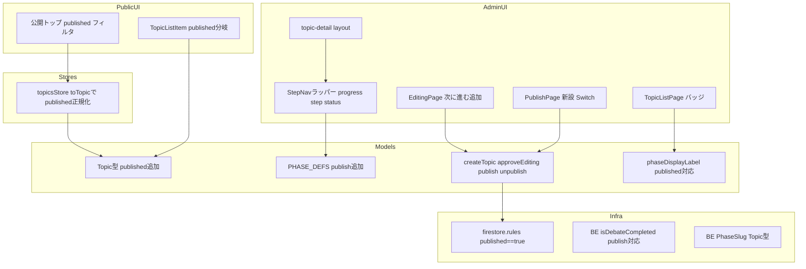
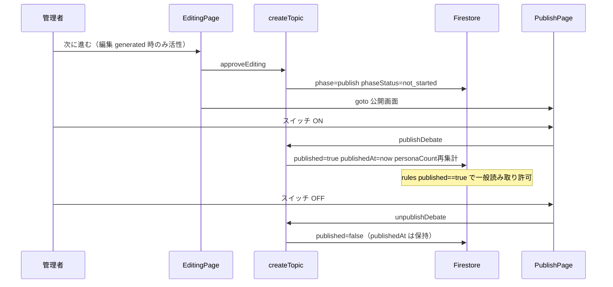

# Technical Design — publish-phase

## Overview

**Purpose**: 編集フェーズの後に「公開(publish)」フェーズを新設し、管理者がトピックの公開 ON/OFF を明示的に制御できるようにする。あわせて、フェーズ完了の暗黙表現（「次へ前進したこと」）が最終フェーズで破綻し StepNav の「編集」ステップが完了表示にならない問題を、構造から解消する。

**Users**: 管理者が編集完了後に「次に進む」で公開フェーズへ進み、公開画面のスイッチで公開/非公開を切り替える。閲覧者は `published` なトピックのみを公開トップで閲覧する。

**Impact**: フェーズ定義の終端が `editing` から `publish` に変わる（FE/BE 両方）。公開状態の真実が `publishedAt` の有無から明示的な `published: boolean` に移り、firestore.rules の一般公開読み取り条件も `published == true` に切り替わる。

### Goals

- 編集フェーズの完了を他の中間フェーズと同一の機構（承認→前進）で表現し、StepNav の完了表示を全フェーズ一貫させる
- 公開状態を可逆なトグル（`published`）としてモデル化し、公開/非公開の判定源をアプリ全体で一本化する
- 公開フェーズの画面（スイッチのみの最小構成）を追加する

### Non-Goals

- 公開画面での最終成果物プレビュー（公開閲覧ページの作成と重複するため対象外）
- `phaseStatus` のセマンティクス変更（公開 ON/OFF を `generated`/`not_started` に載せ替えない）
- 既存データの migration（`published` バックフィルは行わない。既存トピックは rules 切替後に非公開扱いとなり、公開画面から再公開する運用）
- 公開トップの購読クエリ最適化・未認証アクセス対応（既存構成を維持）
- 変更操作のロジック自体の変更（凍結は操作の不活性化のみで、各操作の実装・挙動は変えない）
- BE 側の操作ガード（公開中の `startEditing` 等の拒否）— 凍結は UI レベルのみ（単一管理者の自傷防止が目的）

## Boundary Commitments

### This Spec Owns

- フェーズ定義への `publish` 追加（FE `PHASE_DEFS`/`PhaseSlug`・BE `PhaseSlug` の値集合と順序）
- `Topic` の `published` フィールド（定義・読み書き・境界正規化）と publish/unpublish 操作
- 編集フェーズの承認・前進経路（`approveEditing`・EditingPage の「次に進む」）
- 公開画面（新ルート + feature ページ）
- StepNav ラッパーの progress 導出ロジック（`{ step, status }` 化）
- 公開中のコンテンツ凍結 — フェーズごとの編集可否 `phaseEditable`（phase モデルの純粋関数）と、各フェーズ画面での変更操作の不活性化
- firestore.rules の一般公開読み取り条件（`publishedAt != null` → `published == true`）
- `phaseDisplayLabel` の publish 対応（`published` 入力の追加）

### Out of Boundary

- 公開閲覧ページ（`/debate/[id]` 等）の新設・変更
- `@14ch/svelte-ui` ライブラリ自体（StepNav の `{step, status}` 対応は 0.0.56 で対応済みの前提）
- 編集パイプライン（`startEditing`・editing-lifecycle の生成処理）の挙動変更
- topicsStore の購読構造（全件購読 + クライアントフィルタ）

### Allowed Dependencies

- `@14ch/svelte-ui@0.0.56`（StepNav の `progress: { step, status }`、`Switch`）
- 既存のフェーズ前進機構（`advancePhase` / `nextPhase` / `phaseLogicalState`）
- Firestore Client SDK（stores/models 経由の直接読み書き — 既存方針どおり）
- 依存方向: `models`（型・純関数）→ `stores` → `features`/`routes`（UI）。逆方向 import は禁止

### Revalidation Triggers

- `PhaseSlug` の値集合・順序の変更（FE/BE の一致規約に関わる）
- `TopicForFirestore` の形状変更（FE/BE 同一形の規約に関わる）
- firestore.rules の公開読み取り条件の変更（公開閲覧ページ spec は `published == true` を前提にすること）
- StepNav ライブラリの progress 契約の変更

## Architecture

### Existing Architecture Analysis

- トピックは単一の `(phase, phaseStatus)` カーソルを持ち、完了は「前進」で暗黙表現される。この機構は維持し、終端に `publish` を足すことで editing の完了表現を成立させる
- フェーズ前進は FE の `advancePhase(currentKey)`（次フェーズ + `not_started` を書く）に確立済み。`nextPhase`/`phasePath`/レイアウトのリダイレクトはすべて `PHASE_DEFS` 配列駆動で、定義追加に自動追従する
- `publishDebate()`（`publishedAt` + `personaCount` 焼き込み）は実装済みだが呼び出し元ゼロ。公開画面が初の呼び出し元になる
- 「画面の操作は画面に直接書く」steering 方針に従い、公開画面の操作は PublishPage に直接書く（中央ディスパッチャを作らない）

### Architecture Pattern & Boundary Map



**Architecture Integration**:

- Selected pattern: 既存パターン拡張 + 公開画面のみ新設（research.md Option A）
- 完了判定の二系統: theme〜editing は前進ベース（`phaseLogicalState`）、publish は可逆トグル（`published` 直読み）。これは仕様上のセマンティクス差であり、UI 側で `phaseStatus` に翻訳しない
- 公開の真偽（`published`）とフェーズカーソル（`phase`）は独立した軸。どの操作も相手の軸を暗黙に変えない（自動非公開化のような副作用を作らない）
- **公開中のコンテンツ凍結**: 再生成は旧データを処理開始時に即時削除するため、公開中の変更操作は公開コンテンツを空のまま一般公開させてしまう。これを操作レベルで防ぐ — 閲覧（遷移・表示）は従来どおり許可し、コンテンツを変更する操作のみ不活性化する。編集可否は**フェーズごと**の純粋関数 `phaseEditable(current, target)`（`phaseLogicalState` と同型のパターン）で一元導出し、**どの要素を不活性化するかは各画面が持つ**（判定の定義は1箇所・適用は各画面 — 画面の独立性を保つ steering 方針と両立）。公開画面（`target='publish'`）は常に編集可（公開中にスイッチを OFF にできる必要がある）。phase を巻き戻す生成系操作も不活性化されるため、UI 経路上 `published=true` ⇒ `phase='publish'` の不変条件が成立する（StepNav の公開ステップ完了表示が単一 progress カーソルで常に表現可能）
- Steering compliance: UI は `@14ch/svelte-ui` 標準使用／画面操作は画面に直接記述／FE-BE 型の値集合一致規約を維持

### Technology Stack

| Layer | Choice / Version | Role in Feature | Notes |
|-------|------------------|-----------------|-------|
| Frontend UI | `@14ch/svelte-ui@0.0.56` | `StepNav`（`progress: { step, status }`）・`Switch`（公開トグル） | 0.0.56 で progress 拡張対応済み（本仕様の前提） |
| Frontend | SvelteKit 2.x / Svelte 5 runes | 公開画面ルート・feature ページ | 既存の thin wrapper 規約に従う |
| Data | Firestore（Client SDK 直接） | `topics/{id}.published` の読み書き | 書き込みは models 層（createTopic）に集約 |
| Security | firestore.rules | 一般公開読み取りの条件を `published == true` へ | フィールド欠落時は false 扱い（fail-safe） |
| Backend | Firebase Functions v2 | `isDebateCompleted` の publish 対応・型追加 | デプロイ必須（エミュレータ不使用運用） |

## File Structure Plan

### New Files

```
src/routes/admin/topics/[topicId]/publish/
└── +page.svelte                          # thin wrapper（PublishPage を描画するのみ）
src/lib/features/admin/topic-detail/publish/
└── PublishPage.svelte                    # 公開画面（Switch + 操作。画面の処理は画面に書く）
```

### Modified Files

- `src/lib/models/phase/phase.types.ts` — `PhaseSlug` に `'publish'` 追加
- `src/lib/models/phase/phase.constants.ts` — `PHASE_DEFS` 末尾に publish エントリ追加（正準リストコメント更新）
- `src/lib/models/phase/phase.ts` — `phaseDisplayLabel` の入力に `published` を追加し publish 分岐を実装。`generated && isLastPhase` 分岐と `isLastPhase` を削除。フェーズごとの編集可否 `phaseEditable(current, target)` を追加
- `src/lib/models/topic/topic.types.ts` — `TopicForFirestore.published?: boolean`・`Topic.published: boolean`
- `src/lib/models/topic/createTopic.svelte.ts` — `published` の保持と getter、`approveEditing`、`publishDebate` への `published: true` 追記、`unpublishDebate` 新設
- `src/lib/stores/topics.svelte.ts` — `toTopic` で `published: topicDoc.published ?? false` に正規化
- `src/lib/sharedComponents/StepNav.svelte` — `STEP_GROUPS` に公開ステップ追加、props に `phaseStatus`/`published` 追加、`progress` を `{ step, status }` で導出
- `src/routes/admin/topics/[topicId]/+layout.svelte` — StepNav へ `phaseStatus`/`published` を受け渡し、ヘッダーのタイトル入力を `editable` で不活性化
- 各フェーズ画面 `ThemePage` / `FactResearchPage` / `GeneratePersonaPage` / `GenerateChaptersPage` / `GenerateDebatePage` / `EditingPage`（必要に応じ配下の編集系コンポーネントへ伝播）— `phaseEditable(topic, PHASE)` を参照し、コンテンツを変更する操作（生成・再生成・インライン編集・並べ替え・追加削除等）を不活性化
- `src/lib/features/admin/topic-detail/editing/EditingPage.svelte` — 空プレースホルダを「次に進む」に置換（既存フェーズ画面のパターン踏襲）
- `src/lib/features/admin/topic-list/TopicListPage.svelte` — `getBadge` に `published` を受け渡し
- `src/routes/+page.svelte` — 公開フィルタを `topic.published` へ（ソートの `publishedAt ?? updatedAt` は日時用途のため維持）
- `src/lib/features/topics/list/TopicListItem.svelte` — 表示分岐を `topic.published` へ（日時表示は `publishedAt` のまま）
- `firestore.rules` — 一般公開読み取り条件 4 箇所（topics / personas / chapters / editedChapters / editorial）を `published == true` へ
- `functions/src/types/phase.types.ts` — `PhaseSlug` に `'publish'` 追加（正準リストコメント更新）
- `functions/src/types/topic.types.ts` — `published?: boolean` 追加（FE `TopicForFirestore` と同一形の規約）
- `functions/src/pipeline/debate/debate-lifecycle.ts` — `isDebateCompleted` を「`phase` が `editing` または `publish` なら討論完了扱い」へ
- テスト: `src/tests/sharedComponents/StepNav.svelte.spec.ts`・`src/tests/models/phase/phase.test.ts`・`functions/src/tests/pipeline/debate/`（該当テスト）を仕様変更に追従

## System Flows



- 編集の前進は既存の `advancePhase` パターンそのまま（`nextPhase('editing')` が `'publish'` を返すようになるため、新しい前進機構は作らない）
- 公開 ON は既存 `publishDebate` の拡張（`personaCount` 焼き込み＝公開スナップショット仕様を維持）。OFF は `published: false` のみ書き、`publishedAt` は「最後に公開した日時」として保持する

## Requirements Traceability

| Requirement | Summary | Components | Interfaces | Flows |
|-------------|---------|------------|------------|-------|
| 1.1 | `published` を FE/BE 両型に追加 | Topic 型（FE/BE） | `TopicForFirestore.published?` | — |
| 1.2 | 公開判定は `published` で行う | 公開トップ・TopicListItem・rules・StepNav | — | — |
| 1.3 | 公開時 `published=true` + `publishedAt=now` | createTopic | `publishDebate()` | 公開シーケンス |
| 1.4 | 非公開時 `published=false`・`publishedAt` 保持 | createTopic | `unpublishDebate()` | 公開シーケンス |
| 1.5 | `publishedAt` は日時記録専用 | 公開トップ（ソート）・TopicListItem（日時表示） | — | — |
| 2.1 | `publish` を editing の直後（末尾）に | PHASE_DEFS・BE PhaseSlug | — | — |
| 2.2 | FE/BE の値集合・順序一致 | phase.types.ts（FE/BE） | — | — |
| 2.3 | publish の表示情報を既存枠組みで提供 | PHASE_DEFS・phaseDisplayLabel | `phaseDisplayLabel` | — |
| 2.4 | editing は最終フェーズでなくなる | PHASE_DEFS（配列順） | `nextPhase('editing') === 'publish'` | — |
| 3.1 | 編集 generated で「次に進む」活性 | EditingPage | `canAdvance` 導出 | 前進シーケンス |
| 3.2 | 承認して publish へ前進 | createTopic | `approveEditing()` | 前進シーケンス |
| 3.3 | 前進後 `phaseStatus=not_started` | advancePhase（既存） | — | 前進シーケンス |
| 3.4 | 承認完了で公開画面へ遷移 | EditingPage | `goto(phasePath(id, 'publish'))` | 前進シーケンス |
| 3.5 | 承認失敗時エラー表示・前進しない | EditingPage | `approveError` パターン | — |
| 4.1 | publish フェーズで公開画面を表示 | publish ルート + PublishPage | — | — |
| 4.2 | スイッチを表示 | PublishPage | `Switch`（svelte-ui） | — |
| 4.3 | ON → `published=true` | PublishPage → createTopic | `publishDebate()` | 公開シーケンス |
| 4.4 | OFF → `published=false` | PublishPage → createTopic | `unpublishDebate()` | 公開シーケンス |
| 4.5 | 公開中はスイッチ ON 表示 | PublishPage | `topic.published` 直読み | — |
| 4.6 | 非公開中はスイッチ OFF 表示 | PublishPage | `topic.published` 直読み | — |
| 5.1 | 完了状態を反映した判定 | StepNav ラッパー | `progress: { step, status }` | — |
| 5.2 | progress はステップキーで指定 | StepNav ラッパー | 同上 | — |
| 5.3 | publish 前進後に編集ステップ完了表示 | StepNav ラッパー（ライブラリ規則: progress より手前 = completed） | — | — |
| 5.4 | theme〜編集は `phaseLogicalState` で判定 | StepNav ラッパー | `status: 'done'` ⇔ `generated`（approved は手前配置で表現） | — |
| 5.5 | 公開中は公開ステップ完了表示 | StepNav ラッパー | `status: 'done'` ⇔ `published` | — |
| 5.6 | 非公開中は公開ステップ未完了表示 | StepNav ラッパー | `status: 'in-progress'` | — |
| 5.7 | `published` 直読み（phaseStatus に載せ替えない） | StepNav ラッパー | — | — |
| 6.1 | 公開トップの絞り込みを `published` で | +page.svelte | — | — |
| 6.2 | TopicListItem の分岐を `published` で | TopicListItem | — | — |
| 6.3 | `publishedAt != null` 判定を残さない | rules（4箇所）+ 上記 | — | — |
| 7.1 | `published` 欠落は非公開扱い | toTopic 正規化・rules（`== true` は欠落で false） | — | — |
| 7.2 | 欠落データでも表示が破綻しない | toTopic 正規化（アプリ層は常に boolean） | — | — |
| 8.1 | 公開中も到達済みフェーズの遷移・閲覧は許可 | StepNav ラッパー・layout（既存挙動を変更しない） | — | — |
| 8.2 | 公開中は変更操作を不活性化 | コンテンツ凍結（`phaseEditable` + 各フェーズ画面） | `phaseEditable(current, target)` | — |
| 8.3 | 非公開なら変更操作を従来どおり許可 | コンテンツ凍結（全フェーズ editable で従来挙動） | — | — |

## Components and Interfaces

| Component | Domain/Layer | Intent | Req Coverage | Key Dependencies | Contracts |
|-----------|--------------|--------|--------------|------------------|-----------|
| フェーズ定義（FE/BE） | Models | `publish` の追加と順序の真実 | 2.1–2.4 | — | State |
| Topic 型 + 境界正規化 | Models/Stores | `published` の型と欠落正規化 | 1.1, 7.1, 7.2 | Firestore (P0) | State |
| createTopic 操作群 | Models | 承認前進・公開/非公開の書き込み | 1.3, 1.4, 3.2, 3.3 | Firestore (P0) | Service |
| phaseDisplayLabel | Models | admin バッジの publish 対応 | 2.3 | PHASE_DEFS (P1) | Service |
| StepNav ラッパー | UI (shared) | progress の `{step, status}` 導出 | 5.1–5.7 | svelte-ui StepNav (P0) | State |
| コンテンツ凍結（phaseEditable） | Models + UI (admin) | フェーズごとの編集可否判定と変更操作の不活性化 | 8.1, 8.2, 8.3 | phase モデル (P0) | Service |
| EditingPage 拡張 | UI (admin) | 「次に進む」= 承認 + 遷移 | 3.1, 3.4, 3.5 | createTopic (P0) | — |
| PublishPage + ルート | UI (admin) | 公開スイッチ画面 | 4.1–4.6 | createTopic (P0), svelte-ui Switch (P0) | State |
| 公開トップ / TopicListItem | UI (public) | `published` による表示判定 | 1.2, 1.5, 6.1, 6.2 | topicsStore (P0) | — |
| firestore.rules | Infra | 一般公開読み取りの条件切替 | 1.2, 6.3, 7.1 | — | — |
| BE isDebateCompleted | Backend | publish 到達後の編集再実行を許可 | 2.1（整合） | Firestore (P0) | Service |

### Models

#### フェーズ定義（FE `PHASE_DEFS` / BE `PhaseSlug`）

| Field | Detail |
|-------|--------|
| Intent | `publish` を終端フェーズとして追加し、FE/BE の値集合・順序を一致させる |
| Requirements | 2.1, 2.2, 2.3, 2.4 |

**Responsibilities & Constraints**
- 正準 slug リストは `['theme', 'fact-research', 'personas', 'chapters', 'debate', 'editing', 'publish']` になる（配列順 = 進行順の唯一の真実）
- publish の `statusLabels` は全状態 `'未公開'` のフォールバック定義とする（theme と同様の特例コメントを付す）。実際のバッジは `phaseDisplayLabel` の publish 分岐が `published` から導出するため、`phaseStatus` は publish フェーズで意味を持たない（`not_started` のまま動かさない）
- `nextPhase` / `isLastPhase` 相当 / `phasePath` / レイアウトのリダイレクトは配列駆動のため定義追加のみで追従（コード変更不要）

**Contracts**: State [x]

##### State Management
- State model: `PhaseSlug` union に `'publish'` 追加（FE/BE 両方、コメントの正準リストも更新）
- Persistence & consistency: `phase: 'publish'` は `advancePhase('editing')` のみが書く。`phaseStatus` は `not_started` 固定

#### Topic 型 + 境界正規化

| Field | Detail |
|-------|--------|
| Intent | 公開状態の明示的なフラグを型と読み込み境界で保証する |
| Requirements | 1.1, 7.1, 7.2 |

**Responsibilities & Constraints**
- `TopicForFirestore.published?: boolean`（FE/BE 同一形。既存ドキュメントにフィールドが無い現実を型が反映する）
- アプリ層 `Topic.published: boolean`（必須）。`toTopic` 境界で `published: topicDoc.published ?? false` に正規化し、アプリ層に optional を漏らさない
- `publishedAt` の型・役割は不変（日時記録専用）

**Contracts**: State [x]

##### State Management
- State model: 上記 2 型 + `createTopic.svelte.ts` の状態保持に `published` を追加し getter で公開
- Persistence & consistency: `published` の書き込みは `publishDebate` / `unpublishDebate` の 2 操作に限定

#### createTopic 操作群（approveEditing / publishDebate / unpublishDebate）

| Field | Detail |
|-------|--------|
| Intent | 編集の承認前進と公開状態の書き込みをドメイン操作として提供する |
| Requirements | 1.3, 1.4, 3.2, 3.3 |

**Dependencies**
- Outbound: Firestore `topics/{id}` — updateDoc（P0）

**Contracts**: Service [x]

##### Service Interface
```typescript
// createTopicStates が返すオブジェクトに追加されるメソッド・getter
interface TopicPublishOperations {
	// 編集を承認し publish へ前進（既存 advancePhase('editing') に委譲）
	approveEditing(): Promise<void>;
	// 公開: published=true, publishedAt=now, personaCount 再集計（既存実装に published を追記）
	publishDebate(): Promise<void>;
	// 非公開: published=false のみ（publishedAt は保持）
	unpublishDebate(): Promise<void>;
	readonly published: boolean;
}
```
- Preconditions: `approveEditing` は編集画面が `logicalState ∈ {generated, approved}` を担保して呼ぶ（既存の承認ゲートパターン）
- Postconditions: `approveEditing` 後は `phase='publish', phaseStatus='not_started'`。`publishDebate` 後は `published=true` かつ `publishedAt` 更新。`unpublishDebate` 後は `published=false` かつ `publishedAt` 不変
- Invariants: `published` と `phase` は独立（どの操作も相手の軸を暗黙に変更しない）

#### phaseDisplayLabel（publish 対応）

| Field | Detail |
|-------|--------|
| Intent | admin ダッシュボードのバッジに公開状態を正しく表示する |
| Requirements | 2.3 |

**Contracts**: Service [x]

##### Service Interface
```typescript
const phaseDisplayLabel = (current: {
	phase: PhaseSlug;
	phaseStatus: PhaseStatus;
	published: boolean;
}): { label: string; styleKey: string };
```
- `phase === 'publish'`: `published` ? `{ label: '公開中', styleKey: 'completed' }` : `{ label: '未公開', styleKey: 'pending' }`（`phaseStatus` を見ない）
- それ以外: 従来ロジック。ただし `generated && isLastPhase → completed` 分岐は削除し `generated → ready` に一本化（終端 publish は `generated` に到達しないため分岐は不要。未使用となる `isLastPhase` も削除）
- 呼び出し側（TopicListPage `getBadge`）は `published` を追加で渡す

### UI

#### StepNav ラッパー（progress 導出）

| Field | Detail |
|-------|--------|
| Intent | フェーズ完了状態を `{ step, status }` に写像し、全ステップ一貫の完了表示を実現する |
| Requirements | 5.1, 5.2, 5.3, 5.4, 5.5, 5.6, 5.7 |

**Responsibilities & Constraints**
- `STEP_GROUPS` に `{ id: 'publish', label: '公開', phases: ['publish'] }` を末尾追加
- progress 導出（ライブラリ規則: progress ステップより手前 = completed、`status: 'done'` なら progress ステップ自身も completed）:
  - `step` = `currentPhase` を含むグループのキー（従来どおり。配列 index は使わない）
  - `status` = 現在フェーズの完了判定: `currentPhase === 'publish'` なら `published`、それ以外は `phaseStatus === 'generated'` → 真なら `'done'`、偽なら `'in-progress'`
- `approved`（前進済み）の完了は「progress より手前」の配置で自動的に表現されるため、個別判定は不要（5.4 の `phaseLogicalState` 相当をこの二段で満たす）
- ステップの遷移可否は変更しない（公開中も到達済みステップへの遷移＝閲覧は可能なまま — 8.1）。公開中はコンテンツ凍結（`editable`）により phase を巻き戻す操作が不活性化され `phase='publish'` に固定されるため、`published` の完了判定（5.5/5.6）が progress の単一カーソルで常に表現できる

**Dependencies**
- External: `@14ch/svelte-ui@0.0.56` StepNav — `progress: { step, status }` 対応（P0）

**Contracts**: State [x]

##### State Management
- Props 契約（追加分）:
```typescript
type StepNavWrapperProps = {
	topicId: string;
	currentPhase: PhaseSlug;
	phaseStatus: PhaseStatus; // 追加
	published: boolean;       // 追加
	currentPath?: string;
};
```
- レイアウト（`+layout.svelte`）が `currentTopicStore.topic` から `phaseStatus`・`published` を渡す（topic 未ロード時の既定値は `not_started` / `false`）

#### コンテンツ凍結（phaseEditable）

| Field | Detail |
|-------|--------|
| Intent | フェーズごとの編集可否を純粋関数で一元導出し、公開中のコンテンツ変更操作を不活性化する（閲覧は許可） |
| Requirements | 8.1, 8.2, 8.3 |

**Responsibilities & Constraints**
- **判定の定義は1箇所**: phase モデル（`phase.ts`）の純粋関数 `phaseEditable(current, target)` が対象フェーズの編集可否を返す。`phaseLogicalState` と同型の「トピック状態 × 対象フェーズ → 導出値」パターン。編集可否の規則が将来変わっても（例: 実行中ロックの追加）、変更はこの関数だけで済む
- **公開画面は常に編集可**: `target === 'publish'` は `true` を返す。公開中にスイッチを OFF にする操作が塞がれないことを、画面側の例外ではなく判定の定義として保証する
- **適用は各画面**: 各フェーズ画面（ThemePage / FactResearchPage / GeneratePersonaPage / GenerateChaptersPage / GenerateDebatePage / EditingPage）が自分のフェーズ定数で `phaseEditable(topic, PHASE)` を導出し、自画面の変更系要素（生成・再生成・インライン編集・並べ替え・追加削除等）に `disabled` を適用する。layout のタイトル入力はテーマ設定の成果物として `'theme'` で判定する。どの要素が「変更操作」かは各画面が定義する（中央ディスパッチャを作らない）
- 遷移・閲覧・「次に進む」は不活性化しない。「次に進む」は公開中（= 全フェーズ approved 済み）には承認をスキップして遷移するだけの操作であり、コンテンツを変更しない
- 配下の編集系コンポーネント（章のインライン編集等）へは各画面が props で編集可否を渡す

**Contracts**: Service [x]

##### Service Interface
```typescript
// phase.ts（models・純粋関数）
const phaseEditable = (
	current: { published: boolean },
	target: PhaseSlug
): boolean;
```
- Postconditions: `target === 'publish'` → `true`。それ以外 → `!current.published`
- Invariants: 公開中は phase を巻き戻す操作（`startEditing` 等の生成系）も不活性化されるため、`published=true` の間 `phase='publish'` が維持される
- 入力型は必要最小（`published` のみ）。規則追加時に `current` の型を広げる

**Implementation Notes**
- Integration: 各画面は `currentTopicStore.topic` を直読みして判定を導出（単一用途・ドメイン密着の既存方針）。画面内の操作ロジック自体は変更しない（`disabled` の付与のみ）
- Validation: 非公開（全フェーズ editable）では全画面が従来挙動（8.3）
- Risks: 変更系要素の網羅漏れ。タスクで画面ごとに要素を列挙して確認する

#### EditingPage 拡張（次に進む）

Summary-only（新しい境界なし・既存パターンの踏襲）。

**Implementation Notes**
- Integration: GenerateChaptersPage / GenerateDebatePage と同一パターン（`canAdvance = logicalState ∈ {generated, approved}`、未承認なら `approveEditing()` → `goto(phasePath(topicId, 'publish'))`、押下中 loading・多重押下抑止）
- 既存の「最終ステップのため『次に進む』を持たない」空プレースホルダ（右端スロット）をボタンに置換し、関連コメント・スタイルも更新
- Validation: 承認失敗時は `approveError` 表示・フェーズ不変（3.5）
- Risks: なし（確立済みパターン）

#### PublishPage + publish ルート

| Field | Detail |
|-------|--------|
| Intent | 公開 ON/OFF スイッチのみの公開フェーズ画面 |
| Requirements | 4.1, 4.2, 4.3, 4.4, 4.5, 4.6 |

**Responsibilities & Constraints**
- `src/routes/admin/topics/[topicId]/publish/+page.svelte` は thin wrapper（既存フェーズルートと同形）
- `PublishPage.svelte` は `currentTopicStore.topic` を直接読む（prop 連鎖しない — 単一用途・ドメイン密着コンポーネントの既存方針）
- スイッチ表示は `topic.published` を真実として描画。操作は画面に直接書く

**Dependencies**
- Outbound: createTopic `publishDebate` / `unpublishDebate`（P0）
- External: `@14ch/svelte-ui` `Switch`（`value: boolean`・`onchange`・`disabled`）（P0）

**Contracts**: State [x]

##### State Management
- State model: 表示は `topic.published`（onSnapshot 由来の永続値）。操作中は `disabled` で多重操作を抑止
- Concurrency strategy: `onchange` で publish/unpublish を await。失敗時は永続値（`topic.published`）がそのまま表示の真実なので、ローカルの楽観状態は持たない（エラーメッセージのみ表示）

#### 公開トップ / TopicListItem（判定の寄せ替え）

Summary-only（述語の変更のみ・新しい境界なし）。

**Implementation Notes**
- Integration: `+page.svelte` のフィルタを `topic.published` へ。ソートは `publishedAt ?? updatedAt` を維持（日時用途）。`TopicListItem` の分岐を `{#if topic.published}` へ、内部の `formatDate(topic.publishedAt)` は維持
- Validation: `published=true` かつ `publishedAt` 未設定は運用上発生しない（publish 操作が両方書く）が、`publishedAt` optional の既存表示分岐が吸収する
- Risks: なし

### Infra / Backend

#### firestore.rules（公開読み取り条件の切替）

| Field | Detail |
|-------|--------|
| Intent | 非公開に戻したトピックの一般読み取りを確実に遮断する |
| Requirements | 1.2, 6.3, 7.1 |

**Responsibilities & Constraints**
- 4 箇所の一般公開読み取り条件を切り替える:
  - `topics`: `resource.data.publishedAt != null` → `resource.data.published == true`
  - `personas` / `chapters` / `editedChapters` / `editorial`: `get(...).data.publishedAt != null` → `get(...).data.published == true`
- `== true` 比較はフィールド欠落時に false となり fail-safe（7.1 を rules 層でも満たす）
- **本切替は必須**。`publishedAt` を保持する新仕様で旧条件を残すと、非公開化後も一般読み取りが継続する穴になる

**Contracts**: なし（宣言的ルール）

**Implementation Notes**
- Integration: rules のデプロイはアプリのリリースと同時に行う（旧 rules + 新アプリは「OFF が効かない」、新 rules + 旧アプリは「既存公開が見えない」— 後者は migration スコープ外の合意済み挙動と同一）
- Risks: 既存公開トピックが非公開扱いになる（合意済み。公開画面から再公開する運用）

#### BE isDebateCompleted（publish 対応）

| Field | Detail |
|-------|--------|
| Intent | publish 到達後も「討論は完了済み」と正しく判定し、編集の再実行を許可する |
| Requirements | 2.1（フェーズ追加との整合） |

**Contracts**: Service [x]

##### Service Interface
```typescript
// 変更: phase が editing または publish（討論より後のフェーズ）なら完了扱い
const isDebateCompleted = (topicId: string): Promise<boolean>;
```
- Postconditions: `phase ∈ {'editing', 'publish'}` → true。`phase === 'debate' && phaseStatus === 'generated'` → true。それ以外 → false
- BE の型（`functions/src/types/phase.types.ts` / `topic.types.ts`）追加と同一タスクで実施し、FE/BE ドリフトを防ぐ

## Data Models

### Physical Data Model（Firestore `topics/{id}`）

変更はフィールド 1 つの追加のみ:

| Field | Type | 説明 |
|-------|------|------|
| `published` | `boolean`（optional） | 公開状態の真実。publish/unpublish 操作のみが書く。欠落 = 非公開 |
| `publishedAt` | `Timestamp`（optional・既存） | 最後に公開した日時。公開時に更新、非公開化では保持 |

- 整合性: `published` と `publishedAt` は publish 操作で同一 `updateDoc` に書かれる（原子的）
- 既存フィールド（`phase`/`phaseStatus`/`personaCount` 等）の形状は不変

## Error Handling

- **編集承認の失敗**（3.5）: 既存の `approveError` パターンを踏襲 — エラーメッセージ表示・`goto` しない・再試行可能
- **公開/非公開の失敗**: `onchange` ハンドラで catch し、エラーメッセージを表示。表示の真実は `topic.published`（onSnapshot 由来）なので、書き込み失敗時は表示が自動的に永続値へ戻る（楽観状態を持たない設計により巻き戻し処理が不要）
- **rules による拒否**: 未認証の管理操作は既存どおり rules が遮断（本仕様での追加ハンドリングなし）

## Testing Strategy

### Unit Tests（FE）
- `phase.test.ts`: 正準リストへの `publish` 追加（`phaseOrder`/`nextPhase('editing') === 'publish'`）、`phaseDisplayLabel` の publish 分岐（公開中/未公開）、`isLastPhase` 削除への追従
- `StepNav.svelte.spec.ts`: 公開ステップの存在、`{ step, status }` の導出 — (a) 中間フェーズ `generated` → `done`、(b) `publish` + `published=true` → `done`、(c) `publish` + `published=false` → `in-progress`、(d) 前進済みフェーズのステップが completed になる配置
- `toTopic` 正規化: `published` 欠落 → `false`（7.1）
- `phaseEditable`: 公開中は `publish` 以外の全フェーズが `false`・`publish` は常に `true`、非公開は全フェーズ `true`（8.2, 8.3）

### Unit Tests（BE）
- `isDebateCompleted`: `phase='publish'` → true の追加ケース（既存テストの網羅に追従）

### Integration / Manual
- 編集 generated → 「次に進む」→ publish 前進 → StepNav で編集ステップ完了表示（5.3）
- 公開 ON/OFF → 公開トップの表示/非表示・StepNav 公開ステップの完了表示切替
- 公開 ON → 各フェーズ画面へ遷移・閲覧は可能なまま、変更操作（生成・再生成・編集・並べ替え・削除・タイトル編集）が不活性化（8.1, 8.2）→ OFF で解除（8.3）
- rules: 未認証クライアントで `published=false`（および欠落）のトピックが読めないこと、`published=true` で読めること

## Security Considerations

- 一般公開読み取りの境界が `published == true` に一本化される。非公開化（OFF）が即時に読み取り遮断へ反映されることが本設計の安全性の要（rules 切替を伴わないリリースは不可）
- `published` の書き込みは認証済み管理者のみ（既存の `request.auth != null` write 条件を維持）
