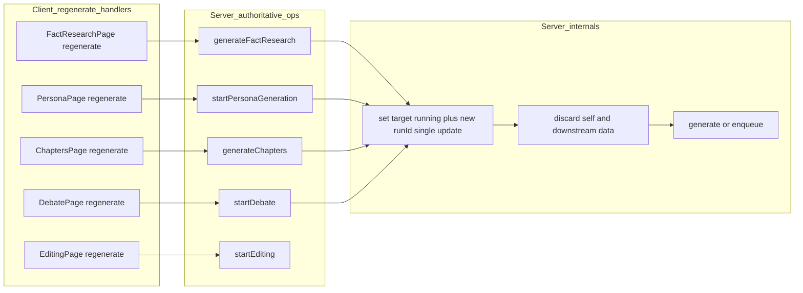
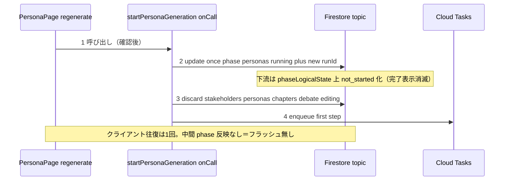

# Design Document: reset-phase-write-decoupling

## Overview

**Purpose**: 再生成（regenerate）時にフェーズポインタが実態とずれ、下流フェーズが「完了済み」表示になる不整合を構造的に根絶し、あわせて phase/phaseStatus を書くメソッドの「名前と責務の乖離」を全件処置する。

問題は2層ある:
1. **前方ジャンプ**: `resetEditingRun` が現在フェーズを見ずに定数 `phase='editing'` を書き、personas 起点の再生成で下流を完了表示にする。
2. **残存フラッシュ**: 全再生成カスケードが対象フェーズの `running` を**最後**（起動処理）に書き、先行するクライアント側 reset 群の実行中は phase が起点（下流を含む）のまま留まる。

**根本方針**: フェーズポインタと下流破棄の責務をクライアントのオーケストレーションからサーバの起動処理へ集約する。各再生成を**単一のサーバ操作**にし、サーバが「対象フェーズを `running` に確定（`update` 1回）→ 自層＋下流データを破棄 → 生成/投入」を**この順序で**所有する。フェーズ確定を先に置くことがフラッシュ根絶の要であり、トランザクションは使わない。これにより前方ジャンプ・残存フラッシュ・順序回避策・runId 世代窓・途中失敗滞留をまとめて排除する。

**Users**: 管理者。どのフェーズを・どの起点（対象フェーズ／前進済み approved）から再生成しても進捗表示が実態と一致する。

**Impact**: クライアント側の reset オーケストレーション（複数 reset を順に await）を廃し、各再生成画面は単一のサーバ操作を1回呼ぶだけになる。下流破棄はサーバ責務へ移動。命名の乖離は責務一致へ是正する。

### Goals
- `resetEditingRun` の現在フェーズ書き換えを除去（R1）。
- フェーズ遷移の所有者を起動・前進・明示停止（サーバ権威）に限定（R2）。
- 全再生成（fact-research / personas / chapters / debate）で起点不問・堅牢に下流完了表示フラッシュを根絶（R3）。
- 順序依存の回避策を解消（R4）。
- 重複・矛盾する `personasStore.resetPersonas` を整理（R5）。
- 最終状態・破棄範囲を保つ（R6）。
- phase を書く全メソッドの命名を責務一致へ是正し、監査の全乖離に処置区分を付す（R7）。

### Non-Goals
- 各リセットが破棄するデータの**範囲**の変更（範囲は不変。実行場所がクライアント→サーバへ移るのは可）。
- AI 生成アルゴリズムの変更。
- フェーズ由来 UI のレイアウト・ラベル文言の変更。
- editing 再生成の下流破棄・先行確定（editing は最終フェーズで下流が無く不要・R3.7）。

## Boundary Commitments

### This Spec Owns
- リセット操作の不変条件「phase/phaseStatus を書かない」。
- 各再生成の**サーバ権威化**: 対象フェーズ確定＋自層/下流破棄＋生成/投入の原子的順序をサーバ起動処理が所有する契約。
- クライアント再生成ハンドラの単純化（単一サーバ操作の呼び出し＋確認ダイアログ）。
- phase/phaseStatus を書くメソッドの命名是正、および監査で挙がった乖離全件の処置区分。

### Out of Boundary
- 生成アルゴリズム本体。
- 破棄対象データの範囲。

### Allowed Dependencies
- 各起動処理（onCall）が対象フェーズ `running`＋runId を権威的に書き、Cloud Tasks で後段を投入する現行基盤。
- `phaseLogicalState` の純粋導出契約。
- Firestore Admin による下流ドキュメント削除。

### Revalidation Triggers
- 起動処理の phase/runId 書き込み・タスク投入順序を変える変更。
- 破棄範囲・破棄場所を変える変更。
- `phaseLogicalState` の導出規則を変える変更。

## Architecture

### Existing Architecture Analysis
- **フェーズポインタ**: `topics/{id}.phase`（順序 slug）＋ `.phaseStatus`＋ `.runId`。`phaseLogicalState(current, target)` が `target < current → 'approved'` を機械的に返す。
- **現行再生成**: クライアントが `reset...（複数 await）→ generate/start（最後）`。対象フェーズ running は最後にしか書かれず、reset 中は phase が起点のまま。下流破棄はクライアント（deleteDoc）とサーバ（resetDebate/resetEditing onCall）に分散。
- **サーバ権威の前提**: `phase-generation-server-authority` により running/generated はサーバが権威的に書く。本設計はこの原則を再生成の下流破棄まで拡張する。

### Architecture Pattern & Boundary Map



**Architecture Integration**:
- Selected pattern: **サーバ権威の原子的再生成**。1操作＝1責務境界（対象フェーズ確定＋下流破棄＋生成）。
- Domain/feature boundaries: クライアントは「意図（再生成する）」だけを送る。フェーズ書き込み・破棄・投入はサーバが所有。リセットはもはやクライアントのオーケストレーション単位ではない。
- Existing patterns preserved: `phaseLogicalState` 純粋導出、各画面の楽観 `starting/isStarting` ローカルフラグ（体感の穴埋めとして残置）、Cloud Tasks 投入。
- New components rationale: サーバ側「下流破棄ヘルパー」を追加（stakeholders/personas/chapters の削除をサーバへ移設）。既存の debate/editing 破棄は流用。中央ディスパッチャは作らず、各起動 onCall が自分の破棄範囲を明示的に呼ぶ。
- Steering compliance: 「過度な共通化・中央ディスパッチャを作らない」に沿い、フェーズ番号での中央分岐は作らない。各 onCall が自分の下流破棄を直書きする。

### Dependency Direction
Types → Firestore(Admin) → discard helpers → 起動 onCall（phase 確定＋破棄＋投入）→ Cloud Tasks 後段。クライアントは onCall を呼ぶだけで、phase/破棄には関与しない。

### 実行順序（各起動 onCall 内部）
必要なのは「フェーズ確定を**先に**、破棄・投入を**後で**」という順序であって、トランザクションではない。

```
1. update() 1回で phase=<target>, phaseStatus='running', runId=new を書く
   - Firestore は単一ドキュメント書き込みが原子的。3フィールドを1回の update で書けば中間状態は生じず、トランザクションは使わない。
2. discard: 自層＋下流データを削除（順次）。旧 runId のタスクは phase/runId 不一致で自己停止する。
3. produce: 生成（同期）または最初の段を Cloud Tasks へ投入。
```
- トランザクションは使わない。単一文書 3フィールドの `update` は原子的で足りる。重い削除・キュー投入をトランザクションに巻き込まない（速度・信頼性）。Cloud Tasks 投入は Firestore と原子結合できないため必ず外に置く。実際に同時押下レース等が観測された場合に限り、その最小範囲だけ後から追加する。
- 手順1で新 runId を先に確定するため、以降の旧世代タスクは無効化される（R3.5 の「窓」を作らない）。
- 手順1〜3が同一 onCall 内で連続するため、クライアント往復ごとの中間 phase 反映（フラッシュ）が発生しない（R3.3）。

### 手順2/3 の冪等性と失敗時の再開責務（R3.4）
- **冪等性**: 手順2の破棄は「既に無いものを消す」を no-op として扱い、同じ入力で何度実行しても結果が同じになるよう組む。手順3の投入は手順1で発行した新 runId に紐づくため、旧世代の重複投入が起きない。
- **失敗時の状態**: 手順1の後に手順2/3 が失敗した場合、onCall は `phaseStatus='stopped'` を書く（`phase` は対象フェーズのまま＝下流 approved へ戻さない・R3.4）。これは既存の `generateFactResearch`/`generateChapters` の catch→stopped と同じ扱い。UI は「対象フェーズ・停止」を表示し、running のまま固着しない。
- **再開責務**: 停止からの再開は、ユーザーが同じ再生成（または再開）操作をもう一度呼ぶことで行う。同操作は手順1〜3を最初から冪等に流し直す（新 runId 発行＋破棄 no-op 許容）。サーバは自動リトライを担わない（在席非依存の自己修復は本 spec のスコープ外）。

### 再生成時の即時フィードバック（旧データの楽観クリア）
破棄をサーバへ移すと、旧データの実削除はクライアント往復の後になる。UX 方針「再生成時は旧データを処理開始時に即時削除（目的は UX フィードバック）」を保つため、各再生成画面は**表示専用のローカル状態で旧データを即時に隠す**（討論画面の `isResetting` と同型）。実データ削除はサーバが権威的に行い、`onSnapshot` 反映後は実状態に委ねる。
- ペルソナ画面: 現状 `hasPersonas`（実データ有無）で `{#if isRunning && !hasPersonas}` スケルトン分岐を切り替えているため、押下直後に旧ペルソナを隠す表示専用フラグ（例 `isRegenerating`）を追加し、実削除完了まで空表示（スケルトン）を出す。
- **フラグ解除条件（ちらつき防止）**: 表示専用フラグは onCall の promise 解決（finally）で解除しない。onSnapshot の実同期状態に連動させ、「対象フェーズが `running` かつ旧データが実際に消えている（例 `!hasPersonas`）」を満たしたとき、または新データ到着時に解除する。往復後に旧データが一瞬再表示されるのを防ぐ。
- 破棄のサーバ移設は「実データの権威的削除場所」の変更であり、即時クリアは「表示の楽観制御」で別責務。両者を併存させ、整合は `onSnapshot` の実状態で最終的に収束させる。

## File Structure Plan

### Modified Files（サーバ: 再生成の権威化）
- `functions/src/api/personas.ts` — `startPersonaGeneration` を「phase=personas/running＋新 runId（txn）→ 下流破棄（stakeholders/personas/chapters/chapterAnalysis/debate side data/editing artifacts）→ 最初の段を投入」に拡張。初回生成時は下流が空で破棄は no-op。
- `functions/src/api/source-contents.ts` ほか fact-research 起動 — `generateFactResearch` を「phase=fact-research/running → 全下流破棄 → factBase 生成 → generated 確定」に拡張。
- `functions/src/api/chapters.ts` — `generateChapters` を「phase=chapters/running＋runId → 旧 chapters/chapterAnalysis＋下流（debate/editing）破棄 → 章生成」に拡張。
- `functions/src/api/debates.ts` — `startDebate` を「phase=debate/running＋runId → 旧討論 side data＋下流 editing 破棄 → 討論開始」に拡張。
- `functions/src/pipeline/**/discard-*.ts`（新規） — stakeholders/personas/chapters(+chapterAnalysis) のサーバ側破棄ヘルパー。debate/editing は既存（`discardChaptersWithSideData`・`clearEditedArtifact`）を流用。

### Modified Files（サーバ: リセット/命名是正）
- `functions/src/pipeline/editing/editing-lifecycle.ts` — `resetEditingRun` から phase 書き込みを除去（R1）。下流破棄では `clearEditedArtifact` を直接使うため、phase 非書き込みとなった `resetEditingRun` は不要なら削除（要参照確認）。
- `functions/src/api/editing.ts` — 単独 `resetEditing` onCall は、編集やり直しが `startEditing`（`startEditingRun` が破棄＋running を担う）に集約されて未使用化するなら削除。docstring も是正。
- `functions/src/utils/topic-phase.ts` / `functions/src/pipeline/debate/debate-lifecycle.ts` — 命名是正（R7）: `updateDebatePhaseStatus` を「runId を発行する」責務が読める名へ（例 `beginDebateRun`）。`setTopicPhaseStatus` との非対称（runId 有無）を docstring で明示。

### Modified Files（クライアント: ハンドラ単純化）
- `src/lib/features/admin/topic-detail/{fact-research,persona,chapters,debate}/*Page.svelte` — `regenerate/onRegenerate` を「確認ダイアログ → 単一サーバ操作を1回呼ぶ」へ単純化。複数 reset の順次 await と「後勝ち」コメントを撤去。あわせて**押下直後に旧データを隠す表示専用フラグ**（討論の `isResetting` と同型。ペルソナは `isRegenerating` を新設）を持たせ、実削除完了までスケルトン/空表示にする（即時 UX フィードバック維持）。
- `src/lib/features/admin/topic-detail/editing/EditingPage.svelte` — `regenerate` を `startEditing` 単独へ（`startEditingRun` が破棄＋running を担うため `resetEditing` 呼び出しを除去）。
- `src/lib/models/topic/createTopic.svelte.ts` — 未使用化する `resetStakeholders`/`resetPersonas`/`resetChapters`/`resetDebate`/`resetEditing` の各クライアントラッパを削除（要参照確認）。`setPhaseStatus` を命名是正（`setPhase` 等、phase を書くことが読める名）。
- `src/lib/stores/personas.svelte.ts` — 重複・未配線の `resetPersonas`（phase を書く）を削除。`markInterviewsStarted`/`markInterviewsStopped` を命名是正（personas フェーズを書く旨が読める名）または docstring で根拠明示。

### Tests
- `functions/src/tests/**` — 各起動 onCall が「phase 確定 → 下流破棄 → 生成/投入」の順序で動くこと、初回生成で破棄が no-op なこと、手順1後の失敗で下流 approved へ戻らないこと。
- `src/tests/**` — 各再生成ハンドラが単一サーバ操作のみ呼ぶこと。削除メソッドに対応する既存テストの除去・整合。

> クライアント reset ラッパ・`resetEditing`・phase 非書き込み化後の `resetEditingRun` の削除は、いずれも「実参照が無いこと」を実装時に grep で再確認してから行う（Risks 参照）。

## System Flows

approved 起点の再生成（例: editing まで進んだ後にペルソナ再生成）:



## Requirements Traceability

| Requirement | Summary | Components | Flows |
|-------------|---------|------------|-------|
| 1.1, 1.2, 1.3 | reset は phase を書かない | `resetEditingRun`・全 reset | 編集リセット |
| 2.1, 2.2 | 遷移はサーバ起動処理が所有 | 各起動 onCall・`startEditingRun` | 全再生成 |
| 3.1–3.7 | 単一サーバ操作で phase確定→破棄→生成、堅牢にフラッシュ根絶 | 各起動 onCall・discard ヘルパー | approved 起点再生成 |
| 4.1, 4.2 | 順序依存・回避策コメントの解消 | 4 再生成画面 | 各再生成 |
| 5.1, 5.2 | 重複 resetPersonas の整理 | `personasStore.resetPersonas` | ペルソナ再生成 |
| 6.1, 6.2, 6.3 | 最終状態・破棄範囲の保存 | 全対象 | 全フロー |
| 7.1–7.4 | 命名是正・乖離全件処置 | 命名是正群・処置表 | — |

## Components and Interfaces

| Component | Domain/Layer | Intent | Req Coverage | Contracts |
|-----------|--------------|--------|--------------|-----------|
| 各起動 onCall（generateFactResearch / startPersonaGeneration / generateChapters / startDebate） | Backend / api | phase確定＋下流破棄＋生成/投入の原子所有 | 2, 3, 6 | Service, Batch |
| discard ヘルパー（stakeholders/personas/chapters） | Backend / pipeline | サーバ側で下流層を破棄 | 3.1, 6.3 | Service |
| resetEditingRun | Backend / editing lifecycle | 編集成果物破棄のみ（phase 非書込）／不要なら削除 | 1.1–1.3 | Service |
| 再生成ハンドラ（4画面） | Frontend / feature | 単一サーバ操作の呼び出しへ単純化 | 3, 4 | State |
| personasStore.resetPersonas | Frontend / store | 削除（createTopic 版へ一本化） | 5 | State |
| 命名是正群（setPhaseStatus→setPhase, updateDebatePhaseStatus→beginDebateRun, markInterviews*） | FE/BE | 名前を責務一致へ | 7 | State/Service |

### 起動 onCall（代表: startPersonaGeneration）

| Field | Detail |
|-------|--------|
| Intent | ペルソナ一気通貫の再生成を単一操作で所有する。 |
| Requirements | 2.1, 3.1–3.6, 6.2, 6.3 |

**Responsibilities & Constraints**
- `update()` 1回で `phase='personas', phaseStatus='running', runId=new` を確定（手順1・単一文書で原子的。トランザクションは使わない）。
- 自層＋下流（stakeholders/personas/chapters/chapterAnalysis/debate side data/editing artifacts）を破棄（手順2）。
- 最初の段（ステークホルダー生成）を投入（手順3）。
- 初回生成でも同一経路（破棄は no-op）。手順1後の失敗で phase は personas に留まる。

**Contracts**: Service [x] / Batch [x]

##### Service Interface
```typescript
const startPersonaGeneration: (input: { topicId: string }) => Promise<{ topicId: string }>;
```
- Preconditions: 有効な topicId。
- Postconditions: `phase='personas', phaseStatus='running'`、新 runId、下流破棄済み、最初の段が投入済み。
- Invariants: 対象フェーズより下流は以降 `phaseLogicalState` 上 not_started。旧 runId のタスクは無効。

**Implementation Notes**
- Integration: クライアント `onRegenerate` は確認後 `topic.startPersonaGeneration()` を1回呼ぶのみ。
- Validation: 順序（phase→破棄→投入）、初回 no-op、手順1後失敗時の非後退をテストで固定。
- Risks: 下流破棄をサーバへ移すため Admin 削除量が増える。大規模サブコレクションはバッチ削除で対応。

### resetEditingRun（phase 非書込化 or 削除）
- phase/phaseStatus 書き込みを除去（R1）。下流破棄は `clearEditedArtifact` を直接使用するため、phase 非書込となった本関数が無参照なら削除。docstring も是正。

### personasStore.resetPersonas（削除）
- 未配線・矛盾のため削除し `topic.resetPersonas` へ一本化。実参照が無いことを実装時に再確認（フォールバック: phase 書込のみ除去）。

## 命名・責任乖離の処置表（R7）

| メソッド | 乖離 | 処置区分 |
|---------|------|---------|
| `resetEditingRun` | reset が phase を書く | **是正**（phase 書込除去／不要なら削除） |
| `personasStore.resetPersonas` | reset が phase を書く・重複 | **是正**（削除） |
| `setPhaseStatus`（createTopic） | 単一状態名で phase も書く | **是正**（`setPhase` 等へ改名） |
| `updateDebatePhaseStatus` | 状態名で phase＋新 runId 発行 | **是正**（`beginDebateRun` 等へ改名＋docstring） |
| `markInterviewsStarted/Stopped` | interviews 名で topic phase を書く | **是正**（personas フェーズを書く旨が読める名へ／最小なら docstring 根拠明記） |
| `fetchSourceContents` | fetch 名で Firestore へ書く | **現状維持＋根拠**（「取得結果を永続する」意図を docstring 明記） |
| `runIntroOutroStep` / `regenerateChapter` / `runInterviewCore` | 局所名でラン全体を終端確定 | **現状維持＋根拠**（終端ステージ設計。docstring で全体確定を明示） |
| `discardChaptersFrom` / `clearEditorial` | 破棄/クリア名で status 遷移・再初期化 | **現状維持＋根拠**（ドキュメント存置の意図を docstring 明記） |
| `publishDebate` | publish 名で personaCount 再計算 | **現状維持＋根拠**（公開スナップショットの一部と明記）／過剰なら別仕様 |
| `save`（createTopic） | save 名で削除・巻き戻し | **現状維持＋根拠**（既存 docstring 済み） |

> 「現状維持」項目も未処置放置にしない: docstring で実責務を明示する最小変更を行う（R7.2）。大きな改名波及（例: `updateDebatePhaseStatus` の呼び出し箇所）はタスクで影響範囲を洗い出して一括で行う。

## Testing Strategy

### Unit Tests
- `resetEditingRun`: phase/phaseStatus を書かない（R1）。
- discard ヘルパー: 対象＋下流のみを削除し他を残す（6.3）。
- `setPhase`（改名後）: phase＋status を書く（命名是正の回帰）。

### Integration Tests
- 各起動 onCall: 「phase 確定 → 下流破棄 → 生成/投入」の順序。初回生成で破棄 no-op（3.1, 6.2）。
- 手順1後の失敗注入: phase が対象フェーズに留まり下流 approved へ戻らない（3.4）。
- 旧世代タスク: 手順1で runId 更新後、旧 runId タスクが自己停止する（3.5）。

### Component/E2E Tests
- approved 起点の各再生成: 開始直後に対象フェーズ/running へ移り、下流が完了表示にならない（3.3）。
- 各再生成ハンドラ: 単一サーバ操作のみ呼ぶ（4.1）。
- 即時クリア: 再生成押下直後、実データ削除の onSnapshot 反映を待たずに旧データが隠れる（表示専用フラグ・UX 維持）。
- 失敗時: 手順1後に手順2/3 が失敗すると `phaseStatus='stopped'`（phase は対象フェーズのまま。running 固着しない・3.4）。
- 編集やり直し: `startEditing` 単独で `editing/running`＋旧記事破棄（6.1）。

### Regression Guards
- 削除メソッド（クライアント reset 群・`personasStore.resetPersonas`・未使用化した `resetEditing`）対応テストの除去・整合。

## Risks
- **破棄のサーバ移設に伴う削除量**: personas サブコレクション等の一括削除はバッチ化。大規模時のタイムアウトに注意。
- **メソッド削除・改名の波及**: `updateDebatePhaseStatus`・`setPhaseStatus` の改名、クライアント reset ラッパ削除は呼び出し箇所を grep で網羅してから一括実施。フォールバックは「削除せず docstring 是正＋副作用のみ除去」。
- **サーバ権威化の範囲**: 4 起動 onCall すべてを原子化するため変更は広い。タスクは onCall 単位で分割し、各々テストで固定する。
