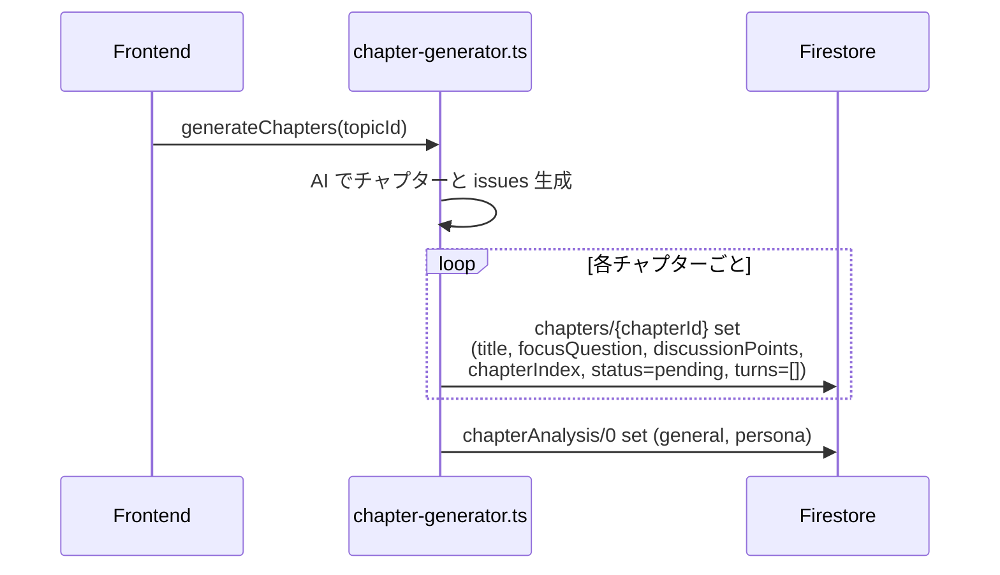
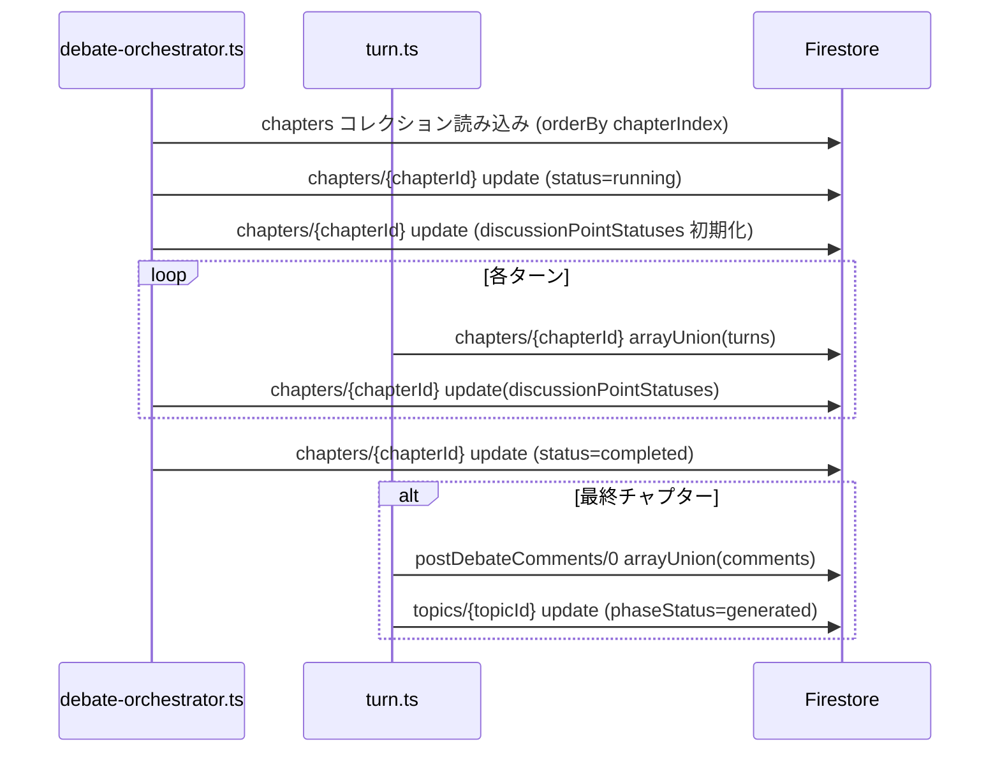
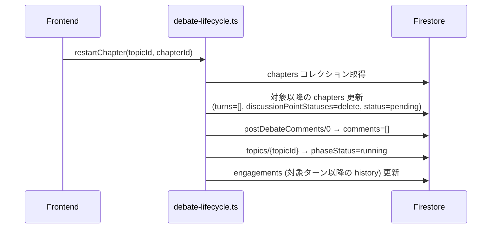

# Design Document: session-document-restructure

## Overview

`topics/{topicId}/sessions/0` は現在、討論ターン記録・チャプター設定・ランタイム状態・後処理成果物の4種類のデータを混在して保持している。各フィールドのライフサイクルを分析した結果、データを `chapters/{chapterId}` コレクションを中心に分散させ、**`sessions/0` ドキュメント自体を廃止**する。

`sessions/0` に残るメタデータ（`createdAt`/`completedAt`/`publishedAt`/`totalTurns`）は、すべて死にフィールドか `topic`・`chapters` から導出可能なものであることを確認済み（`research.md` 参照）。よって `topics/{topicId}` は討論全体の進行管理に徹し、各フェーズの生成物は専用サブコレクションに分離する。

変更対象はFirestoreスキーマ・TypeScript型定義・バックエンドパイプライン・フロントエンドストアと広範にわたるが、討論アルゴリズムとエージェントロジック自体は変更しない。既存本番データの後方互換フォールバックは設けず、クリーンに切り替える（既存の生成済みデータは管理者が再生成して移行する）。

### Goals

- `sessions/0` ドキュメントを廃止する
- チャプターをプライマリコレクション（`chapters/{chapterId}`）として討論データを管理する
- `postDebateComments`・`chapterIssues` をライフサイクルに合った専用サブドキュメントに移動する
- `topics/{topicId}` を進行管理（`phase`/`phaseStatus`/`publishedAt` 等）に専念させる
- `restartChapter` の配列フィルタリングをドキュメント操作に置き換える

### Non-Goals

- 討論アルゴリズム・ファシリテーター/ペルソナエージェントのロジック変更
- UIデザインの変更
- `turns` のサブコレクション化（チャプタードキュメント内の配列を維持）
- `turnIndex` のグローバル連番廃止（engagement履歴・QueuedIntent・DebateState との依存が広く、別スペックで対処する）
- `stakeholders` のサブコレクション化（Phase1 の直交課題。必要なら後続スペックで対処）
- 既存本番データの後方互換フォールバック（クリーン切替・再生成で移行）

---

## Boundary Commitments

### This Spec Owns

- Firestore スキーマの再設計（`sessions/0` 廃止・`chapters` コレクション・`chapterAnalysis/0`・`postDebateComments/0`）
- TypeScript 型定義（`ChapterStateDoc`・関連型）の更新と `SessionDoc` 型の除去
- バックエンドパイプラインの書き込み先変更（`turn.ts`・`chapter-generator.ts`・`debate-orchestrator.ts`・`debate-lifecycle.ts`・`api/debates.ts`）
- フロントエンドストアの再編（`session.svelte.ts` 廃止・`chapters.svelte.ts`・`chapterAnalysis.svelte.ts`・`postDebateComments.svelte.ts` 新設）
- `resetChapters`・`resetDebate`・`publishDebate` の整合性維持
- `sessions/0` への参照のコードベース全体からの除去

### Out of Boundary

- ターンコンテンツの生成ロジック（`generateTurn`・`generateChapterIntroduction` 等）
- エンゲージメント評価・スピーカー選択アルゴリズム
- ペルソナ信念変化のデータ構造
- `engagements` サブコレクション（`topics/{topicId}/sessions/0/engagements` の格納場所のみ移動が必要 — 後述）
- `stakeholders` の格納場所（topic 埋め込みのまま）

### Allowed Dependencies

- Firestore Client SDK（フロントエンド）・Admin SDK（Functions）
- 既存の `topics/{topicId}/personas/{personaId}` コレクション（変更なし）

### Revalidation Triggers

- `ChapterStateDoc` 型の変更 → フロント/バック双方の型参照箇所
- `turns` の書き込み先変更 → engagements の `history.${turnIndex}` 参照
- `engagements` サブコレクションの格納パス変更 → engagements ストア・queued-intents

---

## Architecture

### Existing Architecture Analysis

現行の `sessions/0` は単一ドキュメントに全データを集約し、フロントエンドは `createSessionStore` の1つの `onSnapshot` でターン・チャプター・コメントを一括取得していた。`engagements` は `sessions/0` のサブコレクション（`topics/{topicId}/sessions/0/engagements/{personaId}`）として配置されている。

`sessions/0` を廃止するため、`engagements` の格納先も移動が必要になる。`engagements` はチャプターをまたいでペルソナ単位に蓄積されるランタイムデータのため、`topics/{topicId}/engagements/{personaId}` に移す（チャプター別ではなくトピック直下）。

### Architecture Pattern & Boundary Map

```mermaid
graph TB
    subgraph Firestore
        TopicDoc["topics/{topicId}\n進行管理のみ\nphase, phaseStatus, publishedAt"]
        ChapterCol["topics/{topicId}/chapters/{chapterId}\nchapterIndex, title, focusQuestion\ndiscussionPoints, turns[]\ndiscussionPointStatuses?, status"]
        AnalysisDoc["topics/{topicId}/chapterAnalysis/0\ngeneral[], persona[]"]
        CommentsDoc["topics/{topicId}/postDebateComments/0\ncomments[]"]
        EngageCol["topics/{topicId}/engagements/{personaId}\nhistory, queuedIntents"]
    end

    subgraph Backend_Pipeline
        ChapterGen["chapter-generator.ts"]
        Orchestrator["debate-orchestrator.ts"]
        TurnWriter["turn.ts"]
        Lifecycle["debate-lifecycle.ts"]
    end

    subgraph Frontend_Stores
        ChaptersStore["createChaptersStore"]
        AnalysisStore["createChapterAnalysisStore"]
        CommentsStore["createPostDebateCommentsStore"]
    end

    ChapterGen -->|"write chapters status=pending"| ChapterCol
    ChapterGen -->|"write analysis"| AnalysisDoc
    Orchestrator -->|"status, discussionPointStatuses"| ChapterCol
    Orchestrator -->|"read write"| EngageCol
    TurnWriter -->|"turns append"| ChapterCol
    TurnWriter -->|"comments"| CommentsDoc
    TurnWriter -->|"phaseStatus generated"| TopicDoc
    Lifecycle -->|"read reset chapters"| ChapterCol

    ChaptersStore -->|"onSnapshot"| ChapterCol
    AnalysisStore -->|"onSnapshot"| AnalysisDoc
    CommentsStore -->|"onSnapshot"| CommentsDoc
```



**Key Decisions:**
- `chapters/{chapterId}` はチャプターIDをドキュメントIDとするコレクション。`chapterIndex` フィールドで順序を保証し、フロントは `orderBy('chapterIndex')` で取得する
- `currentChapterIndex` を廃止し、チャプタードキュメントの `status: 'running'` で実行中チャプターを識別する
- 討論完了は `topic.phaseStatus === 'generated'`（finalizeDebate のトランザクションで設定済み）＋全チャプター `status: 'completed'` で表現する
- `turnIndex` はグローバル連番を維持する（engagement履歴キー・QueuedIntent・DebateStateが依存。除去は別スペック）
- `startTurnIndex` はチャプタードキュメントの `turns[0].turnIndex` から導出可能なため保存しない
- `engagements` は `sessions/0` 廃止に伴い `topics/{topicId}/engagements/{personaId}` へ移動する

### Technology Stack

| Layer | Choice | Role |
|-------|--------|------|
| Data / Storage | Firestore | sessions/0 廃止・chapters コレクション追加・engagements 移動 |
| Backend | Firebase Functions v2 / TypeScript | パイプライン書き込み先変更 |
| Frontend | SvelteKit + Svelte 5 runes | ストア再編 |

---

## File Structure Plan

### New Files

```
src/lib/stores/
├── chapters.svelte.ts              # chapters コレクション onSnapshot（新設）
├── chapterAnalysis.svelte.ts       # chapterAnalysis/0 onSnapshot（新設）
└── postDebateComments.svelte.ts    # postDebateComments/0 onSnapshot（新設）
```

### Removed Files

```
src/lib/stores/session.svelte.ts    # sessions/0 廃止に伴い削除
```

### Modified Files

**Backend (functions/src/):**
- `types/debate.types.ts` — `DebateSession` を整理（`chapters`・`currentChapterIndex`・メタデータ系を除去）；`ChapterStateDoc` 型を追加；`DebateTurn` から `chapterId` を除去
- `pipeline/chapters/chapter-generator.ts` — 章を `chapters/{id}` へ書き込み；`chapterAnalysis/0` に issues を書き込み；`sessions/0` 作成を廃止
- `pipeline/debate/debate-orchestrator.ts` — 章の読み込み先を chapters コレクションに；`discussionPointStatuses`・`status` を `chapters/{chapterId}` へ更新；`currentChapterIndex` 更新を廃止
- `pipeline/debate/debate-lifecycle.ts` — `getDebateSessionByTopicId` を `getChaptersByTopicId` に置き換え；`restartChapter` をチャプタードキュメントリセットに変更；`activateDebate`/`markDebateStopped` は topic 操作のため変更なし
- `pipeline/debate/turn.ts` — `addTurn` の書き込み先を `chapters/{chapterId}` に；`getDebateTurnsByTopicId` を chapters 全件読み込みに；`finalizeDebate` の comments 書き込みを `postDebateComments/0` に、メタデータ書き込み（`totalTurns`/`completedAt`）を廃止
- `pipeline/debate/engagement.ts`・`queued-intents.ts` — engagements の格納パスを `topics/{topicId}/engagements` に変更
- `api/debates.ts` — `restartDebate` の実行中チャプター特定を chapters コレクションから行う

**Frontend (src/):**
- `lib/models/session/session.types.ts` — `SessionDoc` を除去；`ChapterStateDoc`・`PostDebateCommentsDoc`・`ChapterAnalysisDoc` 型を追加；`ChapterDoc` から `startTurnIndex` を除去
- `lib/stores/currentTopic.svelte.ts` — `sessionStore` を廃止し `chaptersStore`・`chapterAnalysisStore`・`postDebateCommentsStore`・`engagementsStore`（パス変更）を保持
- `lib/models/topic/createTopic.svelte.ts` — `resetChapters`（chapters削除＋chapterAnalysis削除）・`resetDebate`（chapters の turns リセット＋postDebateComments削除＋engagements移動先削除）・`publishDebate`（topic.publishedAt のみ）を更新
- `lib/features/admin/chapters/Phase4Chapters.svelte` — `chaptersStore`・`chapterAnalysisStore` から取得
- `lib/features/admin/debate/Phase5Debate.svelte` — `chaptersStore` から chapters・running chapter・turns を取得；総ターン数は導出
- `lib/features/topics/detail/DebateViewer.svelte` — チャプター境界判定を turns から導出（`startTurnIndex` 廃止）
- `routes/topics/[topicId]/+page.svelte` — ターンを `chaptersStore` から、コメントを `postDebateCommentsStore` から取得

---

## System Flows

### Phase4: チャプター生成フロー



### Phase5: チャプター実行フロー



### やり直し（restartChapter）フロー



---

## Requirements Traceability

| Requirement | Summary | Components | Flows |
|-------------|---------|------------|-------|
| 1.1 | sessions/0 廃止 | 全コンポーネント | — |
| 1.2 | chapters コレクションで管理 | `chapter-generator.ts`・`ChapterStateDoc` | Phase4 |
| 1.3 | Phase4でチャプタードキュメント個別作成 | `chapter-generator.ts` | Phase4 |
| 1.4 | チャプタードキュメントがターンと論点追跡を保持 | `ChapterStateDoc`・`turn.ts`・`debate-orchestrator.ts` | Phase5 |
| 1.5 | postDebateComments を専用ドキュメントに | `turn.ts`・`postDebateComments.svelte.ts` | Phase5 |
| 1.6 | chapterIssues を chapterAnalysis/0 に | `chapter-generator.ts`・`chapterAnalysis.svelte.ts` | Phase4 |
| 1.7 | publishedAt を topic に一本化 | `createTopic.svelte.ts`・`debate-lifecycle.ts` | — |
| 1.8 | 完了状態を phaseStatus + chapter status で表現 | `turn.ts`・`Phase5Debate.svelte` | Phase5 |
| 1.9 | 総ターン数を chapters から導出 | `Phase5Debate.svelte` | — |
| 2.1, 2.2 | ターンをチャプタードキュメントの turns に arrayUnion | `turn.ts`・`ChapterStateDoc` | Phase5 |
| 2.3 | やり直し時は対象以降チャプターの turns をクリア | `debate-lifecycle.ts` | やり直し |
| 2.4 | 公開ページは全チャプターを読みターン結合表示 | `chapters.svelte.ts`・`+page.svelte` | — |
| 2.5 | TurnDoc から chapterId を除去 | `debate.types.ts`・`session.types.ts` | — |
| 3.1–3.4 | discussionPointStatuses をチャプタードキュメントで管理 | `debate-orchestrator.ts`・`debate-lifecycle.ts` | Phase5・やり直し |
| 3.5 | Phase5管理画面が chaptersStore を onSnapshot 購読 | `Phase5Debate.svelte`・`chapters.svelte.ts` | — |
| 4.1 | 専用ストア群 | `chapters/chapterAnalysis/postDebateComments.svelte.ts` | — |
| 4.2 | 管理操作が全関連ドキュメントをアトミックに更新 | `debate-lifecycle.ts`・`createTopic.svelte.ts` | やり直し |
| 4.3 | sessions/0 参照をコードベースから除去 | 全コンポーネント | — |
| 4.4 | 型定義の更新・SessionDoc 除去 | `session.types.ts`・`debate.types.ts` | — |

---

## Components and Interfaces

### 概要テーブル

| Component | Layer | Intent | Req | Key Dependencies |
|-----------|-------|--------|-----|-----------------|
| `ChapterStateDoc` | 型定義 | チャプタードキュメントの型 | 1.2, 1.4, 2.1, 3.1 | — |
| `PostDebateCommentsDoc`・`ChapterAnalysisDoc` | 型定義 | 専用ドキュメントの型 | 1.5, 1.6 | — |
| `chapter-generator.ts` | Backend | チャプタードキュメント作成・analysis 保存・sessions/0 廃止 | 1.1, 1.3, 1.6 | Firestore Admin SDK |
| `debate-orchestrator.ts` | Backend | チャプタードキュメントへの状態書き込み | 1.4, 3.1–3.4 | `chapter-state.ts`, engagements |
| `turn.ts` | Backend | ターン書き込み・comments・完了処理 | 2.1, 2.2, 1.5, 1.8 | Firestore Admin SDK |
| `debate-lifecycle.ts` | Backend | チャプター読み込み・リセット | 2.3, 4.2 | Firestore Admin SDK |
| `engagement.ts`/`queued-intents.ts` | Backend | engagements 格納パス変更 | 1.1 | Firestore Admin SDK |
| `createChaptersStore` | Frontend | chapters コレクション onSnapshot | 3.5, 4.1, 2.4 | Firestore Client SDK |
| `createChapterAnalysisStore` | Frontend | chapterAnalysis/0 onSnapshot | 1.6 | Firestore Client SDK |
| `createPostDebateCommentsStore` | Frontend | postDebateComments/0 onSnapshot | 1.5 | Firestore Client SDK |
| `createTopic.svelte.ts` | Frontend | reset/publish 処理更新 | 1.7, 4.2 | Firestore Client SDK |

---

### Data Layer（型定義）

#### ChapterStateDoc（新規）

```typescript
type ChapterStateDoc = {
    chapterIndex: number;
    title: string;
    focusQuestion: string;
    discussionPoints: string[];
    turns: TurnDoc[];
    discussionPointStatuses?: DiscussionPointStatusDoc[];
    status: 'pending' | 'running' | 'completed';
};

// chapterId を除去（チャプタードキュメント自体が所属を示す）
type TurnDoc = {
    id: string;
    turnIndex: number;                  // グローバル連番維持
    speakerType: SpeakerType;
    personaId?: string;
    content: string;
    createdAt: Timestamp;
    speechMode?: 'opinion' | 'fact';
    engagementScore?: number;
    fromQueue?: boolean;
    targetPersonaId?: string;
};
```

#### その他の新規型

```typescript
type ChapterAnalysisDoc = {
    general: string[];
    persona: string[];
};

type PostDebateCommentsDoc = {
    comments: PostDebateCommentDoc[];   // PostDebateCommentDoc は既存型を維持
};

// SessionDoc 型は除去する
```

---

### Backend Pipeline

#### chapter-generator.ts

| Field | Detail |
|-------|--------|
| Intent | Phase4: chapters コレクション作成・chapterAnalysis/0 書き込み・sessions/0 作成廃止 |
| Requirements | 1.1, 1.3, 1.6 |

**Contracts**: Batch [ ✓ ]

##### Batch / Job Contract

- **Trigger**: `planChapters(topicId)`
- **Output**:
  - `topics/{topicId}/chapters/{chapter.id}` を各チャプターごとに set（`chapterIndex`, `status: 'pending'`, `turns: []`）
  - `topics/{topicId}/chapterAnalysis/0` を set（`{ general, persona }`）
  - `sessions/0` の作成・初期化を行わない
- **Idempotency**: 再生成時は `resetChapters` が先行して旧チャプターを削除する

#### debate-orchestrator.ts

| Field | Detail |
|-------|--------|
| Intent | チャプタードキュメントへの discussionPointStatuses・status 更新、章読み込み先変更 |
| Requirements | 1.4, 3.1–3.4 |

**Contracts**: State [ ✓ ]

##### State Management

- 章読み込み: `getChaptersByTopicId(topicId)` で chapters コレクションを `orderBy('chapterIndex')` 取得
- `executeChapterTask(topicId, chapterIndex)`: chapters から該当 `chapterIndex` のドキュメントを特定し、その `id` を以降の書き込みに使う
- 冪等性チェック: 現行の `session.currentChapterIndex > chapterIndex` 判定を、`chapters[chapterIndex].status === 'completed'` 判定に置き換える
- `chapterTurnCount()`: 該当チャプタードキュメントの `turns.length`（`chapterId` フィルタ不要）
- `saveDiscussionPointStatuses(topicId, chapterId, state)` → `chapters/{chapterId}` を update
- `updateCurrentChapterIndex` を廃止し、章開始時に `chapters/{chapterId}` の `status: 'running'`、章終了時に `status: 'completed'` を書く

#### turn.ts

| Field | Detail |
|-------|--------|
| Intent | ターン書き込み先変更・postDebateComments 書き込み・完了処理 |
| Requirements | 2.1, 2.2, 1.5, 1.8 |

**Contracts**: Service [ ✓ ] / State [ ✓ ]

##### Service Interface

```typescript
// addTurn: chapterId を必須（書き込み先ドキュメントの識別に使用、TurnDoc には含めない）
const addTurn = async (params: {
    topicId: string;
    chapterId: string;
    turnIndex: number;
    speakerType: 'persona' | 'facilitator';
    personaId?: string;
    content: string;
    speechMode?: 'opinion' | 'fact' | 'question';
    engagementScore?: number;
    fromQueue?: boolean;
    targetPersonaId?: string;
    targetedBy?: 'facilitator' | 'persona';
    searchUsed?: boolean;
    searchQueries?: string[];
}): Promise<{ id: string }>;
// → chapters/{chapterId}.update({ turns: arrayUnion(turn) })

// getDebateTurnsByTopicId: chapters 全件読み込み → turns をフラット化し turnIndex 順
const getDebateTurnsByTopicId = (topicId: string): Promise<DebateTurn[]>;
```

##### State Management（finalizeDebate）

- postDebateComments: `postDebateComments/0` の `comments` フィールドへ `arrayUnion`
- メタデータ書き込み（`totalTurns`・`completedAt`）を廃止
- 完了トランザクション（`phaseStatus: 'generated'`）は現行どおり topic に対して実行

#### debate-lifecycle.ts

| Field | Detail |
|-------|--------|
| Intent | チャプター読み込み・リセット処理 |
| Requirements | 2.3, 4.2 |

**Contracts**: Service [ ✓ ]

##### Service Interface

```typescript
// 新規: chapters コレクション全件取得
const getChaptersByTopicId = (topicId: string): Promise<ChapterStateData[]>;

// restartChapter: 配列フィルタリング廃止
const restartChapter = (topicId: string, chapterId: string): Promise<void>;
// 対象以降チャプタードキュメント: turns=[], discussionPointStatuses=delete, status='pending'
// postDebateComments/0: comments=[]
// topics/{topicId}: phaseStatus='running'
// engagements: 対象ターン以降の history.${ti} を delete
```

**Implementation Notes**:
- `getDebateSessionByTopicId` は廃止。呼び出し元（orchestrator・debates.ts）は `getChaptersByTopicId` に切り替える

#### engagement.ts / queued-intents.ts

| Field | Detail |
|-------|--------|
| Intent | engagements 格納パスを `sessions/0/engagements` → `topics/{topicId}/engagements` に変更 |
| Requirements | 1.1 |

**Implementation Notes**:
- `sessions/0` 廃止により、サブコレクションの親が無くなるため `topics/{topicId}/engagements/{personaId}` に移動する
- 現行 `history` キー（`turnIndex`）の構造は維持

---

### Frontend Stores

#### createChaptersStore（新規）

| Field | Detail |
|-------|--------|
| Intent | chapters コレクションを `orderBy('chapterIndex')` で onSnapshot 購読し、全チャプターとフラット化ターンを公開 |
| Requirements | 3.5, 4.1, 2.4 |

**Contracts**: State [ ✓ ]

```typescript
export const createChaptersStore = (topicId: string) => {
    let chapters = $state<ChapterStateDoc[]>([]);
    let isLoaded = $state(false);
    let unsubscribe: (() => void) | null = null;

    const start = () => {
        const q = query(
            collection(db, 'topics', topicId, 'chapters'),
            orderBy('chapterIndex')
        );
        unsubscribe = onSnapshot(q, (snap) => {
            chapters = snap.docs.map((d) => d.data() as ChapterStateDoc);
            isLoaded = true;
        });
    };
    const stop = () => { unsubscribe?.(); unsubscribe = null; };

    return {
        get chapters() { return chapters; },
        // 全ターンをチャプター順・turnIndex 順にフラット化
        get turns() {
            return chapters.flatMap((c) => c.turns).sort((a, b) => a.turnIndex - b.turnIndex);
        },
        // 実行中チャプター
        get runningChapter() {
            return chapters.find((c) => c.status === 'running') ?? null;
        },
        get isLoaded() { return isLoaded; },
        start, stop
    };
};
```

- **State model**: chapters コレクションを正としてメモリ保持
- **Concurrency**: `onSnapshot` のリアルタイム更新で他プロセスの書き込みが自動反映

#### createChapterAnalysisStore / createPostDebateCommentsStore（新規）

固定IDドキュメント（`chapterAnalysis/0`・`postDebateComments/0`）を onSnapshot 購読する単純なストア。`firebase.md` の基本ストアパターンに従い、`data`（または `comments`）と `isLoaded` を公開する。

#### currentTopic.svelte.ts（更新）

`sessionStore` を廃止し、`chaptersStore`・`chapterAnalysisStore`・`postDebateCommentsStore` を保持する。`engagementsStore` は格納パス変更（`topics/{topicId}/engagements`）に追従する。

#### createTopic.svelte.ts（更新）

```typescript
// publishDebate: topic.publishedAt のみ（session への書き込み廃止）
const publishDebate = async () => {
    const personasSnap = await getDocs(collection(db, 'topics', id, 'personas'));
    await updateDoc(doc(db, 'topics', id), {
        personaCount: personasSnap.size,
        publishedAt: Timestamp.now(),
        updatedAt: Timestamp.now()
    });
};

// resetChapters: chapters コレクション全削除 + chapterAnalysis/0 削除
// resetDebate: 各 chapters の turns=[]/discussionPointStatuses=delete/status='pending'
//              + postDebateComments/0 削除 + engagements 削除
//              + ペルソナの triggeredByTurnId 付き belief 削除（現行どおり）
```

---

### Frontend UI Components（summary-only）

#### Phase4Chapters.svelte
- `session.chapters` → `chaptersStore.chapters`
- `session.chapterIssues` → `chapterAnalysisStore.data`

#### Phase5Debate.svelte
- `session.chapters` → `chaptersStore.chapters`
- `session.currentChapterIndex` → `chaptersStore.runningChapter?.chapterIndex`
- `session.discussionPointStatuses` → `chaptersStore.runningChapter?.discussionPointStatuses`
- `session.turns` → `chaptersStore.turns`
- `session.totalTurns` → 廃止。進捗は `chaptersStore.turns.length` で表示（目標値の概念を削除）

#### DebateViewer.svelte
- チャプター境界判定: `chapter.startTurnIndex` の代わりに、各チャプターの最初のターンの `turnIndex` を境界に使う
- `ChapterDoc` から `startTurnIndex` を除去

#### +page.svelte（topics/[topicId]）
- ターン: `sessionStore.session.turns` → `chaptersStore.turns`
- postDebateComments: `sessionStore.session.postDebateComments` → `postDebateCommentsStore.comments`
- chapters（表示用）: `chaptersStore.chapters`

---

## Data Models

### Physical Data Model（Firestore）

#### 新規: `topics/{topicId}/chapters/{chapterId}`
```
chapterIndex: number          // 0始まりの順序
title, focusQuestion: string
discussionPoints: string[]
turns: TurnDoc[]              // そのチャプターのターン（arrayUnion 追記）
discussionPointStatuses?: DiscussionPointStatusDoc[]  // 討論中のみ
status: 'pending' | 'running' | 'completed'
```
- **ドキュメントID**: `chapter.id`（chapter-agent が nanoid 生成）
- **サイズ見積もり**: 約30ターン × 1.5KB ≈ 45KB（1MB上限から十分余裕）

#### 新規: `topics/{topicId}/chapterAnalysis/0`
```
general: string[]
persona: string[]
```

#### 新規: `topics/{topicId}/postDebateComments/0`
```
comments: PostDebateCommentDoc[]
```

#### 移動: `topics/{topicId}/engagements/{personaId}`
旧 `sessions/0/engagements/{personaId}` から移動。フィールド構造（`history`・`queuedIntents`）は維持。

#### 廃止: `topics/{topicId}/sessions/0`
ドキュメントごと削除。`turns`・`chapters`・`currentChapterIndex`・`chapterIssues`・`discussionPointStatuses`・`postDebateComments`・`createdAt`・`completedAt`・`publishedAt`・`totalTurns` はすべて移動済みまたは廃止。

#### 変更なし: `topics/{topicId}`
`publishedAt` を公開判定・一覧ソートの唯一の正とする（既にそうなっている）。

---

## Error Handling

### Error Strategy

- **章ドキュメント不在**: `executeChapterTask` 開始時に chapters を読み込み、対象 `chapterIndex` のドキュメントが無ければ `Error('Chapter not found')` をスロー（現行パターン踏襲）
- **書き込み失敗**: `FieldValue.arrayUnion` による原子的追記で冪等性を維持
- **フロントエンド**: ストアの `isLoaded` が false の間はローディング表示（既存パターン維持）
- **既存データ非互換**: 後方互換フォールバックは設けない。旧 `sessions/0` 構造のトピックは管理者が章立てを再生成して移行する

---

## Testing Strategy

### Unit Tests
- `chapter-generator.ts`: `chapters/{id}` と `chapterAnalysis/0` を作成し、`sessions/0` を作成しないこと
- `turn.ts`: `addTurn` が `chapters/{chapterId}` に書き込むこと；`finalizeDebate` が `postDebateComments/0` に書き、メタデータを `sessions/0` に書かないこと
- `debate-lifecycle.ts`: `restartChapter` が配列フィルタリングなしでチャプタードキュメントをリセットすること
- `debate-orchestrator.ts`: 冪等性チェックが `status === 'completed'` で機能すること

### Integration Tests
- `createChaptersStore`: onSnapshot で `chapters`・`turns`（フラット化）・`runningChapter` が更新されること
- `Phase5Debate.svelte`: `chaptersStore` からチャプター・論点状態・ターンが取得されること
- `+page.svelte`: 公開ページが chapters と postDebateComments から討論を構成すること
