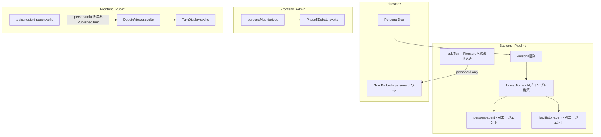
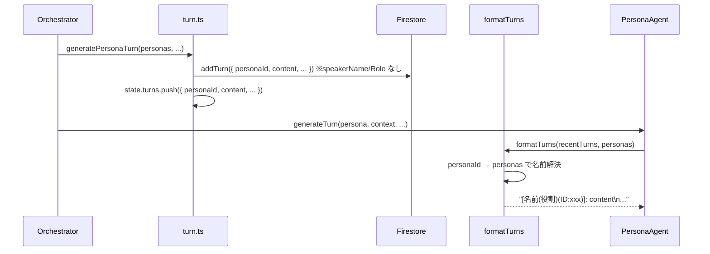

# 設計書: session-turn-normalization

## Overview

Firestore の `sessions/0.turns[]` 配列に保存されている各ターンドキュメントから、冗長な発言者情報（`speakerName`・`speakerRole`）を除去し、`personaId` のみで発言者を識別できるよう正規化する。

情報の解決レイヤーを明確に分離する: **Firestore 保存レイヤー**では `personaId` のみを保持し、**AI プロンプト構築レイヤー**では `personas` 配列を介して実行時に名前・役割を解決する。**表示レイヤー**（管理画面・公開ページ）ではページコンポーネントレベルで `personaId → persona` の解決を行い、表示コンポーネントには解決済みの値を渡す。

### Goals
- Firestore ターンドキュメントから `speakerName`・`speakerRole` を除去してスキーマを正規化する
- AI 会話履歴フォーマッタが `personas` 配列から名前・役割を実行時解決する
- ペルソナフィルタリングを名前文字列比較から `personaId` 比較に切り替えて堅牢化する

### Non-Goals
- `PublishedTurn` の `speakerName`・`speakerRole` フィールド除去（表示コンポーネントは解決済み値を受け取る設計を維持する）
- Firestore 上の既存ターンドキュメントへのデータマイグレーション（古いフィールドは自然に無視される）
- ペルソナエージェント・ファシリテーターエージェントのプロンプト内容の変更

## Boundary Commitments

### This Spec Owns
- `DebateTurn` TypeScript 型の `speakerName?`・`speakerRole?` フィールド
- `addTurn()` のパラメータおよび Firestore 書き込みロジック
- `formatTurns()` のシグネチャおよび名前解決ロジック
- `TurnDoc`（フロントエンド）の `speakerName?`・`speakerRole?` フィールド
- `PublishedTurn` への `personaId?` フィールド追加
- `DebateViewer.svelte` のフィルタリングロジック

### Out of Boundary
- ペルソナエージェント・ファシリテーターエージェントのプロンプト文面
- Firestore 上に残存する古い `speakerName`/`speakerRole` フィールドの削除
- 信念変化・エンゲージメント等の別データモデル

### Allowed Dependencies
- `Persona` 型（`functions/src/types/persona.types.ts`）— 名前・役割の参照元
- `personasStore`（`src/lib/stores/personas.svelte`）— フロントエンドの persona データソース

### Revalidation Triggers
- `Persona` 型の `name`・`specificRole`・`stakeholderRole` フィールドが変更された場合
- `formatTurns()` の出力フォーマットを変更した場合（AIプロンプトへの影響）

## Architecture

### Existing Architecture Analysis

現在の非正規化フロー:
1. `generatePersonaTurn()` が `addTurn({ speakerName: persona.name, speakerRole: persona.specificRole })` を呼び出す
2. `generateFacilitatorTurn()` / `persistInterventionTurn()` が `addTurn({ speakerName: 'ファシリテーター', speakerRole: '' })` を呼び出す
3. `formatTurns(turns)` が `t.speakerName` を参照してプロンプトを組み立てる
4. `state.turns.push()` も同様に `speakerName`/`speakerRole` を設定する

正規化後のフロー:
1. `addTurn()` は `speakerName`/`speakerRole` を受け取らず書き込まない
2. `state.turns.push()` も `speakerName`/`speakerRole` を含まない
3. `formatTurns(turns, personas)` が `personaId → personas` で解決してプロンプトを組み立てる

### Architecture Pattern & Boundary Map



### Technology Stack

| レイヤー | 技術 | 本変更での役割 |
|---------|------|--------------|
| Backend / Functions | TypeScript strict | `DebateTurn` 型変更・`addTurn()` シグネチャ変更 |
| Data / Firestore | Firestore Admin SDK | turns 配列から speakerName/speakerRole フィールドを除去 |
| Frontend / SvelteKit | Svelte 5 runes | Phase5Debate・DebateViewer の解決ロジック変更 |

## File Structure Plan

### Modified Files

**Backend（functions/src）:**
- `types/debate.types.ts` — `DebateTurn` から `speakerName?`・`speakerRole?` を削除。`TurnGenerationContext.queuedTrigger.speakerName` はそのまま保持（in-memory 解決済み値）
- `pipeline/debate/turn.ts` — `addTurn()` パラメータと Firestore 書き込みから `speakerName`/`speakerRole` を除去。`state.turns.push()` からも除去。`queuedTrigger` 構築時に `personas` から名前を解決
- `pipeline/debate/intervention.ts` — `persistInterventionTurn()` の `addTurn()` 呼び出しと `state.turns.push()` から `speakerName`/`speakerRole` を除去
- `utils/prompt-formatters.ts` — `formatTurns(turns, personas)` にシグネチャを変更し、`personaId` から名前・役割を解決するよう実装変更
- `agents/persona-agent.ts` — `formatTurns()` の呼び出しに `personas` を追加
- `agents/facilitator-agent.ts` — `formatTurns()` の呼び出しに `personas` を追加（呼び出し箇所を確認して修正）

**Frontend（src）:**
- `lib/models/session/session.types.ts` — `TurnDoc` から `speakerName?`・`speakerRole?` を削除。`PublishedTurn` に `personaId?: string | null` を追加
- `lib/features/admin/debate/Phase5Debate.svelte` — ターンの `speakerName`/`speakerRole` 参照を `personaMap` からの解決に変更
- `lib/features/topics/detail/DebateViewer.svelte` — フィルタリング条件を `t.speakerName === name` から `t.personaId === selectedPersonaId` に変更
- `routes/topics/[topicId]/+page.svelte` — `PublishedTurn` 構築時に `personaId: t.personaId ?? null` を追加

## System Flows



## Requirements Traceability

| 要件 | 概要 | コンポーネント | インターフェース |
|------|------|--------------|----------------|
| 1.1–1.4 | Firestore ターンの正規化 | `addTurn`, `DebateTurn` 型 | `addTurn()` シグネチャ |
| 2.1–2.6 | `formatTurns()` の名前解決 | `formatTurns`, `PersonaAgent`, `FacilitatorAgent` | `formatTurns(turns, personas)` |
| 3.1–3.2 | `queuedTrigger` 名前解決 | `generatePersonaTurn` | `personas` 配列参照 |
| 4.1–4.3 | 管理画面表示対応 | `Phase5Debate.svelte`, `TurnDoc` 型 | `personaMap` 参照 |
| 5.1–5.4 | 公開ページ表示・フィルタ対応 | `+page.svelte`, `DebateViewer.svelte`, `PublishedTurn` 型 | `personaId` 比較 |

## Components and Interfaces

| コンポーネント | レイヤー | 役割 | 要件 | 依存 |
|-------------|---------|------|------|------|
| `addTurn()` | Backend / Firestore | ターンの永続化（正規化済み） | 1.1–1.3 | Firestore Admin SDK (P0) |
| `DebateTurn` 型 | Backend / 型 | インメモリターン表現 | 1.4, 3.1 | — |
| `formatTurns()` | Backend / ユーティリティ | AIプロンプト用会話履歴文字列の構築 | 2.1–2.6 | `Persona[]` (P0) |
| `generatePersonaTurn()` | Backend / Pipeline | `queuedTrigger` 名前解決 | 3.1–3.2 | `Persona[]` (P0) |
| `TurnDoc` 型 | Frontend / 型 | Firestore ターンのクライアント表現 | 4.3 | — |
| `PublishedTurn` 型 | Frontend / 型 | 表示用解決済みターン表現 | 5.1–5.4 | — |
| `Phase5Debate.svelte` | Frontend / 管理画面 | 管理画面のターン表示 | 4.1–4.2 | `personaMap` (P0) |
| `DebateViewer.svelte` | Frontend / 公開画面 | 公開ページのターンフィルタリング | 5.4 | `PublishedTurn.personaId` (P0) |
| `+page.svelte` | Frontend / 公開ページ | `PublishedTurn` の構築 | 5.1–5.3 | `personaMap`, `TurnDoc` (P0) |

### Backend / Pipeline

#### addTurn()

| Field | Detail |
|-------|--------|
| Intent | ターンを Firestore の sessions/0.turns[] に追記する（speakerName/speakerRole を除く） |
| Requirements | 1.1, 1.2, 1.3 |

**Contracts**: Service [x]

##### Service Interface
```typescript
// speakerName / speakerRole パラメータを除去
type AddTurnParams = {
  topicId: string;
  turnIndex: number;
  speakerType: 'persona' | 'facilitator';
  personaId?: string;
  content: string;
  chapterId?: string;
  speechMode?: 'opinion' | 'fact' | 'question';
  engagementScore?: number;
  fromQueue?: boolean;
  targetPersonaId?: string;
  targetedBy?: 'facilitator' | 'persona';
  searchUsed?: boolean;
  searchQueries?: string[];
};
```

**Implementation Notes**
- `speakerName`・`speakerRole` の条件付き書き込みを `addTurn()` 本体から削除
- `generateFacilitatorTurn()` と `persistInterventionTurn()` の `state.turns.push()` からも除去

#### formatTurns()

| Field | Detail |
|-------|--------|
| Intent | ターン配列を AI プロンプト用の文字列に変換する。personaId から personas で名前・役割を解決する |
| Requirements | 2.1, 2.2, 2.3, 2.4, 2.5, 2.6 |

**Contracts**: Service [x]

##### Service Interface
```typescript
// personas を必須第2引数として追加
const formatTurns = (
  turns: ReadonlyArray<DebateTurn>,
  personas: ReadonlyArray<Persona>
): string
```

- 出力フォーマット（変更なし）:
  - ペルソナターン: `[名前(役割)(ID:personaId)]: content`
  - ファシリテーターターン: `[ファシリテーター()]: content`
- `personaId` が `personas` に存在しない場合は `Persona(${personaId})` にフォールバック
- Preconditions: `turns` は空配列でも可。`personas` は空配列でも可（フォールバックで処理）

**Implementation Notes**
- `persona-agent.ts` の2箇所（`recentTurns`・`ownTurns`）で `formatTurns(turns, personas)` に更新
- `facilitator-agent.ts` の呼び出し箇所でも同様に `personas` を渡す

### Frontend / 型定義

#### TurnDoc 型

```typescript
// session.types.ts
export type TurnDoc = {
  id: string;
  turnIndex: number;
  speakerType: SpeakerType;
  personaId?: string;
  // speakerName?: string;  ← 削除
  // speakerRole?: string;  ← 削除
  content: string;
  createdAt: Timestamp;
  speechMode?: 'opinion' | 'fact';
  engagementScore?: number;
  fromQueue?: boolean;
  targetPersonaId?: string;
};
```

#### PublishedTurn 型

```typescript
// session.types.ts
export type PublishedTurn = {
  id: string;
  turnIndex: number;
  speakerType: SpeakerType;
  personaId?: string | null;  // ← 追加（フィルタリング用）
  speakerName: string;         // 解決済み値として保持
  speakerRole: string;         // 解決済み値として保持
  content: string;
  beliefChangesTriggered: BeliefChangeTrigger[];
};
```

### Frontend / 管理画面

#### Phase5Debate.svelte

| Field | Detail |
|-------|--------|
| Intent | 管理画面でのターン一覧表示。speakerName/Role を personaMap から解決する |
| Requirements | 4.1, 4.2 |

**Implementation Notes**
- `speakerName: t.speakerName ?? persona?.name ?? 'ファシリテーター'` → `speakerName: persona?.name ?? 'ファシリテーター'`
- `speakerRole: persona?.specificRole ?? persona?.stakeholderRole ?? t.speakerRole ?? ''` → `speakerRole: persona?.specificRole ?? persona?.stakeholderRole ?? ''`

### Frontend / 公開ページ

#### DebateViewer.svelte

| Field | Detail |
|-------|--------|
| Intent | ペルソナ選択によるターンフィルタリング |
| Requirements | 5.4 |

**Implementation Notes**
- `t.speakerName === debate.personas.find((p) => p.id === selectedPersonaId)?.name` → `t.personaId === selectedPersonaId`
- `PublishedTurn.personaId` を参照するため、型に `personaId?` が追加されていること前提

## Data Models

### Logical Data Model（変更箇所のみ）

**TurnEmbed（Firestore `sessions/0.turns[]` 配列要素）**

| フィールド | 型 | 変更 |
|-----------|-----|------|
| `speakerName` | `string` | **削除** |
| `speakerRole` | `string` | **削除** |
| `personaId` | `string \| undefined` | 変更なし（識別子として使用） |

Firestore 上の既存ドキュメントに残存する `speakerName`/`speakerRole` フィールドは読み取り側が参照しなくなるため、実害なし。データマイグレーション不要。

## Testing Strategy

### Unit Tests
- `formatTurns(turns, personas)`: `personaId` が存在するケース・存在しないケース（フォールバック）・ファシリテーターターンのケースを各1件
- `addTurn()`: Firestore に `speakerName`/`speakerRole` が書き込まれないことを検証

### Integration Tests
- `generatePersonaTurn()` 呼び出し後の `state.turns` に `speakerName`/`speakerRole` が含まれないことを検証
- `formatTurns()` が正しい文字列を返すことを AI エージェントのユニットテストで検証

### Regression
- `DebateViewer.svelte` のペルソナフィルタリングが正しく動作することをコンポーネントテストで確認（`speakerName` 比較ではなく `personaId` 比較）
