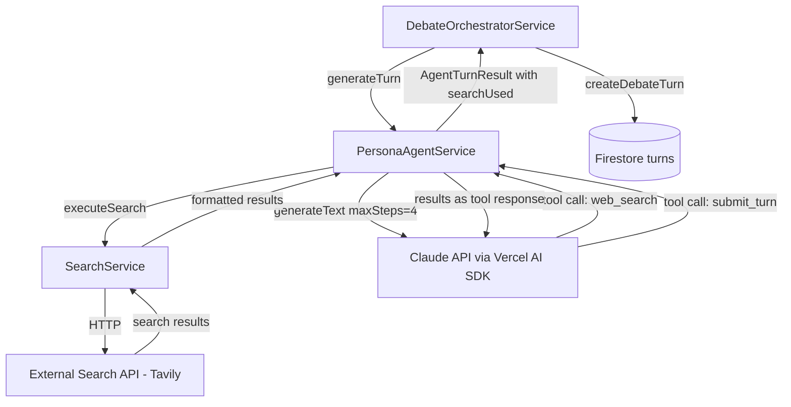
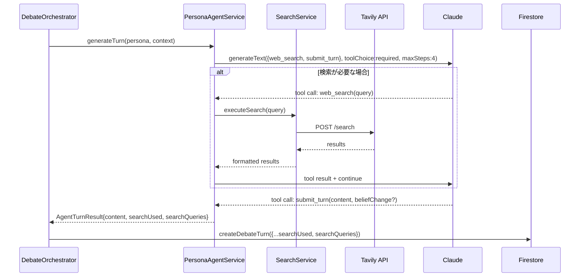

# Design Document — speech-search-grounding

## Overview

本フィーチャーは、logotope の討論生成パイプラインにおける `PersonaAgentService.generateTurn` に Web 検索ツールを統合する。Vercel AI SDK v4 の `maxSteps` によるアジェンティックループを活用し、ペルソナが数値・統計・最新情報などを発言に含める際に検索ツールを自律的に呼び出せるよう拡張する。

**Purpose**: 討論中に事実情報が必要と判断した場合にペルソナが検索を実行し、根拠のある発言を生成できるようにする。  
**Users**: 管理者（AI 生成の品質・透明性確認）、エンドユーザー（高品質な討論コンテンツ閲覧）。  
**Impact**: `PersonaAgentService.generateTurn` の呼び出しパターンを変更し、Firestore のターンドキュメントに検索メタデータフィールドを追加する。

### Goals

- ペルソナエージェントが発言生成時に自律的に Web 検索を実行できる
- 検索が不要な場合は既存の1ステップ生成と同等の動作・コストを維持する
- 検索実行の有無とクエリを Firestore のターンレコードに記録する
- 検索 API が利用不可な場合でも討論が中断しない

### Non-Goals

- ファシリテーターエージェントへの検索ツール適用
- フロントエンドからのリアルタイム検索 UI
- 検索結果のフロントエンド表示
- Gemini / GPT モデル固有の検索機能（グラウンディング等）との統合

## Boundary Commitments

### This Spec Owns

- `PersonaAgentService.generateTurn` の検索ツール統合とアジェンティックループ実装
- 検索ツールを提供する `SearchService` のインターフェースと実装
- `AgentTurnResult`, `DebateTurn`, `CreateDebateTurnParams` への検索メタデータ追加
- システムプロンプトの検索ガイダンス追加と既存制限指示の置換

### Out of Boundary

- `assessEngagement` および `generatePostDebateComment` への検索ツール適用
- 検索結果のフロントエンドへの公開
- 検索プロバイダーの選定以上の外部サービス契約・設定

### Allowed Dependencies

- Vercel AI SDK (`ai@^4.0.0`) の `generateText` + `maxSteps`
- `@ai-sdk/anthropic` v1.2.12（現行バージョンのまま使用）
- 外部検索 API（Tavily 等）— 環境変数 `TAVILY_API_KEY` が未設定の場合はグレースフルデグレード
- 既存の Firestore `FieldValue.arrayUnion` によるターン追記パターン

### Revalidation Triggers

- `AgentTurnResult` の型変更（新規フィールド追加）は `debate-orchestrator.ts` の参照箇所を再確認
- `CreateDebateTurnParams` の変更は `repository.ts` の `createDebateTurn` 実装を再確認
- 検索プロバイダー変更時は `SearchService` インターフェースを再確認

## Architecture

### Existing Architecture Analysis

現行 `generateTurn` は Vercel AI SDK の `generateText` を1ステップで呼び出し、`toolChoice: { type: 'tool', toolName: 'submit_turn' }` で強制的に1回の tool call を取得する。`maxSteps` は未使用。

```
generateTurn()
└── generateText({
      tools: { submit_turn },
      toolChoice: { type: 'tool', toolName: 'submit_turn' },  ← 強制1ステップ
    })
      └── submit_turn args → AgentTurnResult
```

### Architecture Pattern & Boundary Map



**Architecture Integration**:
- 選択パターン: agentic tool loop（`maxSteps` で検索ループ → `submit_turn` で終了）
- `web_search` は `execute` あり（SDK がループ継続）、`submit_turn` は `execute` なし（SDK がループ停止）
- `SearchService` は `persona-agent.ts` から依存し、`debate-orchestrator.ts` からは直接参照しない
- 既存の `buildPersonaSystemPrompt`, `buildFullTurnTools`, `generateTurn` を修正

### Technology Stack

| Layer | Choice / Version | Role in Feature | Notes |
|-------|------------------|-----------------|-------|
| Backend / AI | Vercel AI SDK `ai@^4.0.0` | `generateText` + `maxSteps` でアジェンティックループ | 既存依存、変更なし |
| Backend / AI | `@ai-sdk/anthropic@1.2.12` | Claude モデルの呼び出し | web_search 未実装のため外部 API 必須 |
| Backend / 検索 | Tavily API（推奨） | 検索クエリ → 結果スニペット | `TAVILY_API_KEY` 環境変数で管理 |
| Data | Firestore `FieldValue.arrayUnion` | 検索メタデータ付きターンの追記 | 既存パターン維持 |

## File Structure Plan

### 新規ファイル

```
functions/src/
└── search/
    └── search-service.ts    # 検索 API クライアント（SearchService 実装）
```

### 修正ファイル

- `functions/src/agents/persona-agent.ts` — `buildPersonaSystemPrompt`, `buildFullTurnTools`, `generateTurn` を修正
- `functions/src/types/index.ts` — `AgentTurnResult` に検索メタデータ追加
- `functions/src/db/repository.ts` — `DebateTurn`, `CreateDebateTurnParams`, `createDebateTurn` を修正
- `functions/src/pipeline/debate-orchestrator.ts` — `generatePersonaTurn` で検索メタデータを `repo.createDebateTurn` に渡す
- `functions/src/config/ai.ts` — `MAX_TOKENS.PERSONA_TURN_WITH_SEARCH` 追加（任意）

## System Flows



フロー上の判断点:
- `web_search` が `execute` を持つため、呼ばれると SDK が自動でループを継続する
- `submit_turn` が `execute` を持たないため、呼ばれると SDK がループを停止して結果を返す
- `maxSteps: 4` を超えた場合 / `submit_turn` が見つからない場合: 従来の強制 `toolChoice` でリトライ

## Requirements Traceability

| Requirement | Summary | Components | Interfaces | Flows |
|-------------|---------|------------|------------|-------|
| 1.1 | Claude API の tool_use で検索ツール受け取り | `PersonaAgentService.generateTurn`, `buildFullTurnTools` | `SearchToolDef` | generateText ループ |
| 1.2 | 検索ツール付きで Claude API 呼び出し | `PersonaAgentService.generateTurn` | `generateText({tools})` | sequenceDiagram |
| 1.3 | multi-step tool call サポート | `generateTurn` (`maxSteps: 4`) | — | sequenceDiagram |
| 1.4 | 検索ツールの有効/無効制御 | `buildFullTurnTools(searchEnabled)` | `SearchService.isAvailable()` | — |
| 2.1 | 正確性が必要な情報を検索 | `buildPersonaSystemPrompt` 修正 | — | — |
| 2.2 | 判断を職種・発信者に限定しない | `buildPersonaSystemPrompt` 修正 | — | — |
| 2.3 | 検索不要なら直接 submit_turn | `toolChoice: 'required'` + AI 自律判断 | — | sequenceDiagram |
| 2.4 | ペルソナの立場に沿ったクエリ構築 | `buildPersonaSystemPrompt` 修正（クエリ構築指示） | — | — |
| 3.1 | 検索結果を参照して発言生成 | `generateTurn` (`maxSteps` で tool result をコンテキストに追加) | — | sequenceDiagram |
| 3.2 | beliefs・stanceDirection の維持 | `buildPersonaSystemPrompt`（既存の信念ドキュメント指示を継続）| — | — |
| 3.3 | 検索結果と信念の矛盾処理 | システムプロンプトの検索ガイダンスに指示を追加 | — | — |
| 3.4 | 根拠を発言に組み込む | システムプロンプトの検索ガイダンスに指示を追加 | — | — |
| 4.1 | 検索エラー時にログ記録して継続 | `SearchService.executeSearch` のエラーハンドリング | `SearchResult` | — |
| 4.2 | 検索結果が空の場合は既存知識で発言 | `generateTurn` の `submit_turn` 未発見時リトライ | — | — |
| 4.3 | 検索可用性に依存せず発言を返す | `TAVILY_API_KEY` 未設定時のグレースフルデグレード | — | — |
| 4.4 | 検索失敗時に討論を中断しない | `generateTurn` の try-catch 既存パターン継続 | — | — |
| 5.1 | 検索クエリ・結果を Firestore に記録 | `createDebateTurn` + `generatePersonaTurn` | `CreateDebateTurnParams` | — |
| 5.2 | `searchUsed: boolean` フラグをターンに含める | `DebateTurn`, `CreateDebateTurnParams` | — | — |
| 5.3 | 既存 turns 埋め込み構造を使用 | `repository.ts` の `FieldValue.arrayUnion` | — | — |
| 5.4 | 新規サブコレクションを追加しない | `createDebateTurn` のみ修正 | — | — |

## Components and Interfaces

### Summary

| Component | Domain / Layer | Intent | Req Coverage | Key Dependencies | Contracts |
|-----------|---------------|--------|--------------|------------------|-----------|
| `SearchService` | Infrastructure | 外部検索 API の呼び出しと結果整形 | 1.4, 4.1, 4.3 | Tavily API (P1) | Service |
| `PersonaAgentService.generateTurn` | AI Pipeline | 検索アジェンティックループの実行 | 1.1–1.4, 2.1–2.4, 3.1–3.4, 4.1–4.4 | SearchService (P1), Vercel AI SDK (P0) | Service |
| `buildPersonaSystemPrompt` | AI Pipeline | システムプロンプトへの検索ガイダンス追加 | 2.1–2.4, 3.2–3.4 | — | — |
| `buildFullTurnTools` | AI Pipeline | 検索ツール定義の組み込み | 1.1, 1.4 | SearchService (P1) | — |
| `AgentTurnResult` | Types | 検索メタデータの型定義 | 5.1, 5.2 | — | State |
| `DebateTurn` / `CreateDebateTurnParams` | Data | Firestore ターンの検索メタデータ永続化 | 5.1–5.4 | — | State |

---

### Infrastructure

#### SearchService

| Field | Detail |
|-------|--------|
| Intent | 外部検索 API（Tavily 等）を呼び出し、LLM が利用しやすい形式で検索結果を返す |
| Requirements | 1.4, 4.1, 4.3 |

**Responsibilities & Constraints**
- 検索クエリを受け取り、結果を文字列（スニペット集合）として返す
- `TAVILY_API_KEY` 未設定時は `available: false` を返し、ツールを無効化する
- 1クエリあたりの結果数は上限5件（LLM コンテキスト肥大化を防ぐ）

**Dependencies**
- External: Tavily API — 検索クエリへの応答 (P1)

**Contracts**: Service [x]

##### Service Interface

```typescript
interface SearchService {
  isAvailable(): boolean;
  executeSearch(query: string): Promise<SearchResult>;
}

interface SearchResult {
  ok: boolean;
  content?: string;  // 結果スニペットを連結した文字列
  error?: string;
}
```

- Preconditions: `isAvailable() === true` の場合のみ `executeSearch` を呼ぶ
- Postconditions: `ok: true` の場合は `content` が定義される
- Invariants: `executeSearch` はネットワークエラー時も例外を投出せず `{ ok: false }` を返す

---

### AI Pipeline

#### `buildPersonaSystemPrompt` の修正

| Field | Detail |
|-------|--------|
| Intent | 検索ガイダンスをシステムプロンプトに追加し、既存の「個人経験のみ」制限を置換する |
| Requirements | 2.1–2.4, 3.2–3.4 |

**変更内容**

削除するセクション（`buildPersonaSystemPrompt` 内）:
```
発言の根拠は自分が直接経験したこと・職場で見聞きしたことに限る。
立場を守るために遠い政策事例・海外制度・統計数値を持ち出すのは不自然。
自分の生活や仕事の実感として話すこと。
```

追加するセクション（`## 情報収集について` として末尾に追加）:
```
数値・統計・最新動向など正確性が求められる情報を発言の根拠として示す場合は、
推測や記憶だけに頼らず検索ツールを積極的に使用すること。
検索クエリは自分の立場・職業・関心に沿った視点で構築すること。
検索ツールは必要なときのみ使用し、1〜2回以内にとどめること。
自分の体験・実感はそのまま語ってよい。
```

また `factInstruction` の以下制限も除去する:
```
出典・数字は事前取材レコードの範囲にとどめ、不確かなことは断言しない。
```

置換後:
```
検索ツールで確認した情報は根拠として使ってよい。確認していない情報は断言しない。
```

#### `buildFullTurnTools` の修正

| Field | Detail |
|-------|--------|
| Intent | `web_search` ツール定義を `submit_turn` と組み合わせて提供する |
| Requirements | 1.1, 1.4 |

**変更内容**

```typescript
// 変更前シグネチャ
function buildFullTurnTools(styleGuide: string, lengthGuide: string)

// 変更後シグネチャ
function buildFullTurnTools(
  styleGuide: string,
  lengthGuide: string,
  searchService: SearchService
)
```

戻り値に `web_search` を追加:
```typescript
{
  submit_turn: { /* 既存定義そのまま、execute なし */ },
  web_search: {
    description: '数値・統計・最新情報など正確性が必要な情報を検索する。1〜2回以内で使用すること。',
    parameters: jsonSchema({
      type: 'object',
      properties: { query: { type: 'string', description: '検索クエリ（日本語可）' } },
      required: ['query'],
    }),
    execute: async ({ query }: { query: string }) => {
      const result = await searchService.executeSearch(query);
      return result.ok ? result.content! : '検索結果を取得できませんでした。';
    },
  },
}
```

`searchService.isAvailable()` が `false` の場合、`web_search` を含めず `{ submit_turn }` のみを返す。

#### `PersonaAgentService.generateTurn` の修正

| Field | Detail |
|-------|--------|
| Intent | `maxSteps` アジェンティックループで検索 → 発言生成を1回の `generateText` で実現する |
| Requirements | 1.1–1.4, 2.1–2.4, 3.1–3.4, 4.1–4.4 |

**変更内容**

```typescript
// 変更前
const callFull = (model) =>
  generateText({
    model,
    maxTokens: MAX_TOKENS.PERSONA_TURN,
    system,
    tools: fullTools,
    toolChoice: { type: 'tool', toolName: 'submit_turn' } as const,
    messages: [{ role: 'user', content: userContent }],
  });

// 変更後
const collectedSearchQueries: string[] = [];
const fullTools = buildFullTurnTools(styleGuide, lengthGuide, searchServiceWithQueryCollection);
const callFull = (model) =>
  generateText({
    model,
    maxTokens: MAX_TOKENS.PERSONA_TURN,
    system,
    tools: fullTools,
    toolChoice: 'required' as const,
    maxSteps: 4,
    messages: [{ role: 'user', content: userContent }],
  });
```

`submit_turn` の取得を全ステップから検索するよう変更:
```typescript
// 変更前
const toolCall = fullResult.toolCalls[0];

// 変更後
const toolCall = fullResult.steps
  .flatMap(s => s.toolCalls)
  .find(c => c.toolName === 'submit_turn');

// submit_turn が見つからない場合は強制 toolChoice でリトライ（既存パターン）
if (!toolCall) {
  const retryResult = await generateText({
    ...options,
    tools: { submit_turn: submitTurnOnlyTool },
    toolChoice: { type: 'tool', toolName: 'submit_turn' },
    maxSteps: 1,
    messages: [{ role: 'user', content: userContent }],
  });
  // ...
}
```

`AgentTurnResult` に検索メタデータを追加して返す:
```typescript
return {
  ok: true,
  value: {
    content,
    speechMode: isFact ? 'fact' : 'opinion',
    beliefChange,
    addressedToPersonaId,
    searchUsed: collectedSearchQueries.length > 0,
    searchQueries: collectedSearchQueries.length > 0 ? collectedSearchQueries : undefined,
  },
};
```

**Implementation Notes**
- Integration: `SearchService` は `PersonaAgentService` のコンストラクタ引数（または内部インスタンス化）で注入する
- Validation: `TAVILY_API_KEY` 未設定時は `searchService.isAvailable() === false` → `web_search` ツールを省略 → 既存の1ステップ動作と同等
- Risks: `collectedSearchQueries` は各呼び出しスコープで初期化すること（クロスターン汚染を防ぐ）

---

### Types

#### `AgentTurnResult` の拡張

**Contracts**: State [x]

```typescript
// 変更前
export interface AgentTurnResult {
  content: string;
  speechMode?: 'opinion' | 'fact';
  beliefChange: BeliefChangeEvent | null;
  addressedToPersonaId?: string;
}

// 変更後
export interface AgentTurnResult {
  content: string;
  speechMode?: 'opinion' | 'fact';
  beliefChange: BeliefChangeEvent | null;
  addressedToPersonaId?: string;
  searchUsed?: boolean;      // 追加: 検索ツールが呼ばれた場合 true
  searchQueries?: string[];  // 追加: 実行された検索クエリ一覧
}
```

---

### Data

#### `DebateTurn` / `CreateDebateTurnParams` の拡張

**Contracts**: State [x]

```typescript
// repository.ts — DebateTurn に追加
export interface DebateTurn {
  // ...既存フィールド...
  searchUsed?: boolean;
  searchQueries?: string[];
}

// repository.ts — CreateDebateTurnParams に追加
export interface CreateDebateTurnParams {
  // ...既存フィールド...
  searchUsed?: boolean;
  searchQueries?: string[];
}
```

`createDebateTurn` の実装変更（既存の undefined スキップパターンに準じる）:
```typescript
if (params.searchUsed) turn.searchUsed = true;
if (params.searchQueries?.length) turn.searchQueries = params.searchQueries;
```

---

### Pipeline

#### `generatePersonaTurn` の修正（debate-orchestrator.ts）

`turnResult.value` から検索メタデータを取得して `repo.createDebateTurn` に渡す:

```typescript
const savedTurn = await repo.createDebateTurn({
  // ...既存パラメータ...
  searchUsed: turnResult.value.searchUsed,
  searchQueries: turnResult.value.searchQueries,
});
```

## Data Models

### Domain Model

```
TurnEmbed（topics/{topicId}/sessions/0 の turns 配列要素）
  既存: id, turnIndex, speakerType, content, speechMode, engagementScore, fromQueue, addressedPersonaId
  追加: searchUsed?: boolean, searchQueries?: string[]
```

### Physical Data Model

**Firestore — turns 配列エントリ（変更後）**

| フィールド | 型 | 条件 |
|-----------|---|------|
| `searchUsed` | `boolean` | 検索が実行された場合のみ（`true` のとき保存、`false` / 未検索なら省略） |
| `searchQueries` | `string[]` | 検索が実行された場合のみ |

- Firestore 読み取り課金への影響なし（既存ドキュメントへの追記のみ）
- ターン1件あたりの増分: 最大数百バイト（既存上限 300KB に対して無視可能）

## Error Handling

### Error Strategy

| エラー種別 | 発生箇所 | 対応 |
|-----------|----------|------|
| 検索 API エラー（HTTP 4xx/5xx） | `SearchService.executeSearch` | `{ ok: false }` を返す。`web_search` ツールは「結果を取得できませんでした」を返してループ継続 |
| `submit_turn` 未発見（maxSteps 枯渇） | `generateTurn` | 強制 `toolChoice: submit_turn` でリトライ（既存パターン） |
| 全リトライ失敗 | `generateTurn` | `{ ok: false, error: { code: 'AI_API_ERROR', retryable: true } }` を返す（既存パターン） |
| `TAVILY_API_KEY` 未設定 | `SearchService.isAvailable()` | `false` を返し `web_search` ツールを省略。動作は検索なし版と同等 |

### Monitoring

- `console.error('[search] query failed:', query, err)` で検索失敗をログ
- `console.log('[search] query:', query)` で検索実行をログ（デバッグ用）
- Firestore の `searchUsed: true` ターンを集計することで検索利用率を確認可能

## Testing Strategy

### Unit Tests

- `SearchService.executeSearch`: 正常系（結果あり）/ エラー系（HTTP 500）/ 空結果のそれぞれで正しい `SearchResult` を返す
- `buildFullTurnTools(searchEnabled=true)`: `web_search` ツールが含まれる
- `buildFullTurnTools(searchEnabled=false)`: `web_search` ツールが含まれない
- `buildPersonaSystemPrompt`: 検索ガイダンス文言が含まれる / 旧「個人経験のみ」制限が含まれない
- `createDebateTurn`: `searchUsed: true` のとき Firestore の `arrayUnion` に `searchUsed` フィールドが含まれる

### Integration Tests

- `generateTurn` + モック `SearchService`（検索あり）: `AgentTurnResult.searchUsed === true`, `searchQueries` が1件以上
- `generateTurn` + モック `SearchService`（検索なし）: `AgentTurnResult.searchUsed === undefined`
- `generateTurn` + 検索 API エラー: エラー後も `content` を含む正常な結果を返す
- `generateTurn` + `searchEnabled=false`（API キーなし）: 既存の1ステップ動作と同等のレスポンス

## Security Considerations

- `TAVILY_API_KEY` は Firebase Functions の Secret Manager（または環境変数）で管理し、コードに直接埋め込まない
- 検索クエリはペルソナの発言コンテキストから生成される。個人情報（ユーザーの入力）は含まれない

## Performance & Scalability

- 検索ありの場合: 追加レイテンシは検索 API のラウンドトリップ × 検索回数（目安 0.5〜2秒/回）
- 検索なしの場合: 既存と同一（`web_search` が呼ばれなければ追加コストゼロ）
- `maxSteps: 4` はデフォルト上限。過剰検索をシステムプロンプトで抑制する

## Supporting References

- research.md — アーキテクチャパターン評価と決定根拠
- Vercel AI SDK `maxSteps` ドキュメント（実装時参照推奨）
- Tavily API ドキュメント（実装時参照推奨）
