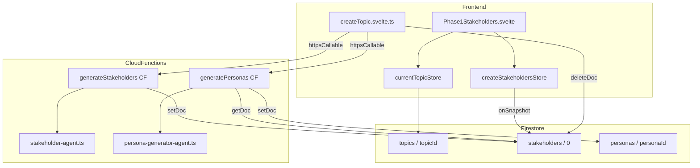
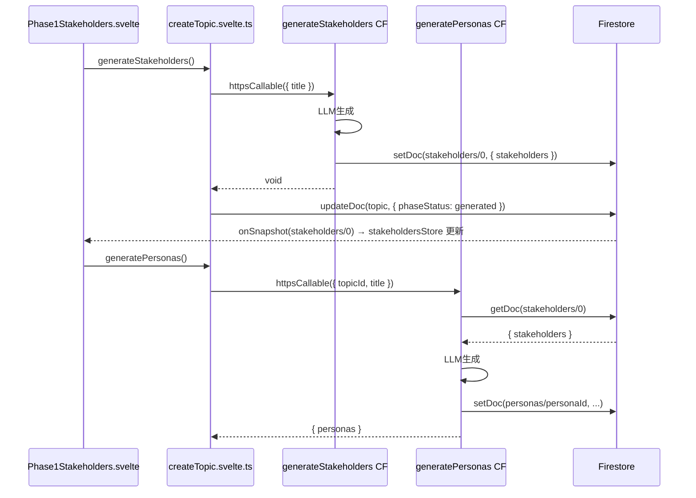

# Technical Design: stakeholder-document-extraction

## Overview

`topic.stakeholders[]` の埋め込み配列を廃止し、`topics/{topicId}/stakeholders/0` 固定 ID サブドキュメントへ移行する。`chapterAnalysis/0`・`postDebateComments/0` と同様の固定 ID ドキュメントパターンを適用することで、Phase1 生成成果物の管理方針を統一する。

あわせて `generateStakeholders` CF が生成結果を直接 Firestore に書き込む構造に変更し、`generatePersonas` CF がステークホルダーデータをフロントエンド経由ではなく Firestore から直接読み込む構造にする。これによりフロントエンドが LLM 出力を中継する不要な責務が除去される。

### Goals

- `topic.stakeholders[]` を廃止し `stakeholders/0` ドキュメントへ移行する
- `generateStakeholders` CF が `stakeholders/0` に直接書き込む
- `generatePersonas` CF がフロントエンド引数を受け取らずに `stakeholders/0` を読む
- `createStakeholdersStore` を新設し、`currentTopicStore` に統合する

### Non-Goals

- `Stakeholder` 型・ステークホルダー生成プロンプトの変更
- `StakeholderDoc` 型の移動（`topic.types.ts` のフィールドのみ除去）
- Phase1 の UI デザイン変更

---

## Boundary Commitments

### This Spec Owns

- `topics/{topicId}/stakeholders/0` ドキュメントの書き込み（`generateStakeholders` CF）・読み込み（`stakeholdersStore`）・削除（`resetStakeholders`）
- `topic.stakeholders` フィールドの廃止（型定義・読み書きコード）
- `generatePersonas` CF の `stakeholders` 引数除去と Firestore 直接読み込みへの切り替え
- Firestore セキュリティルールの `stakeholders/{docId}` エントリ追加

### Out of Boundary

- `StakeholderDoc` 型の別ファイルへの移動
- ステークホルダー生成ロジック（プロンプト・モデル選択）の変更
- Phase1 画面の UX・レイアウト変更

### Allowed Dependencies

- `firebase-admin/firestore`（CF 側 Firestore 書き込み）
- `firebase/firestore`（フロントエンド `onSnapshot`・`deleteDoc`）
- 既存の `createChapterAnalysisStore`・`createPostDebateCommentsStore` パターン

### Revalidation Triggers

- `stakeholders/0` ドキュメントのフィールド構造変更（`StakeholderDoc` 型変更時）
- `currentTopicStore.start()` のライフサイクル変更時

---

## Architecture

### Existing Architecture Analysis

現状のデータフローは以下の通り：

1. フロントエンドが `generateStakeholders` CF を呼び出す（引数: `title`）
2. CF が LLM でステークホルダーを生成し、`{ stakeholders: StakeholderDoc[] }` をフロントに返す
3. フロントエンドが `updateDoc(topic, { stakeholders: data.stakeholders, ... })` を書き込む
4. フロントエンドが `topic.stakeholders` を `$state` で保持し、`Phase1Stakeholders.svelte` が参照する
5. `generatePersonas` 呼び出し時にフロントエンドが `stakeholders` を引数として CF に渡す

変更後のフローは CF が直接 Firestore に書き込み、フロントエンドは `stakeholdersStore` 経由で参照する。

### Architecture Pattern & Boundary Map



**Key Decisions**:
- `generateStakeholders` CF は LLM 結果をフロントに返さず、直接 `stakeholders/0` に `setDoc` する（`generateChapters` CF と同じパターン）
- `generatePersonas` CF は `request.data.stakeholders` を除去し、Admin SDK で `stakeholders/0` を `getDoc` する
- フロントエンドの `createTopicStates` から `stakeholders` $state と `get stakeholders()` を除去する

### Technology Stack

| Layer | Choice | Role |
|-------|--------|------|
| Frontend Store | Svelte 5 Runes + `onSnapshot` | `stakeholders/0` 購読 |
| Backend CF | Firebase Functions v2 + Admin SDK | `stakeholders/0` 書き込み・読み込み |
| Data | Firestore（固定 ID ドキュメント） | ステークホルダー永続化 |

---

## File Structure Plan

### 新規ファイル

```
src/lib/stores/
└── stakeholders.svelte.ts    ← createStakeholdersStore（chapterAnalysis パターン）
```

### 変更ファイル

- `functions/src/api/stakeholders.ts` — `stakeholders/0` への `setDoc` を追加。レスポンス型を void 相当に変更
- `functions/src/api/personas.ts` — `stakeholders` 引数を除去。`stakeholders/0` を Firestore から読む
- `src/lib/models/topic/topic.types.ts` — `TopicDoc.stakeholders?: StakeholderDoc[]` フィールドを除去
- `src/lib/models/topic/createTopic.svelte.ts` — `stakeholders` $state・`get stakeholders()`・引数渡しを除去。`resetStakeholders` を `deleteDoc` に変更
- `src/lib/stores/currentTopic.svelte.ts` — `stakeholdersStore` を追加（初期化・start・stop）
- `src/lib/features/admin/stakeholders/Phase1Stakeholders.svelte` — データ参照元を `stakeholdersStore.stakeholders` に変更
- `firestore.rules` — `stakeholders/{docId}` ルールを追加

---

## System Flows



---

## Requirements Traceability

| Requirement | Summary | Components | Flows |
|-------------|---------|------------|-------|
| 1.1 | `topic.stakeholders` フィールド除去 | `topic.types.ts`, `createTopic.svelte.ts` | — |
| 1.2 | `stakeholders/0` ドキュメントに保存 | `generateStakeholders CF`, Firestore | generateStakeholders フロー |
| 1.3 | CF が直接 `stakeholders/0` に書き込む | `functions/src/api/stakeholders.ts` | generateStakeholders フロー |
| 1.4 | `stakeholders: StakeholderDoc[]` フィールドのみ保持 | `stakeholders/0` ドキュメント構造 | — |
| 1.5 | 型定義から `stakeholders` フィールド除去 | `topic.types.ts` | — |
| 2.1 | `generatePersonas` CF から `stakeholders` 引数除去 | `functions/src/api/personas.ts` | generatePersonas フロー |
| 2.2 | CF が `stakeholders/0` を Firestore から読む | `functions/src/api/personas.ts` | generatePersonas フロー |
| 2.3 | `stakeholders/0` が存在しない場合にエラー | `functions/src/api/personas.ts` | generatePersonas フロー |
| 2.4 | フロントが `stakeholders` 引数を渡さない | `createTopic.svelte.ts` | — |
| 3.1 | `createStakeholdersStore` 新設 | `src/lib/stores/stakeholders.svelte.ts` | — |
| 3.2 | `stakeholders` と `isLoaded` を公開 | `createStakeholdersStore` | — |
| 3.3 | `currentTopicStore` に統合 | `src/lib/stores/currentTopic.svelte.ts` | — |
| 3.4 | `Phase1Stakeholders.svelte` が新ストアを参照 | `Phase1Stakeholders.svelte` | — |
| 3.5 | トピック離脱時にストアを停止 | `currentTopicStore.start()` の返却クリーンアップ | — |
| 4.1 | リセットで `stakeholders/0` を削除 | `createTopic.svelte.ts` → `deleteDoc` | — |
| 4.2 | `approveStakeholders` が `topic.stakeholders` を参照しない | `createTopic.svelte.ts` | — |
| 4.3 | `topic.stakeholders` への読み書きコード除去 | `createTopic.svelte.ts`, `Phase1Stakeholders.svelte` | — |
| 5.1 | `stakeholders/{docId}` ルール追加（認証必須） | `firestore.rules` | — |
| 5.2 | 未認証読み取り禁止 | `firestore.rules` | — |

---

## Components and Interfaces

| Component | Layer | Intent | Req Coverage | Key Dependencies |
|-----------|-------|--------|--------------|-----------------|
| `createStakeholdersStore` | Frontend Store | `stakeholders/0` 購読 | 3.1–3.5 | `onSnapshot`（P0） |
| `generateStakeholders CF` | Backend CF | ステークホルダー生成 + Firestore 書き込み | 1.2, 1.3, 1.4 | Admin SDK `setDoc`（P0） |
| `generatePersonas CF` | Backend CF | `stakeholders/0` 読み込み + ペルソナ生成 | 2.1–2.4 | Admin SDK `getDoc`（P0） |
| `createTopic.svelte.ts` | Frontend Model | stakeholders $state 廃止・操作更新 | 1.1, 2.4, 4.1–4.3 | `createStakeholdersStore` |
| `currentTopicStore` | Frontend Store | ストアライフサイクル管理 | 3.3, 3.5 | `createStakeholdersStore`（P0） |
| `Phase1Stakeholders.svelte` | Frontend UI | 新ストアへの参照切り替え | 3.4 | `currentTopicStore`（P0） |
| `firestore.rules` | Security | `stakeholders/{docId}` ルール定義 | 5.1, 5.2 | — |

### Backend: generateStakeholders CF

| Field | Detail |
|-------|--------|
| Intent | LLM でステークホルダーを生成し `stakeholders/0` に直接書き込む |
| Requirements | 1.2, 1.3, 1.4 |

**Contracts**: Service [x] / API [ ] / Event [ ] / Batch [ ] / State [ ]

##### Service Interface

```typescript
// functions/src/api/stakeholders.ts
// Request
type GenerateStakeholdersRequest = { title: string };

// Response（フロントに返すデータなし）
type GenerateStakeholdersResponse = Record<string, never>;

// Firestore 書き込み
// setDoc(doc(db, 'topics', topicId, 'stakeholders', '0'), { stakeholders: Stakeholder[] })
```

- Preconditions: `title` が空でないこと、認証済みであること
- Postconditions: `stakeholders/0` ドキュメントが `{ stakeholders: Stakeholder[] }` で作成または上書きされる
- Invariants: 書き込み失敗時は CF がエラーを返し、`phaseStatus` は `stopped` に更新される（フロント側責務）

**Implementation Notes**
- Integration: `topicId` は `request.data` に追加する（現状は `title` のみ）
- Risks: `topicId` 引数の追加に伴い、フロント側 `httpsCallable` の型定義も変更が必要

---

### Backend: generatePersonas CF

| Field | Detail |
|-------|--------|
| Intent | `stakeholders/0` を読み込んでペルソナを生成する |
| Requirements | 2.1, 2.2, 2.3, 2.4 |

**Contracts**: Service [x] / API [ ] / Event [ ] / Batch [ ] / State [ ]

##### Service Interface

```typescript
// functions/src/api/personas.ts
// Request（stakeholders 引数を除去）
type GeneratePersonasRequest = { topicId: string; title: string };

// Firestore 読み込み
// getDoc(doc(db, 'topics', topicId, 'stakeholders', '0'))
// → data().stakeholders: Stakeholder[]
```

- Preconditions: `topicId`・`title` が空でないこと、`stakeholders/0` が存在すること
- Postconditions: `personas/{personaId}` ドキュメントが生成される
- Error: `stakeholders/0` が存在しない場合 `HttpsError('invalid-argument', 'stakeholders not found')`

---

### Frontend Store: createStakeholdersStore

| Field | Detail |
|-------|--------|
| Intent | `stakeholders/0` を `onSnapshot` で購読し、`stakeholders` と `isLoaded` を公開する |
| Requirements | 3.1, 3.2, 3.5 |

**Contracts**: Service [ ] / API [ ] / Event [ ] / Batch [ ] / State [x]

##### State Management

```typescript
// src/lib/stores/stakeholders.svelte.ts
export const createStakeholdersStore = (topicId: string) => {
  // state
  stakeholders: StakeholderDoc[];  // stakeholders/0.stakeholders
  isLoaded: boolean;

  // methods
  start(): void;
  stop(): void;
};
```

- State model: `stakeholders/0` ドキュメントが存在しない場合 `stakeholders = []`
- Persistence: `onSnapshot` によるリアルタイム同期

---

## Data Models

### Physical Data Model（Firestore）

**変更前**:
```
topics/{topicId}
  stakeholders?: StakeholderDoc[]   ← 廃止
  ...
```

**変更後**:
```
topics/{topicId}
  （stakeholders フィールドなし）
  ...

topics/{topicId}/stakeholders/0    ← 新規
  stakeholders: StakeholderDoc[]
```

**`StakeholderDoc` 型**（変更なし）:
```typescript
type StakeholderDoc = {
  role: string;
  reason: string;
  mainInterests: string[];
  minorityLevel: 'high' | 'medium' | 'low';
  engagementLevel?: 'high' | 'medium' | 'low';
};
```

Firestore の埋め込み基準（`firebase.md`）に照らすと、ステークホルダーはトピックとは独立して読み込まれる場合があり（Phase1 画面）、かつ固定 ID で 1:1 の関係。固定 ID ドキュメントは「クエリ不要・パスが決定的」という設計原則にも合致する。

---

## Error Handling

### Error Strategy

| エラー | 発生箇所 | 対応 |
|--------|---------|------|
| `stakeholders/0` 未存在 | `generatePersonas` CF | `HttpsError('invalid-argument')` を返す |
| Firestore 書き込み失敗 | `generateStakeholders` CF | CF が throw → フロントが `setPhaseStatus(1, 'stopped')` |
| `stakeholders/0` 削除失敗 | `resetStakeholders` | `deleteDoc` の reject をフロントが catch してエラー表示 |

---

## Testing Strategy

### Unit Tests

- `createStakeholdersStore`: `onSnapshot` モックで `stakeholders` と `isLoaded` の更新を検証
- `generateStakeholders` CF: `setDoc` が `stakeholders/0` に正しいデータで呼ばれることを検証
- `generatePersonas` CF: `getDoc` が `stakeholders/0` から読まれ、`stakeholders` 引数なしで動作することを検証
- `resetStakeholders`: `deleteDoc(stakeholders/0)` が呼ばれることを検証

### Integration Points

- Phase1 画面でステークホルダーが生成・表示・リセットされる一連の操作
- Phase1 → Phase2 遷移時に `generatePersonas` が `stakeholders/0` から正しく読み込む

---

## Security Considerations

`stakeholders` はステークホルダー分析データであり、公開討論と直接関係しない。未認証読み取りは許可しない。Firestore セキュリティルールに以下を追加する：

```
match /stakeholders/{docId} {
  allow read, write: if request.auth != null;
}
```

`topics/{topicId}` ブロック内の他の認証必須ルール（`chapterAnalysis`・`engagements`）と同じ設定。
