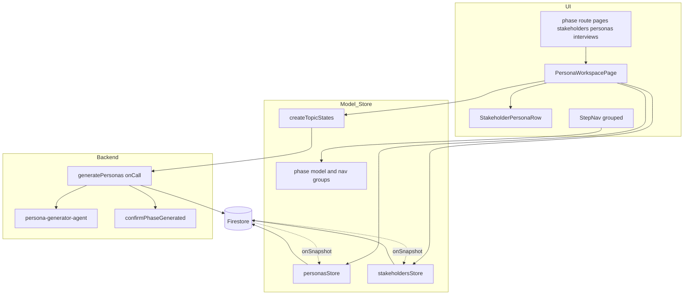
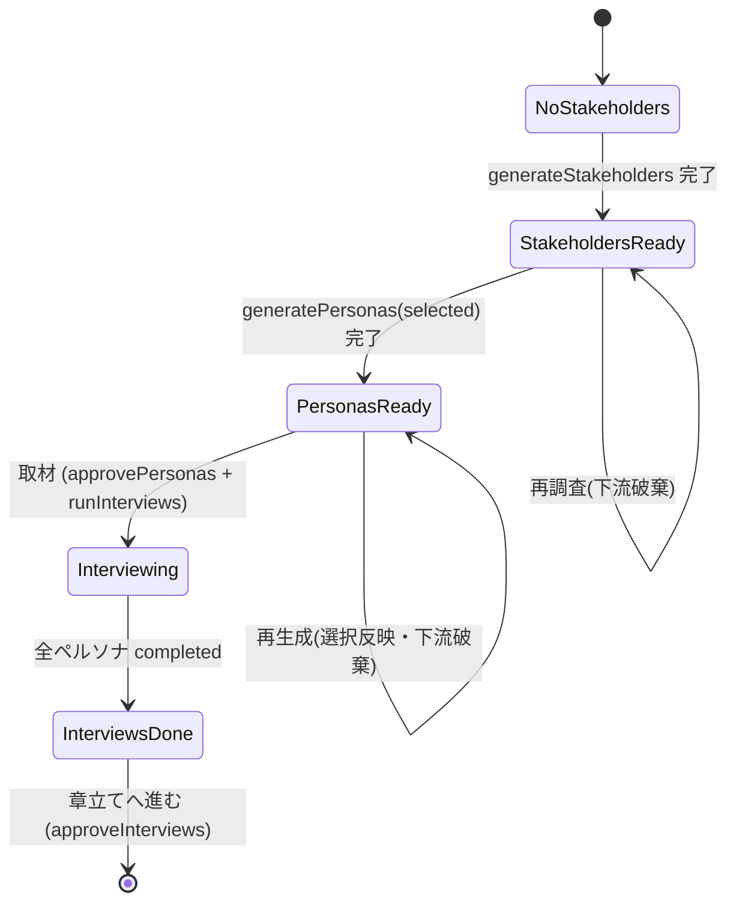

# Technical Design: stakeholder-persona-interview-workspace

## Overview

**Purpose**: 管理者が「ステークホルダー生成 → 採用選択 → ペルソナ生成 → ペルソナ取材」を、フェーズごとの画面遷移や個別の承認操作なしに、1つのワークスペース画面で連続実行できるようにする。

**Users**: 討論コンテンツを作成する管理者が、テーマ設定後のペルソナ準備工程で利用する。

**Impact**: 現状の3つの独立フェーズ画面（`stakeholders` / `personas` / `interviews`）を、ステークホルダー（左）と対応ペルソナ（右）を1行の左右セットとして縦に並べる単一の統合画面へ置き換える。フェーズモデル（`PhaseKey` 3値）は据え置き、承認は次操作へ暗黙的に畳み込む。新たにステークホルダー単位の採用選択に基づく**選択的ペルソナ生成**を導入する。

### Goals
- 3操作を1画面から連続実行し、明示的な承認ボタンを廃する（R1, R6）。
- 採用（チェックON・既定ON）したステークホルダーのみからペルソナを生成する（R3, R4）。
- ステークホルダーと生成ペルソナを行単位で対応づけて可視化する（R1-3, R4-3）。

### Non-Goals
- フェーズモデルの畳み込み（`PhaseKey` は3値据え置き。BE契約は不変）。
- 章立て以降のフェーズ、取材・信念生成・ペルソナ生成プロンプトの内部アルゴリズム。
- 採用選択のサーバ永続（クライアント状態で保持。既存ペルソナから復元する）。

## Boundary Commitments

### This Spec Owns
- 統合ワークスペース画面（行単位の左右セット・縦並び）とその3操作の状態導出・実行導線。
- ステークホルダー採用選択の状態（クライアント）と、選択に基づく生成対象の決定。
- ステークホルダーの安定 id（`stakeholder.id` を永続）と、それを唯一の突合キーとする「ペルソナ対応づけ（`persona.stakeholderId`）」および「採用選択（`Set<stakeholderId>`）」。
- StepNav のナビ・グルーピング（`stakeholders`/`personas`/`interviews` を1ステップに集約）。

### Out of Boundary
- 各生成・取材の中身（LLMプロンプト・信念モデル・検索）。既存 `agents/`・`pipeline/` の責務。
- 章立て・討論・編集フェーズの挙動（`approveInterviews` による前進の受け口までが本スペック）。
- フェーズ状態の生成完了確定（`confirmPhaseGenerated` の既存規範を利用するのみ）。

### Allowed Dependencies
- 既存モデル/ストア: `createTopicStates`（`generate*`/`reset*`/`approve*`）、`personasStore`（`approvePersonas`/`runInterviews`）、`stakeholdersStore`。
- 既存フェーズモデル: `phaseLogicalState`/`phaseOrder`/`nextPhase`/`phasePath`、`PHASE_DEFS`。
- 既存BE: `generatePersonas` onCall、`persona-generator-agent`、`confirmPhaseGenerated`。
- UI: `@14ch/svelte-ui`（`Checkbox`/`Button`/`Tab`/`ConfirmDialog`/`Skeleton`）。

### Revalidation Triggers
- `StakeholderForFirestore` への `id` 追加、および `PersonaForFirestore` への `stakeholderId` 追加（ステークホルダー/ペルソナを読む全コンシューマ）。
- `generatePersonas` onCall ペイロード契約の変更（`selectedStakeholderIds`。FEクライアントとBEハンドラ）。
- `persona-generator-agent` の出力スキーマ拡張（由来ステークホルダーのエコー用タグ）。
- StepNav のナビ項目導出の変更（フェーズナビを参照する箇所）。

## Architecture

### Existing Architecture Analysis
- **フェーズは線形・承認ゲート型**。トピックの `phase`/`phaseStatus` が唯一の真実で、各画面は自フェーズ slug 固定の `PhasePanel` に `logicalState` を渡す。承認は `advancePhase` で次フェーズへ前進。
- **サーバ権威**: 生成完了（`phaseStatus='generated'`）とペルソナ永続はサーバが確定（`confirmPhaseGenerated`）。FE は running を楽観表示し `onSnapshot` で反映。
- **再生成は「自フェーズ＋下流」を各画面が合成**して `reset*`→`generate*` を呼ぶ。
- **維持する境界**: FE→Functions 経由のAI処理、ドメインデータは `models/`、UIオーケストレーションは feature/画面に直接。過度な共通化をしない（steering `structure.md`）。

### Architecture Pattern & Boundary Map



**Architecture Integration**:
- 選択パターン: 既存フェーズ／ストア基盤の上に、統合画面（新規UI）を載せる Extension。
- 境界分離: 表示は行部品、オーケストレーションは画面、ドメイン操作は既存 model/store、対応キー付与はサーバ。
- 維持する既存パターン: サーバ権威なステータス確定、`reset*`→`generate*` 合成、`onSnapshot` 反映。
- 新規コンポーネントの根拠: 行レイアウト（R1-3）と採用選択（R3）は既存 `PhasePanel`（縦1列・単一状態）で表現できないため新設。
- Steering 準拠: 画面処理は画面に直接（中央ディスパッチャを作らない）、BEM、アロー関数、`@14ch/svelte-ui` 優先。

### Technology Stack

| Layer | Choice / Version | Role in Feature | Notes |
|-------|------------------|-----------------|-------|
| Frontend | SvelteKit 2.x / Svelte 5 runes | 統合画面・行部品・状態機械 | 新規 `PersonaWorkspacePage` / `StakeholderPersonaRow` |
| Frontend | `@14ch/svelte-ui` | `Checkbox`/`Button`/`Tab`/`ConfirmDialog`/`Skeleton` | 採用選択に `Checkbox`、StepNav に `Tab.customPathMatcher` |
| Backend | Firebase Functions v2 | `generatePersonas` に選択インデックス受け口を追加 | 既存 onCall の拡張 |
| Data | Firestore | `stakeholders/0` 配列要素に `id`、`personas/*` に `stakeholderId` 追加 | 既存構造踏襲・追加のみ |

## File Structure Plan

### New Files
```
src/lib/features/admin/topic-detail/persona-workspace/
├── PersonaWorkspacePage.svelte   # 統合画面。3操作の状態導出・実行導線・採用選択状態を保持
└── StakeholderPersonaRow.svelte  # 1行=採用チェック+ステークホルダー(左)+ペルソナ/空(右)+取材状態
```
- 表示は既存 `StakeholderItem` / `PersonaItem` / `InterviewItem` を行内で再利用する。

### Modified Files
- `src/routes/admin/topics/[topicId]/{stakeholders,personas,interviews}/+page.svelte` — 3ページとも `PersonaWorkspacePage` を描画する薄いラッパーへ変更（R7-1）。
- `src/lib/models/stakeholder/stakeholder.types.ts` — `StakeholderForFirestore` に `id: string`（安定 id）を追加。`Stakeholder` は既に `id` を持つため型は整合。
- `src/lib/stores/stakeholders.svelte.ts` — `id` を配列インデックスから導出する現行を、永続 `id` を採用する形へ変更（旧データは `String(index)` フォールバック）。
- `src/lib/models/persona/persona.types.ts` — `PersonaForFirestore` / `Persona` に `stakeholderId?: string` を追加（旧データを正直に表すため任意）。
- `src/lib/models/topic/createTopic.svelte.ts` — `generatePersonas` の引数に `selectedStakeholderIds: string[]` を追加し callable へ渡す。
- `src/lib/models/phase/phase.constants.ts` — StepNav 用のナビ・グループ定義 `STEP_NAV_GROUPS` を追加。
- `src/lib/models/phase/phase.ts` — グループから StepNav 項目を導出するヘルパー（現在フェーズが属するグループ判定・到達可否）を追加。
- `src/lib/sharedComponents/StepNav.svelte` — `STEP_NAV_GROUPS` を `Tab` にマップし、`customPathMatcher` でグループ内 slug を1タブに束ねる。
- `functions/src/api/stakeholders.ts` — ステークホルダー永続時に各要素へ安定 `id`（サーバ付番）を付与。
- `functions/src/api/personas.ts` — `selectedStakeholderIds` を受け `stakeholders/0` を絞り込み、生成結果をエコータグで由来解決して各ペルソナへ `stakeholderId` を付与。
- `functions/src/agents/persona-generator-agent.ts` — 入力の各立場に短いエコー用タグを付し、出力スキーマにそのタグ項目を追加（出力順非依存の由来解決のため）。
- `functions/src/types/stakeholder.types.ts` — `Stakeholder`（永続形）に `id: string` を追加。
- `functions/src/types/persona.types.ts` — `Persona`（永続形）に `stakeholderId?: string` を追加。

### Removed Files
- `.../stakeholders/GenerateStakeholdersPage.svelte`、`.../personas/GeneratePersonasPage.svelte`、`.../interview/GenerateInterviewsPage.svelte` — 統合画面へ置き換え（表示部品 `*Item.svelte` は残置・再利用）。

> 依存方向: `types → phase model → store/model → UI(page → row)`。UIは model/store のみに依存し、逆流しない。

## System Flows

### 承認を畳み込んだパイプライン（操作境界と暗黙前進）

```mermaid
sequenceDiagram
    actor Admin
    participant WS as PersonaWorkspacePage
    participant Topic as createTopicStates
    participant Store as personasStore
    participant FS as Firestore

    Admin->>WS: ステークホルダー調査を開始
    WS->>Topic: generateStakeholders()
    Note over Topic,FS: phase=stakeholders running to generated (server)

    Admin->>WS: ペルソナ生成 (採用選択 = ON集合)
    WS->>Topic: generatePersonas(selectedStakeholderIds)
    Note over Topic: phase advances to personas (stakeholders implicitly approved)
    Topic->>FS: personas persisted with stakeholderId, phase=personas generated

    Admin->>WS: ペルソナ取材
    WS->>Store: approvePersonas()
    Note over Store,FS: personas approved=true, phase=interviews not_started
    WS->>Store: runInterviews(title)
    Note over Store,FS: phase=interviews running; results persisted; generated (server)

    Admin->>WS: 章立てへ進む
    WS->>Topic: approveInterviews()
    Note over Topic: advancePhase interviews to chapters
    WS-->>Admin: goto chapters route
```

**Key Decisions**:
- 承認は独立ボタンを持たない（R6-1）。stakeholders承認は `generatePersonas` が phase を前進させることで、personas承認は取材操作の `approvePersonas()`（`approved:true` 付与を含む）で成立する。
- `approved:true` の付与は編集フェーズが依存するため、取材操作で必ず `approvePersonas()` を先に呼ぶ（`runInterviews` 単独では書かれない）。
- 再生成は既存の `reset*`→`generate*` 合成を踏襲（下流破棄：R4-6）。

### ペルソナ生成の状態機械（ボタン活性）



- ボタン活性の導出: `stakeholdersStore.stakeholders.length`・`personasStore.personas`・各フェーズの `phaseLogicalState` から算出。ペルソナ生成は「採用0件」で不活性（R3-4）。取材は「ペルソナ0件」で不活性（R5-5）。ステークホルダー未生成でペルソナ生成不可、ペルソナ未生成で取材不可（R6-2,3）。

## Requirements Traceability

| Requirement | Summary | Components | Interfaces | Flows |
|-------------|---------|------------|------------|-------|
| 1.1, 1.3, 1.4 | 行単位の左右セット・縦並び・空欄 | PersonaWorkspacePage, StakeholderPersonaRow | 対応づけ(`stakeholderId`) | — |
| 1.2, 1.5 | 3操作の同一画面実行・状態表示 | PersonaWorkspacePage | 状態機械 | 状態機械図 |
| 2.1–2.5 | ステークホルダー生成/再生成 | PersonaWorkspacePage | `generateStakeholders`/`resetStakeholders` | パイプライン図 |
| 3.1–3.4 | 採用チェック(既定ON)・0件ガード | PersonaWorkspacePage, StakeholderPersonaRow | selection state | — |
| 4.1,4.2,4.7 | 選択的生成・暗黙承認 | PersonaWorkspacePage, generatePersonas onCall | `generatePersonas(selectedStakeholderIds)` | パイプライン図 |
| 4.3 | 由来対応づけ表示 | StakeholderPersonaRow | `stakeholderId` | — |
| 4.4–4.6 | 実行中/失敗/再生成の下流破棄 | PersonaWorkspacePage | `reset*` 合成 | — |
| 5.1–5.6 | 取材実行・進捗・部分再実行・暗黙承認 | PersonaWorkspacePage, StakeholderPersonaRow | `approvePersonas`+`runInterviews` | パイプライン図 |
| 6.1–6.6 | 承認暗黙化・順序ガード・章立て前進・状態整合 | PersonaWorkspacePage, phase model | `approveInterviews`, `phaseLogicalState` | パイプライン図 |
| 7.1–7.3 | 3画面置換・データ互換・進行対応 | route pages, StepNav | `STEP_NAV_GROUPS`, `stakeholderId`/`role` フォールバック | — |

## Components and Interfaces

| Component | Domain/Layer | Intent | Req Coverage | Key Dependencies (P0/P1) | Contracts |
|-----------|--------------|--------|--------------|--------------------------|-----------|
| PersonaWorkspacePage | UI (feature) | 3操作の状態導出・実行・採用選択保持 | 1,2,3,4,5,6 | createTopicStates (P0), personasStore (P0), stakeholdersStore (P0) | State |
| StakeholderPersonaRow | UI (presentational) | 1行の左右セット表示＋採用チェック | 1,3,4,5 | StakeholderItem/PersonaItem/InterviewItem (P1) | State(props) |
| generatePersonas (onCall) | Backend | 選択ステークホルダーのみ生成・`stakeholderId` 付与 | 4 | persona-generator-agent (P0), confirmPhaseGenerated (P0) | API, Batch |
| phase model (nav groups) | Model | 3フェーズを1ナビステップに束ねる導出 | 6,7 | PHASE_DEFS (P0) | Service |
| StepNav | UI (shared) | グループをタブ表示・アクティブ判定 | 6-6,7 | Tab (P1), phase model (P0) | State |

### UI (feature)

#### PersonaWorkspacePage

| Field | Detail |
|-------|--------|
| Intent | 統合画面。3操作の状態を導出し実行導線と採用選択状態を保持する |
| Requirements | 1.1, 1.2, 1.5, 2.1–2.5, 3.4, 4.1, 4.4–4.7, 5.1–5.6, 6.1–6.6 |

**Responsibilities & Constraints**
- 3操作（ステークホルダー生成/再生成、ペルソナ生成/再生成、取材/再取材、章立てへ進む）のハンドラと活性状態を、`stakeholders`/`personas`/各フェーズの `phaseLogicalState` から導出する。
- 採用選択（`Set<string>`＝採用ステークホルダーの安定 id 集合）をクライアント状態で保持する。永続はしない。
- オーケストレーションのみを担い、ドメイン操作は既存 model/store に委譲する（新たな中央ディスパッチャを作らない）。

**Dependencies**
- Outbound: `createTopicStates`（`generateStakeholders`/`generatePersonas`/`reset*`/`approveInterviews`）— 生成・破棄・前進 (P0)
- Outbound: `personasStore`（`approvePersonas`/`runInterviews`）— 承認付与・取材 (P0)
- Outbound: `stakeholdersStore` — ステークホルダー一覧・採用選択の種 (P0)

**Contracts**: State [x]

##### State Management
- **採用選択**: `let selectedIds = $state(new Set<string>())`（採用ステークホルダーの安定 id 集合）。位置ではなく安定 id で持つため、配列の再構成に影響されない。
  - **シード／整合（reconcile）**: ステークホルダー一覧の変化を監視する `$effect` で、**まだ選択状態が確定していない（新規に現れた）id のみ**を既定に従ってシードし、既存のユーザ選択/解除は保持する。既定は、そのステークホルダーに対応ペルソナがあれば ON（`persona.stakeholderId`。無ければ `stakeholderRole===role` で解決）、無ければ **ON（既定ON：R3-2）**。
  - ステークホルダー再調査では id が総入れ替えされ、全件が「新規」となるため規則どおり**新集合が全 ON**になる（別途の再シードロジックは不要）。
  - 以降はユーザのチェック操作で `selectedIds` を更新する（R3-3）。
- **楽観的 running 表示**: 既存 `GeneratePersonasPage` の `isStarting` パターンを踏襲（押下直後に実行中表示、実状態反映で解除）。
- **ボタン活性**（Derived）:
  - ステークホルダー生成: `stakeholders.length===0` で「調査開始」、それ以外は「再調査」（`ConfirmDialog`）。
  - ペルソナ生成: `stakeholders.length>0 && selectedIds.size>0` で活性。`personas.length>0` なら「再生成」（`ConfirmDialog`、下流破棄）。
  - 取材: `personas.length>0` で活性。
  - 章立てへ進む: interviews フェーズが `generated`（全ペルソナ completed）で活性。
- **ハンドラ契約**（オーケストレーション。戻り値なし・例外は楽観表示解除で握る）:
  - `onGeneratePersonas()` → `topic.generatePersonas([...selectedIds])`。既存ペルソナありの再生成時は先に `resetPersonas`→`resetChapters`→`resetDebate`→`resetEditing`（R4-6）。
  - `onRunInterviews()` → `personasStore.approvePersonas()`（`approved:true`＋personas承認）→ `personasStore.runInterviews(topic.title)`（R5, R6-1）。
  - `onAdvanceToChapters()` → `topic.approveInterviews()` → `goto(phasePath(topic.id,'chapters'))`（R6-4）。
  - 再生成・再調査・再取材は既存各画面の `reset*` 合成順序を踏襲。

**Implementation Notes**
- Integration: 3ルート（`stakeholders`/`personas`/`interviews`）から同一コンポーネントが描画される。どのルートでも全操作を表示（layout のリダイレクトは各 slug が現在フェーズ以下のため到達可能）。
- Validation: 採用0件時はペルソナ生成ボタンを不活性化し、理由を提示（R3-4）。
- Risks: 3操作の状態導出が画面に集中する。フェーズ状態は `phaseLogicalState` に一元化して自前の状態を最小化する。

#### StakeholderPersonaRow

| Field | Detail |
|-------|--------|
| Intent | 1行の左右セット（採用チェック＋ステークホルダー＋対応ペルソナ＋取材状態）を表示 |
| Requirements | 1.3, 1.4, 3.1, 4.3, 5.2 |

**Responsibilities & Constraints**（Summary-only／presentational）
- Props: `stakeholder: Stakeholder`、`persona: Persona | undefined`、`checked: boolean`、`onToggle: (checked: boolean) => void`。
- 親は `stakeholder.id` を突合キーに、対応ペルソナ（`persona.stakeholderId === stakeholder.id`。旧データは `stakeholderRole===role` フォールバック）と `checked`（`selectedIds.has(stakeholder.id)`）を解決して渡す。
- 左に採用 `Checkbox` ＋ `StakeholderItem`、右に `persona` があれば `PersonaItem`＋取材状態（`InterviewItem` 相当）、無ければ**空白**（R1-4：プレースホルダーなし）。
- 状態を持たず、採用トグルは `onToggle` で親へ委譲する。

**Implementation Note**: BEM `.stakeholder-persona-row`。行は CSS Grid（左右2カラム＋行縦積み）。ペルソナ有無で右セルの内容のみ変わる。

### Backend

#### generatePersonas (onCall) — 拡張

| Field | Detail |
|-------|--------|
| Intent | 採用ステークホルダーのみ生成し、各ペルソナへ由来 `stakeholderId` を付与する |
| Requirements | 4.1, 4.2, 4.3 |

**Responsibilities & Constraints**
- `stakeholders/0` を読み、`selectedStakeholderIds` に一致する要素で決定的に絞り込む（順序保持）。絞り込んだ部分集合を、各立場に短いエコー用タグ（例: 選択内の連番）を付してエージェントへ渡す。
- **由来解決（出力順非依存）**: エージェント出力の各ペルソナはエコー用タグを含む。サーバはタグ→ステークホルダー id の対応で `persona.stakeholderId` を決定する。タグが欠落/不正な場合のみ、位置フォールバック（k 番目→選択 k 番目）と `stakeholderRole===role` 照合で補う。`sortOrder` は生成順の連番。
- 完了確定は既存 `confirmPhaseGenerated(topicId,'personas')`。

**Contracts**: API [x] / Batch [x]

##### API Contract
| Method | Endpoint(callable) | Request | Response | Errors |
|--------|--------------------|---------|----------|--------|
| onCall | `generatePersonas` | `{ topicId: string; title: string; selectedStakeholderIds: string[] }` | `{}` | invalid-argument（topicId/title 空・selected 空・未知id・stakeholders不在）, internal（生成失敗） |

- Preconditions: `selectedStakeholderIds` は非空、各値は `stakeholders/0` に実在する id。
- Postconditions: 選択件数と同数のペルソナが永続され、各々に一意な `stakeholderId`（選択集合の値のいずれか）を持つ。`phaseStatus=generated`（サーバ確定）。
- Invariants: 未選択ステークホルダーに対応するペルソナは生成されない（R4-2）。各生成ペルソナの `stakeholderId` は選択集合に属し重複しない。

##### Batch / Job Contract
- Trigger: FE `topic.generatePersonas(selectedStakeholderIds)`。
- Input/validation: 上記 API 契約。空・未知 id はサーバで `invalid-argument`。
- Output/destination: `topics/{id}/personas/*`（`stakeholderId`/`sortOrder`/`approved:false`/`beliefs:[]`/`createdAt`）。
- Idempotency & recovery: 既存どおりバッチ一括コミット（全件 or 未書込）。完了確定は running 限定の冪等トランザクション。

**Implementation Notes**
- Integration: `persona-generator-agent` は入力配列を反復して1立場1体生成する。部分集合＋エコー用タグの受け渡しで選択的生成と由来解決が成立（スキーマにタグ項目を1つ追加）。
- Validation: `selectedStakeholderIds` の重複除去・実在性検証。出力タグは選択集合に属することを検証。
- Risks: LLM出力順ズレ／タグ欠落 → 一次はエコータグで由来解決、二次に位置＋`stakeholderRole` フォールバック。プロンプトの「立場ごとに1体・`.length(count)`」は維持。

### Model / Shared

#### phase model — ナビ・グループ導出（新規）

**Contracts**: Service [x]

```typescript
type StepNavGroup = {
  label: string;
  phases: PhaseSlug[];        // このステップに束ねるフェーズ（進行順）
};

// グローバルなナビ定義（画面別分岐を作らない）
export const STEP_NAV_GROUPS: readonly StepNavGroup[];
// 例: fact-research / [stakeholders, personas, interviews]=ペルソナ準備 / chapters / debate / editing

// 現在フェーズが属するグループ、および到達可否・代表 slug を導出
export const stepNavItems = (
  topicId: string,
  currentPhase: PhaseSlug
): { label: string; href: string; disabled: boolean; phases: PhaseSlug[] }[];
```
- `disabled`: グループ先頭フェーズの `phaseOrder` が `currentPhase` より後なら不活性。
- 代表 href: グループが現在フェーズを含むならそのフェーズ、含まなければ先頭フェーズの `phasePath`。

#### StepNav — グループ表示（修正）
- `stepNavItems` を `Tab` にマップ。`customPathMatcher` で「現在URLの末尾 slug がそのグループの `phases` に含まれるか」で1タブのアクティブを判定（`stakeholders`/`personas`/`interviews` を「ペルソナ準備」1タブに集約）。R6-6, R7。

## Data Models

### Logical Data Model
- **Stakeholder**（`topics/{id}/stakeholders/0` の配列要素）: 安定 `id: string`（サーバ付番）を追加。id は生成時に確定し、配列位置に依存しない。採用選択は永続しない。旧データ（id 不在）は表示時に `String(index)` でフォールバック解決。
- **Persona**（`topics/{id}/personas/{personaId}`）: `stakeholderId?: string` を追加。値は由来ステークホルダーの安定 id。
  - 参照整合: `persona.stakeholderId` は同一トピックの `stakeholders/0` のいずれかの要素 id を指す。ステークホルダー再生成時はペルソナも下流破棄されるため、id 集合の一貫性が保たれる（R4-6 の reset 合成が保証）。
  - 行対応（UI）: `stakeholder.id` ↔ `personas.find(p => p.stakeholderId === stakeholder.id)`。`stakeholderId` 不在の旧データは `p.stakeholderRole === stakeholder.role` でフォールバック（R7-2）。
  - 同一キーの二役: `stakeholder.id` は「行対応（`persona.stakeholderId`）」と「採用選択（`selectedIds`）」の唯一の突合キーであり、位置ベースの識別子は用いない。

### Data Contracts & Integration
- FE/BE 双方の永続型に追加（`*ForFirestore` とドメイン型の双方。フロントで `*ForFirestore` を流用しない）: `Stakeholder.id`、`Persona.stakeholderId`。
- `generatePersonas` callable リクエストに `selectedStakeholderIds: string[]` を追加（後方: 旧クライアントは存在しないが、サーバは空/未知 id を `invalid-argument` として弾く）。

## Error Handling

### Error Strategy
- 生成/取材の失敗は既存パターンを踏襲: FE は `stopped` を楽観表示し、サーバが `generated` を確定済みなら巻き戻さない（`createTopicStates` の各 `generate*` の catch と同型）。
- 取材の部分失敗は `Promise.allSettled` の rejected 検知で `markInterviewsStopped`（既存 `runInterviews`）。未完了ペルソナのみ再取材可能（R5-3）。

### Error Categories and Responses
- User Errors: 採用0件でのペルソナ生成、ペルソナ0件での取材 → ボタン不活性＋理由提示（R3-4, R5-5）。
- System Errors: 生成/取材の onCall 失敗 → 当該フェーズ `stopped` 表示＋再実行導線。
- Business Logic: 空/未知 id の `selectedStakeholderIds` → サーバ `invalid-argument`。

### Monitoring
- 既存の `console.error('[generatePersonas] ...')` 系ログを踏襲。追加のメトリクスは設けない。

## Testing Strategy

### Unit Tests
- `generatePersonas` onCall: `selectedStakeholderIds` による絞り込みと `stakeholderId` 付与（選択2/3件で2ペルソナ・id一致）。出力タグ順を入れ替えても由来解決が正しいこと。
- `generatePersonas` onCall: 空/未知 id で `invalid-argument`。
- phase model: `stepNavItems` が `stakeholders`/`personas`/`interviews` を1グループに束ね、`currentPhase` に応じ `disabled`/代表 href を導出する。
- 採用選択の整合（reconcile）: 新規 id のみ既定 ON でシードし既存選択を保持。既存ペルソナがあればその `stakeholderId` を ON として反映。ステークホルダー総入れ替え時に新集合が全 ON になる。

### Integration Tests
- ペルソナ生成操作: `generatePersonas(selected)` 呼出で phase が `personas` へ前進（stakeholders 暗黙承認）。
- 取材操作: `approvePersonas()`→`runInterviews()` の順で `approved:true` が付与され、phase が `interviews` へ前進。
- 章立て前進: `approveInterviews()` で phase が `chapters` へ、`goto` が発火。

### E2E/UI Tests
- 一部ステークホルダーのチェックを外してペルソナ生成 → 未選択の行の右セルが空、選択行にのみ対応ペルソナが表示（R4-2,3, R1-4）。
- 3ルートいずれを開いても同一ワークスペースが表示され、StepNav は「ペルソナ準備」1タブがアクティブ（R7）。

## Security Considerations
- `generatePersonas` は既存どおり `requireAuth` を先頭で通す（管理者のみ）。`selectedStakeholderIds` はサーバ側で実在性を検証し、未知 id 経由の不整合書込を防ぐ。
