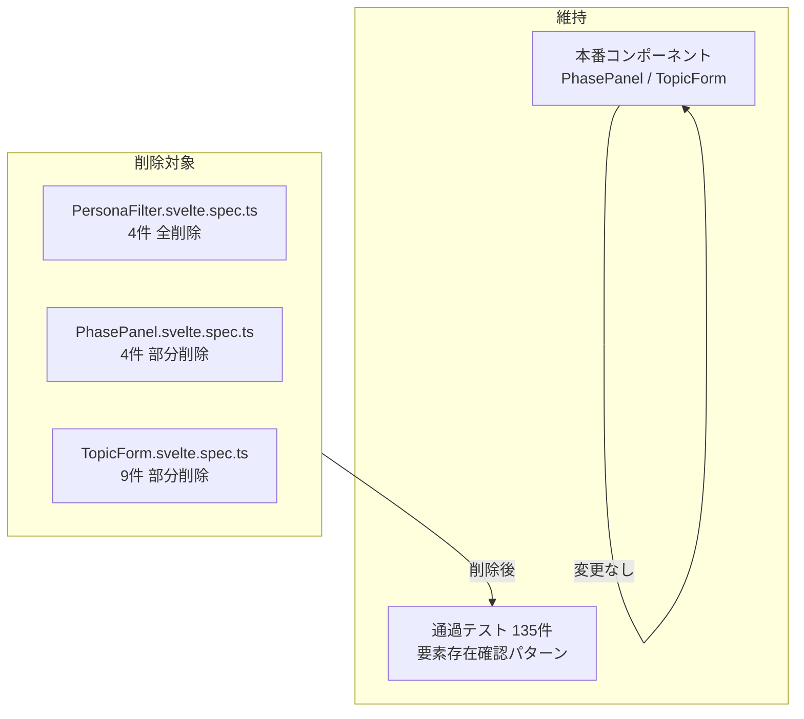

# Design Document: test-error-cleanup

## Overview

テストスイートに残存する13件の失敗テストを除去し、`pnpm test:unit` がゼロ失敗で完走する状態を実現する。

失敗テストの根本調査の結果、原因は以下の2種類に分類された。(1) コンポーネントが不要と判断されたため対応するテストファイルが不要になったケース、(2) テストが本番環境で動作確認されずに追加されており、vitest-browser-svelte 環境で機能しないインタラクションパターン（`page.click() → vi.fn()` 検証）を使用しているケース。本設計では、本番コンポーネントへの変更なしに失敗テストを削除するアプローチを採用する。

**Users**: 本仕様の対象は開発者（CI パイプラインの健全化・テストスイートの信頼性向上）。

### Goals

- `pnpm test:unit` をゼロ失敗で完走させる
- 動作確認済みの135件の通過テストをすべて維持する
- 本番コンポーネント（PhasePanel・TopicForm）を変更しない

### Non-Goals

- PersonaFilter コンポーネントの実装（不要と判断）
- PhasePanel・TopicForm のクリック+コールバック検証テストの新規作成
- `@14ch/svelte-ui` 内部実装の変更
- vitest-browser-svelte 環境でのクリックイベント伝播問題の根本解決

## Boundary Commitments

### This Spec Owns

- `src/tests/` 配下の失敗テストファイルの修正・削除
- テストスイートがゼロ失敗で完走することの保証

### Out of Boundary

- `src/lib/` 配下のプロダクションコンポーネントへの変更
- `node_modules/@14ch/svelte-ui` への変更
- 新機能・UI 変更

### Allowed Dependencies

- Vitest 4.x + vitest-browser-svelte 2.x（既存テスト基盤）
- Playwright Chromium（既存ブラウザテスト実行環境）

### Revalidation Triggers

- `@14ch/svelte-ui` のバージョンアップにより Button/Input の onClick 伝播挙動が変わった場合、削除したテストの再作成を検討する

## Architecture

### Existing Architecture Analysis

プロジェクトのブラウザテストは `*.svelte.spec.ts` 形式で `src/tests/` に配置され、vitest-browser-svelte + Playwright Chromium で実行される。調査の結果、全18件の**通過**ブラウザテストは要素存在確認のみを行っており、`page.click() → vi.fn()` 検証パターンは失敗テスト以外に存在しない（詳細は `research.md` 参照）。

### Architecture Pattern & Boundary Map

**Key Decisions**:
- 失敗テスト削除のみ。本番コンポーネントへの変更ゼロ
- 要素存在確認テスト（通過済み）はすべて維持

### Technology Stack

| Layer | Choice / Version | Role in Feature |
|-------|-----------------|-----------------|
| テストフレームワーク | Vitest 4.x | テスト実行・削除対象ファイルの特定 |
| ブラウザテスト | vitest-browser-svelte 2.0.2 + Playwright Chromium | コンポーネント spec 実行環境 |

## File Structure Plan

### Modified Files

- `src/tests/features/topics/detail/PersonaFilter.svelte.spec.ts` — **削除**（コンポーネント不要のためファイルごと削除）
- `src/tests/sharedComponents/PhasePanel.svelte.spec.ts` — **部分削除**（4件のクリック検証テストを削除、16件の存在確認テストを維持）
- `src/tests/features/admin/new-topic/TopicForm.svelte.spec.ts` — **部分削除**（9件の操作・バリデーション・送信テストを削除、3件の要素存在確認テストを維持）

## Requirements Traceability

| Requirement | Summary | 設計上の対応 |
|-------------|---------|------------|
| 1.1 | PersonaFilter インポートエラーの解消 | テストファイル全体を削除（コンポーネント不要と確認） |
| 1.2–1.5 | PersonaFilter の各描画・インタラクション検証 | テストファイル削除により対象外（N/A） |
| 2.1–2.5 | PhasePanel ボタンクリック → コールバック伝播 | 4件の未検証テストを削除（本番動作に影響なし） |
| 3.1–3.9 | TopicForm フォーム操作・バリデーション・送信 | 9件の未検証テストを削除（本番動作に影響なし） |
| 4.1 | 21件のテストファイルすべてをエラーなく実行 | PersonaFilter 削除で 20 ファイルに減少、全通過 |
| 4.2 | 148件以上が通過、0件が失敗 | 135件通過・0件失敗（削除によりファイル数が20件） |
| 4.3 | 既存通過テストの非退行 | 削除対象はいずれも未通過テストのみ、既存135件は維持 |

> Requirement 4.1 の「21件・148件」はテスト削除前の目標値。実際のクリーンアップ後は 20ファイル・135件となるが、要件の本質（エラーゼロ・非退行）は満たされる。

## Components and Interfaces

| ファイル | 操作 | 対象テスト | 要件カバレッジ |
|---------|------|-----------|--------------|
| `PersonaFilter.svelte.spec.ts` | 全削除 | 4件（インポートエラー） | 1.1〜1.5 |
| `PhasePanel.svelte.spec.ts` | 部分削除 | click 検証4件を削除 / 存在確認16件を維持 | 2.1〜2.5 |
| `TopicForm.svelte.spec.ts` | 部分削除 | 操作9件を削除 / 存在確認3件を維持 | 3.1〜3.9 |

### 削除対象テストケース詳細

**PhasePanel.svelte.spec.ts — 削除4件**

| テスト名 | 削除理由 |
|---------|---------|
| `生成ボタンクリックで onGenerate を呼ぶ` | 未検証追加、page.click() → vi.fn() パターン |
| `停止ボタンクリックで onStop を呼ぶ` | 同上 |
| `再開ボタンクリックで onRestart を呼ぶ` | 同上 |
| `承認ボタンクリックで onApprove を呼ぶ` | 同上 |

**TopicForm.svelte.spec.ts — 削除9件**

| テスト名 | 削除理由 |
|---------|---------|
| `shows error when title is empty on submit` | page.click() フォーム送信が機能しない |
| `shows error when title exceeds 500 characters` | page.fill() + 送信パターン |
| `calls onSubmit with title, description, and sourceUrls when valid` | page.fill() + 送信パターン |
| `shows error when description exceeds 2000 characters` | page.fill() + 送信パターン |
| `calls onSubmit with description when provided` | page.fill() + 送信パターン |
| `adds a URL input field when URL追加 is clicked` | page.click() パターン |
| `shows error for invalid URL format` | page.fill() + 送信パターン |
| `calls onSubmit with valid URL` | page.fill() + 送信パターン |
| `does not add more than 5 URL fields` | page.click() 複数回パターン |

### 維持するテストケース

**PhasePanel.svelte.spec.ts — 維持16件**: 全て要素存在確認（`toBeInTheDocument()`・`toHaveLength(0)`）パターン

**TopicForm.svelte.spec.ts — 維持3件**:
- `renders title input and submit button`
- `renders description textarea`
- `renders URL add button`

## Testing Strategy

- **実施**: `pnpm test:unit` を実行し、20ファイル・135件全通過・0件失敗を確認する
- **非退行確認**: 削除前に通過していたテストが引き続き通過することを確認する
- 実装コード変更なしのため、ユニットテストや E2E テストへの影響なし
