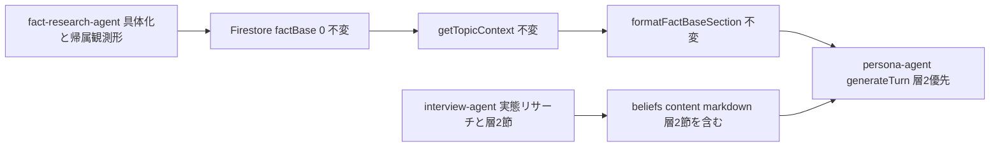
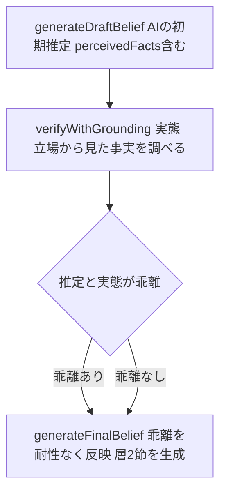
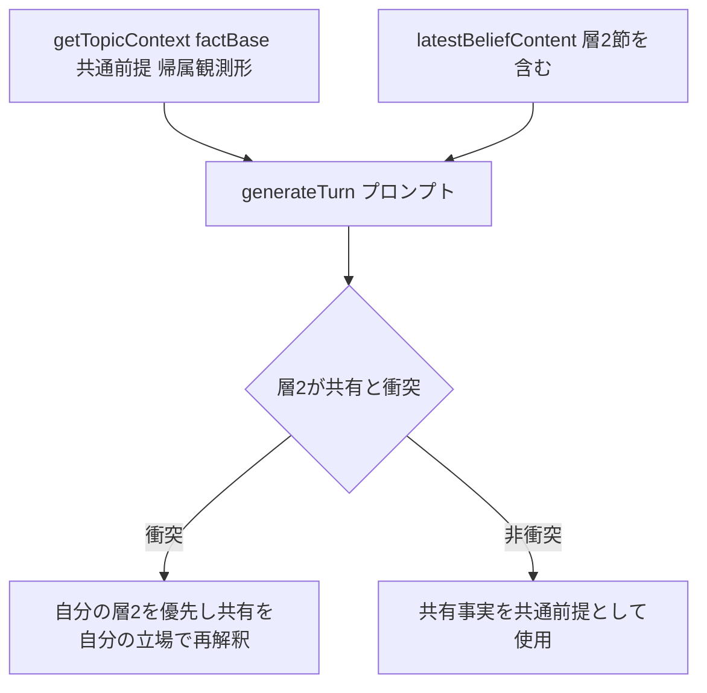

# Technical Design: topic-fact-base-enrichment

## Overview

**Purpose**: `topic-fact-base` で新設した事実基盤の **具体性・網羅性を高め**、さらに **立場によって異なる"事実"（層②）を各ペルソナに帰属させてリサーチ・保持する** ことで、下流討論の具体性と立場再現の忠実さを底上げする。

**Users**: 管理者が具体的な共有事実と立場固有の事実認識を得たペルソナで討論を生成し、閲覧者が「具体的事実に基づき、かつ各立場が平板化されない」討論を得る。

**Impact**: 変更は既存3エージェント（`fact-research-agent`・`interview-agent`・`persona-agent`）の **生成・構造化プロンプトとフローに閉じる**。共有事実基盤の型・永続（`FactItem`/`FactBase`・`topics/{id}/factBase/0`）・供給経路（`getTopicContext`/`formatFactBaseSection`）は不変で、具体化は全消費者へ自動伝播する。取材は「反証（真偽検証）」から「実態（その立場から見た事実）」へ再定位し、耐性なくペルソナ信念へ反映する。

### Goals
- 事実リサーチが grounding の具体（数値・固有名詞・日付・経緯）を statement に保持し、主要側面を十分な件数で網羅する（1, 2, 3）。
- 共有基盤を帰属・観測形で記述し、検証済み真実として位置づけない（7）。正確性を人手・事前知識に依存させない。
- 取材が「その立場から見た事実」をリサーチし耐性なく信念へ反映、共有基盤と区別して保持する（8）。
- 層②が共有基盤と衝突する場合、当該ペルソナの発言では層②を優先する（8.8, 8.9）。

### Non-Goals
- 共有事実基盤（`FactItem`/`FactBase`）の型・永続形の破壊的変更（6.3）。
- 取材でのテーマ**共有客観事実**の個別再収集の復活（6.2）。
- 討論インライン・ファクトチェックの自動書き換えが層②を矯正し得る干渉の解消（別スコープ・既知の制約）。
- 立場横断の事実食い違いの構造化可視化、事実の confidence スコアリング。

## Boundary Commitments

### This Spec Owns
- `fact-research-agent` の生成・構造化プロンプト（具体性・網羅・帰属/観測形・出典・真実非保証）。
- `interview-agent` の grounding 再定位、`DraftBelief.perceivedFacts`（層②のドラフトスロット）、`initialBelief` の「前提としている事実（立場から見た事実）」節。
- `persona-agent.generateTurn` の層②優先指示。

### Out of Boundary
- 共有事実基盤の型・永続・供給経路（`topic-fact-base` 所有・不変）。
- 取材の**共有事実の個別再収集禁止**の仕組み（`topic-fact-base` R6.2 を維持）。
- 討論インライン/章ファクトチェックの挙動（別スコープ）。
- 信念変化追跡・討論オーケストレーションの制御構造。

### Allowed Dependencies
- BE: `search/grounding.ts`、`llm/models.ts`、`utils/prompt-formatters.ts`、`types/topic.types.ts`・`persona.types.ts`、`pipeline/topics/topic-context.ts`。
- FE: 既存の事実リサーチ画面・信念表示（表示調整のみ）。

### Revalidation Triggers
- `DraftBelief` / `InterviewOutput` の形状変更（interview トレース永続に波及）。
- `initialBelief` の節構成（消費側 `latestBeliefContent` は文字列注入のため後方互換だが、節見出し規約に依存する下流があれば要再確認）。
- `formatFactBaseSection` の出力契約（不変予定）。
- 事実/信念分離・層②優先の境界規則の変更。

## Architecture

### Existing Architecture Analysis
- **事実基盤は生成→蒸留→永続→供給→消費が確立済み**（`topic-fact-base`）。`fact-research-agent` が grounding→`buildStructuringPrompt` で `{statement, sourceIndices}` に蒸留。供給は `getTopicContext`＋`formatFactBaseSection`。本仕様は蒸留品質と帰属形を強化するのみで、契約は不変。
- **取材は3フェーズ**（`generateDraftBelief`→`verifyWithGrounding`→`generateFinalBelief`）。信念は6節 markdown 文字列で永続（`beliefs:[{content}]`）、討論は `latestBeliefContent` で注入。現状 `verifyWithGrounding` は「反証起点」で真偽検証寄り＝立場矯正リスク。ここを実態志向へ再定位する。
- **討論ターン**は `persona-agent.generateTurn` が共有事実（`factBaseNote`）と信念（`system`）を同一プロンプトに注入。層②優先はここに指示を足すだけで実現。
- **技術的負債の解消**: 「取材が立場を現実へ矯正して平板化する」混同を、grounding の対象再定位で解消する。

### Architecture Pattern & Boundary Map



**Architecture Integration**:
- Selected pattern: **既存エージェントのプロンプト拡張（Option A）＋層②の内部構造化スロット（Option C 的最小）**。研究ログ参照。
- Domain/feature boundaries: 共有事実（fact-research／factBase／供給）と、ペルソナ固有の事実認識（interview／belief 節）を明確に分離。層②優先は消費側（persona-agent）のプロンプト規則。
- Existing patterns preserved: 3フェーズ取材、単一 markdown 信念、grounding 2フェーズ、`formatFactBaseSection` 供給、`FactItem`/`FactBase` 永続。
- New components rationale: 新規コンポーネントは無し。加算は `DraftBelief.perceivedFacts`（非破壊）と `initialBelief` の1節のみ。
- Steering compliance: 「過度な共通化をしない」（各画面/各エージェントに直接記述、中央ディスパッチャを作らない）、`any` 不使用、型は Firestore 形と一致。

### Dependency Direction
BE: `types`（`DraftBelief` 加算）→ `search`/`llm` → `agents`（fact-research/interview/persona のプロンプト）→ `pipeline`（供給は不変）→ `api`（不変）。各層は左方向のみ import。

### Technology Stack

| Layer | Choice / Version | Role in Feature | Notes |
|-------|------------------|-----------------|-------|
| Backend / Services | Firebase Functions + TypeScript（現行） | 3エージェントのプロンプト/フロー調整 | 依存追加なし |
| AI / Grounding | `@ai-sdk/google` + Gemini（現行 `PIPELINE_MODELS`） | 具体化・実態リサーチ | 既存モデル流用 |
| Data / Storage | Firestore（現行） | 変更なし（`factBase/0`・`beliefs` 文字列） | 型/永続不変 |
| Frontend | SvelteKit（現行） | 具体化した記述・層②節の表示 | 折返し/スクロール既存対応 |

## File Structure Plan

新規ファイルは無い。変更は既存ファイルのプロンプト/フロー/型に閉じる。

### Modified Files（BE）
- `functions/src/agents/fact-research-agent.ts` — `buildGroundingPrompt`/`buildStructuringPrompt` に具体性・網羅・件数・帰属/観測形・真実非保証の指示を追加（1, 2, 3, 4, 7）。
- `functions/src/agents/interview-agent.ts` — `verifyWithGrounding` を実態/立場から見た事実へ再定位、`generateFinalBelief` の `initialBelief` に「前提としている事実（立場から見た事実）」節を追加、grounding の乖離を耐性なく反映（8）。
- `functions/src/types/persona.types.ts`（または interview 型定義箇所）— `DraftBelief` に `perceivedFacts` を optional 加算（8）。※`DraftBelief` は `interview-agent.ts` に定義。実配置は同ファイル内で加算。
- `functions/src/agents/persona-agent.ts` — `generateTurn` の userContent に層②優先指示を追加（8.8, 8.9）。

### Modified Files（テスト）
- `functions/src/tests/agents/fact-research-agent.test.ts` — 具体性・網羅・帰属形のプロンプト内包アサーション追加。
- `functions/src/tests/agents/interview-agent.test.ts` — 「反証起点」→「実態/立場から見た事実」再定位の文言更新、層②節・耐性なし反映の検証。
- `functions/src/tests/agents/persona-agent.test.ts` — 層②優先指示のプロンプト内包アサーション。
- 代表テーマの `*.eval.test.ts`（新規・任意）— 時事/領土/宗教/陰謀論での挙動評価。

### Modified Files（FE・最小）
- 事実リサーチ画面・信念表示は既存のまま具体化記述・層②節を描画（破綻なく表示＝6.4）。表示調整が要る場合のみ当該コンポーネントに直接記述。

## System Flows

### 取材の再定位（実態リサーチ・耐性なし反映）



grounding は「その立場の当事者が実際にどう認識するか」を対象にし（真偽裁定に使わない）、AI 初期推定との乖離を **システムの推定違いの是正** として耐性なく反映する。立場の事実認識が共通見解と異なっても共通見解へ均さず、層②として帰属保持する（8.1–8.6）。共有客観事実の個別再収集はしない（6.2 維持）。

### 共有事実と層②の供給・優先（討論）



供給値（共有事実基盤）は全消費者で同一のまま（9.3 維持）。優先は当該ペルソナの発言・推論内の解釈規則であり、供給値・他消費者への中立性は変えない（8.9）。

## Requirements Traceability

| Requirement | Summary | Components | Interfaces | Flows |
|-------------|---------|------------|------------|-------|
| 1.1–1.4 | 具体性・検証可能性 | fact-research-agent | `buildGroundingPrompt`/`buildStructuringPrompt` | — |
| 2.1–2.4 | 網羅性・件数・空縮退 | fact-research-agent | 同上 | — |
| 3.1–3.4 | 収集情報の保持・出典 | fact-research-agent | 同上（sources 写像は既存） | — |
| 4.1–4.3 | 客観性・分離維持 | fact-research-agent, persona-agent | プロンプト制約 | — |
| 5.1–5.3 | 下流一貫供給 | getTopicContext, formatFactBaseSection（不変） | 既存契約 | 供給 |
| 6.1–6.4 | 非破壊（承認/型/6.2/表示） | createTopic, PhaseFactResearch, types, interview-agent | 既存契約維持 | — |
| 7.1–7.7 | 帰属・観測形・真実非保証 | fact-research-agent | プロンプト制約＋出典（既存） | — |
| 8.1–8.7 | 層②リサーチ・耐性なし反映 | interview-agent | `DraftBelief.perceivedFacts`, `initialBelief` 節 | 取材再定位 |
| 8.8–8.9 | 層②優先（衝突解決） | persona-agent | `generateTurn` プロンプト規則 | 供給・優先 |

## Components and Interfaces

| Component | Domain/Layer | Intent | Req Coverage | Key Dependencies (P0/P1) | Contracts |
|-----------|--------------|--------|--------------|--------------------------|-----------|
| fact-research-agent | BE/Agent | 具体化・網羅・帰属観測形で事実生成 | 1, 2, 3, 4, 7 | grounding, llm/models (P0) | Service |
| interview-agent | BE/Agent | 実態リサーチと層②節の生成 | 8 | grounding, prompt-formatters (P0) | Service, State |
| persona-agent | BE/Agent | 層②優先で討論ターン生成 | 4, 8.8, 8.9 | getTopicContext（供給・P0） | Service |

### BE / Agent

#### fact-research-agent

| Field | Detail |
|-------|--------|
| Intent | grounding の具体を保持し、帰属・観測形で網羅的に事実を構造化する |
| Requirements | 1.1–1.4, 2.1–2.4, 3.1–3.4, 4.1–4.3, 7.1–7.7 |

**Responsibilities & Constraints**
- statement に出来事・結果・数値・固有名詞・日付・経緯を保持（1, 3）。主要側面を十分な件数で網羅、恣意的切り詰め禁止（2）。空縮退は維持（2.4）。
- 立場で分かれる事項は帰属・観測形（誰が主張/実効支配、文書化事象、「コンセンサスによれば」）でのみ記述し、裸の断定・評価的特徴づけ（「係争中」等）を避ける（7.1–7.5）。
- 主観（立場・評価・解釈）を混入させない（4）。各事実に出典を付し、検証済み真実として位置づけない（7.6）。中立性を人手/事前知識に依存させない（7.7）。

**Dependencies**
- Outbound: `search/grounding.ts`（extractSources/resolveSourceUrls・既存, P0）。
- External: `getGoogleProvider()` + `PIPELINE_MODELS.factResearch`（P0）。

**Contracts**: Service [x]

##### Service Interface
```typescript
// 契約は不変（プロンプト内容のみ強化）。
export const runFactResearch = (
  title: string,
  now: Date
): Promise<Result<FactBase, PipelineError>>;
// structuringSchema は不変: { facts: { statement: string; sourceIndices: number[] }[] }
```
- Preconditions: `GEMINI_API_KEY` 設定済み。
- Postconditions: statement は具体・帰属/観測形。grounding 空は `facts: []`（既存の空縮退・2.4）。件数は zod では強制せずプロンプトで誘導。
- Invariants: `FactItem`/`FactBase` 形不変（6.3）。主観を含まない（4）。

**Implementation Notes**
- Integration: `buildGroundingPrompt`/`buildStructuringPrompt` に具体性・網羅・件数・帰属観測形・真実非保証の指示を追加。件数の zod `min()` は 2.4 と衝突するため不採用。
- Validation: 出典写像（`sourceIndices`→sources）は既存踏襲。空 statement 除去も既存踏襲。
- Risks: 冗長化によるトークン増（全下流へ伝播）。established-but-denied を相対化しない指示（7.5）で確立事実を帰属形保持。

#### interview-agent

| Field | Detail |
|-------|--------|
| Intent | その立場の当事者の実態（立場から見た事実）を調べ、耐性なく信念へ反映し層②節を保持する |
| Requirements | 8.1–8.7（＋6.2 維持） |

**Contracts**: Service [x] / State [x]

##### Service Interface
```typescript
// DraftBelief に層②のドラフトスロットを optional 加算（非破壊）。
export type DraftBelief = {
  stanceAndGrounds: string;
  coreClaims: string;
  concerns: string;
  values: string;
  compromisePoints: string;
  changePotential: string;
  perceivedFacts?: string; // 立場から見た事実（層②のドラフト）
};
// runInterview / InterviewOutput / finalBeliefSchema の形は不変。
// initialBelief（markdown）に「## 前提としている事実（立場から見た事実）」節を追加。
```
- Preconditions: 取材対象ペルソナ・共有コンテキスト（`getTopicContext`）が供給される（既存）。
- Postconditions: `initialBelief` は層②節を含む。層②は共有事実基盤と区別して保持（8.4）。関連実態が無ければ捏造しない（8.6）。
- Invariants: 共有客観事実をペルソナ個別に再収集しない（6.2）。

**State Management**
- State model: 信念は `beliefs:[{version, content: initialBelief(markdown)}]`（既存）。層②は content 内の1節として持ち、別永続フィールドを設けない。
- Persistence & consistency: 永続形不変。討論消費は `latestBeliefContent`（文字列注入）で層②節が自動到達。

**Implementation Notes**
- Integration: `verifyWithGrounding` の grounding は **2つの役割を明示分離** して指示する（この分離が再定位の要）:
  - **A. 人物描写の実在感接地（全次元・維持）**: 「この立場の実在の当事者は実際どんな価値観・懸念・立場の幅を持つか」を現実に照らし、AI の紋切り型（戯画）を外す。stance/values/concerns など**事実認識以外の全次元に引き続き適用**する（既存の脱・紋切り型機能を失わない＝6 非破壊）。
  - **B. 事実認識の扱い（層②・consensus 矯正なし）**: その立場の当事者が事実をどう認識するか（立場から見た事実）を把握し、**客観的真偽で裁定・矯正しない**。共通見解と異なっても均さず層②として帰属保持（8.1–8.3）。
  - ※ A と B を混同して「本人の自己認識をそのまま反映し現実照合しない」と雑に書かないこと。A（現実接地）は残し、B（真偽矯正）だけを層②で止める。
- Integration: `generateFinalBelief` は grounding の乖離を「システムの推定違いの是正」として耐性なく反映し、`initialBelief` に層②節を生成（8.2, 8.5）。戯画化禁止・捏造禁止（8.6）。
- Validation: grounding 空でもエラーにしない（既存の空許容を踏襲）。eval で「人物像が紋切り型に回帰しない（A維持）」と「立場の事実が矯正されず保持される（B層②）」の両方を確認（下記 Testing 参照）。
- Risks: 再定位で A まで失うと人物像が戯画へ回帰（6 非破壊違反）。A/B 分離指示＋eval の両観点で回帰検知。

#### persona-agent

| Field | Detail |
|-------|--------|
| Intent | 討論ターンで層②を共有事実に優先させ、当該ペルソナの発言に限定する |
| Requirements | 4, 8.7, 8.8, 8.9 |

**Contracts**: Service [x]

**Implementation Notes**
- Integration: 優先を**別ブロックの追加指示にせず、共有事実注記そのものに内在させる**（2ブロック相反の回避＝Issue 3）。`generateTurn` に注入する共有事実注記（`factBaseNote`）を、討論ペルソナ文脈では次の一体文言に統一する：「これはテーマの共通の背景。基本は共通前提として踏まえるが、**自分の認識（信念）と食い違う点に限り**自分の見方を優先し、共有側を自分の立場から再解釈してよい」。※`formatFactBaseSection` の共有出力（生成側）は不変。ペルソナ討論プロンプトでの提示文言のみ調整する。
- Validation: 優先は **層②が実際に差異を持つ衝突点に限定**（全事実の否認へ拡大させない文言）。当該ペルソナの発言・推論に閉じ、共有事実基盤の供給値・他消費者への中立性は不変（8.9 / 9.3）。
- Risks: 統合文言が弱いと優先が無視され、強すぎると全否認へ振れる。eval（衝突テーマ）で両極を確認。

### FE（表示・最小）
- 事実リサーチ画面は具体化した statement・出典（読み取り専用リンク）を既存レイアウトで描画（6.4）。信念表示があれば層②節も markdown としてそのまま描画。表示調整が要る場合のみ当該コンポーネントに直接記述（過度な共通化をしない）。

## Data Models

### Domain Model
- **共有客観事実（fact base）**: `FactItem { statement; sources }` / `FactBase { facts; generatedAt }` — 不変。statement の中身のみ具体化・帰属観測形化。
- **ペルソナ固有の事実認識（層②）**: 信念 markdown の「前提としている事実（立場から見た事実）」節。永続の独立フィールドを持たない。ドラフト段階のみ `DraftBelief.perceivedFacts`（optional）。
- **信念**: `beliefs:[{version, content: markdown}]` — 節構成に層②を追加（形は文字列で不変）。

### Data Contracts & Integration
- `DraftBelief.perceivedFacts` は optional 加算（後方互換）。既存の interview トレース永続（`interview.draftBelief`）は追加フィールドを許容。
- `FactItem`/`FactBase`・`formatFactBaseSection` 出力・`getTopicContext` 契約は不変（5, 6.3）。

## Error Handling

### Error Strategy
- 生成失敗・grounding 空は既存方針を踏襲（`fact-research` は空縮退、`interview` の grounding 空は非エラー）。本仕様は新規エラー経路を追加しない。
- 真実非保証はエラーではなく設計上の位置づけ：システムは事実の正誤を断定せず、出典と読者FC（別スコープ）へ委譲する（7.6）。

### Monitoring
- 既存ログ方針（`console.error`/`console.info`）を踏襲。追加メトリクスなし。

## Testing Strategy

### Unit Tests
- fact-research-agent: プロンプトが具体性（数値・固有名詞・日付・経緯）・網羅/件数・帰属観測形（「誰が主張」「コンセンサスによれば」）・評価的特徴づけ回避を含む（1, 2, 3, 7）。空縮退は既存テスト維持（2.4）。
- interview-agent: `verifyWithGrounding` プロンプトが「実態/立場から見た事実」を対象化し「真偽裁定に使わない」旨を含む。`generateFinalBelief` が層②節を生成し耐性なく反映する（8.1–8.6）。既存「反証起点」アサーションを更新。
- persona-agent: `generateTurn` プロンプトが層②優先（衝突時に自分の認識優先・再解釈）を含み、優先が発言限定である旨を持つ（8.8, 8.9）。

### Integration Tests
- interview 3フェーズ統合：層②節を含む `initialBelief` が生成され `beliefs` に永続、`latestBeliefContent` 経由で討論注入まで到達（8, 5）。
- 供給一貫性：`getTopicContext`/`formatFactBaseSection` の契約不変を回帰確認（5.2, 6.3）。

### E2E/UI Tests
- 事実リサーチ画面が具体化 statement・出典を破綻なく表示（6.4）。

### Eval（必須：本仕様の挙動要件の主検証）
本仕様の価値は挙動品質であり、プロンプト内包アサーションは「指示が入ったこと」しか示さない。挙動要件（1, 2, 7, 8）の**完了判定は eval を必須の検証手段**とする（`*.eval.test.ts` に倣い、既存 `fact-check-judge.eval.test.ts` の LLM-judge 方式を流用可）。

**代表テーマ（固定セット）**: (a) 時事の具体的出来事、(b) 領土/歴史認識（立場対称）、(c) 宗教/教義（合意なし）、(d) 陰謀論（established-but-denied）。

**合否シグナル（要件別）**:
| 観点 | 合格シグナル | 対応要件 |
|------|--------------|----------|
| 事実の具体性 | statement に数値・固有名詞・日付・経緯が一般論に薄まらず含まれる | 1, 3 |
| 網羅性 | テーマの主要側面が複数事実で被覆、恣意的少数化していない | 2 |
| 帰属形の中立性 | 争点が「誰が主張／実効支配／コンセンサスによれば」で書かれ、裸の断定・「係争中」等の評価的特徴づけが無い | 7 |
| 人物像の非戯画化（A維持） | ペルソナが紋切り型でなく背景・理由を伴う立体像 | 8.6, 6 |
| 立場の非平板化（B層②） | (c)(d) で当該立場の事実認識が consensus へ矯正されず帰属保持されている | 8.1–8.3 |
| 層②優先の安定 | 衝突テーマで層②を優先しつつ全事実の否認へ拡大しない | 8.8, 8.9 |

**運用**: LLM-judge で各シグナルを判定し、代表テーマ全体で回帰（特に取材再定位による A の喪失＝戯画化回帰）を検知する。タスクの完了条件に本 eval の通過を含める。
