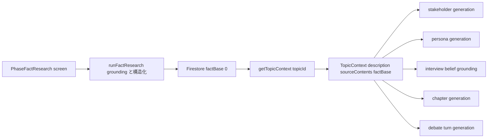
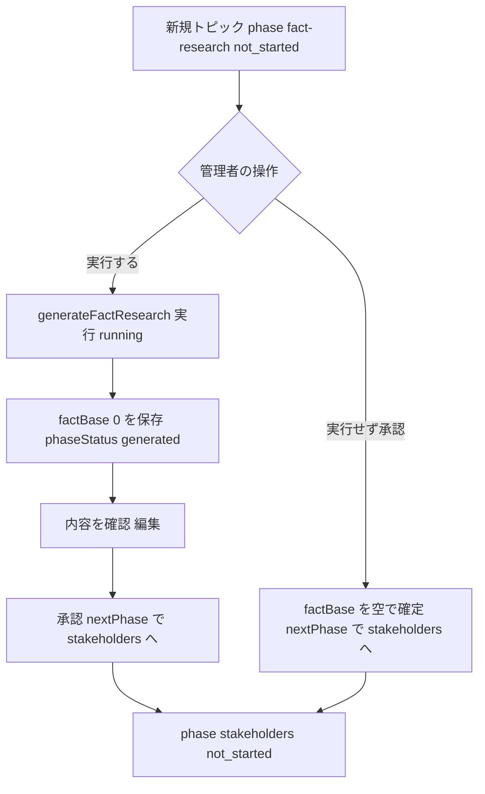
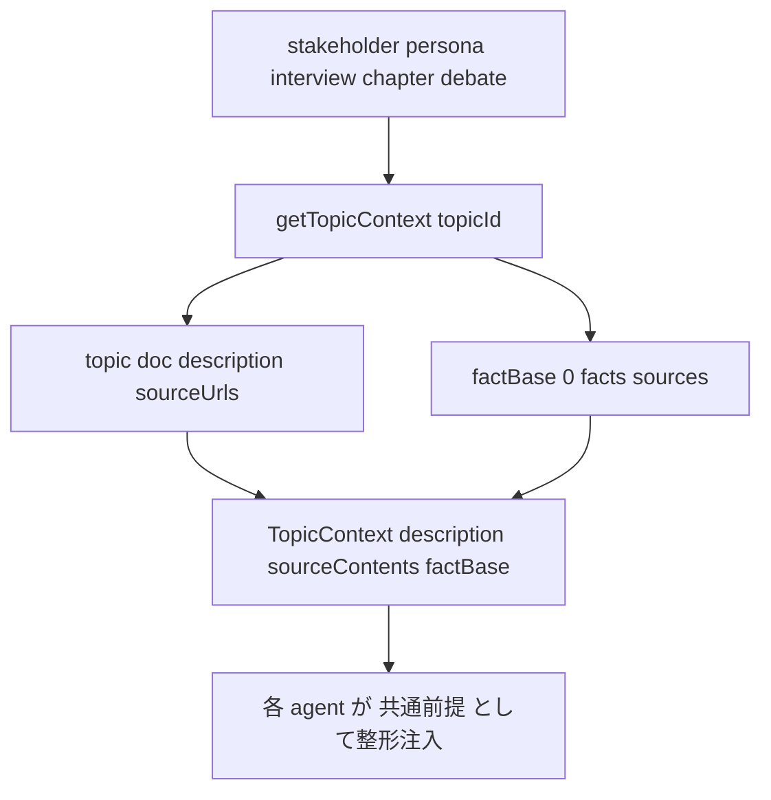

# Technical Design: topic-fact-base

## Overview

**Purpose**: テーマ討論生成パイプラインに **トピック事実基盤（topic fact base）** を新設する。テーマ設定とステークホルダー抽出の間に、ユーザーが確認・編集・承認する独立フェーズ「事実リサーチ（`fact-research`）」を挿入し、現在日付基準で収集した客観的・出典付き・構造化された事実基盤を、下流の全工程（ステークホルダー抽出・ペルソナ生成・取材・章立て・討論）に共通前提として供給する。

**Users**: 管理者が事実リサーチを実行・編集・承認し、閲覧者が「具体的事実に基づく討論」を得る。恩恵は、タイムリーなテーマでも討論が一般論に薄まらず具体的事実を踏まえること。

**Impact**: 現状「テーマの客観的事実がどこにも共有されない（各ペルソナが信念レンズ越しにバラバラに拾う）」構造を、事実基盤への一元化に変える。フェーズは6→7へ（`fact-research` を先頭に挿入）。`TopicContext` に `factBase` を追加し、消費者はこれを「共通前提」として `sourceContents`（参考資料）と区別して参照する。挙動の中核変更は取材（テーマ事実収集の責務移管）と討論（共通前提化）。

### Goals
- 現在日付基準・Google Search Grounding・出典付き・構造化の事実基盤を生成する（R1）。
- 事実リサーチを「テーマ設定の次・ステークホルダーの前」の必須フェーズとして挿入し、実行は任意・承認は必須とする（R2）。
- 事実基盤を `sourceContents` と分離して永続化する（R3）。
- ステークホルダー抽出・ペルソナ生成・章立て・取材・討論が事実基盤を参照する（R4–R8）。
- 客観的事実（共有）と主観的信念（ペルソナ固有）を全工程で分離する（R9）。

### Non-Goals
- 事実基盤の承認後変更に伴う下流成果物の自動カスケード再生成（各フェーズ再実行に委ねる）。
- 既存ファクトチェック機能の変更、討論中のリアルタイム検索の変更。
- 事実の confidence スコアリング（要件外）。

## Boundary Commitments

### This Spec Owns
- 新フェーズ `fact-research` の識別子・順序位置・状態遷移・画面・ルート。
- 事実基盤の生成（`runFactResearch`）・永続（`topics/{id}/factBase/0`）・型（`FactBase`/`FactBaseForFirestore`）。
- `TopicContext.factBase` フィールドの定義（FE/BE 対称）と、BE 権威の `getTopicContext(topicId)` による供給経路。
- 各消費者（stakeholder/persona/interview/chapter/debate）が factBase を「共通前提」として参照するプロンプト配線。

### Out of Boundary
- フェーズ識別子・順序の基盤（`PhaseSlug`/`PhaseKey`/`PHASE_DEFS`/`phaseOrder`/`nextPhase`）の仕組みそのもの（`phase-key-migration` が所有。本 spec は「配列に1エントリ追加」で利用するのみ）。
- ペルソナの信念（beliefs）の生成ロジック本体、ファクトチェックパイプライン、討論オーケストレーションの制御構造。
- 事実基盤変更後の下流再生成カスケード。

### Allowed Dependencies
- FE: `$lib/models/phase/*`、`$lib/models/topic/*`、`$lib/stores/*`、`Phase*.svelte`/`PhasePanel`。
- BE: `search/grounding.ts`、`llm/models.ts`、`constants/ai.constants.ts`、`utils/topic-phase.ts`、`agents/*`、`pipeline/*`、`types/topic.types.ts`。
- Firestore（`topics/{id}/factBase/0`、`topics/{id}.phase`）。

### Revalidation Triggers
- `TopicContext` / `factBase` の形状変更。
- `PHASE_DEFS` の順序変更・`PhaseSlug`/`PhaseKey` 値集合の変更（正準リスト self-check が落ちる）。
- `getTopicContext` の戻り値契約変更。
- 事実/信念分離の境界（factBase と beliefs の責務）の変更。

## Architecture

### Existing Architecture Analysis
- **フェーズ基盤は slug 方式（`phase-key-migration` land 済み）**: 順序は `PHASE_DEFS` 配列位置、`phaseLogicalState` はインデックス比較、承認は `nextPhase(currentKey)` 前進。StepNav・layout リダイレクトは配列から自動導出。→ フェーズ挿入は「1エントリ追加」で自動追随。
- **grounding は確立パターン**: `fact-check-runner.ts` が `generateText`＋`google_search` → `extractSources`/`resolveSourceUrls` → `generateObject` の2フェーズを実装。事実リサーチはこれを流用。
- **`TopicContext` 配線は半分済み**: chapter は配線済み。stakeholder/persona/debate 未配線。interview は topicContext を FE で組み立てて callable へ渡す唯一の経路。
- **永続は単一 doc サブコレクションパターン**: `stakeholders/0`・`chapterAnalysis/0`。FE はそれぞれ対応ストアを `currentTopicStore` が集約。
- **技術的負債の解消**: 事実を信念レンズ越しに各自収集する混同（R9 のバグ）を、factBase への一元化で解消する。

### Architecture Pattern & Boundary Map



**Architecture Integration**:
- Selected pattern: **共有事実基盤（single source of truth）＋派生コンテキスト供給**。factBase は Firestore が権威、`getTopicContext` が唯一の合成点。
- Domain/feature boundaries: 生成（`runFactResearch`）・永続（`factBase/0`）・供給（`getTopicContext`）・消費（各 agent プロンプト）を分離。消費者は factBase の作り方を知らず `TopicContext` だけに依存。
- Existing patterns preserved: slug フェーズ、単一 doc サブコレクション、grounding 2フェーズ、`PhasePanel` の状態別アクション。
- New components rationale: `runFactResearch`（生成）、`factBase/0`（永続）、`getTopicContext`（BE 権威の合成）、`PhaseFactResearch`＋ルート（UI）、`factBase` ストア（FE 読み書き）。
- Steering compliance: 「中央ディスパッチャを作らない」に準拠（`getTopicContext` は分岐器ではなくデータ読み込み合成器）。「過度な共通化をしない」に配慮し各画面処理は画面に置く。事実の権威を Firestore に一元化し FE stale を排除。

### Dependency Direction
FE: `models/phase` → `models/topic`（`TopicContext`/`FactBase`）→ `stores`（`factBase.svelte.ts`）→ `Phase*.svelte`/`PhasePanel`。
BE: `types`（`TopicContext`/`FactBase`/`PhaseKey`）→ `constants`（`PIPELINE_MODELS`）→ `search`/`llm` → `agents`（`fact-research-agent`）→ `pipeline`（`getTopicContext`/消費者）→ `api`（`generateFactResearch`）。各層は左方向のみ import。

### Technology Stack

| Layer | Choice / Version | Role in Feature | Notes |
|-------|------------------|-----------------|-------|
| Frontend | SvelteKit + TypeScript（現行） | 事実リサーチ画面・factBase ストア・フェーズ挿入 | 依存追加なし |
| Backend | Firebase Functions + TypeScript（現行） | 事実生成 onCall・factBase 永続・context 供給 | 依存追加なし |
| AI / Grounding | `@ai-sdk/google`（現行）+ Gemini（`PIPELINE_MODELS.factResearch` 追加） | Google Search Grounding で事実収集 | 既存 grounding パターン流用 |
| Data / Storage | Firestore（現行） | `topics/{id}/factBase/0` | 単一 doc サブコレクション |

## File Structure Plan

### 新規ファイル（BE）
```
functions/src/
├── agents/fact-research-agent.ts        # runFactResearch(title): grounding→構造化で FactBase を生成
├── api/fact-research.ts                  # generateFactResearch onCall + confirmPhaseGenerated('fact-research')
└── pipeline/topics/topic-context.ts      # getTopicContext(topicId): topic + factBase/0 を合成し TopicContext を返す
```

### 新規ファイル（FE）
```
src/lib/
├── models/factBase/factBase.types.ts     # FactBase / FactItem / FactBaseForFirestore（型と型ガードのみ）
├── stores/factBase.svelte.ts             # factBase/0 の購読・保存（chapterAnalysis.svelte.ts を範）
└── features/admin/topic-detail/fact-research/PhaseFactResearch.svelte  # 事実リサーチ画面
src/routes/admin/topics/[topicId]/fact-research/+page.svelte            # ルート
```

### 変更ファイル（BE）
- `functions/src/types/topic.types.ts` — `TopicContext.factBase?` 追加。`PhaseKey` に `'fact-research'` 追加。`FactBase`/`FactBaseForFirestore` 型定義。
- `functions/src/utils/topic-phase.ts` — `GeneratePhase` に `'fact-research'` を追加。
- `functions/src/constants/ai.constants.ts` — `PIPELINE_MODELS.factResearch` 追加。
- `functions/src/agents/stakeholder-agent.ts` — `generateStakeholders(title, topicContext?)`＋プロンプトに事実節。
- `functions/src/agents/persona-generator-agent.ts` — `generatePersonas(title, stakeholders, topicId, topicContext?)`＋事実節。
- `functions/src/agents/chapter-agent.ts` — `buildTopicContextSection` に factBase 節を追加。
- `functions/src/agents/interview-agent.ts` — `verifyWithGrounding` からテーマ事実収集を外し信念反証へ純化（R6）。factBase をドラフト/検証に注入。
- `functions/src/agents/persona-agent.ts` / `facilitator-agent.ts` — `generateTurn`/ファシリテーターに factBase を「共通前提」として注入（R8）。
- `functions/src/types/turn.types.ts` — `TurnGenerationContext.factBase?` 追加。
- `functions/src/api/{stakeholders,personas,interviews}.ts` — `getTopicContext(topicId)` で factBase を server-side に供給。
- `functions/src/pipeline/chapters/chapter-generator.ts` — `buildTopicContext` を `getTopicContext` に置換（factBase 合成）。
- `functions/src/pipeline/debate/{debate-orchestrator,step}.ts` — factBase を取得し `TurnGenerationContext` に載せる。

### 変更ファイル（FE）
- `src/lib/models/phase/phase.types.ts` — `PhaseSlug` に `'fact-research'` 追加。
- `src/lib/models/phase/phase.constants.ts` — `PHASE_DEFS` 先頭に `fact-research` エントリ（label＋statusLabels）。
- `src/lib/models/topic/topic.types.ts` — `TopicContext.factBase?` 追加。
- `src/lib/models/topic/createTopic.svelte.ts` — `approveFactResearch`（`nextPhase('fact-research')`＝stakeholders へ前進、空承認も同経路）。
- `src/lib/stores/topics.svelte.ts` — 新規トピック初期フェーズを `'fact-research'` に。
- `src/lib/stores/currentTopic.svelte.ts` — `factBaseStore` を集約に追加。
- `src/lib/sharedComponents/PhasePanel.svelte` — `not_started` 時の承認アクション（任意プロップ `onApprove`/`approveLabel` を not_started でも表示可能に）。
- `src/lib/features/admin/topic-list/TopicListPage.svelte` ほか — バッジ・ナビは `PHASE_DEFS` から自動追随（変更なし）。

### 変更ファイル（テスト）
- FE `src/tests/models/phase/phase.test.ts` — 正準リスト `CANONICAL_PHASE_KEYS`・ラベルスナップショットに `fact-research` を反映。
- BE `functions/src/tests/types/phase-key.test.ts` — `PhaseKey`/`GeneratePhase` 正準リストに `fact-research` を反映。

## System Flows

### 事実リサーチフェーズのライフサイクル（実行任意・承認必須）



承認は常に `nextPhase('fact-research')==='stakeholders'` へ前進。空承認（R2.5）は factBase を `facts: []` で確定して同じ前進経路を通る。未承認中はステークホルダー以降へ進めない（R2.2、layout リダイレクトが `phaseOrder` で担保）。

### 事実基盤の供給（BE 権威）



factBase は Firestore が権威。FE は factBase を callable へ渡さない（stale 排除・R9.3）。

## Requirements Traceability

| Requirement | Summary | Components | Interfaces | Flows |
|-------------|---------|------------|------------|-------|
| 1.1–1.6 | 事実基盤生成（grounding/出典/日付/空縮退） | fact-research-agent | `runFactResearch` | 供給 |
| 2.1–2.7 | 独立承認フェーズ（必須・実行任意・編集・再実行） | PHASE_DEFS, PhaseFactResearch, PhasePanel, createTopic | `approveFactResearch` | ライフサイクル |
| 3.1–3.4 | 永続化（sourceContents分離・日付・出典・状態） | factBase.types, factBase store, api/fact-research | `FactBaseForFirestore` | — |
| 4.1–4.2 | ステークホルダー参照 | stakeholder-agent, getTopicContext | `generateStakeholders` | 供給 |
| 5.1–5.2 | ペルソナ生成参照 | persona-generator-agent, getTopicContext | `generatePersonas` | 供給 |
| 6.1–6.5 | 取材が共有基盤参照（個別検索置換） | interview-agent | `runInterview`/`verifyWithGrounding` | 供給 |
| 7.1–7.2 | 章立て参照 | chapter-agent, chapter-generator | `buildTopicContextSection` | 供給 |
| 8.1–8.5 | 討論で共通前提化・件数ノルマなし | persona-agent, facilitator-agent, step | `TurnGenerationContext.factBase` | 供給 |
| 9.1–9.3 | 事実/信念の分離 | topic.types, getTopicContext, interview-agent | `TopicContext.factBase` | 供給 |

## Components and Interfaces

| Component | Domain/Layer | Intent | Req Coverage | Key Dependencies (P0/P1) | Contracts |
|-----------|--------------|--------|--------------|--------------------------|-----------|
| fact-research-agent | BE/Agent | grounding で事実基盤を生成 | 1 | grounding, llm/models (P0) | Service |
| api/fact-research | BE/API | 生成 onCall・永続・確定 | 1, 2, 3 | fact-research-agent, topic-phase (P0) | API, Batch |
| getTopicContext | BE/Pipeline | factBase を合成し供給 | 4–9 | factBase/0, topics (P0) | Service |
| FactBase types | FE/BE Model | 事実基盤の型・分離 | 3, 9 | — | State |
| PhaseFactResearch | FE/UI | 事実の確認・編集・承認 | 2 | factBase store, PhasePanel (P0) | State |
| factBase store | FE/Store | factBase/0 購読・保存 | 2, 3 | firestore (P0) | State |
| consumers wiring | BE/Agent | 事実の共通前提注入 | 4–8 | getTopicContext (P0) | Service |

### BE / Agent

#### fact-research-agent

| Field | Detail |
|-------|--------|
| Intent | テーマから現在日付基準で客観的事実を grounding 収集し、出典付き構造化する |
| Requirements | 1.1, 1.2, 1.3, 1.4, 1.5, 1.6 |

**Responsibilities & Constraints**
- 客観的事実のみ（立場・信念・評価を含めない、R1.4）。検証可能な具体（出来事・結果・数値・固有名詞・日付、R1.3）。
- grounding が事実を返さない／時事性が無い場合は捏造せず空 factBase に縮退（R1.5, R1.6）。
- 現在日付を生成基準として記録（R1.2 の出典＋生成日）。

**Dependencies**
- Outbound: `search/grounding.ts`（`extractSources`/`resolveSourceUrls`）— 出典抽出・URL解決（P0）
- External: `getGoogleProvider()` + `PIPELINE_MODELS.factResearch` — Google Search Grounding（P0）

**Contracts**: Service [x]

##### Service Interface
```typescript
export type FactItem = {
  statement: string;                 // 検証可能な具体的事実
  sources: { title: string; url: string }[];
};

export type FactBase = {
  facts: FactItem[];                 // 空配列＝事実なし（R1.5/1.6）
  generatedAt: Date;                 // 生成基準日（現在日付）
};

export const runFactResearch = (
  title: string,
  now: Date
): Promise<Result<FactBase, PipelineError>>;
```
- Preconditions: `GEMINI_API_KEY` 設定済み（未設定は `getGoogleProvider()` が null → エラー）。
- Postconditions: grounding 空なら `facts: []` を返す（成功扱い）。各 fact に出典を対応付ける。
- Invariants: 主観（立場・評価）を含まない。

#### getTopicContext（pipeline/topics/topic-context.ts）

| Field | Detail |
|-------|--------|
| Intent | topic doc と factBase/0 から `TopicContext` を合成する唯一の BE 権威経路 |
| Requirements | 4.1, 5.1, 6.1, 7.1, 8.1, 9.1, 9.3 |

**Contracts**: Service [x]

##### Service Interface
```typescript
export const getTopicContext = (topicId: string): Promise<TopicContext>;
// TopicContext（FE/BE 対称・拡張後）
export type TopicContext = {
  description?: string;
  sourceContents?: string[];
  factBase?: FactBase;   // 承認済み事実基盤（空 facts 可）
};
```
- Preconditions: topic が存在する。
- Postconditions: factBase/0 が存在すればその facts を、無ければ `factBase` 未設定。description/sourceContents は現行の合成ロジックを踏襲。
- Invariants: factBase は全消費者で同一値（一貫性 R9.3）。分岐（フェーズ別処理）を持たない。

### BE / API

#### api/fact-research（generateFactResearch）

| Field | Detail |
|-------|--------|
| Intent | 事実リサーチを実行し factBase/0 を永続、フェーズを generated 確定 |
| Requirements | 1.1, 2.3, 2.7, 3.1, 3.2, 3.3 |

**Contracts**: API [x] / Batch [x]

##### API Contract
| Method | Endpoint(callable) | Request | Response | Errors |
|--------|--------------------|---------|----------|--------|
| onCall | `generateFactResearch` | `{ topicId, title }` | `{}` | invalid-argument, internal |

**Implementation Notes**
- Integration: `runFactResearch(title, now)` → `topics/{id}/factBase/0` に `FactBaseForFirestore` を `.set` → `confirmPhaseGenerated(topicId, 'fact-research')`（running 限定・冪等、既存規範）。`onCall({ timeoutSeconds: 300, secrets })`。
- Validation: `topicId`/`title` 必須。空 grounding は空 factBase を保存し generated 確定（R2.7 の再実行でも同経路）。
- Risks: 再実行は承認前の factBase を再生成（R2.7）。承認後変更のカスケードは Non-Goal。

### BE / Consumers（stakeholder / persona / interview / chapter / debate）

| Field | Detail |
|-------|--------|
| Intent | factBase を「確定した客観的事実（共通前提）」として各生成に注入 |
| Requirements | 4.1, 4.2, 5.1, 5.2, 6.1, 6.2, 6.3, 6.4, 6.5, 7.1, 7.2, 8.1, 8.2, 8.3, 8.4, 8.5 |

**Contracts**: Service [x]

**Implementation Notes**
- Integration:
  - stakeholder/persona: シグネチャに `topicContext?` を追加。API 側は `getTopicContext(topicId)` を渡す。プロンプトに事実節（`sourceContents` と区別し「共通前提」ラベル）。
  - chapter: `buildTopicContext` を `getTopicContext` に置換。`buildTopicContextSection` に factBase 節を追加（既存 【】節に「【確定した客観的事実（共通前提）】」を追加）。
  - interview（R6）: `verifyWithGrounding` からテーマ事実の収集を外し、ペルソナ固有信念の反証検証に純化（R6.3）。factBase を draft/verify に共通前提として注入し、関連事実を薄めず反映（R6.4）。関連事実が無ければ盛り込まない（R6.5）。context は callable 内で `getTopicContext` により server-side に factBase を供給。
  - debate（R8）: `debate-orchestrator`/`step` が factBase を取得し `TurnGenerationContext.factBase` に載せる。`generateTurn`/facilitator プロンプトで「共通前提」として提示。関与濃淡はプロフィール・関心度依存（R8.2）、件数ノルマ無し（R8.3）、知ったかぶり禁止と両立（R8.4）、関心薄なら概括可（R8.5）。
- Validation: factBase 空／該当事実なしのとき、各消費者は従来どおりテーマ情報のみで動作（R4.2, R5.2, R7.2, R6.5）。
- Risks: 取材の挙動退行（belief grounding 空許容へ緩和）、討論の暗唱化（件数ノルマ回避・自然さ調整）。

### FE / Model + Store + UI

#### FactBase types / factBase store

| Field | Detail |
|-------|--------|
| Intent | factBase/0 の型・購読・保存。信念と別データとして扱う | 
| Requirements | 3.1, 3.2, 3.3, 3.4, 9.1 |

**Contracts**: State [x]

##### State Management
```typescript
// src/lib/models/factBase/factBase.types.ts（型と型ガードのみ）
export type FactItem = { statement: string; sources: { title: string; url: string }[] };
export type FactBase = { facts: FactItem[]; generatedAt: Date };
export type FactBaseForFirestore = { facts: FactItem[]; generatedAt: Timestamp };
```
- Persistence: `topics/{topicId}/factBase/0`。状態（未実行/生成済/承認済＝R3.4）は topic の `phase`/`phaseStatus` で表現（doc に status を二重持ちしない）。
- Store: `chapterAnalysis.svelte.ts` を範に `onSnapshot` 購読。編集保存は `factBase/0` を `.set`（R2.4）。

#### PhaseFactResearch（screen）+ PhasePanel 拡張

| Field | Detail |
|-------|--------|
| Intent | 事実の確認・編集・実行・承認（実行任意） |
| Requirements | 2.1, 2.3, 2.4, 2.5, 2.6, 2.7 |

**Implementation Notes**
- Integration: `const PHASE = 'fact-research'`。`generate`＝`generateFactResearch` 呼び出し、`approve`＝`approveFactResearch()`＋`goto(phasePath(id, nextPhase(PHASE)!))`。content スロットに factBase の編集可能リスト（statement＋sources）を表示（R2.3, R2.4）。
- PhasePanel 拡張: `not_started` 状態でも `approveLabel`/`onApprove` が渡されていれば「実行せず承認」ボタンを表示（R2.5）。他フェーズは当該プロップ未指定で不変。
- Validation: 空承認は factBase を `facts: []` で確定して前進（R2.5）。
- Risks: PhasePanel に not_started 承認分岐が増える（最小・後方互換）。

## Data Models

### Physical Data Model（Firestore）
- `topics/{topicId}/factBase/0`: `FactBaseForFirestore { facts: FactItem[]; generatedAt: Timestamp }`。
- `topics/{topicId}.phase`: `'fact-research' | 'stakeholders' | ... | 'editing'`（`PhaseKey`/`PhaseSlug`）。新規は `'fact-research'`。
- 分離: `factBase` は `sourceUrls`/`fetchedSourceContents`（ユーザー提供資料）と別ドキュメント（R3.1）。
- 空表現: `facts: []`＝事実なし（R1.5/1.6, R2.5）。doc 不在も「空」とみなす。

### Data Contracts & Integration
- `TopicContext.factBase`（FE/BE 対称）は生成時のアプリ層型（`generatedAt: Date`）。永続は `*ForFirestore`（`Timestamp`）。
- consumers は `TopicContext` のみに依存（factBase の取得方法を知らない）。

## Error Handling

### Error Strategy
- 生成: `getGoogleProvider()` null（`GEMINI_API_KEY` 未設定）は `AI_API_ERROR`。grounding 空は**エラーにせず空 factBase**（R1.6：捏造しない）。
- 確定: `confirmPhaseGenerated` の running 限定・冪等・巻き戻し防止を踏襲（既存規範）。
- 取材（R6）: テーマ事実収集を外した結果 belief grounding が空になり得るため、`verifyWithGrounding` の「groundingChunks 空＝エラー」を空許容へ緩和（信念反証は可能な範囲で実施）。
- UI: 生成失敗は `stopped`（既存 generate 失敗パターン）。空承認はエラー経路ではなく正常遷移。

### Monitoring
- 既存ログ方針を踏襲（`console.error`/`console.info`）。追加メトリクスなし。

## Testing Strategy

### Unit Tests
- `runFactResearch`: grounding 応答から FactBase 構造化（出典対応）／grounding 空で `facts: []`（R1.5/1.6）。
- `getTopicContext`: factBase/0 あり→`factBase` 合成、なし→未設定、description/sourceContents の現行合成維持。
- `buildTopicContextSection`（chapter-agent）: factBase 節が「共通前提」として整形される／空で無出力。
- FE `phase.test.ts`: `PHASE_DEFS` 先頭 `fact-research`＋正準リスト・ラベルスナップショット更新（順序 7 フェーズ）。
- BE `phase-key.test.ts`: `PhaseKey`/`GeneratePhase` に `fact-research` を反映した正準 self-check。

### Integration Tests
- `generateFactResearch`: 実行→`factBase/0` 保存→`confirmPhaseGenerated('fact-research')` で generated（冪等）。
- 承認遷移: `approveFactResearch`＝`nextPhase('fact-research')==='stakeholders'` 前進。空承認（not_started から）で `facts: []` 確定＋前進（R2.5）。
- 取材（R6）: factBase 注入時に関連事実を反映、無関連時は盛り込まない。belief grounding 空でエラーにしない。
- 討論（R8）: `TurnGenerationContext.factBase` が persona/facilitator に共通前提として渡る。件数ノルマ無しで自然に関与。

### E2E/UI Tests
- 新規トピック作成→`fact-research` が先頭フェーズとして表示（StepNav 自動追随）。
- 実行→編集→承認、および実行せず承認（空確定）の2経路。
- 未承認中はステークホルダー以降へ遷移不可（layout リダイレクト）。

## Migration Strategy
- 既存データ移行は不要（`phase-key-migration` で本番 topics は空にリセット済み）。新規トピックは `phase: 'fact-research'` で作成。
- 正準リスト self-check は `fact-research` 追加で一時的に失敗するため、フェーズ定義更新とテスト正準リスト更新を同一タスクに束ねる（ドリフト検出の意図どおり）。
- Rollback triggers: 取材・討論の挙動退行（事実の暗唱化・不自然化）が目視で顕著なら、当該プロンプト配線を段階的に見直す。
