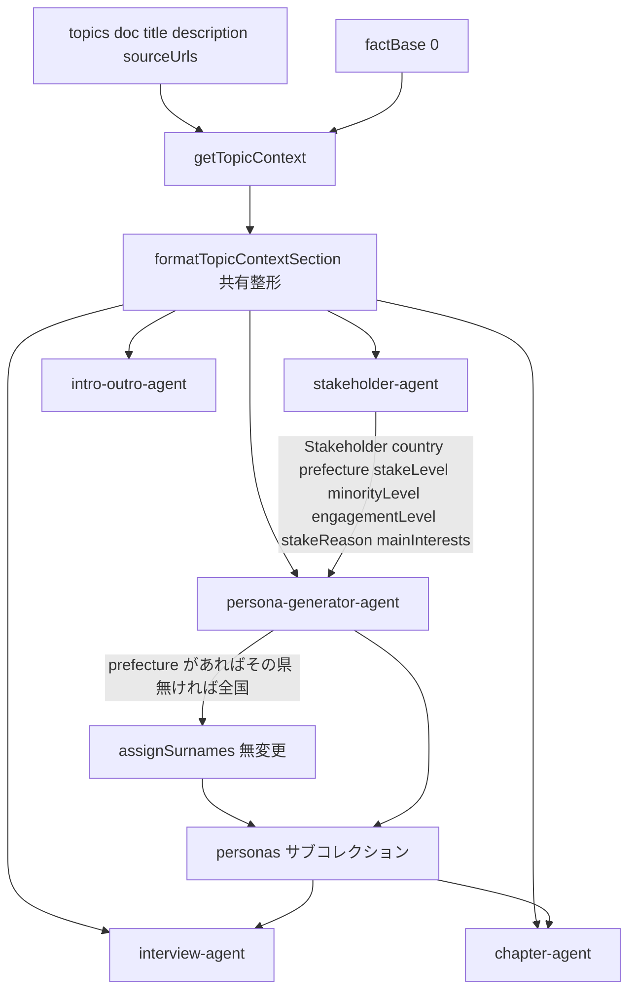
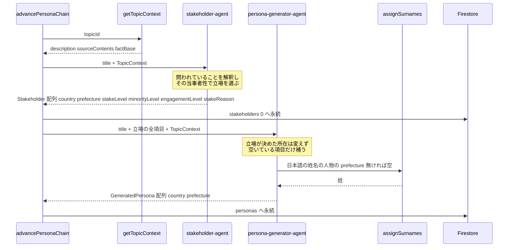
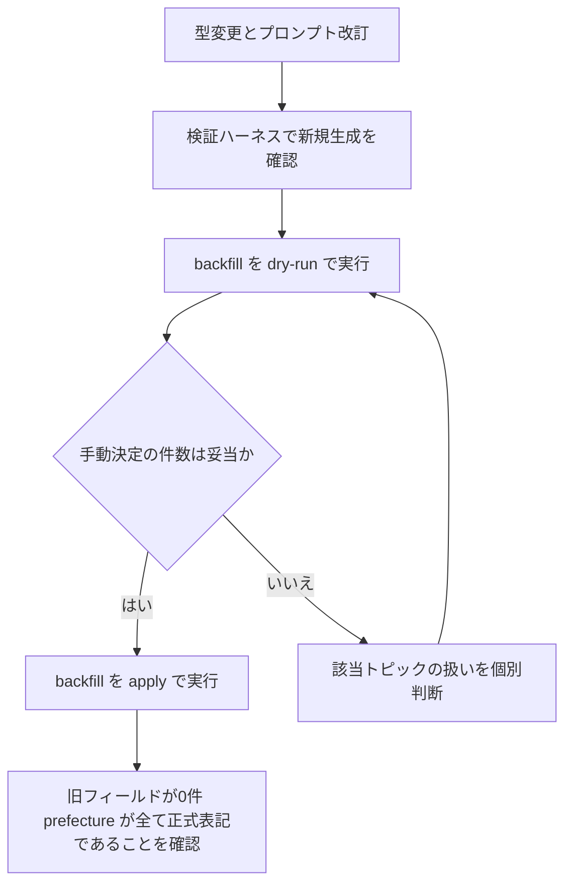

# Technical Design: topic-intent-fidelity

## Overview

**Purpose**: 本仕様は、利用者がテーマ設定で与えた指示（何が問われているか・どの舞台か・誰に語らせたいか）を、**キャストを決める2段**——ステークホルダー生成とペルソナ生成——へ確実に届け、各段の既定の生成方針がその指示を上書きしない状態を作る。

**Users**: テーマを設定する管理者が、書いた指示のとおりの顔ぶれで討論が始まることを得る。閲覧者は、問われていることの当事者が場にいる討論を読む。

**Impact**: 意図の供給経路（`getTopicContext`）と配線（`persona-chain`）は既に完成しており、変更は**消費側に閉じる**。加えて、舞台（立場が存在する国・地域）と当事者性を構造として持たせるため、`Stakeholder` と `Persona` の型が変わる。ペルソナの所在モデル変更には既存データの移行を伴う。

### Goals

- テーマの詳細説明・参考資料を、全生成段が同一の整形・同一の重みで共通前提として受け取る（段ごとの取捨を無くす）
- 立場の選定基準を「題材領域の利害関係者」から「その討論で問われていることへの当事者性」へ移す
- 当事者性・少数性・専門や意識の高さを、独立した3軸として構造に持つ
- 舞台を立場の属性として構造に持ち、ペルソナがそれを引き継ぐ。特定国籍を既定とする扱いを撤廃する
- 所在を国・都道府県の任意項目として持ち、テーマが決めている範囲だけを値にする
- 所在の解釈をコードに持たせない（文字列の正規化・都道府県判定を生成経路から外す）
- 日本人の名前決定に地域性を反映する既存の仕組みを生かす
- 指示との整合を、本番と同一経路で再現可能に確認できる検証ハーネスを持つ

### Non-Goals

- **外国人氏名の語彙テーブル化**。日本人姓と同等のデータ源を全国籍について用意できない。プロンプト指示で満たし、分布の実測手段を用意したうえで、狭まりが確認された場合に後続 spec で扱う（`research.md` の Design Decision 参照）
- **討論の発言機会への当事者性の反映**。話者選択は意欲評価のスコアで動いており、そこへ軸を足すのは討論設計そのものの変更である。価値との衝突が理由ではない
- **実在の特定個人を模したペルソナの生成**。ペルソナは架空の一人の人物であるという既存の前提を変えない
- テーマ設定画面の入力項目の追加・再設計
- `fact-research-agent` の呼び出し契約の統一（後述）

## Boundary Commitments

### This Spec Owns

- `TopicContext` の**プロンプト整形**（`description` / `sourceContents` / `factBase` を1つの節に組み立てる唯一の関数）と、その全消費者への適用
- `Stakeholder` の形（舞台・当事者性・当事者である理由）と、立場の選定基準
- `Stakeholder` / `Persona` の所在の形（`country` / `prefecture`）と、その決定規則
- ステークホルダーからペルソナへ引き継ぐ項目の範囲
- キャスト構成の検証ハーネス（本番経路を通す再現可能な確認手段）
- `personas` サブコレクションの所在フィールド移行

### Out of Boundary

- **`getTopicContext` の合成規則**。供給は既に権威経路として完成しており、本仕様は消費側のみを変える
- **`fact-research-agent` の呼び出し契約**。`factBase` を生成する段であり `TopicContext` を経由しない（まだ `factBase` が存在しない）。`description` は既に消費しているため、統一の実益が無い
- **論点・章立ての生成ロジック**。`description` を方向性として最優先に扱う既存の挙動は維持する（整形の共有により文言は変わらない）
- **話者選択・意欲評価**。当事者性を発言機会へ反映しない
- **アバター生成の生成ロジック**。`nationality` → `country` の改名に追随するのみで、プロンプトの組み立て自体は変更しない
- **`stakeholders/0` の既存データの移行**。新フィールドを読む経路が同一 run 内のペルソナ生成に限られるため不要（根拠は Migration Strategy）

### Allowed Dependencies

- `pipeline/topics/topic-context.ts`（`getTopicContext`）— 共通前提の唯一の供給経路
- `constants/surname-regions.ts` / `constants/japanese-surnames.ts` / `pipeline/personas/surname-assignment.ts` — 日本国内の姓の割り当て（**無変更で利用する**。`PREFECTURES` は `prefecture` のスキーマ定義にも使う）
- `llm/models.ts`（`getPipelineModel`）、`llm/usage-recorder.ts`（`llmTask`）— 既存の LLM 呼び出し基盤
- 依存方向: `types` → `constants` → `utils` → `agents` → `pipeline` → `api`。この向きを逆流させない

### Revalidation Triggers

- `Stakeholder` / `Persona` の形が変わったとき（下流の取材・討論・編集・アバターの参照）
- `formatTopicContextSection` の見出し・文言が変わったとき（全生成段のプロンプトが同時に変わる）
- ペルソナ生成が立場から引き継ぐ項目が変わったとき
- `personas` サブコレクションのフィールド構成が変わったとき（FE ミラー型・公開表示型）

## Architecture

### Existing Architecture Analysis

| 観点 | 現状 | 本仕様での扱い |
|---|---|---|
| 共通前提の供給 | `getTopicContext` が全段へ同一値を返す。`persona-chain` は両段へ渡し済み | 維持。消費側のみ変更 |
| 共通前提の消費 | `formatFactBaseSection` のみ共有。`description`/`sourceContents` の整形は3箇所に重複、2箇所に欠落 | 共有整形へ統一（重複3→1、欠落2→解消） |
| 立場の属性 | `role` / `reason` / `mainInterests` / `minorityLevel` / `engagementLevel`。下流へ届くのは `role` と `engagementLevel` のみ | 舞台と当事者性を追加し、**全項目をペルソナ生成へ渡す**（死蔵の解消） |
| ペルソナの所在 | `homePrefecture: string`（都道府県専用・国外は空文字）と `nationality: string` が併存し、どちらも必須 | `country?` / `prefecture?` の任意項目へ改名。空文字で不在を表す運用をやめる |
| 姓の割り当て | 居住都道府県から地域姓／全国姓を重み付き抽選 | **無変更**。`prefecture` をそのまま渡す（`normalizePrefecture` は経路から外れる） |
| 生成の連鎖 | Cloud Tasks の自己連鎖（`advancePersonaChain`） | 無変更 |

技術的負債として同時に解消するもの — `Stakeholder.engagementLevel` の optional（zod は required なのに型が optional で、ペルソナ生成に未設定フォールバックが残っている）、`reason` / `mainInterests` / `minorityLevel` の死蔵。

### Architecture Pattern & Boundary Map

選定パターン: **共有整形 + 段間の属性引き継ぎ**。新しい段や中央ディスパッチャは作らない（steering: 過度な共通化・中央ディスパッチャを作らない）。



**Architecture Integration**:
- **選定パターン**: 整形の共有 1 本 + 立場からペルソナへの属性引き継ぎ。LLM 呼び出しの段数は増やさない
- **責務の分離**: 舞台と当事者性の**判定**はステークホルダー生成が所有する。ペルソナ生成は立場が決めた所在を変えず、空いている項目だけを補う。**文脈の判断は LLM、語彙と分布はコード** — 所在の決定は自由記述の立場・職務・生活を読む判断なので LLM が持ち、姓そのものの選択は語彙リストからの抽選としてコードが持つ（`surname-regions.ts` の既存原則）
- **維持する既存パターン**: Cloud Tasks の自己連鎖、`llmTask` による使用量記録、`Result<T, PipelineError>` のエラー表現、`sourceTag` による由来突合、dry-run 既定の backfill、本番同一経路の検証ハーネス
- **新規コンポーネントの理由**: `formatTopicContextSection`（重複3箇所と欠落2箇所を同時に解消する唯一の場所）、`verify-cast-composition`（ステークホルダー段を含めて通す検証が現存しない）、`backfill-persona-location`（所在フィールドの改名に伴う移行）
- **steering 準拠**: 件数・比率の固定値で縛らない、対立を煽る枠組みを持ち込まない、検証用と本番の実装を分けない、一過性処理もリポジトリに残す

### Technology Stack

| Layer | Choice / Version | Role in Feature | Notes |
|-------|------------------|-----------------|-------|
| Backend / Services | Firebase Functions v2（既存）, Vercel AI SDK `generateObject`（既存）, zod（既存） | 生成エージェントとスキーマ検証 | 新規依存なし |
| Data / Storage | Cloud Firestore（既存） | `stakeholders/0` / `personas` サブコレクション | スキーマ変更あり（下記 Data Models） |
| Frontend | SvelteKit（既存） | 型のミラーのみ。画面変更なし | 立場を表示する画面は現存しない |
| Infrastructure / Runtime | Cloud Tasks（既存の自己連鎖） | 変更なし | — |

所在は `country`（自由記述）と `prefecture`（47都道府県の enum）の任意項目で表す。都道府県は有限集合なので生成スキーマで直接受け取れ、表記ゆれを吸収する `normalizePrefecture` が生成経路から外れる。**コードは値の有無を見るだけで、所在の文字列を解釈しない。** 国を表す独自のコード体系は導入しない。

## File Structure Plan

### Directory Structure

```
functions/src/
├── types/
│   ├── stakeholder.types.ts          # 所在 country?/prefecture?・当事者性 stakeLevel を追加、reason を stakeReason へ、engagementLevel を必須化
│   └── persona.types.ts              # homePrefecture を prefecture? へ、nationality を country? へ改名
├── constants/
│   └── surname-regions.ts            # 無変更（PREFECTURES を prefecture のスキーマに利用）
├── utils/
│   └── prompt-formatters.ts          # formatTopicContextSection を新設（唯一の整形）
├── agents/
│   ├── stakeholder-agent.ts          # 選定基準を問いへの当事者性に置換、3軸と舞台を出力
│   ├── persona-generator-agent.ts    # 立場の全項目を入力に、所在を引き継ぎ、日本人既定を撤廃
│   ├── chapter-agent.ts              # 自前整形を共有へ置換（文言は同一）
│   ├── interview-agent.ts            # 同上（見出しが変わる）
│   └── intro-outro-agent.ts          # 同上（見出しが変わる）
├── pipeline/personas/
│   ├── surname-assignment.ts         # 無変更
│   ├── verify-persona-naming.ts      # 削除（下記へ置換）
│   └── verify-cast-composition.ts    # 新設。テーマ文から立場生成→ペルソナ生成を本番経路で通す
└── scripts/
    ├── backfill-persona-location.ts  # 新設。homePrefecture → prefecture / nationality → country の改名（dry-run 既定）
    └── inspect-persona-names.ts      # 氏名の分布を都道府県別・日本語名か否かで出せるよう拡張

src/lib/models/
├── stakeholder/stakeholder.types.ts  # BE 型をミラー
└── persona/persona.types.ts          # BE 型をミラー（country?/prefecture? へ改名）
```

### Modified Files

- `functions/src/types/stakeholder.types.ts` — `StakeLevel` と `country?` / `prefecture?` を追加、`reason` → `stakeReason`、`engagementLevel` を必須化
- `functions/src/types/persona.types.ts` — `homePrefecture` → `prefecture?`、`nationality` → `country?`（ともに任意）
- `functions/src/avatar/avatar-prompt.ts` — `AvatarVariation.nationality` を `country?` へ追随。値が無い人物では当該の括弧書きを出さない
- `functions/src/avatar/avatar-engine.ts` — `AvatarSpec.nationality` を `country?` へ追随（任意のまま prompt 層へ渡す）
- `functions/src/api/avatars.ts` — `persona.nationality ?? ''` を `persona.country` の受け渡しへ置換。**空文字で埋めない**（欠損を許容する分岐を新項目へ持ち越さない）
- `functions/src/avatar/verify-avatar-generation.ts` — 固定値の `nationality` を `country` へ追随
- `functions/src/scripts/backfill-persona-home-prefecture.ts` / `backfill-persona-surnames.ts` — 旧フィールド名を読む既存の移行スクリプト。改名後は対象データが存在しないため、実行済みの記録として冒頭に「`homePrefecture` 時代のスクリプト。現行スキーマでは動作しない」旨を明記し、型は新フィールドへ追随させてビルドを通す（削除しない）
- `functions/src/utils/prompt-formatters.ts` — `formatTopicContextSection` を追加。`formatFactBaseSection` はその内部から呼ばれる形に整理（既存の単独利用は無くなる）
- `functions/src/agents/stakeholder-agent.ts` — zod スキーマとプロンプトの全面改訂
- `functions/src/agents/persona-generator-agent.ts` — 立場リストの整形、所在と名前の規則、日本人既定の撤廃
- `functions/src/agents/chapter-agent.ts` / `interview-agent.ts` / `intro-outro-agent.ts` — 自前の `buildTopicContextSection` / `formatTopicContextSection` を削除し共有を呼ぶ
- `src/lib/models/stakeholder/stakeholder.types.ts` / `src/lib/models/persona/persona.types.ts` — ミラー更新
- テスト: `functions/src/tests/agents/{stakeholder,persona-generator,chapter,interview,intro-outro}-agent.test.ts`、`functions/src/tests/types/persona.types.test.ts`、`src/tests/models/persona/persona.types.test.ts`、固定値に `homePrefecture` / `nationality` を含む各テスト、`functions/src/tests/avatar/` 配下のアバタープロンプトのテスト

## System Flows

### キャスト決定の流れ



**流れの決定事項**:
- **所在は立場が決めた範囲をペルソナが引き継ぐ**。立場が埋めた項目をペルソナは変えない（3.3・3.6）。立場が空にした項目は、その人物を描くうえで必要なときだけ補う。テーマが決めていない所在を埋めるために推測しない
- **3.3 はコードで確定させる。** 由来の立場が `country` / `prefecture` を持つとき、ペルソナ生成後にその値を採用する（LLM の出力で上書きしない）。立場が埋めた値をペルソナへ移すのは解釈を伴わない転記であり、`assignSurnames` が生成後に所在系を確定させている既存の後処理と同型である。LLM が決めるのは立場が空にした項目だけで、そこは自由記述の職務・生活を読む文脈判断として残す。これにより Data Models の不変条件（立場が所在を決めているとき、ペルソナの所在はそれと一致する）が構造で成立する
- **プロンプトの指示は残す。** 立場の所在を渡し「変えない」と指示したうえでコードが確定させる二重の担保にする。ハーネスの役割は「翻案の検出」から「立場が空にした項目の補い方が妥当か」の提示へ移る
- 姓の割り当ては、既存どおり `familyName` が空のとき（＝日本語の姓名の人物）に走る。`prefecture` があればその県の地域姓／全国姓を抽選し、**無ければ都道府県を限定せず全国の語彙から抽選する**（4.6）。`assignSurnames` は無変更で、`normalizePrefecture` は不要になる

## Requirements Traceability

| Requirement | Summary | Components | Interfaces | Flows |
|---|---|---|---|---|
| 1.1, 1.2 | 詳細説明・参考資料をキャスト決定2段が受け取る | TopicContextFormatter, StakeholderGenerator, PersonaGenerator | `formatTopicContextSection` | キャスト決定の流れ |
| 1.3 | 段ごとの取捨分岐を持たない | TopicContextFormatter | 同上（全5消費者が同一関数を呼ぶ） | — |
| 1.4 | 指示を既定の生成方針より優先 | TopicContextFormatter, StakeholderGenerator, PersonaGenerator | 見出し【テーマの方向性（最優先）】の統一 | — |
| 1.5 | 未設定時の従来動作 | TopicContextFormatter | 空文字への縮退 | — |
| 2.1, 2.2 | 選定基準を問いへの当事者性に置く | StakeholderGenerator | プロンプト（選定基準）・`stakeReason` | キャスト決定の流れ |
| 2.3 | 当事者群を複数の立場に分解 | StakeholderGenerator | プロンプト | — |
| 2.4 | 当事者である理由を出力 | StakeholderGenerator | `Stakeholder.stakeReason` | — |
| 2.5 | 射程内の多様性を維持 | StakeholderGenerator | プロンプト・`minorityLevel` / `engagementLevel` | — |
| 2.6 | 3軸を独立に扱う | StakeholderGenerator, PersonaGenerator | `stakeLevel` / `minorityLevel` / `engagementLevel` | — |
| 2.7 | 件数・比率で機械的に割り当てない | StakeholderGenerator | プロンプト | — |
| 3.1, 3.2, 3.5 | 舞台から所在を決める／既定を持たない | StakeholderGenerator | `Stakeholder.country` / `.prefecture` | キャスト決定の流れ |
| 3.3, 3.6 | 翻案しない／立場の所在を引き継ぎ空欄だけ補う | PersonaGenerator, CastCompositionVerifier | プロンプト＋ハーネスの機械判定 | キャスト決定の流れ |
| 3.4 | 日本国内テーマの従来動作 | PersonaGenerator, SurnameAssignment | `assignSurnames`（無変更） | キャスト決定の流れ |
| 4.1 | その人物の出自として自然な氏名 | PersonaGenerator | プロンプト（語彙化は Non-Goals） | — |
| 4.2 | 所在を任意項目として持ち既定の国を置かない | PersonaGenerator | `Persona.country?` / `.prefecture?` | — |
| 4.3 | 同等の具体性 | PersonaGenerator | プロンプト | — |
| 4.4 | 表記の一貫性 | PersonaGenerator | `composeName` | — |
| 4.5, 4.6 | 都道府県の地域性維持／未定なら全国の語彙から | PersonaGenerator, SurnameAssignment | `assignSurnames`（無変更） | キャスト決定の流れ |
| 5.1–5.5 | 再現可能な検証 | CastCompositionVerifier | CLI 契約 | — |
| 6.1, 6.2 | 既存の生成品質・架空の人物 | PersonaGenerator | プロンプト（既存節の保持） | — |
| 6.3 | 由来の突合 | PersonaGenerator | `sourceTag` → `stakeholderId`（無変更） | キャスト決定の流れ |
| 6.4 | 下流の非破壊 | PersonaLocationBackfill | `homePrefecture` → `prefecture` / `nationality` → `country` の改名 | — |
| 6.5 | 章立ての最優先扱いを維持 | TopicContextFormatter | 見出しを最も強い形へ統一 | — |

## Components and Interfaces

| Component | Domain/Layer | Intent | Req Coverage | Key Dependencies | Contracts |
|---|---|---|---|---|---|
| TopicContextFormatter | utils | 共通前提をプロンプト節へ整形する唯一の場所 | 1.1–1.5, 6.5 | `TopicContext`（P0） | Service |
| StakeholderGenerator | agents | 問いへの当事者性で立場を選び、所在と3軸を付す | 2.1–2.7, 3.1, 3.2, 3.5 | TopicContextFormatter（P0）, LLM（P0） | Service |
| PersonaGenerator | agents | 立場の所在を引き継ぎ人物を作る。空欄だけ補う | 3.2–3.6, 4.1–4.6, 6.1–6.3 | StakeholderGenerator の出力（P0）, SurnameAssignment（P0） | Service |
| SurnameAssignment | pipeline | 日本国内の姓を語彙から割り当てる | 3.4, 4.5, 4.6 | `japanese-surnames`（P0） | Service（**無変更**） |
| CastCompositionVerifier | pipeline | 本番経路でキャスト構成を確認する | 5.1–5.5 | StakeholderGenerator, PersonaGenerator（P0） | Batch |
| PersonaLocationBackfill | scripts | 既存ペルソナの所在フィールドを改名する | 6.4 | Firestore Admin（P0） | Batch |
| 既存消費者3件 | agents | 自前整形を共有へ置換 | 1.3, 6.5 | TopicContextFormatter（P0） | Service（差分のみ） |

### utils

#### TopicContextFormatter

| Field | Detail |
|---|---|
| Intent | `TopicContext` をプロンプト節へ整形する唯一の関数 |
| Requirements | 1.1, 1.2, 1.3, 1.4, 1.5, 6.5 |

**Responsibilities & Constraints**
- `description` / `sourceContents` / `factBase` を1つの節に組み立てる
- **全消費者で同一の文言を返す**。呼び出し側による重みの切り替え引数を持たない（持てば「段ごとの分岐」が戻る）
- 見出しは `chapter-agent` の最も強い形へ統一する — 【テーマの方向性（最優先）】とし、方向性から外れた切り口を避ける旨を含む。1.4 がキャスト決定段でも優先扱いを要求しており、取材・導入締めで最優先でも不都合が無いため
- **本文に工程固有の語を含めない。** `chapter-agent` の現行文言は「**論点・章立ては**必ずこの方向性に沿って生成し…」と自工程を名指ししており、そのまま共有すると立場生成・ペルソナ生成・取材・導入締めに文脈の合わない指示が混入する。工程名を外した一般形（この方向性に沿って生成し、方向性から外れた切り口は避ける）にする
- **参考資料を切り詰めない。** 現行は `interview-agent` / `intro-outro-agent` が 1件 3,000 字で切り、`chapter-agent` は切らない。上限は取得時（`source-fetcher.ts` の 10,000 字）で既に決まっており、プロンプト側の二重の上限は誰も決めていない段ごとの差を生んでいる。共有整形は保存されている本文をそのまま載せ、`MAX_SOURCE_CHARS` は両エージェントから削除する
- 未設定の項目は節を出さず空文字へ縮退する（1.5）

**Dependencies**
- Inbound: stakeholder-agent / persona-generator-agent / chapter-agent / interview-agent / intro-outro-agent — 共通前提の整形（P0）
- Outbound: `formatFactBaseSection` — 事実節の整形（P0・既存を内部で呼ぶ）

**Contracts**: Service [x]

##### Service Interface
```typescript
export const formatTopicContextSection: (topicContext?: TopicContext) => string;
```
- Preconditions: なし（`undefined` を許容する）
- Postconditions: 返り値は空文字、または `\n\n` で始まる1つ以上の節の連結
- Invariants: 同一の `TopicContext` に対し常に同一の文字列を返す。呼び出し元によって内容が変わらない

**Implementation Notes**
- Integration: 既存の `buildTopicContextSection`（`chapter-agent` / `interview-agent`）と `formatTopicContextSection`（`intro-outro-agent`）を削除し、この1本へ集約する
- Validation: 6.5 の退行検知は、`chapter-agent` のプロンプト期待値テストを新文言へ更新したうえで「方向性が最優先として提示されること」を検査する形で行う。**文言が一般形へ変わるため「無改訂で通る」ことは成立しない**
- Risks: `interview-agent` / `intro-outro-agent` の見出しが変わるため、それらの期待値テストは更新が要る

### agents

#### StakeholderGenerator

| Field | Detail |
|---|---|
| Intent | 問われていることへの当事者性で立場を選び、所在と3軸を付して返す |
| Requirements | 2.1–2.7, 3.1, 3.2, 3.5 |

**Responsibilities & Constraints**
- **選定基準の所有**: 題材領域の利害関係者であることではなく、テーマで問われていることへの当事者性で選ぶ（2.1）。題材一般にのみ当事者である立場は選ばない（2.2）
- **所在の所有**: テーマが決めている範囲だけを埋める。国が定まるなら `country`、日本国内で土地が立場の本質なら `prefecture` まで。どちらも任意で、テーマが土地を問わない立場では持たない（3.1）。特定の国を既定にしない（3.2）
- 当事者性・少数性・専門や意識の高さを独立した3軸として付す。一方から他方を導かない（2.6）
- 射程を絞ったうえで、その射程内の少数性・専門や意識の幅・生活者目線の一般層を満たす（2.5）
- 件数・比率の固定値で機械的に割り当てない（2.7）。スキーマ上の下限（5件）は維持し上限は置かない
- **プロンプトから撤去するもの**: 「直接・間接の全利害関係者を網羅的に」という拡散の指示、`engagementLevel` の説明に含まれる「当事者」の語（軸の混同の解消）

**Dependencies**
- Inbound: `persona-chain.runStakeholdersStage` — 生成要求（P0）
- Outbound: TopicContextFormatter（P0）, `getPipelineModel('stakeholderAnalyzer')`（P0）
- External: Vercel AI SDK `generateObject` — 構造化出力（P0）

**Contracts**: Service [x]

##### Service Interface
```typescript
export const generateStakeholders: (
  title: string,
  topicContext?: TopicContext
) => Promise<Result<{ stakeholders: Omit<Stakeholder, 'id'>[] }, PipelineError>>;
```
- Preconditions: `title` は非空
- Postconditions: 各要素は3軸すべてが設定済み、`stakeReason` が非空。`country` / `prefecture` はテーマが所在を決めているときだけ値を持つ
- Invariants: `id` は付与しない（永続時にサーバが付番する既存契約を維持）

**Implementation Notes**
- Integration: 呼び出し契約（引数・返り値の器）は変えない。変わるのは `Stakeholder` の中身とプロンプト
- Validation: `stakeReason` と3軸の非空・値域を zod で強制する（`role` の非空保証と同じ扱い）。`prefecture` は `PREFECTURES` の enum として受け取り（表記ゆれが構造的に起きない）、`country` は自由記述。どちらも `.optional()`
- Risks: 射程を絞る指示が強すぎると少数性・一般層が落ちうる。検証ハーネスの分布出力で人が確認する

#### PersonaGenerator

| Field | Detail |
|---|---|
| Intent | 立場の全項目を引き継いで人物を作る。所在は立場が決めた範囲を変えない |
| Requirements | 3.2–3.6, 4.1–4.6, 6.1–6.3 |

**Responsibilities & Constraints**
- **立場が決めた所在を変えない**（3.3）。立場が持つ `country` / `prefecture` は生成後にコードが採用し、LLM の出力で上書きしない。空いている項目は、その人物を描くうえで必要なときだけ補う（3.6）。日本国内の立場で県まで決まっていなければ人物側で県を決めてよい。テーマが土地を問わない立場に土地を捏造しない
- **特定国籍を既定とする記述を撤廃する**（3.2）。「基本的には日本人」「海外を舞台とする場合は例外」という構造を削除する
- **姓の割り当ての仕組みは既存のまま生かす**（4.5, 4.6）。`familyName` が空＝日本語の姓名の人物としてコードが姓を割り当てる。`prefecture` があればその県の地域姓／全国姓を抽選し、無ければ都道府県を限定せず全国の語彙から抽選する。**姓そのものを LLM に選ばせる経路は持たない**
- **プロンプトに残すもの**: 日本語の姓名の人物は `familyName` を空で返す、という指示。「基本的には日本人」の撤去と一緒に落とすと、姓が LLM の創作に戻る
- 立場の**全項目**（`role` / `stakeReason` / `mainInterests` / `country` / `prefecture` / 3軸）をプロンプトへ渡す。死蔵を残さない
- 既存の生成品質要求を保持する — 立場の具体化（総称でなく具体的な役職）、専門・意識レベルに応じた描き分け、性のあり方の2軸、架空の一人の人物であること（6.1, 6.2）
- 当事者性・少数性は**ペルソナへ永続しない**。生成の入力としてのみ使う（読み手が生成しかなく、永続すれば死蔵が増えるため）
- **`nationality` は `country` へ改名して残す**。国はアバターの服装判断が読んでいる実需のある情報であり、所在の項目としても同じ値である。市区町村・州といったさらに細かい所在や、国籍と居住地が異なる来歴は、項目を増やさず `background` の自然文が受け持つ

**Dependencies**
- Inbound: `persona-chain.runPersonasStage` — 生成要求（P0）
- Outbound: TopicContextFormatter（P0）, `assignSurnames`（P0）
- External: Vercel AI SDK `generateObject`（P0）

**Contracts**: Service [x]

##### Service Interface
```typescript
export const generatePersonas: (
  title: string,
  stakeholders: Stakeholder[],
  topicId: string,
  topicContext?: TopicContext
) => Promise<Result<{ personas: GeneratedPersona[] }, PipelineError>>;
```
- Preconditions: `stakeholders` は非空。各要素は3軸を持つ
- Postconditions: 生成数は `stakeholders.length` と一致。`prefecture` は 47 都道府県のいずれか、または未設定
- Invariants: `sourceTag` による由来解決の既存契約を維持する（6.3）

**Implementation Notes**
- Integration: 表示名の組み立て（`composeName`）は既存のまま。コードが姓を割り当てた人物は「姓 名」、LLM が姓名を返した人物は「名・姓」（4.4）
- Validation: `prefecture` は enum で受けるため正規化が要らない。`prefecture` を持たない日本語の姓名の人物は全国の語彙から姓を引く（既存の `assignSurnames('')` の経路）
- Risks: 日本語以外の氏名は LLM が決めるため分布が狭まる可能性が残る（Non-Goals・`inspect-persona-names.ts` で測れる状態にする）

### pipeline

#### CastCompositionVerifier

| Field | Detail |
|---|---|
| Intent | テーマ文から立場生成とペルソナ生成を本番経路で通し、指示との整合を確認する |
| Requirements | 5.1, 5.2, 5.3, 5.4, 5.5 |

**Responsibilities & Constraints**
- **本番と同一の `generateStakeholders` / `generatePersonas` を呼ぶ**。検証専用の生成経路を持たない（5.1）
- Firestore へ書き込まない。使用量は既存の構造化ログにのみ残る（5.5）
- **機械判定は LLM の出力を対象とする項目に限る** — `prefecture` を持つ人物に該当地域の姓が引かれているか、日本語の姓名の人物が `familyName` を空で返しているか、表示名の形式。**立場からの所在の引き継ぎは検査しない** — コードが確定させる値になったため、照合しても自分が焼き込んだ値を読み返すだけになる（自己参照の検証を避ける）。ハーネスが所在について示すのは、立場が空にした項目をペルソナがどう補ったか（人手判定）である
- **各検査を何件に対して実施したかを出力する。** 地域姓の整合は、地域に結びつく立場が生成されたときだけ走る。**0 件は異常ではない** — 地域性はテーマから導かれるものであり、テーマがそれを要求しなければ該当する立場は生成されないのが正しい。件数を出すのは、そのテーマで地域性が問われたかどうかを読み手が判別できるようにするためで、「何も検査せずに問題なしと出た」状態と区別するため（5.3）
- 人手判定のために提示する項目 — 立場ごとの `stakeReason`、3軸の分布、地域、氏名、背景の冒頭（5.4）
- 機械判定できない観点（その舞台の人物として自然か、問われていることの当事者が場にいるか）は**判定せず提示する**。自動ゲートで担保したことにしない

**Dependencies**
- Inbound: 開発者による CLI 実行（P0）
- Outbound: StakeholderGenerator, PersonaGenerator（P0）

**Contracts**: Batch [x]

##### Batch / Job Contract
- Trigger: `npx tsx src/pipeline/personas/verify-cast-composition.ts --title "..." [--description "..."]`
- Input / validation: テーマのタイトル（必須）と詳細説明（任意）。既定値として国内テーマと国外テーマを1本ずつ持ち、引数なしでも両方の観点を確認できる。**国内の既定テーマは、地域に結びつく立場が確実に生成されるもの**（例: 在日米軍基地の集中と地域の負担）を用いる。既定テーマが担保するのは「地域性の検査が走ること」であって、どの土地が出るかではない
- Output / destination: 標準出力のみ。機械判定の失敗一覧と、人手判定用の一覧
- Idempotency & recovery: 副作用なし。失敗時は再実行するだけでよい

**Implementation Notes**
- Integration: 既存の `verify-persona-naming.ts` を**置き換える**（削除して新設）。立場リストのハードコードは廃止し、ステークホルダー段から通す。立場を固定したモードは持たない
- **固定リストを捨てるのは意図的である。** 現行ハーネスの6立場（沖縄・東北の住民など）は、①誰かが事前に想像できた立場しか試せず、②「地域を代表する立場は沖縄と東北」という日本中心の前提をハーネス自体に焼き付けている。後者は本仕様が正す対象そのものであり、検証側に残してはならない
- **地域性はテーマから導かれる。** あるテーマでは地域が立場の本質であり（在日米軍基地の負担・被災地の生業）、別のテーマでは地域が一切関係しない。立場を固定すると、この「要るときだけ要る」という性質を検証側が潰してしまう。生成された立場をそのまま検査対象にすることで、地域性が問われたテーマでだけ地域性が検査される
- Risks: 立場が生成物になるため、検査対象は run ごとに変わる。これは欠点ではなく実物に即した確認だが、該当する立場が出ない run では検査が走らない。**検査件数の出力**で不実施を可視化し、沈黙した成功を防ぐ
- Validation: 日本国内テーマでは、`prefecture` を持つ立場が生成されたとき、その人物が同じ県になり地域姓が引かれるかを確認する（5.3）。確認対象の県は生成結果に従い、特定の県を前提に置かない
- Risks: LLM を2段呼ぶため1回の実行コストが上がる。観測のたびに実行する性質のものではないため許容する

#### PersonaLocationBackfill

| Field | Detail |
|---|---|
| Intent | 既存ペルソナの `homePrefecture` を `prefecture` へ、`nationality` を `country` へ改名する |
| Requirements | 6.4 |

**Contracts**: Batch [x]

##### Batch / Job Contract
- Trigger: `npx tsx src/scripts/backfill-persona-location.ts [--apply]`
- Input / validation: 全トピックの `personas` サブコレクション。`--apply` なしでは書き込まず計画のみ表示（既存 backfill と同じ型）
- Output / destination: `personas/{id}` に `prefecture` / `country` を書き、`homePrefecture` と `nationality` を削除する
- Idempotency & recovery: 旧フィールドを持たないペルソナは対象外。中断後の再実行で同じ結果になる

**Implementation Notes**
- Integration: **値の解釈を伴わない改名である。** 空文字だった項目は任意項目として**未設定にする**（空文字で不在を表す運用をここで終える）。`nationality` は国の値そのものなので `country` へそのまま移す — 国外ペルソナの所在を捨てない
- Validation: 移行後、`homePrefecture` / `nationality` を持つペルソナが0件であること、`prefecture` の値がすべて `PREFECTURES` に含まれることを確認する。含まれない値は手動決定として根拠付きで列挙する
- Risks: 旧 `homePrefecture` に正式表記でない値が入っている可能性がある（旧プロンプトは正式表記を指示していたが強制していない）。`--apply` 前の dry-run で件数を確認する

## Data Models

### Domain Model

- **Stakeholder（立場）** — テーマで問われていることに対する当事者の一類型。所在（国・都道府県の任意項目）と3つの独立した軸を持つ。`stakeholders/0` の配列要素として永続する中間生成物であり、同一 run 内のペルソナ生成のみが読む
- **Persona（人物）** — 立場を代表する架空の一人。所在は国と都道府県の任意項目で、テーマが決めている範囲だけ値を持つ。市区町村・州や、国籍と居住国が異なる来歴は `background` の自然文が受け持つ
- **不変条件**: 当事者性・少数性・専門や意識の高さは相互に導出されない。立場が所在を決めているとき、ペルソナの所在はそれと一致する

### Logical Data Model

```typescript
// functions/src/types/stakeholder.types.ts
export type MinorityLevel = 'high' | 'medium' | 'low';
export type EngagementLevel = 'high' | 'medium' | 'low';
/** 当事者性。問われていることが自分の生活・利害にどれだけ直接刺さるか。少数性・専門性とは独立 */
export type StakeLevel = 'high' | 'medium' | 'low';

/** 都道府県。47件の有限集合なので生成スキーマでそのまま受け取れ、正規化を要さない */
export type Prefecture = (typeof PREFECTURES)[number];

export type Stakeholder = {
  id: string;
  role: string;
  /** 問われていることに対してどう当事者か（旧 reason）。stakeLevel の根拠 */
  stakeReason: string;
  mainInterests: string[];
  /** その立場が属する国。テーマが国を決めているときだけ持つ */
  country?: string;
  /** 日本国内で土地が立場の本質のときだけ持つ。姓の地域性の入力になる */
  prefecture?: Prefecture;
  stakeLevel: StakeLevel;
  minorityLevel: MinorityLevel;
  /** 必須。zod は従来から required であり、型の optional は実体の無い欠損分岐だった */
  engagementLevel: EngagementLevel;
};
```

```typescript
// functions/src/types/persona.types.ts
// PersonaForFirestore の差分
// - homePrefecture: string  ← 改名（必須・空文字で不在を表す運用をやめる）
// - nationality: string     ← 改名（同上）
// + country?: string        ← その人物が属する国。立場から引き継ぐ。未設定を許す
// + prefecture?: Prefecture ← 暮らす都道府県。姓の地域性の入力。未設定を許す
```

**Consistency & Integrity**
- `country` / `prefecture` はいずれも未設定を許す。所在はテーマから導かれるものであり、テーマが土地を問わなければ持たないのが正しい状態である
- **空文字で不在を表さない。** 任意項目として未設定にする（旧 `homePrefecture` の空文字運用を持ち越さない）
- コードは所在の文字列を解釈しない。`prefecture` は enum、`country` は生成入力と表示にのみ使う
- `stakeLevel` / `minorityLevel` はペルソナへ引き継がない。立場にのみ存在する
- FE の `src/lib/models/{stakeholder,persona}/*.types.ts` は BE 型をミラーする。公開表示型（`PersonaForDisplay` / 公開記事）には所在を持ち込まない（`nationality` を持ち込まなかった既存方針を引き継ぐ）

### Data Contracts & Integration

ステークホルダーからペルソナ生成へ渡す立場リストは、全項目を含む整形とする。渡す項目を絞らない（死蔵を作らない）。

| 項目 | 用途 |
|---|---|
| `sourceTag` | 由来の突合（既存） |
| `role` | 具体的立場への特定の起点 |
| `country` / `prefecture` | 所在の引き継ぎ。立場が埋めた項目をペルソナは変えない |
| `stakeLevel` | 切実さの描き分け |
| `minorityLevel` | 声の届きにくさの描き分け |
| `engagementLevel` | 専門知識・意識の描き分け（既存） |
| `stakeReason` | その人物が何の当事者かの理解 |
| `mainInterests` | `interests` の具体化 |

## Error Handling

### Error Strategy

既存の `Result<T, PipelineError>` を維持する。生成失敗は `AI_API_ERROR`（`retryable: true`）として返し、Cloud Tasks のリトライに委ねる。

### Error Categories and Responses

- **スキーマ違反（LLM 出力）**: `stakeReason` の空文字、3軸の値域違反は zod が弾き、`generateObject` が例外を投げる。生成入口で失敗させ、不正な値を永続させない（`role` の非空保証と同じ方針）
- **所在の未設定**: `country` / `prefecture` が無いことはエラーではない。テーマが土地を問わなければ持たないのが正しい
- **移行時の導出不能**: backfill は推測で埋めず、手動決定として根拠付きで列挙する。`--apply` なしでは書き込まない
- **共通前提の欠落**: `description` / `sourceContents` が未設定なら節を出さずに縮退する。エラーにしない（1.5）

### Monitoring

既存の `llmTask` による `[llm-usage]` 構造化ログを維持する。本仕様で新たな監視は追加しない。

## Testing Strategy

### Unit Tests

- `formatTopicContextSection` — `description` / `sourceContents` / `factBase` の各節の出力、未設定時の空文字への縮退、全消費者で同一文字列を返すこと（1.1–1.5）
- `generateStakeholders` — プロンプトに詳細説明・参考資料が含まれること、拡散の指示（「直接・間接の全利害関係者を網羅的に」）が含まれないこと、`engagementLevel` の説明に「当事者」の語が無いこと（2.1, 2.6）
- ステークホルダーの zod スキーマ — 3軸と `stakeReason` が必須であること、`country` / `prefecture` が任意であること、`prefecture` が 47 都道府県の enum であること（2.4, 2.6, 3.1）
- `generatePersonas` — 「基本的には日本人」の記述がプロンプトに無いこと、立場の全項目がプロンプトに現れること（3.2）
- `generatePersonas` — 立場の所在がプロンプトに現れ、それを変えない旨の指示が含まれること（3.3, 3.6）
- `generatePersonas` — 立場が `country` / `prefecture` を持つとき、LLM が別の値を返しても立場の値が採用されること。立場が空の項目は LLM の値が残ること（3.3, 3.6・コードで確定させる後処理の検査）
- 共有整形 — 参考資料が切り詰められずそのまま載ること（保存時の 10,000 字上限を二重に切らない）
- `generatePersonas` — 日本語の姓名の人物は `familyName` を空で返す指示がプロンプトに残っていること（4.5, 4.6 の退行検知）
- `assignSurnames` — `prefecture` を持たない人物（`''`）へ全国の語彙から姓が付くこと（4.6・既存経路の明示）
- `composeName` — コードが姓を割り当てた人物と LLM が姓名を返した人物で表記が分かれること（4.4・既存テストの維持）
- `assignSurnames` — 既存テストが無改訂で通ること（4.5 の退行検知）
- `chapter-agent` のプロンプト期待値テスト — 共有整形への置換後、方向性が最優先として提示されること（6.5 の退行検知。文言が一般形へ変わるため期待値の更新を伴う）
- 共有整形の本文に工程固有の語（「論点・章立て」等）が含まれないこと（1.3）

### Integration Tests

- `advancePersonaChain` の stakeholders 段 → personas 段 — 立場の属性（所在を含む）がペルソナ生成へ届くこと（6.3）
- 型のミラー — BE と FE の `Stakeholder` / `Persona` の形が一致すること（既存の型テストを更新）
- 公開表示型 — `country` / `prefecture` が公開表示型へ持ち込まれないこと（`nationality` を検査していた既存テストを置き換える）

### 人手による確認（自動化しない）

`verify-cast-composition` の出力に対し、次を人が読んで判断する。自動ゲートで担保したことにしない（steering: 自動判定できない項目は明記する）。

- 問われていることの当事者が場にいるか。題材一般の関係者で埋まっていないか
- 射程を絞った後も少数性・専門や意識の幅が残っているか
- その舞台の人物として氏名・所在・背景が自然か

## Migration Strategy



**ステークホルダーの移行は不要。** `stakeholders/0` を読むのは `runPersonasStage` のみで、`stepKind: 'personas'` は `stakeholders` 段からしか enqueue されない（`advancePersonaChain`）。両段は同一 run 内で連続し、再生成時は `discardStakeholders` で破棄される。したがって新コードが古い形の `stakeholders/0` を読む経路が存在しない。FE にも立場を表示する画面が無い。

> **Revalidation**: `personas` 段を単独で再実行する経路が将来追加された場合、この前提は崩れる。その変更を行う spec は `stakeholders/0` の移行要否を再検討すること。

**ペルソナの移行は必要。** `personas` は討論・記事の生成で読まれ続けるため、`homePrefecture` → `prefecture`、`nationality` → `country` へ改名する。値の解釈を伴わない改名であり、国外ペルソナの国も `country` として残るため、移行で失われる情報は無い。旧フィールドを残したまま新フィールドを足す二重持ちにはせず、dry-run で計画を確認してから一度で切り替える。
