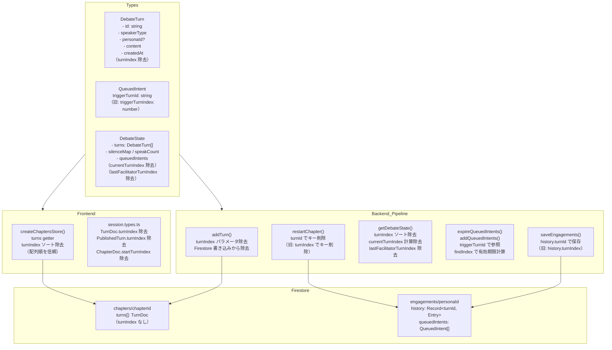
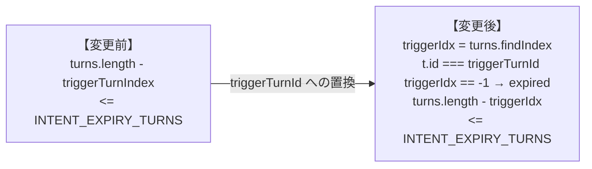

# Design Document: turn-index-abolition

## Overview

`session-document-restructure` で `chapters/{chapterId}` コレクションがプライマリとなったことで、ターンの順序はチャプターの `chapterIndex` 順 + `turns` 配列内の位置から自明に決まる。`turnIndex` は不要な状態にもかかわらず、型定義・Firestore 書き込み・QueuedIntent の参照・DebateState の内部変数として残存している。

このフィーチャーでは `turnIndex` グローバル連番を廃止し、ターン参照を `turnId`（nanoid 文字列）に統一する。Firestore の engagement history キーを文字列 ID に変更し、QueuedIntent の起点ターン参照を `triggerTurnId` に切り替え、`DebateState` から連番依存の状態変数を除去する。

### Goals

- `DebateTurn.turnIndex` / `TurnDoc.turnIndex` を Firestore 書き込みと型定義から除去する
- Engagement History のキーを `turnId` に変更する
- `QueuedIntent.triggerTurnIndex` を `triggerTurnId` に切り替える
- `DebateState.currentTurnIndex` と `lastFacilitatorTurnIndex`（デッドコード）を除去する
- フロントエンドのターンソートを配列順ベースに変更する

### Non-Goals

- 討論アルゴリズム・エージェントロジックの変更
- UIデザインの変更
- 既存本番データの後方互換フォールバック（クリーン切替・再生成で移行）
- `chapterAnalysis/0`・`postDebateComments/0` 構造（別 spec 対処済み）

---

## Boundary Commitments

### This Spec Owns

- `DebateTurn` / `TurnDoc` 型から `turnIndex` を除去すること
- `addTurn()` 関数から `turnIndex` パラメータと Firestore 書き込みを除去すること
- Engagement History の Firestore キーを `history.${turnId}` 形式に変更すること
- `QueuedIntent.triggerTurnIndex` → `triggerTurnId: string` への変更と、それに伴う有効期限計算の更新
- `DebateState.currentTurnIndex` と `lastFacilitatorTurnIndex` の除去
- `getDebateTurnsByTopicId()` と `getChaptersByTopicId()` からの `turnIndex` 参照除去
- フロントエンドの `chapters.svelte.ts` 内の `turnIndex` ソート除去
- `session.types.ts` の `TurnDoc`・`PublishedTurn`・`ChapterDoc` 型の整理

### Out of Boundary

- ターンコンテンツの生成ロジック（`generateTurn`・`generateChapterIntroduction` 等）
- engagement スコアの評価アルゴリズム
- `pairConversationTurns` や `silenceMap` 等の連番非依存の DebateState フィールド
- Firestore の `engagements/{personaId}` コレクション自体のパス変更

### Allowed Dependencies

- Firestore Admin SDK（バックエンド）・Client SDK（フロントエンド）
- `nanoid`（`turnId` はすでに `nanoid()` で生成されており、変更不要）
- 既存の `chapters/{chapterId}` コレクション（変更なし）

### Revalidation Triggers

- `DebateTurn` 型の変更 → バックエンド全ファイルの `DebateTurn` 参照箇所（コンパイルエラーで検出可）
- `QueuedIntent` 型の変更 → `queued-intents.ts`・`debate-state.ts`・`turn.ts` の参照箇所
- `DebateState` 型の変更 → `debate-orchestrator.ts`・`intervention.ts`・`turn.ts` の参照箇所
- `TurnDoc` 型の変更 → フロントエンドの `chapters.svelte.ts`・`Phase5Debate.svelte`・公開ページ

---

## Architecture

### Existing Architecture Analysis

現在の `turnIndex` グローバル連番は次の 4 点で機能している：

1. **Firestore 書き込み**: `addTurn()` が `turnIndex: params.turnIndex` をターンドキュメントに書き込む。値は `state.turns.length` から計算。
2. **Engagement History キー**: `saveEngagements()` が `history.${turnIndex}` をキーとして engagement スコアを Firestore に保存。`restartChapter()` 時にこのキーを削除。
3. **QueuedIntent 参照**: `triggerTurnIndex: number` でインテントが発生したターンを参照。有効期限計算（`turns.length - triggerTurnIndex <= INTENT_EXPIRY_TURNS`）に使用。
4. **DebateState 内部変数**: `currentTurnIndex`（次のターンに割り当てるインデックス）と `lastFacilitatorTurnIndex`（最後のファシリテーターターンのインデックス）が `getDebateState()` 内で計算される。`lastFacilitatorTurnIndex` は**デッドコード**（計算されるが参照箇所なし）。

### Architecture Pattern & Boundary Map



### Technology Stack

| Layer | Choice | Role | Notes |
|-------|--------|------|-------|
| Backend / Types | TypeScript strict mode | 型定義の変更と波及エラー検出 | `DebateTurn`・`QueuedIntent`・`DebateState` の変更 |
| Backend / Storage | Firestore Admin SDK | `history.${turnId}` キーで書き込み | mergeFields の文字列も変更 |
| Frontend / State | Svelte 5 runes / `onSnapshot` | `turns` getter のソートロジック変更 | `chapters.svelte.ts` |

---

## File Structure Plan

### Modified Files

**バックエンド:**

- `functions/src/types/debate.types.ts` — `DebateTurn`・`QueuedIntent`・`DebateState` の型変更
- `functions/src/pipeline/debate/turn.ts` — `addTurn()` の `turnIndex` パラメータ除去、3 箇所のターン生成関数の更新、`getDebateTurnsByTopicId()` のソート除去
- `functions/src/pipeline/debate/engagement.ts` — `saveEngagements()` のキー変更
- `functions/src/pipeline/debate/queued-intents.ts` — `triggerTurnId` への変更と有効期限計算の更新
- `functions/src/pipeline/debate/debate-state.ts` — `currentTurnIndex` 計算除去・`lastFacilitatorTurnIndex` 除去・ターン初期ソート除去・QueuedIntent 有効期限計算の更新
- `functions/src/pipeline/debate/debate-lifecycle.ts` — `restartChapter()` の engagement クリーンアップを `turnId` ベースに変更、`getChaptersByTopicId()` の `turnIndex` マッピング除去
- `functions/src/pipeline/debate/intervention.ts` — `persistInterventionTurn()` の `addTurn()` 呼び出しから `turnIndex` 除去、`tryIntervention()` の `addQueuedIntents()` 呼び出しを `triggerTurnId` に変更
- `functions/src/pipeline/debate/debate-orchestrator.ts` — `addQueuedIntents()` 呼び出しの `triggerTurnIndex` → `triggerTurnId` 変更

**フロントエンド:**

- `src/lib/models/session/session.types.ts` — `TurnDoc.turnIndex`・`PublishedTurn.turnIndex`・`ChapterDoc.startTurnIndex` の除去
- `src/lib/stores/chapters.svelte.ts` — `turns` getter の `turnIndex` ソート除去
- `src/routes/topics/[topicId]/+page.svelte` — `PublishedTurn` 構築から `turnIndex` 設定を除去

---

## System Flows

### QueuedIntent 有効期限計算の変更



`findIndex` が `-1` を返す（トリガーターンが state.turns に存在しない）場合は期限切れとして扱う。チャプターやり直し後に旧 QueuedIntent のトリガーターンが消去された場合の安全なフォールバック。

---

## Requirements Traceability

| Requirement | Summary | 変更対象ファイル |
|-------------|---------|--------------|
| 1.1–1.4 | TurnDoc から turnIndex 除去 | `debate.types.ts`, `turn.ts`, `session.types.ts`, `debate-lifecycle.ts`, `intervention.ts` |
| 2.1–2.4 | Engagement History キーを turnId に変更 | `engagement.ts`, `debate-lifecycle.ts` |
| 3.1–3.5 | QueuedIntent を triggerTurnId に切り替え | `debate.types.ts`, `queued-intents.ts`, `debate-state.ts`, `turn.ts`, `debate-orchestrator.ts`, `intervention.ts` |
| 4.1–4.6 | DebateState 内部変数の整理 | `debate.types.ts`, `debate-state.ts` |
| 5.1–5.4 | フロントエンドの型とソート更新 | `session.types.ts`, `chapters.svelte.ts`, `+page.svelte` |

---

## Components and Interfaces

### コンポーネント概要

| Component | Layer | Intent | Requirements |
|-----------|-------|--------|-------------|
| `DebateTurn` 型 | Types | ターン構造から `turnIndex` を除去 | 1.1, 5.1 |
| `QueuedIntent` 型 | Types | `triggerTurnId: string` に変更 | 3.1 |
| `DebateState` 型 | Types | `currentTurnIndex`・`lastFacilitatorTurnIndex` 除去 | 4.1, 4.2 |
| `addTurn()` | Turn Pipeline | `turnIndex` パラメータと Firestore 書き込みを除去 | 1.2, 1.3, 1.4 |
| `saveEngagements()` | Engagement Pipeline | `turnId` キーで保存 | 2.1, 2.2 |
| `expireQueuedIntents()` | Queued Intents | `findIndex` ベースの有効期限計算 | 3.3, 3.5 |
| `addQueuedIntents()` | Queued Intents | `triggerTurnId` でキュー追加 | 3.2 |
| `getDebateState()` | State Derivation | ソート除去・連番変数除去・QueuedIntent 有効期限更新 | 4.3–4.6, 3.3 |
| `restartChapter()` | Lifecycle | `turnId` で engagement キー削除 | 2.3 |
| `createChaptersStore.turns` | Frontend Store | `turnIndex` ソート除去 | 5.2, 5.3, 5.4 |

---

### Types Layer

#### DebateTurn / QueuedIntent / DebateState

| Field | Detail |
|-------|--------|
| Intent | Pipeline 全体の型基盤を `turnIndex` 非依存に変更する |
| Requirements | 1.1, 3.1, 4.1, 4.2 |

**Contracts**: State [ ✓ ]

##### State Interface

```typescript
// debate.types.ts（変更後）

export type DebateTurn = {
  id: string;
  // turnIndex: number  ← 除去
  speakerType: string;
  personaId?: string | null;
  content: string;
  createdAt: string;
  speechMode?: 'opinion' | 'fact' | 'question';
  engagementScore?: number;
  fromQueue?: boolean;
  targetPersonaId?: string;
  targetedBy?: 'facilitator' | 'persona';
  searchUsed?: boolean;
  searchQueries?: string[];
};

export type QueuedIntent = {
  triggerTurnId: string;   // 旧: triggerTurnIndex: number
  intentSummary: string;
};

export type DebateState = {
  turns: DebateTurn[];
  silenceMap: Map<string, number>;
  speakCount: Map<string, number>;
  lastSpeakerId?: string;
  queuedIntents: Map<string, QueuedIntent[]>;
  pairConversationTurns: number;
  // currentTurnIndex: number  ← 除去（state.turns.length で代替）
  // lastFacilitatorTurnIndex: number  ← 除去（デッドコード）
  discussionPoints: DiscussionPointState[];
};
```

**Implementation Notes**
- `state.turns.length` が次ターンに割り当てていた `currentTurnIndex` と同値なため、呼び出し側での変更は「`state.currentTurnIndex` を `state.turns.length` に」置換するだけ
- `lastFacilitatorTurnIndex` は `debate-state.ts` でのみセットされており、読み取り箇所なし（`research.md` 参照）

---

### Turn Pipeline

#### addTurn()

| Field | Detail |
|-------|--------|
| Intent | `turnIndex` をパラメータと Firestore 書き込みから除去する |
| Requirements | 1.2, 1.3, 1.4 |

**Contracts**: Service [ ✓ ]

##### Service Interface

```typescript
// turn.ts（変更後シグネチャ）
const addTurn = async (params: {
  topicId: string;
  chapterId: string;
  // turnIndex: number  ← 除去
  speakerType: 'persona' | 'facilitator';
  personaId?: string;
  content: string;
  speechMode?: 'opinion' | 'fact' | 'question';
  engagementScore?: number;
  fromQueue?: boolean;
  targetPersonaId?: string;
  targetedBy?: 'facilitator' | 'persona';
  searchUsed?: boolean;
  searchQueries?: string[];
}): Promise<{ id: string }>
```

- Postconditions: Firestore の `chapters/{chapterId}.turns[]` に `turnIndex` を含まないターンが追記される

**Implementation Notes**
- `generateFacilitatorTurn()`・`generatePersonaTurn()`・`persistInterventionTurn()` の各関数で `turnIndex = state.turns.length` の計算行と `addTurn()` 呼び出しの `turnIndex` 引数を除去する
- `state.turns.push()` 内の `turnIndex` フィールドも同時に除去する
- `getDebateTurnsByTopicId()` のターンマッピングから `turnIndex: t.turnIndex` を除去し、末尾の `.sort()` を除去する（chapters は `chapterIndex` 順でクエリ済みのため不要）

---

### Engagement Pipeline

#### saveEngagements()

| Field | Detail |
|-------|--------|
| Intent | Firestore への engagement 保存キーを `turnIndex` から `turnId` に変更する |
| Requirements | 2.1, 2.2, 2.4 |

**Contracts**: Service [ ✓ ]

##### Service Interface

```typescript
// engagement.ts（変更後）
const saveEngagements = async (params: {
  topicId: string;
  turnId: string;   // 旧: turnIndex: number
  engagements: Array<{ personaId: string; score: number; mode: ...; intentSummary?: string }>;
}): Promise<void>
```

- Postconditions: `topics/{topicId}/engagements/{personaId}.history.${turnId}` に `{ score, mode }` が保存される

**Implementation Notes**
- `evaluateEngagements()` の呼び出し側: `turnIndex: Math.max(0, state.turns.length - 1)` → `turnId: state.turns[state.turns.length - 1]?.id ?? ''`
- `state.turns` が空の場合（最初のターン生成前）は `''` がキーになるが、engagement history の読み戻しは存在しないため機能上の影響なし（`research.md` 参照）

---

### Queued Intents Pipeline

#### addQueuedIntents() / expireQueuedIntents()

| Field | Detail |
|-------|--------|
| Intent | `triggerTurnId` でキューイング・有効期限判定を行う |
| Requirements | 3.2, 3.3, 3.4, 3.5 |

**Contracts**: Service [ ✓ ]

##### Service Interface

```typescript
// queued-intents.ts（変更後）
const addQueuedIntents = async (params: {
  topicId: string;
  state: DebateState;
  engagements: readonly Engagement[];
  speakerSelection: SpeakerSelection;
  triggerTurnId: string;   // 旧: triggerTurnIndex: number
}): Promise<void>

// 有効期限判定ロジック（変更後）
const isAlive = (item: QueuedIntent, turns: DebateTurn[]): boolean => {
  const triggerIdx = turns.findIndex(t => t.id === item.triggerTurnId);
  if (triggerIdx === -1) return false; // トリガーターンが存在しない → 期限切れ
  return turns.length - triggerIdx <= INTENT_EXPIRY_TURNS;
};
```

**Implementation Notes**
- `addQueuedIntents()` の呼び出し箇所は `debate-orchestrator.ts` と `intervention.ts` の 2 箇所。いずれも `triggerTurnIndex: Math.max(0, state.turns.length - 1)` → `triggerTurnId: state.turns[state.turns.length - 1]?.id ?? ''` に変更する
- `expireQueuedIntents()`（`queued-intents.ts`）と初期ロード時（`debate-state.ts`）の 2 箇所で同一の `isAlive` ロジックを使用する

---

### State Derivation

#### getDebateState()

| Field | Detail |
|-------|--------|
| Intent | ターン初期ソート・`currentTurnIndex` 計算・`lastFacilitatorTurnIndex` セットを除去する |
| Requirements | 4.1, 4.2, 4.3, 4.4, 4.5, 4.6 |

**Contracts**: Service [ ✓ ]

##### Service Interface

```typescript
// debate-state.ts（変更後）
export const getDebateState = (
  inputTurns: ReadonlyArray<DebateTurn>,  // chapterIndex 順・配列順で入力
  personas: ReadonlyArray<Persona>,
  persistedQueuedIntents: ReadonlyMap<string, ReadonlyArray<QueuedIntent>>
): DebateState
```

- Preconditions: `inputTurns` は `getDebateTurnsByTopicId()` から chapterIndex 順・配列順で渡される（ソート不要）
- Postconditions: `state.currentTurnIndex` / `state.lastFacilitatorTurnIndex` フィールドなし

**Implementation Notes**
- 現在の先頭行 `const turns = [...inputTurns].sort((a, b) => a.turnIndex - b.turnIndex)` を `const turns = [...inputTurns]` に変更する
- `currentTurnIndex` の計算行（`turns[turns.length-1].turnIndex + 1`）を削除する
- `lastFacilitatorTurnIndex` のセット処理を削除する（`t.turnIndex` 参照もここで排除）
- QueuedIntent 有効期限フィルタを `currentTurnIndex - item.triggerTurnIndex` から `isAlive(item, turns)` に変更する

---

### Lifecycle Pipeline

#### restartChapter()

| Field | Detail |
|-------|--------|
| Intent | engagement history のクリーンアップキーを `turnId` に変更する |
| Requirements | 2.3 |

**Implementation Notes**
- `removedTurnIndexes` 変数を削除する（`removedTurnIds` はすでに `Set<string>` で存在する）
- engagement クリーンアップを `for (const ti of removedTurnIndexes) { updates['history.${ti}'] = FieldValue.delete() }` から `for (const id of removedTurnIds) { updates['history.${id}'] = FieldValue.delete() }` に変更する
- `getChaptersByTopicId()` のターンマッピングから `turnIndex: t.turnIndex` を除去する

---

### Frontend: Session Types

#### TurnDoc / PublishedTurn / ChapterDoc

**Contracts**: State [ ✓ ]

```typescript
// session.types.ts（変更後）
export type TurnDoc = {
  id: string;
  // turnIndex: number  ← 除去
  speakerType: SpeakerType;
  personaId?: string;
  content: string;
  createdAt: Timestamp;
  speechMode?: 'opinion' | 'fact';
  engagementScore?: number;
  fromQueue?: boolean;
  targetPersonaId?: string;
};

export type ChapterDoc = {
  title: string;
  focusQuestion: string;
  discussionPoints?: string[];
  // startTurnIndex?: number  ← 除去（session-document-restructure 以降のデッドコード）
};

export type PublishedTurn = {
  id: string;
  // turnIndex: number  ← 除去
  speakerType: SpeakerType;
  personaId?: string | null;
  speakerName: string;
  speakerRole: string;
  content: string;
  beliefChangesTriggered: BeliefChangeTrigger[];
};
```

---

### Frontend: Chapters Store

#### createChaptersStore.turns

**Contracts**: State [ ✓ ]

```typescript
// chapters.svelte.ts（変更後）
get turns(): TurnDoc[] {
  return chapters.flatMap((c) => c.turns);
  // .sort((a, b) => a.turnIndex - b.turnIndex) ← 除去
}
```

**Implementation Notes**
- `chapters` は `orderBy('chapterIndex')` クエリ結果であり、各チャプターの `turns[]` は `arrayUnion` による追記順が保証される。追加のソート不要。

---

## Data Models

### Firestore スキーマ変更（Engagement History）

**変更前:**
```
topics/{topicId}/engagements/{personaId}
  history: {
    "42": { score: 3, mode: "opinion" },
    "43": { score: 1, mode: "none" },
    ...
  }
  queuedIntents: [
    { triggerTurnIndex: 42, intentSummary: "..." }
  ]
```

**変更後:**
```
topics/{topicId}/engagements/{personaId}
  history: {
    "abc123xyz": { score: 3, mode: "opinion" },
    "def456uvw": { score: 1, mode: "none" },
    ...
  }
  queuedIntents: [
    { triggerTurnId: "abc123xyz", intentSummary: "..." }
  ]
```

キーが数値文字列から nanoid 文字列に変わる。セマンティクスは同一（最後に評価を実施したターンの ID）。

### Firestore スキーマ変更（Chapter turns）

**変更前:**
```
topics/{topicId}/chapters/{chapterId}
  turns: [
    { id: "abc", turnIndex: 42, speakerType: "persona", ... }
  ]
```

**変更後:**
```
topics/{topicId}/chapters/{chapterId}
  turns: [
    { id: "abc", speakerType: "persona", ... }   // turnIndex なし
  ]
```

---

## Testing Strategy

### Unit Tests
- `getDebateState()`: `inputTurns` が `chapterIndex` 順で渡された場合、`turns` が同じ順序で保持されることを検証（ソートなし）
- `getDebateState()`: `QueuedIntent` の有効期限判定が `triggerTurnId` ベースで正しく機能することを検証（有効・期限切れ・ID 未発見の各ケース）
- `expireQueuedIntents()`: `triggerTurnId` が `state.turns` に存在しない場合に期限切れ扱いになることを検証
- `saveEngagements()`: `history.${turnId}` キーで Firestore が更新されることを検証
- `restartChapter()`: `removedTurnIds` の各 ID でキーが削除されることを検証

### Integration Tests (build verification)
- `functions`: `npm run build` が型エラーなく通ることを検証（`DebateTurn`・`QueuedIntent`・`DebateState` 型変更の波及チェック）
- `src`: `tsc --noEmit` が型エラーなく通ることを検証（`TurnDoc`・`PublishedTurn` 型変更の波及チェック）

### Migration Notes
- 既存データの `history.${turnIndex}` キーはそのまま残留するが、新規書き込みは `turnId` 形式になる
- `restartChapter()` が呼ばれると削除対象キーが `turnId` ベースになり、旧 `turnIndex` 形式のキーはクリーンアップされない
- 再生成（全チャプターリセット → 再実行）によりデータが新形式に統一される
